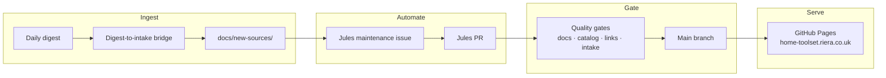

# Architecture & Flows

High-level design of the AI Hub: how components connect, how data flows between them, and how the repository maintains itself over time.

## Contents

| Document | What it covers |
| :--- | :--- |
| [Component Map](component_map.md) | Full inventory of services and their relationships — the definitive "what talks to what" map |
| [Automation Flows](flows.md) | Detailed sequence and data-flow diagrams for key automation workflows |
| [Infrastructure](infrastructure.md) | Hardware topology, network layout, and resource allocation decisions |
| [SSH Execution Patterns](ssh_execution_patterns.md) | Secure orchestration of remote commands across TrueNAS, Pi, and MacBook |
| [Automated Contributions](automated_contributions.md) | How Google Jules, digest workflows, and quality gates keep the repo self-improving |
| [Multi-Agent KnowledgeOps](multi_agent_knowledgeops.md) | Governance contract, role model, and CI gates for scalable multi-agent documentation growth |
| [Prompt Catalogue](prompt-catalogue.md) | Reference library of production prompts used across automation workflows |

---

## System at a Glance

---

## Related

- [Home](../index.md)
- [Contributing](../CONTRIBUTING.md)
- [Standards](../standards.md)

## Sources / References
- [Automated Contributions](automated_contributions.md)
- [Multi-Agent KnowledgeOps Governance](multi_agent_knowledgeops.md)
- [GitHub Actions Documentation](https://docs.github.com/actions)

## Contribution Metadata
- Last reviewed: 2026-03-15
- Confidence: high
