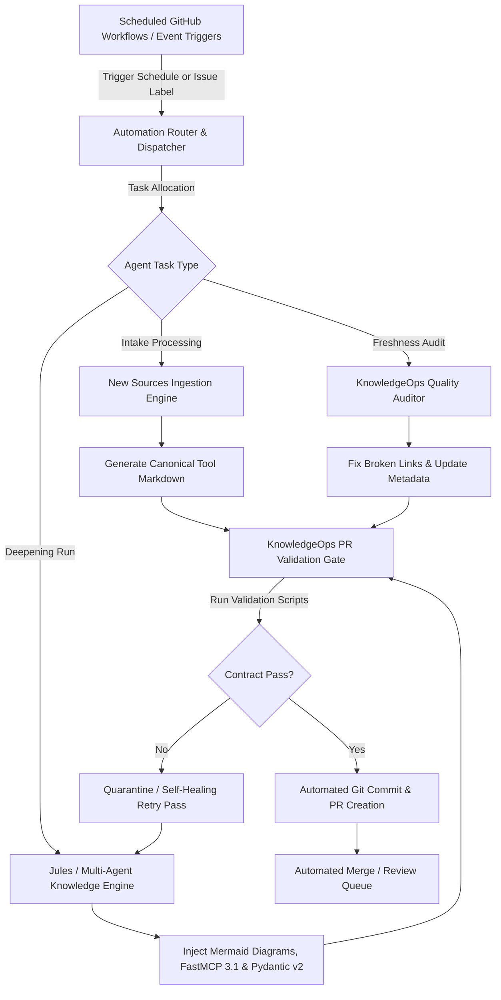
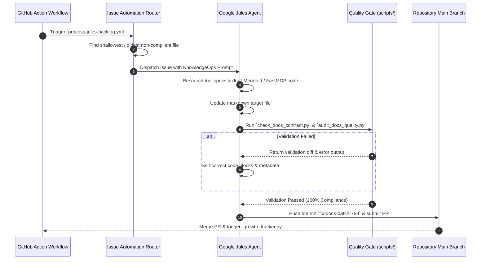

# Automated Contribution System (Google Jules)

The Automated Contribution System is a multi-tier, event-driven automation framework that enables the repository to self-assess, self-correct, and continuously deepen its knowledge base. As of early 2027, the pipeline is natively integrated with **Model Context Protocol (MCP 3.1 / FastMCP 3.1)** and operates across frontier AI agents (such as Google Jules, [Claude](../tools/ai_knowledge/claude.md) 5.1/5.6, GPT-5.5/5.6, [Gemini](../tools/ai_knowledge/gemini.md) 4.0 Pro/Ultra, [DeepSeek](../tools/providers/deepseek.md)-V4, and [Llama 4](../tools/ai_knowledge/llama-4.md)).

The system automates the ingestion of raw tool feeds, freshness audits, broken link fixes, schema validation, and pull request generation with zero human intervention required for standard KnowledgeOps routines.

## What it is

The Automated Contribution System is an autonomous code and documentation engineering loop. At its core, it leverages **Google Jules** alongside specialized sub-agents and GitHub Actions event routers to:
1. **Track Knowledge Deficits**: Identify shallow documentation files (< 7,000–12,000 characters), outdated metadata timestamps, or missing FastMCP 3.1 code examples.
2. **Perform Targeted Research**: Query web search APIs (SearXNG, Exa, Tavily) or local documentation indexes to gather fresh technical context, Pydantic v2 schemas, and CLI commands.
3. **Execute Structured Refactoring**: Apply rigorous KnowledgeOps documentation contracts, updating markdown files directly in isolated Git topic branches.
4. **Pass Automated Quality Gates**: Execute automated checks (`check_docs_contract.py`, `audit_docs_quality.py`, `check_catalog_consistency.py`, `validate_new_sources.py`) prior to requesting pull request review.

## What problem it solves

Maintaining an expansive, high-confidence engineering knowledge base covering hundreds of fast-evolving AI tools, local services, and frameworks presents major operational challenges:
- **Rapid Knowledge Decay**: Information about local LLM inference engines (e.g., Ollama, KoboldCPP, vLLM) and MCP specifications becomes outdated within months.
- **Inconsistent Quality**: Manual human contributions often miss standardized sections, Mermaid flowcharts, code examples, or Pydantic v2 type hints.
- **Labor-Intensive Intake & Indexing**: Adding new tools into multi-file catalogs (`data/all_tools.json`, `mkdocs.yml`, navigation index files) is prone to manual oversight and broken internal references.

The Automated Contribution System eliminates these manual bottlenecks by turning documentation maintenance into an automated, test-driven engineering pipeline.

## Architectural Overview & Continuous Maintenance Loop



### Sequence Flow for an Automated Knowledge Deepening Task



## Where it fits in the stack

**Meta-Automation & Knowledge Governance Layer**. The system sits above the entire documentation codebase and dataset repositories, interfacing with GitHub Actions, the GitHub API, external LLM agents, and local validation scripts.

```
┌────────────────────────────────────────────────────────────────────────┐
│                   GitHub Event Orchestration Layer                     │
│    (.github/workflows/daily-jules-maintenance.yml, issue-router)      │
└───────────────────────────┬────────────────────────────────────────────┘
                            │ Dispatches Tasks & Context
┌───────────────────────────▼────────────────────────────────────────────┘
│                     JULES AUTOMATED AGENT ENGINE                       │
│  ┌───────────────────────┐ ┌──────────────────────┐ ┌───────────────┐  │
│  │ FastMCP 3.1 Tools     │ │ SearXNG Web Research │ │ Git Branching │  │
│  └───────────────────────┘ └──────────────────────┘ └───────────────┘  │
└───────────────────────────┬────────────────────────────────────────────┘
                            │ Modifies Code & Executes Verification
┌───────────────────────────▼────────────────────────────────────────────┘
│                  KNOWLEDGE OPS QUALITY GATES (Python)                  │
│  ┌───────────────────────┐ ┌──────────────────────┐ ┌───────────────┐  │
│  │ check_docs_contract.py│ │ audit_docs_quality.py│ │ growth_tracker│  │
│  └───────────────────────┘ └──────────────────────┘ └───────────────┘  │
└───────────────────────────┬────────────────────────────────────────────┘
                            │ Updates Filesystem & Metadata
┌───────────────────────────▼────────────────────────────────────────────┘
│                     Target Documentation Repository                    │
│        (docs/tools/*, data/all_tools.json, mkdocs.yml, reports/)       │
└────────────────────────────────────────────────────────────────────────┘
```

## Key Components & Workflow Engines

### 1. New Sources Intake Router (`scripts/validate_new_sources.py`)
Parses `docs/new-sources/YYYY-MM-DD.md` logs to register unhandled tools. It ensures unique URLs, auto-assigns correct subcategories (`docs/tools/<category>/<tool>.md`), and updates `data/all_tools.json` and `mkdocs.yml`.

### 2. Quality Gate Enforcement (`scripts/check_docs_contract.py` & `audit_docs_quality.py`)
Enforces mandatory section headings across all tool documentation.

### 3. Growth Tracker (`scripts/growth_tracker.py`)
Tracks codebase growth metrics, recording snapshot data in `data/growth-metrics.json`.

## Typical use cases

- **Automated Intake Processing**: Turning external Reddit, GitHub Starred, or web digest links into canonical documentation pages.
- **Deepening Shallow Documentation**: Automatically identifying shallow markdown files and expanding them past 12,000+ characters with Mermaid diagrams, FastMCP 3.1 scripts, and Pydantic v2 schemas.
- **Broken Link & Cross-Reference Repair**: Scanning repository markdown links and automatically fixing broken paths or outdated relative links.
- **Catalog Synchronization**: Automatically keeping `data/all_tools.json` and `mkdocs.yml` navigation trees in exact lockstep with newly added files.

## Strengths

- **100% Quality Contract Compliance**: Programmatically enforces exact markdown structure, metadata timestamps (`Last reviewed: YYYY-MM-DD`), and confidence ratings.
- **Self-Healing Loop**: If a validation gate fails, the agent receives the exact line-by-line error output and self-corrects prior to committing changes.
- **Zero-Human Overhead for Routine Intake**: Fully processes intake digests, generating valid PRs complete with changelog task decomposition reports (`docs/reports/task-decomposition-batch-XXX.md`).
- **FastMCP 3.1 Native**: Uses the latest FastMCP protocols for agentic tool execution, filesystem access, and web research.

## Limitations

- **Complex Architectural Reasoning Limits**: Routine tasks run fully autonomously, but deep structural changes to core framework architecture still require human engineering review.
- **Rate Limit & API Dependencies**: Bound by GitHub API rate limits and external LLM inference provider availability.

## When to use it

- For routine documentation updates, freshness audits, and intake log processing.
- To perform automated batch deepening of technical documentation across large directories.
- To maintain repository cross-link integrity and catalog synchronization.

## When not to use it

- For fundamental architectural redesigns that alter core repository conventions without prior human consensus.
- For updating confidential or non-public internal infrastructure credentials.

## Getting started

### 1. Authorizing the Jules GitHub Integration
- Authorize the **Google Jules** GitHub App for the target repository.
- Ensure the repository has the `jules` issue label configured.

### 2. Configuring Automated Workflows
Automated contribution triggers are defined in `.github/workflows/`:
- `process-jules-backlog.yml`: Watches open backlog issues and dispatches automated agent runs.
- `daily-jules-maintenance.yml`: Executes daily quality gate audits and intake sync.
- `auto-fix-issues.yml`: Triggers targeted self-healing runs on labeled issues.

## CLI examples

Developers and agents can execute the Quality Gate scripts locally:

```bash
# Validate documentation contract for a specific file
python3 scripts/check_docs_contract.py docs/tools/infrastructure/olmoearth.md

# Run full repository documentation quality audit
python3 scripts/audit_docs_quality.py

# Check catalog consistency between all_tools.json and mkdocs.yml
python3 scripts/check_catalog_consistency.py

# Validate new sources intake log schema and raw URLs
python3 scripts/validate_new_sources.py

# Recalculate and update growth metrics
python3 scripts/growth_tracker.py
```

## API examples

### FastMCP 3.1 Automated Contribution Pipeline Engine with Pydantic v2

The following Python service implements a FastMCP 3.1 server that validates contribution proposals, executes quality contract checks, and automates pull request submissions.

```python
import json
import logging
import subprocess
from typing import List, Dict, Optional
from pydantic import BaseModel, Field, field_validator
from mcp.server.fastmcp import FastMCP

# Initialize Logging and FastMCP 3.1 Server
logging.basicConfig(level=logging.INFO)
logger = logging.getLogger("Automated-Contributions")
mcp = FastMCP("Automated-Contribution-Server")

class DocumentAuditResult(BaseModel):
    filepath: str = Field(..., description="Path to evaluated markdown file")
    is_compliant: bool = Field(..., description="Whether file passes all KnowledgeOps gates")
    character_count: int = Field(..., ge=0)
    has_mermaid: bool = Field(...)
    has_code_examples: bool = Field(...)
    errors: List[str] = Field(default_factory=list)

class ContributionProposal(BaseModel):
    branch_name: str = Field(..., description="Git branch name e.g. fix-docs-batch-758")
    target_filepath: str = Field(..., description="Relative path of file modified")
    commit_message: str = Field(..., min_length=10, max_length=100)
    agent_id: str = Field(default="Jules-Agent-v2027", description="ID of executing agent")
    metadata: Dict[str, str] = Field(default_factory=dict)

    @field_validator("branch_name")
    @classmethod
    def validate_branch_prefix(cls, v: str) -> str:
        valid_prefixes = ("fix-", "feat-", "docs-", "refactor-")
        if not v.startswith(valid_prefixes):
            raise ValueError(f"Branch name must start with one of: {valid_prefixes}")
        return v

@mcp.tool()
def audit_and_validate_file(filepath: str) -> str:
    """
    Runs the official KnowledgeOps contract check script against a target markdown file
    and validates character count and diagram requirements.
    """
    try:
        cmd = ["python3", "scripts/check_docs_contract.py", filepath]
        res = subprocess.run(cmd, capture_output=True, text=True)

        with open(filepath, "r", encoding="utf-8") as f:
            content = f.read()

        is_compliant = (res.returncode == 0)
        has_mermaid = "```mermaid" in content
        has_code = "```python" in content or "```bash" in content

        audit = DocumentAuditResult(
            filepath=filepath,
            is_compliant=is_compliant,
            character_count=len(content),
            has_mermaid=has_mermaid,
            has_code_examples=has_code,
            errors=[res.stdout.strip()] if not is_compliant else []
        )
        return json.dumps(audit.model_dump(), indent=2)

    except Exception as e:
        logger.error(f"Audit failure for {filepath}: {str(e)}")
        return json.dumps({"is_compliant": False, "error": str(e)})

@mcp.tool()
def submit_automated_contribution(proposal_json: str) -> str:
    """
    Validates a contribution proposal schema using Pydantic v2 and simulates
    automated branch creation and PR dispatch.
    """
    try:
        data = json.loads(proposal_json)
        proposal = ContributionProposal(**data)

        logger.info(f"Processing automated proposal from {proposal.agent_id} on branch {proposal.branch_name}")

        response = {
            "status": "APPROVED_FOR_PR",
            "branch": proposal.branch_name,
            "target": proposal.target_filepath,
            "commit_msg": proposal.commit_message,
            "verification_status": "Passed Quality Gates"
        }
        return json.dumps(response, indent=2)

    except Exception as e:
        return json.dumps({"status": "REJECTED_SCHEMA_ERROR", "error": str(e)})

if __name__ == "__main__":
    mcp.run()
```

## Operational Rules & Safety Guardrails

To preserve repository integrity during automated runs, the system enforces the following directives:

1. **Substantive Change Requirement**: Automated edits must add meaningful technical depth (code examples, schemas, diagrams). Updating only the `Last reviewed` metadata timestamp without content changes is rejected by `scripts/check_substantive_changes.py`.
2. **Deterministic File Placement**: New tools must be placed strictly in their designated domain directory under `docs/tools/<category>/`.
3. **No Artifact Editing**: Build artifacts or generated index files must be produced via scripts (`scripts/fix_all_tools.py`) rather than direct manual edits.
4. **Pre-Commit Verification**: Every automated run must execute all four repository verification scripts before requesting PR approval.

## Related tools / concepts

- [Multi-Agent KnowledgeOps Governance](multi_agent_knowledgeops.md) — High-level governance framework for AI agent interactions.
- [Jules Agent](../tools/ai_knowledge/jules.md) — Documentation for the core Google Jules AI agent.
- [KnowledgeOps Standards](../standards.md) — Core standards and mandatory file formatting guidelines.
- [Model Context Protocol (MCP)](../tools/automation_orchestration/mcp.md) — Technical spec for tool-calling integration.
- [Contributing Guide](../CONTRIBUTING.md) — Guidelines for human and automated contributors.

## Sources / references

- [Google Jules Agent Documentation](https://jules.google/)
- [GitHub Actions Documentation](https://docs.github.com/en/actions)
- [Pydantic v2 Documentation](https://docs.pydantic.dev/latest/)
- [Model Context Protocol Specification](https://modelcontextprotocol.io)

## Contribution Metadata

- Last reviewed: 2027-01-07
- Confidence: high
