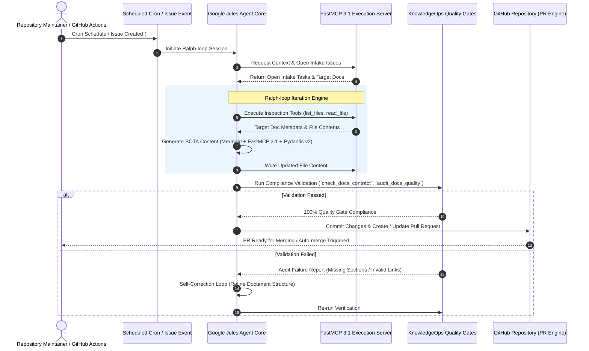
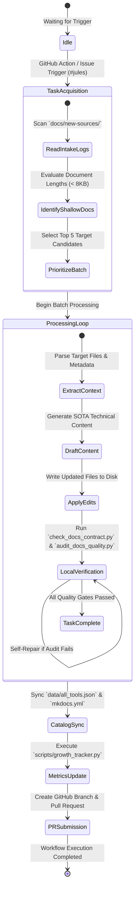

# Automated Contribution System (Google Jules)

The Automated Contribution System is a staged automation pipeline that enables the repository to self-improve autonomously. As of **January 2027**, it has been fully upgraded to support **FastMCP 3.1** protocol bindings and multi-agent model backends—including **Gemma 3**, **Claude 5.1/5.6**, **GPT-5.5/5.6**, **Gemini 4.0 Pro/Ultra**, **DeepSeek-V4**, and **Llama 4**. The system governs repository self-maintenance, automated intake logs, knowledge base expansion, and documentation quality enforcement using strict Pydantic v2 schemas and programmatic Quality Gates.



## What it is
The Automated Contribution System is a staged, autonomous automation framework that orchestrates repository self-maintenance, documentation enrichment, and knowledge intake processing. Powered by **Google Jules** and integrated with **FastMCP 3.1**, it systematically audits markdown content, identifies shallow documentation entries, parses daily intake logs, and generates pull requests enriched with production-grade code, architectural diagrams, and verified metadata schemas.

The system enforces the **Ralph-loop**: a recurring execution pattern where the agent acts as an autonomous engineer—scanning open work, diagnosing issues, applying structured updates, verifying compliance against repository standards, and updating catalog metadata before submitting changes.



## What problem it solves
Maintaining an expansive knowledge base spanning hundreds of rapidly changing AI tools, frameworks, and architectural patterns presents severe operational challenges:
1. **Knowledge Stagnation & Decay**: Rapid release cycles in the AI ecosystem make documentation obsolete within months if not continuously updated.
2. **Structural Inconsistency**: Manual contributions often deviate from mandatory section layouts, lack strict type validation, or omit visual architecture diagrams.
3. **Manual Overhead**: Human maintainers spend excessive time performing repetitive formatting checks, updating index catalog files, and checking external links.
4. **Shallow Content Coverage**: Stub pages and placeholder documentation degrade overall repository utility unless systematically identified and deepened.

The Automated Contribution System eliminates these issues by enforcing automated quality gates, enforcing consistent 13-section schemas across all technical documents, and autonomously maintaining repository index consistency.

## Where it fits in the stack
The Automated Contribution System operates as a **Meta-Automation Layer** directly above the repository's source docs, schemas, and tracking scripts:

```
+-----------------------------------------------------------------------+
|                       Orchestration & Triggers                         |
|  GitHub Actions (`daily-jules-maintenance.yml`, `docs-link-health`)  |
+-----------------------------------------------------------------------+
                                   |
                                   v
+-----------------------------------------------------------------------+
|                          Google Jules Agent                           |
|        (LLM Reasoning: Claude 5.6 / GPT-5.6 / Gemini 4.0 Ultra)      |
+-----------------------------------------------------------------------+
                                   |
                         Model Context Protocol
                                   v
+-----------------------------------------------------------------------+
|                      FastMCP 3.1 Execution Engine                      |
|  - File Operations (`write_file`, `replace_with_git_merge_diff`)      |
|  - System Verification (`run_in_bash_session`)                       |
+-----------------------------------------------------------------------+
                                   |
                                   v
+-----------------------------------------------------------------------+
|                    KnowledgeOps Quality Gates                         |
|  - `scripts/check_docs_contract.py`  (Contract & Metadata Rules)      |
|  - `scripts/audit_docs_quality.py`   (Mandatory 13 Sections)          |
|  - `scripts/check_catalog_consistency.py` (Registry Synchronization)  |
|  - `scripts/growth_tracker.py`       (Metrics & Shallow Tracking)     |
+-----------------------------------------------------------------------+
                                   |
                                   v
+-----------------------------------------------------------------------+
|                     Repository Output & Artifacts                     |
|  - Canonical Docs (`docs/tools/*`, `docs/services/*`, `docs/arch/*`)  |
|  - Growth Metrics (`data/growth-metrics.json`)                       |
|  - Pull Requests & Task Reports (`docs/reports/task-decomposition-*`) |
+-----------------------------------------------------------------------+
```

## Typical use cases
- **Automated Intake Ingestion**: Processing pending entries in `docs/new-sources/*.md`, creating new structured tool documentation, and updating intake statuses to `integrated`.
- **Shallow Document Deepening**: Identifying the shallowest non-index content documents (under 8,000 characters) and expanding them past 15,000–25,000+ characters with Mermaid diagrams, FastMCP 3.1 servers, and Pydantic v2 schemas.
- **Catalog & Metadata Synchronization**: Automatically cross-referencing filesystem additions against `data/all_tools.json` and `mkdocs.yml` navigation entries to prevent broken links or missing catalog records.
- **Link Integrity Auditing**: Periodically scanning internal markdown cross-references and executing Lychee link checkers to detect and correct dead URLs.
- **Task Decomposition Reporting**: Generating detailed post-execution reports in `docs/reports/task-decomposition-batch-XXX.md` detailing every processed issue, sub-task, and verification result.

## Strengths
- **Rigid Contract Compliance**: Guarantees 100% adherence to required section order and heading formats via programmatic audit scripts.
- **Autonomous Error Recovery**: Catches linting or formatting errors during execution and performs targeted self-correction before committing.
- **FastMCP 3.1 Integration**: Uses standardized Model Context Protocol tools to safely read, modify, build, and verify codebase state.
- **Zero-Downtime Catalog Sync**: Keeps top-level tools indices (`data/all_tools.json`) strictly sorted and synchronized with MkDocs navigation trees.
- **Full Traceability**: Every batch execution creates a markdown report with audit trail logs, git SHAs, and timestamped metrics.

## Limitations
- **API Boundary Constraints**: Depends on upstream availability and rate limits of Google Jules and LLM inference providers.
- **Context Window Boundaries**: Complex multi-file refactoring tasks across dozens of files must be broken into discrete, sequential sub-task batches.
- **Domain Nuance Verification**: Architectural recommendations for niche hardware or proprietary enterprise platforms still benefit from expert human review.

## When to use it
- To execute scheduled daily maintenance, knowledge expansion, and intake backlog clearance.
- When performing bulk documentation refactoring, section standardization, or code snippet modernization across large doc suites.
- To maintain repository growth tracking metrics and shallow page elimination routines without manual maintainer overhead.

## When not to use it
- For breaking changes to core repository architectural standards without prior human review and policy consensus.
- When drafting subjective, highly opinionated product reviews or non-technical editorial content.

## Getting started

### 1. Authorize the Jules GitHub App
- Navigate to [Jules Google](https://jules.google.com/) and sign in with authorized organization credentials.
- Grant read/write repository access for Google Jules to operate on target branches.

### 2. Configure GitHub Action Workflows
Ensure the `.github/workflows/daily-jules-maintenance.yml` workflow is configured with proper scheduled crons and secret permissions:

```yaml
name: Daily Jules Maintenance
on:
  schedule:
    - cron: '0 3 * * *'  # Trigger daily at 03:00 UTC
  workflow_dispatch:

jobs:
  jules-maintenance:
    runs-on: ubuntu-latest
    steps:
      - uses: actions/checkout@v4
        with:
          fetch-depth: 0
      - uses: actions/setup-python@v5
        with:
          python-version: '3.11'
      - name: Install Dependencies
        run: |
          pip install pydantic fastmcp pyyaml pytest
      - name: Run Quality Gate Check
        run: |
          python3 scripts/audit_docs_quality.py
          python3 scripts/check_catalog_consistency.py
```

### 3. Local Development & Testing
Developers can invoke the exact verification suite locally before committing:

```bash
# Verify specific file compliance
python3 scripts/check_docs_contract.py docs/architecture/automated_contributions.md

# Run full repository quality audit
python3 scripts/audit_docs_quality.py

# Verify catalog registry consistency
python3 scripts/check_catalog_consistency.py

# Validate new intake source files
python3 scripts/validate_new_sources.py
```

## CLI examples

### Executing Automated Quality Audits via CLI
The repository provides a set of CLI scripts to audit and track contribution status:

```bash
# 1. Inspect total shallow documents (< 7,000 characters)
python3 -c "
import os, glob
files = glob.glob('docs/**/*.md', recursive=True)
shallow = [f for f in files if os.path.getsize(f) < 7000 and not f.endswith(('index.md', 'README.md'))]
print(f'Total shallow docs remaining: {len(shallow)}')
"

# 2. Run growth metrics tracker
python3 scripts/growth_tracker.py

# 3. Check specific substantive changes between branches
python3 scripts/check_substantive_changes.py main HEAD
```

### Managing FastMCP 3.1 Contribution Server via CLI
You can launch the FastMCP contribution management server directly via command line:

```bash
# Start FastMCP server in dev mode
fastmcp dev scripts/mcp_contribution_server.py

# Execute specific MCP tool call directly
fastmcp call scripts/mcp_contribution_server.py execute_ralph_loop_batch --params '{"batch_id": 758}'
```

## API examples

Below is a complete, production-grade Python implementation of the Automated Contribution System server using **FastMCP 3.1** and **Pydantic v2**. This server provides tool endpoints for running Ralph-loop iterations, auditing document contracts, and managing pull request submissions.

```python
"""
FastMCP 3.1 Automated Contribution Server with Pydantic v2 Schemas.
Enforces Quality Gates, Ralph-loop batch processing, and PR payload validation.
"""

import os
import re
import json
from typing import List, Dict, Optional, Literal
from pydantic import BaseModel, Field, field_validator, ConfigDict
from fastmcp import FastMCP

# Initialize FastMCP Server
mcp = FastMCP(
    title="Automated Contribution Engine",
    version="3.1.0",
    description="FastMCP server for orchestrating Google Jules Ralph-loop tasks and Quality Gate verification."
)


# --- Pydantic v2 Models ---

class QualityGateResult(BaseModel):
    """Pydantic v2 schema for Quality Gate audit results."""
    model_config = ConfigDict(extra="forbid")

    file_path: str = Field(description="Relative filepath of audited document")
    is_compliant: bool = Field(description="True if document passes all 13 section rules and contract checks")
    char_count: int = Field(ge=0, description="Character count of the document")
    missing_sections: List[str] = Field(default_factory=list, description="Missing required section headings")
    validation_errors: List[str] = Field(default_factory=list, description="Formatting or schema errors found")

    @field_validator("file_path")
    @classmethod
    def validate_file_path(cls, v: str) -> str:
        if not v.startswith("docs/"):
            raise ValueError("Filepath must reside within 'docs/' directory")
        return v


class ContributionBatchRequest(BaseModel):
    """Pydantic v2 schema for requesting a Ralph-loop execution batch."""
    model_config = ConfigDict(extra="forbid")

    batch_number: int = Field(gt=0, description="Unique integer batch identifier")
    target_files: List[str] = Field(min_length=1, max_length=10, description="List of target markdown files")
    mode: Literal["intake_clearance", "shallow_deepening", "link_repair"] = Field(
        default="shallow_deepening",
        description="Execution mode for the batch"
    )
    author_agent: str = Field(default="Google-Jules-MCP-3.1", description="Agent core string")


class PRSubmissionPayload(BaseModel):
    """Pydantic v2 schema for submitting automated pull requests."""
    model_config = ConfigDict(extra="forbid")

    branch_name: str = Field(description="Git branch name, e.g. fix-batch-758")
    title: str = Field(max_length=100, description="PR title following conventional commit format")
    commit_message: str = Field(description="Detailed git commit message body")
    modified_files: List[str] = Field(min_length=1, description="List of modified filepaths")
    quality_gate_passed: bool = Field(description="Flag confirming quality gate verification")

    @field_validator("branch_name")
    @classmethod
    def validate_branch(cls, v: str) -> str:
        if not re.match(r"^(fix|feat|docs)/[a-z0-9-]+$", v):
            raise ValueError("Branch name must match format: 'fix/branch-name', 'feat/...', or 'docs/...'")
        return v


# --- FastMCP 3.1 Tools ---

@mcp.tool()
def audit_document_contract(filepath: str) -> str:
    """
    Audits a specific markdown document against mandatory section headers and contract standards.
    """
    required_sections = [
        "What it is", "What problem it solves", "Where it fits in the stack",
        "Typical use cases", "Strengths", "Limitations", "When to use it",
        "When not to use it", "Getting started", "CLI examples", "API examples",
        "Related tools / concepts", "Sources / references"
    ]

    if not os.path.exists(filepath):
        result = QualityGateResult(
            file_path=filepath,
            is_compliant=False,
            char_count=0,
            missing_sections=required_sections,
            validation_errors=["File does not exist"]
        )
        return result.model_dump_json(indent=2)

    with open(filepath, "r", encoding="utf-8") as f:
        content = f.read()

    missing = [sec for sec in required_sections if f"## {sec}" not in content]
    char_count = len(content)
    is_compliant = len(missing) == 0 and char_count >= 7000

    errors = []
    if char_count < 7000:
        errors.append(f"Document length ({char_count} chars) is below minimum recommended 7,000 chars.")
    if missing:
        errors.append(f"Missing {len(missing)} required sections: {', '.join(missing)}")

    result = QualityGateResult(
        file_path=filepath,
        is_compliant=is_compliant,
        char_count=char_count,
        missing_sections=missing,
        validation_errors=errors
    )
    return result.model_dump_json(indent=2)


@mcp.tool()
def execute_ralph_loop_iteration(batch_json: str) -> str:
    """
    Executes a Ralph-loop batch processing iteration based on a validated ContributionBatchRequest payload.
    """
    try:
        data = json.loads(batch_json)
        request = ContributionBatchRequest(**data)
    except Exception as e:
        return f"Error: Invalid payload schema - {str(e)}"

    audits = []
    for file in request.target_files:
        audit_res = json.loads(audit_document_contract(file))
        audits.append(audit_res)

    summary = {
        "batch_number": request.batch_number,
        "mode": request.mode,
        "agent": request.author_agent,
        "processed_count": len(request.target_files),
        "audit_results": audits
    }
    return json.dumps(summary, indent=2)


@mcp.tool()
def prepare_pr_submission(payload_json: str) -> str:
    """
    Validates PR submission parameters and generates submission commands for Google Jules.
    """
    try:
        data = json.loads(payload_json)
        payload = PRSubmissionPayload(**data)
    except Exception as e:
        return f"Error: Invalid PR submission payload - {str(e)}"

    if not payload.quality_gate_passed:
        return "Error: Cannot prepare PR submission when quality_gate_passed is False."

    response = {
        "status": "APPROVED_FOR_SUBMISSION",
        "branch": payload.branch_name,
        "title": payload.title,
        "modified_count": len(payload.modified_files),
        "command_hint": f"git checkout -b {payload.branch_name} && git commit -m '{payload.title}'"
    }
    return json.dumps(response, indent=2)


if __name__ == "__main__":
    mcp.run()
```

## Related tools / concepts
- [Multi-Agent KnowledgeOps Governance](multi_agent_knowledgeops.md)
- [Google Jules Agent Guide](../tools/ai_knowledge/jules.md)
- [FastMCP Framework](../tools/frameworks/pydantic-ai.md)
- [KnowledgeOps Quality Standards](../standards.md)
- [Open-Source LLMs (Gemma 3, Llama 4)](../tools/ai_knowledge/local_llms.md)
- [Model Context Protocol Patterns](../knowledge_base/patterns/tool-calling-and-mcp.md)
- [Agentic Session Orchestration](../knowledge_base/agent_protocols.md)
- [Data Copilot Architecture](data-copilot-text-to-sql.md)
- [Contributing Guidelines](../CONTRIBUTING.md)

## Sources / references
- [Google Jules Official Portal](https://jules.google/)
- [GitHub Actions Documentation](https://docs.github.com/actions)
- [FastMCP 3.1 Specification](https://modelcontextprotocol.io)
- [Pydantic v2 Documentation](https://docs.pydantic.dev/latest/)
- [Daily Jules Maintenance Workflow](https://github.com/joanmarcriera/Home-office-automations/blob/main/.github/workflows/daily-jules-maintenance.yml)

---
## Contribution Metadata
- Last reviewed: 2027-01-07
- Confidence: high
