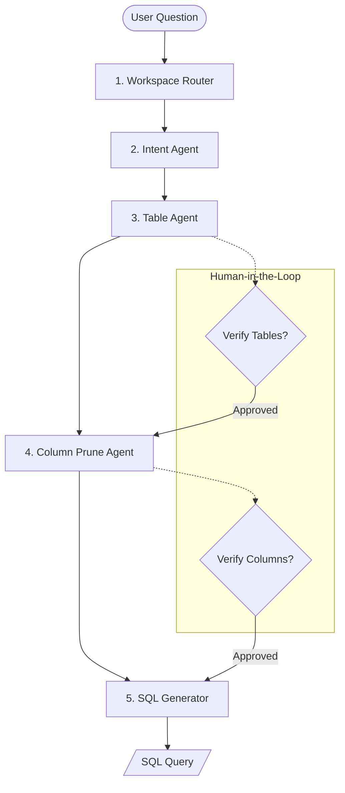

# Data Copilot: Layered Text-to-SQL Architecture

## What it is

Data Copilot is a robust, cost-effective pipeline architecture for converting natural language questions into executable SQL queries. It employs a layered, multi-agent approach to decompose the complex task of Text-to-SQL into five distinct, specialized stages: workspace routing, intent extraction, table selection, column pruning, and SQL generation.

## What problem it solves

Traditional "one-shot" Text-to-SQL approaches frequently fail when faced with complex database schemas, ambiguous user questions, or large-scale data environments. They often consume excessive tokens and lack transparency. Data Copilot solves these issues by breaking the problem into manageable steps, minimizing token usage through aggressive schema pruning, and ensuring accuracy via specialized agents and human-in-the-loop (HITL) checkpoints.

## Where it fits in the stack

Data Copilot sits in the **Data Access and Analytics** layer of the Home-office stack. It acts as an intelligent intermediary between natural language interfaces (like a chat assistant) and relational databases (SQLite, Postgres, etc.), providing a governed and scalable way to query structured data without requiring SQL expertise from the end-user.

## Typical use cases

- **Natural Language Business Intelligence**: Allowing non-technical users to ask questions about sales, inventory, or financial metrics.
- **Home Lab Management**: Querying home automation databases (e.g., Home Assistant, Grocy) for specific historical data or summaries.
- **Automated Reporting**: Generating on-demand or scheduled reports based on simple text prompts.
- **Internal Tooling**: Providing a simplified interface for employees to interact with company databases safely.

## Strengths

- **Token Efficiency**: Drastically reduces prompt size by only sending relevant tables and columns to the final generator.
- **Accuracy**: Modular agents focus on specific sub-tasks, reducing the cognitive load and error rate of any single model call.
- **Cost-Effective**: Routes simpler tasks (routing, pruning) to smaller, cheaper models, using expensive models only when necessary.
- **Governance**: Built-in HITL points and SQL validation prevent unsafe queries and ensure data privacy.

## Limitations

- **Latency**: Multiple agent calls introduce sequential latency compared to a single-shot approach.
- **Complexity**: Requires maintaining multiple prompts, agent definitions, and a coordination layer.
- **Dialect Sensitivity**: Still requires careful configuration for specific SQL dialects (Postgres vs. SQLite vs. BigQuery).

## When to use it

- When you have a complex schema with dozens or hundreds of tables.
- When you want to minimize the cost of LLM tokens for high-volume querying.
- When you need a transparent, auditable process for how a natural language question becomes a SQL query.

## When not to use it

- For extremely simple, single-table databases where a one-shot prompt is sufficient.
- For high-stakes financial audits requiring 100% precision without any human oversight.
- When the data resides in non-relational silos that require complex multi-agent RAG instead of structured SQL.



## Layers & Interfaces

### 1. Workspace Router
- **Role**: Identifies which "workspace" (database or domain) the question belongs to (e.g., Finance, Home Automation, Inventory).
- **Benefit**: Prevents the LLM from being overwhelmed by the entire repository's schema.
- **Model Recommendation**: Small/Fast (e.g., Qwen 2.5 0.8B or 2B via Ollama).
- **Interface**:
```json
{
  "workspace_id": "inventory",
  "description": "Home Inventory and Assets",
  "db_connection_string": "sqlite:///home_inventory.db"
}
```

### 2. Intent Agent
- **Role**: Refines the raw user question into a structured intent, identifying metrics, time ranges, and filters.
- **Input**: User question + Workspace context.
- **Output**: JSON object with intent parameters.
- **Interface**:
```json
{
  "metrics": ["quantity", "purchase_price"],
  "dimensions": ["category"],
  "filters": {"room": "Kitchen"},
  "time_range": "last_30_days"
}
```

### 3. Table Agent
- **Role**: Selects the minimal set of tables required to answer the intent.
- **HITL Point**: Optional user approval of selected tables to prevent joined-table explosions.
- **Pruning Strategy**: Semantic search over table descriptions (RAG) instead of dumping all table names.
- **Interface**:
```json
{
  "selected_tables": ["items", "categories"],
  "rationale": "Need 'items' for quantity/price and 'categories' for grouping."
}
```

### 4. Column Prune Agent
- **Role**: For the selected tables, identifies only the columns needed for the query.
- **Benefit**: Drastically reduces the prompt size for the final SQL generation, staying within small model context limits.
- **HITL Point**: Verification of critical columns (e.g., "Are you sure you want 'net_price' instead of 'gross_price'?").
- **Interface**:
```json
[
  {
    "table_name": "items",
    "columns": ["name", "quantity", "purchase_price", "category_id", "room"]
  },
  {
    "table_name": "categories",
    "columns": ["id", "name"]
  }
]
```

### 5. SQL Generator
- **Role**: Produces the final SQL query using the pruned schema and refined intent.
- **Input**: Intent JSON + Pruned Schema (Tables + Columns).
- **Output**: Valid SQL string.
- **Interface**:
```json
{
  "sql": "SELECT c.name, SUM(i.quantity) FROM items i JOIN categories c ON i.category_id = c.id WHERE i.room = 'Kitchen' GROUP BY c.name;"
}
```

## Data Contracts (Interfaces)

To ensure interoperability between layers, we use standardized Pydantic models (see [Skeleton Implementation](../reference-implementations/data-copilot/skeleton-guide.md)).

| Interface | Input | Output |
| :--- | :--- | :--- |
| **Router** | `query: str` | `WorkspaceContext` (ID, DB Path) |
| **Intent** | `query`, `WorkspaceContext` | `IntentOutput` (Metrics, Filters, Time) |
| **Table** | `IntentOutput` | `TableSelection` (Table List, Rationale) |
| **Prune** | `tables: List`, `IntentOutput` | `List[PrunedSchema]` (Table + Columns) |
| **SQL** | `IntentOutput`, `List[PrunedSchema]` | `sql: str` |

## Cost & Model Routing

To maintain a "free/cheap-first" stack, route each layer to the cheapest model class that can pass that layer's tests, then escalate only the failed layer with the same pruned context. Treat model IDs as configuration, not hard-coded business logic, because hosted catalogs and local model availability change over time.

| Layer | Free / cheap primary route | Escalation route | Token budget control | Rationale |
| :--- | :--- | :--- | :--- | :--- |
| Router | Local Ollama small classifier such as `qwen3:1.7b` or another compact open model | Local `qwen3:8b` | Workspace names + 1-line descriptions only | Simple domain classification should not require paid tokens. |
| Intent | Local `qwen3:8b`, `llama3.1:8b`, or equivalent small instruct model | Low-cost hosted model such as OpenAI GPT-5.4 mini-class or Claude Haiku-class | User question + workspace policy + metric glossary | Metric/date extraction needs stronger reasoning than routing but remains compact. |
| Table Selection | Hosted free/developer-plan open model on Groq or local 8B model over table summaries | Low-cost hosted mini/Haiku-class model | Top 10 table cards, each with owner, grains, joins, and metric tags | Wrong-table errors are expensive, so this layer gets stronger reasoning and HITL review. |
| Column Pruning | Local `qwen3:8b` with JSON/schema output validation | Claude Haiku-class or OpenAI mini-class model | Selected table DDL plus PK/FK/metric comments only | Structured pruning is cheap to verify and keeps SQL prompts small. |
| SQL Generation | Low-cost hosted mini/Haiku-class model | Larger hosted SQL-capable model only after validation failure | Pruned schema + intent JSON + dialect rules; no full database dump | SQL syntax and dialect reliability are worth a small paid call after pruning. |

### Human correction points

Human correction is intentionally placed before the pipeline pays for larger-context SQL generation:

1. **Table review**: The Table Agent returns selected tables, confidence, and a rationale. If confidence is low, too many tables are selected, or a domain expert spots a missing fact table, the reviewer can replace the table list and continue without rerunning routing or intent extraction.
2. **Column / metric review**: The Column Prune Agent returns per-table column lists and the metric assumptions it inferred. A reviewer can correct ambiguous fields such as `gross_price` versus `net_price`, add required join keys, or send the question back for clarification.
3. **Post-validation review**: If SQL validation or sample-result checks fail, show the user the intent, table list, pruned schema, generated SQL, and validator error together so the correction targets the smallest broken layer.


## Token Control & Schema Pruning Strategy

To minimize costs and stay within the context limits of smaller models, the following pruning strategies are used:

1.  **Semantic Table Filtering**: Instead of sending all table schemas, we use an embedding-based search (RAG) to find the top $N$ (usually 3-5) most relevant tables for the intent.
2.  **Column-Level Pruning**: Once tables are selected, only the primary keys, foreign keys, and columns identified by the **Column Prune Agent** are included in the final SQL generation prompt.
    - *Example*: For a table `orders` with 50 columns, if the intent is "Total sales by month", the pruned schema sent to the SQL Generator only contains `[id, total_amount, created_at]`.
3.  **Schema metadata**: We include short comments in the schema (e.g., `-- type: categorical`) rather than raw data samples to keep token counts low.
4.  **Fallback Routing**: If a query fails on a local model, route only that layer to a more capable hosted model with the same pruned schema. Avoid rerunning the whole pipeline unless the validator proves the earlier interface is wrong.
5.  **Token ceilings per layer**: Enforce hard maximum prompt sizes for router, intent, table, prune, and SQL layers. If a layer exceeds its budget, summarize or retrieve fewer schema cards before escalating to a bigger model.

## Failure Modes & Mitigation

1. **Wrong Domain (Router Failure)**:
   - *Symptom*: Question about "eggs" routed to "Home Office" instead of "Grocy".
   - *Mitigation*: Provide a "Unsure" fallback that triggers a human clarification.
2. **Wrong Table / Table Explosion (Table Agent Failure)**:
   - *Symptom*: Selecting an event-log table instead of the canonical fact table, or selecting 10+ tables for a simple query.
   - *Mitigation*: Hard limit on table count (e.g., max 4), table-grain metadata, and HITL verification before column pruning.
3. **Wrong Metric Definition**:
   - *Symptom*: User asks for "spend" or "total sales" but the schema has `subtotal`, `tax`, `discount`, `gross_price`, and `net_price`.
   - *Mitigation*: Maintain a metric glossary, require the Intent Agent to emit metric assumptions, and ask for clarification when multiple metric definitions match.
4. **Unsafe or Overbroad SQL**:
   - *Symptom*: Generated SQL uses `SELECT *`, unbounded date ranges, write statements, or cross-workspace joins.
   - *Mitigation*: Run a **SQL Policy Validator** using `sqlglot` to enforce safety guardrails (mutation blocking, table allowlists, row limits, and sensitive column exclusion).

### SQL Guardrail Implementation (Python / sqlglot)
This logic is implemented in `scripts/sql_validator.py` and is mandatory for all Data Copilot execution paths.

```python
import sqlglot
from sqlglot import exp

def enforce_sql_policy(sql: str, allowed_tables: list[str], default_limit: int = 1000):
    expressions = sqlglot.parse(sql)
    # Mutation Guard: Block DELETE, DROP, UPDATE, INSERT, ALTER
    mutation_nodes = (exp.Delete, exp.Drop, exp.Update, exp.Insert, exp.Alter)
    for expression in expressions:
        if any(isinstance(node, mutation_nodes) for node in expression.walk()):
            raise ValueError("Mutation detected: DDL/DML operations are forbidden.")

        # Table Guard: Check against allowlist
        for table in expression.find_all(exp.Table):
            if table.name.lower() not in [t.lower() for t in allowed_tables]:
                raise ValueError(f"Table '{table.name}' not in allowlist.")

        # Limit Guard: Append or cap LIMIT 1000
        if isinstance(expression, exp.Select):
            if not expression.find(exp.Limit):
                expression = expression.limit(default_limit)
    return "; ".join(e.sql() for e in expressions)
```

## Related tools / concepts

- [Data Copilot MCP Tooling](../knowledge_base/patterns/data-copilot-mcp-tooling.md)
- [Data Copilot Agentic RAG](../knowledge_base/patterns/data-copilot-agentic-rag.md)
- [Data Copilot SQL Validation](../playbooks/data-copilot-sql-validation.md)
- [Answer Synthesis Schema](../reference-implementations/data-copilot/answer-synthesis-schema.md)
- [Multi-Agent KnowledgeOps Governance](./multi_agent_knowledgeops.md)
- [Automated Contribution System](./automated_contributions.md)
- [Jules Agent](../tools/ai_knowledge/jules.md)
- [KnowledgeOps Standards](../standards.md)

## Sources / References
- [Uber Engineering: Text-to-SQL at Scale](https://www.uber.com/en-GB/blog/text-to-sql-at-scale/)
- [SQL-Coder (Defog.ai)](https://github.com/defog-ai/sqlcoder)
- [Ollama documentation](https://docs.ollama.com/)
- [Groq supported models](https://console.groq.com/docs/models)
- [OpenAI API pricing](https://openai.com/api/pricing)
- [Claude pricing documentation](https://docs.claude.com/en/docs/about-claude/pricing)

## Contribution Metadata

- Last reviewed: 2026-05-28
- Confidence: high
- Related Issues: #186, #187, #188, #189, #190
