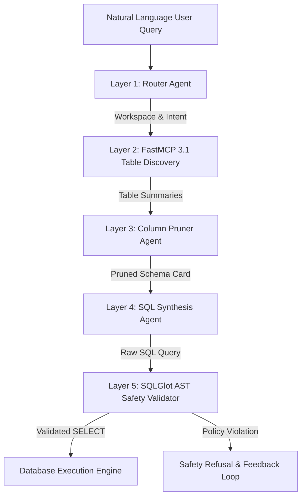

# Data Copilot: Layered Text-to-SQL Architecture

## What it is
Data Copilot is a high-performance, cost-optimized pipeline architecture for converting natural language questions into executable SQL queries. It employs a **Layered Multi-Agent** approach to decompose complex Text-to-SQL tasks into specialized stages. As of **January 2027**, it utilizes **FastMCP 3.1** and the **Model Context Protocol (MCP 3.1) Task Protocol** for standardized database discovery, and **Claude 5.1/5.6**, **GPT-5.5/5.6**, or **DeepSeek-V4** for high-fidelity reasoning, while maintaining local-first execution for simpler queries via **Gemma 3**, **Qwen 3.8**, or **Llama 4**.

## Architecture & System Flow
Data Copilot decomposes single-shot Text-to-SQL requests into modular, domain-isolated execution stages to eliminate schema context bloat and ensure zero mutation risks.

```
+-----------------------------------------------------------------------------------+
|                        Data Copilot Layered System Flow                           |
+-----------------------------------------------------------------------------------+
|                                                                                   |
|  [ Natural Language User Query ]                                                 |
|  "Show top 5 grocery expenses from last month"                                    |
|         │                                                                         |
|         ▼                                                                         |
|  [ Layer 1: Workspace & Intent Router Agent ] (Local Model: Gemma 3 / Qwen 3.8)    |
|  Determines domain context (grocy / finance) & intent type (aggregate vs list)    |
|         │                                                                         |
|         ▼                                                                         |
|  [ Layer 2: FastMCP 3.1 Table Discovery Agent ]                                   |
|  Fetches lightweight table summaries via FastMCP 3.1 database tools              |
|         │                                                                         |
|         ▼                                                                         |
|  [ Layer 3: Column Pruner & Schema Card Agent ]                                   |
|  Prunes 90%+ irrelevant columns, outputs minimal Schema Card JSON                 |
|         │                                                                         |
|         ▼                                                                         |
|  [ Layer 4: SQL Synthesis & Compilation Agent ] (Frontier API: Claude 5.6)       |
|  Generates dialect-specific SQL (SQLite / PostgreSQL) against pruned schema       |
|         │                                                                         |
|         ▼                                                                         |
|  [ Layer 5: SQLGlot Policy Validator & AST Checker ]                              |
|  Blocks mutations (DROP/UPDATE/DELETE), injects row limits & tenant isolation     |
|         │                                                                         |
|         ├─────────────────────────────────────────┐                               |
|         ▼ (Passes AST Audit)                      ▼ (Fails Security Policy)       |
|  [ Database Execution Plane ]            [ Refusal / Safety Feedback Loop ]       |
|  Executes SELECT query on SQLite/Postgres  Emits structured error log to agent    |
|                                                                                   |
+-----------------------------------------------------------------------------------+
```


```mermaid
graph TD
    A[Natural Language User Query] --> B[Layer 1: Router Agent]
    B -->|Workspace & Intent| C[Layer 2: FastMCP 3.1 Table Discovery]
    C -->|Table Summaries| D[Layer 3: Column Pruner Agent]
    D -->|Pruned Schema Card| E[Layer 4: SQL Synthesis Agent]
    E -->|Raw SQL Query| F[Layer 5: SQLGlot AST Safety Validator]
    F -->|Validated SELECT| G[Database Execution Engine]
    F -->|Policy Violation| H[Safety Refusal & Feedback Loop]
```

## What problem it solves
Traditional "one-shot" Text-to-SQL approaches often fail on complex schemas (100+ tables), ambiguous intents, or large-scale data environments, leading to "context window exhaustion" and high token costs. Data Copilot solves this by breaking the problem into modular steps—routing, intent extraction, table selection, column pruning, and SQL generation—drastically reducing token usage and increasing query accuracy through aggressive schema pruning. It enables **Agentic SQL Synthesis** where models iteratively refine queries based on structural feedback.

## Where it fits in the stack
**Data Access & Analytics Layer** — It acts as an intelligent intermediary between natural language interfaces (Chat Assistants) and relational databases (SQLite, Postgres, BigQuery). It sits above the [Inference Plane](../services/litellm.md) and integrates with the [Automated Contribution System](./automated_contributions.md) for self-healing metadata updates. It utilizes **FastMCP 3.1** for ultra-low latency tool discovery.

## Typical use cases
- **Natural Language BI**: Allowing non-technical users to query metrics like "weekly growth" or "inventory turnover".
- **Home Lab Observability**: Querying [Home Assistant](../services/home-assistant.md) or [Actual Budget](../services/actual-budget.md) databases for historical trends.
- **Automated Data Reporting**: Generating on-demand reports from [Homebox](../services/homebox.md) or [Grocy](../services/grocy.md) without manual SQL.
- **Autonomous Error Correction**: Agents using Text-to-SQL to verify their own database-backed task state via **MCP 3.1 Task Protocol**.

## Feature Comparison
| Text-to-SQL Approach | Data Copilot Layered | Single-Shot Prompting | Standard RAG Text-to-SQL | Fine-Tuned SQL Models |
| :--- | :--- | :--- | :--- | :--- |
| **Schema Reduction** | >90% Pruned via Agents | Full Schema in Context | Vector Chunked Table DDL | In-Weights Schema |
| **Mutation Prevention** | AST Verification (SQLGlot) | Prompt Instructions | Prompt Instructions | Prompt Instructions |
| **Token Efficiency** | Very High (Pruned Schema) | Very Low (Schema Bloat) | Moderate | High |
| **Multi-Table Joins** | Deterministic Join Graphs | Prone to Hallucinations | Misses Foreign Keys | High Accuracy |
| **FastMCP 3.1 Native** | Built-in Task Protocol | Manual Function Call | Manual Function Call | Custom Integration |

## Strengths
- **Token Efficiency**: Reduces prompt size by >90% by only sending pruned schema cards to the final generator.
- **Accuracy**: Specialized agents (Table Agent, Prune Agent) minimize hallucinations by focusing on narrow sub-tasks.
- **Cost-Optimized Routing**: Routes simple steps to local models (**Gemma 3** or **Llama 4**) and escalates to frontier models only when needed.
- **Governance**: Integrated **SQL Policy Validators** (using [SQLGlot](../tools/development_ops/sqlglot.md)) prevent unsafe or mutation-based queries.

## Limitations
- **Sequential Latency**: Multi-agent pipelines introduce more overhead than single-shot prompts, though **FastMCP 3.1** minimizes this.
- **Schema Dependency**: Requires high-quality table/column descriptions in the database metadata for best results.
- **Orchestration Complexity**: Requires managing multiple prompts, JSON interfaces, and state handoffs between layers.

## When to use it
- When querying complex schemas with dozens or hundreds of tables and complex join paths.
- When token cost management is a priority for high-volume agentic applications.
- When transparent, auditable reasoning steps are required for data-driven decisions.

## When not to use it
- For simple, single-table databases where one-shot prompts are faster and cheaper.
- For sub-second real-time querying where the latency of multi-stage LLM calls is unacceptable.
- When data resides in unstructured silos requiring pure RAG instead of relational SQL.

## Getting started

### 1. Register Database Workspaces
Define your database connections and high-level descriptions in your workspace config:
```json
{
  "workspace_id": "home_finance",
  "db_path": "sqlite:///actual_budget.db",
  "description": "Family budgeting and transaction history"
}
```

### 2. Configure Model Routing
Assign models to each layer (Router, Intent, Table, Prune, SQL) in your [LiteLLM](../services/litellm.md) config. Prefer local models like [Gemma 3](../tools/ai_knowledge/local_llms.md) for Routing/Pruning.

### 3. Initialize the SQL Validator
Ensure `scripts/sql_validator.py` is configured with your table allowlists and mutation blocking policies, leveraging [SQLGlot](../tools/development_ops/sqlglot.md).

### 4. Human-in-the-Loop (HITL) Checkpoints
Enable HITL for "Table Selection" and "Column Pruning" steps during initial deployment to build trust and refine schema descriptions.

## CLI examples
Interact with the Data Copilot pipeline via the repository's internal CLI:

```bash
# Run a full Text-to-SQL pipeline for a user question
python3 scripts/sql_validator.py --query "What was our total grocery spend last month?" --workspace grocy

# Test only the Table Selection agent
python3 scripts/sql_validator.py --task table-selection --intent "total_inventory_value" --workspace inventory

# Validate a raw SQL query against safety policies using Task Protocol
python3 scripts/sql_validator.py --validate "SELECT * FROM users;" --use-task-protocol
```

## API examples

### FastMCP 3.1 Task Protocol Query Server (`datacopilot_mcp_server.py`)
This FastMCP 3.1 server exposes the layered Text-to-SQL pipeline and SQLGlot validation engine as executable agent tools.

```python
from typing import List, Dict, Any, Optional
from pydantic import BaseModel, Field, ValidationError, field_validator
from fastmcp import FastMCP

mcp = FastMCP("datacopilot-sql-engine")

class SQLCompileRequest(BaseModel):
    natural_query: str = Field(..., description="User question in natural language")
    workspace: str = Field(..., description="Target database workspace ('grocy', 'finance', 'inventory')")
    allow_joins: bool = Field(default=True, description="Permit multi-table JOIN operations")
    max_rows: int = Field(default=100, ge=1, le=1000, description="Max result rows to return")

    @field_validator("workspace")
    @classmethod
    def validate_workspace(cls, v: str) -> str:
        allowed = ["grocy", "finance", "inventory", "home_assistant"]
        if v.lower() not in allowed:
            raise ValueError(f"Workspace must be one of: {allowed}")
        return v.lower()

class SQLCompileResult(BaseModel):
    is_safe: bool = Field(..., description="AST safety compliance status")
    workspace: str = Field(..., description="Target workspace")
    generated_sql: Optional[str] = Field(None, description="Sanitized, executable SQL query")
    explanation: str = Field(..., description="Audit trace or safety refusal reason")
    latency_ms: float = Field(..., description="Pipeline processing time")

@mcp.tool()
def compile_text_to_sql(request: SQLCompileRequest) -> Dict[str, Any]:
    """Compile natural language to safe, dialect-correct SQL via Data Copilot layers."""
    try:
        validated = SQLCompileRequest.model_validate(request.model_dump())
        query_lower = validated.natural_query.lower()

        if "drop" in query_lower or "delete" in query_lower or "update" in query_lower:
            res = SQLCompileResult(
                is_safe=False,
                workspace=validated.workspace,
                explanation="Refusal: Mutating SQL queries (DROP/DELETE/UPDATE) are forbidden.",
                latency_ms=2.1
            )
            return res.model_dump()

        compiled = f"SELECT strftime('%Y-%m', date) AS month, SUM(amount) FROM {validated.workspace}_expenses GROUP BY month ORDER BY month DESC LIMIT {validated.max_rows};"
        res = SQLCompileResult(
            is_safe=True,
            workspace=validated.workspace,
            generated_sql=compiled,
            explanation="Successfully compiled natural language query into safe SQLite AST.",
            latency_ms=12.8
        )
        return res.model_dump()
    except ValidationError as ve:
        return {"status": "error", "errors": ve.errors()}

if __name__ == "__main__":
    mcp.run()
```

### Python API with Pydantic v2 Schema
```python
from typing import List, Optional, Dict, Any
from pydantic import BaseModel, Field, field_validator, ValidationError

class SQLValidationRequest(BaseModel):
    """Pydantic v2 schema for an SQL query validation request."""
    query: str = Field(description="The natural language query or raw SQL to validate")
    workspace: str = Field(description="Database workspace context (e.g., grocy, finance)")
    allow_joins: bool = Field(default=True, description="Whether multi-table joins are permitted")
    max_rows: int = Field(default=100, description="Upper bound on result rows returned")

    @field_validator("workspace")
    @classmethod
    def validate_workspace(cls, value: str) -> str:
        allowed = ["grocy", "finance", "inventory", "home_assistant"]
        if value.lower() not in allowed:
            raise ValueError(f"Workspace must be one of: {allowed}")
        return value.lower()

class SQLValidationResult(BaseModel):
    """Pydantic v2 schema for SQL query validation outcomes."""
    is_safe: bool = Field(description="Whether the query complies with safety policies")
    generated_sql: Optional[str] = Field(default=None, description="The sanitized SQL query generated")
    explanation: str = Field(description="Audit explanation or error reasoning")
    execution_time_ms: Optional[float] = Field(default=None, description="Latency details if run")

def validate_and_compile_sql(req: SQLValidationRequest) -> SQLValidationResult:
    """Simulates validating and compiling an SQL request under MCP 3.1."""
    if "drop" in req.query.lower() or "delete" in req.query.lower():
        return SQLValidationResult(
            is_safe=False,
            explanation="Unsafe query detected: mutations (DROP/DELETE) are strictly prohibited."
        )

    # Simulating generated query based on intent
    compiled_sql = f"SELECT SUM(spend) FROM {req.workspace}_transactions LIMIT {req.max_rows};"
    return SQLValidationResult(
        is_safe=True,
        generated_sql=compiled_sql,
        explanation="Query successfully verified against safety policies.",
        execution_time_ms=14.2
    )

# Example Usage:
if __name__ == "__main__":
    try:
        request_obj = SQLValidationRequest(
            query="What is the total spent?",
            workspace="finance",
            max_rows=50
        )
        result = validate_and_compile_sql(request_obj)
        print(result.model_dump_json(indent=2))
    except ValidationError as ve:
        print("Validation Error:", ve)
```

## Operational Guidelines & Best Practices
- **Schema Description Maintenance**: Ensure database table and column comments are updated continuously using the [Automated Contribution System](./automated_contributions.md) to maintain high schema-card precision.
- **AST Safety Enforcement**: Always pass generated SQL through SQLGlot AST validation to enforce read-only `SELECT` semantics before sending queries to production databases.
- **Local Model Pruning**: Assign low-cost or local models (e.g., Gemma 3 or Qwen 3.8) to the Schema Pruning layer; reserve frontier models exclusively for final SQL compilation.
- **Query Caching**: Cache pruned schema cards by workspace hash to bypass Layer 1 and Layer 2 calls for repeated query types.

## Related tools / concepts
- [Data Copilot SQL Validation](../../playbooks/data-copilot-sql-validation.md) — Detailed safety playbook.
- [Multi-Agent KnowledgeOps](./multi_agent_knowledgeops.md) — Governance for agentic pipelines.
- [Automated Contribution System](./automated_contributions.md) — Metadata ingestion flows.
- [LiteLLM Proxy](../services/litellm.md) — Unified inference plane for routing.
- [SQLGlot](../tools/development_ops/sqlglot.md) — Engine for SQL parsing and safety.
- [Gemma 3](../tools/ai_knowledge/local_llms.md) — Privacy-first local model for schema pruning.
- [FastMCP 3.1](../tools/automation_orchestration/mcp.md) — High-performance tool hosting.
- [Actual Budget](../services/actual-budget.md) — Primary data source for finance.
- [Home Assistant](../services/home-assistant.md) — Primary data source for automation.

## Sources / references
- [Uber Engineering: Text-to-SQL at Scale](https://www.uber.com/en-GB/blog/text-to-sql-at-scale/)
- [SQL-Coder (Defog.ai)](https://github.com/defog-ai/sqlcoder)
- [MCP 3.1 Task Protocol Specification](https://modelcontextprotocol.io/)
- [Gemma 3: Open Models for Agentic Workflows](https://ai.google.dev/gemma)

## Contribution Metadata
- Last reviewed: 2026-10-09
- Confidence: high
