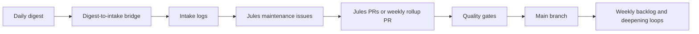

---
hide:
  - navigation
  - toc
---

# Home-Office Automation & AI Hub

> Operational documentation for AI-enabled home-office automation, maintained by humans and agents with explicit quality gates.

## Start by Goal

-   **Implement a workflow**

    ---

    Go to [Playbooks](playbooks/index.md) for step-by-step execution guides.

-   **Evaluate or compare tools**

    ---

    Start in the [Tool Catalogue](tools/README.md), then use the [AI Tooling Landscape](knowledge_base/ai_tooling_landscape.md) for context.

-   **Build a website or app quickly**

    ---

    Start in the [AI Builder Index](knowledge_base/ai_builder_index.md), then use the [Free AI Website Playbook](knowledge_base/free_ai_website_playbook.md).

-   **Choose the right model**

    ---

    Start with the [Model Routing Guide](knowledge_base/model_routing_guide.md).

-   **Understand architecture and system design**

    ---

    Use [Architecture](architecture/README.md) for component maps, flows, and governance.

-   **Contribute safely (human or agent)**

    ---

    Follow [Contributing](CONTRIBUTING.md), [Standards](standards.md), and the [Agent Rules](https://github.com/joanmarcriera/Home-office-automations/blob/main/AGENTS.md).

---

## Section Guide

| Section | What you will find | Entry page |
| :--- | :--- | :--- |
| **New Sources** | Intake queue process and dated discovery logs used by automation workflows. | [new-sources.md](new-sources.md) |
| **Playbooks** | Reusable execution guides for recurring operational workflows. | [playbooks/index.md](playbooks/index.md) |
| **Services** | Self-hosted service docs (deploy context, use cases, strengths/limits). | [services/README.md](services/README.md) |
| **Tool Catalogue** | Canonical docs for AI tools, frameworks, providers, agents, infra, benchmarking, and orchestration. | [tools/README.md](tools/README.md) |
| **Knowledge Base** | Concepts and patterns: protocols, RAG, model classes, security, and ecosystem landscape. | [knowledge_base/README.md](knowledge_base/README.md) |
| **Architecture** | Component map, data flows, infrastructure decisions, and multi-agent governance. | [architecture/README.md](architecture/README.md) |
| **Reference Implementations** | Concrete prompts, mapping rules, and workflow exports for direct reuse. | [reference-implementations/index.md](reference-implementations/index.md) |
| **Roadmap** | Planned improvements and known gaps. | [roadmap.md](roadmap.md) |
| **Standards** | Taxonomy, canonical-page rules, metadata requirements, and dedup policy. | [standards.md](standards.md) |

---

## How Repository Automation Works

Repository mapping:

- **Daily digest**: `.github/workflows/daily-digest.yml`
- **Digest-to-intake bridge**: `.github/workflows/digest-to-intake.yml`
- **Jules maintenance issues**: `.github/workflows/daily-jules-maintenance.yml`
- **Jules PRs / weekly rollup PR**: Jules bot PRs plus `automation/weekly-rollup`
- **Quality gates**: docs, catalog, intake, link, and generated-content workflows
- **Weekly backlog / deepening loops**: `.github/workflows/process-jules-backlog.yml`, `.github/workflows/daily-jules-knowledge.yml`, `.github/workflows/weekly-planner.yml`, `.github/workflows/weekly-automation-rollup-merge.yml`

Supporting docs:

- [Automated Contributions](architecture/automated_contributions.md)
- [Multi-Agent KnowledgeOps](architecture/multi_agent_knowledgeops.md)
- [Contributing Guide](CONTRIBUTING.md)

---

## Maintenance Entry Points

- Human maintainers: [CONTRIBUTING.md](CONTRIBUTING.md)
- LLM agents: [AGENTS.md](https://github.com/joanmarcriera/Home-office-automations/blob/main/AGENTS.md) (repo-root file on GitHub)
- Agent task patterns: [skills.md](https://github.com/joanmarcriera/Home-office-automations/blob/main/skills.md) (repo-root file on GitHub)

<small>Use this page as the section index. Use section overview pages for detailed scope and conventions.</small>

## Sources / References
- [Automated Contributions](architecture/automated_contributions.md)
- [Multi-Agent KnowledgeOps Governance](architecture/multi_agent_knowledgeops.md)
- [Contributing Guide](CONTRIBUTING.md)

## Contribution Metadata
- Last reviewed: 2026-03-15
- Confidence: high
