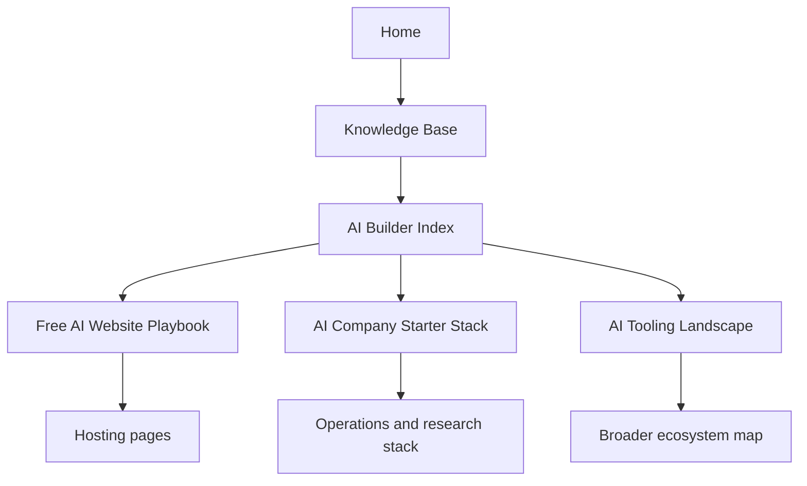

# AI Builder Index

This page is the discovery-oriented front door for building things with the stack in this repository.

It is inspired by the information-distribution pattern used on [awesomeclaude.ai](https://awesomeclaude.ai/): put the highest-signal buckets near the top, explain why they matter in one sentence, and then route people into the right detailed pages.

## Start by outcome

| Goal | Start here | Then go to | Best for |
| :--- | :--- | :--- | :--- |
| Build a website or app for free | [Free AI Website Playbook](free_ai_website_playbook.md) | [Vercel](../tools/development_ops/vercel.md), [Cloudflare Pages](../tools/development_ops/cloudflare-pages.md), [GitHub Pages](../tools/development_ops/github-pages.md), [Supabase](../tools/infrastructure/supabase.md) | Founders, consultants, internal builders |
| Set up an AI-driven company stack | [AI Company Starter Stack](ai_company_starter_stack.md) | [n8n](../services/n8n.md), [Google Workspace CLI](../tools/automation_orchestration/google-workspace-cli.md), [mem0](../tools/agents/mem0.md) | Teams building operating leverage |
| Build AI products | [AI Tooling Landscape](ai_tooling_landscape.md) | [Context7](../tools/development_ops/context7.md), [Claude Cookbooks](../tools/development_ops/claude-cookbooks.md), [OpenRouter](../tools/ai_knowledge/openrouter.md) | Product builders and engineers |
| Research markets, leads, or targets | [AI Company Starter Stack](ai_company_starter_stack.md) | [DeerFlow](../tools/agents/deerflow.md), [Tavily](../tools/providers/tavily.md), [Browser Use](../tools/automation_orchestration/browser-use.md) | Agencies, sales, strategy work |
| Build internal knowledge assistants | [AI Company Starter Stack](ai_company_starter_stack.md) | [AnythingLLM](../tools/ai_knowledge/anythingllm.md), [LocalAI](../tools/infrastructure/localai.md), [Ollama](../services/ollama.md) | Internal enablement and knowledge access |
| Run local or private AI | [AI Company Starter Stack](ai_company_starter_stack.md) | [LocalAI](../tools/infrastructure/localai.md), [llmfit](../tools/development_ops/llmfit.md), [Ollama](../services/ollama.md) | Privacy-sensitive or cost-conscious teams |

## Recommended entry paths

-   **Build Websites**

    ---

    Start with the [Free AI Website Playbook](free_ai_website_playbook.md).

    Use this when you need to decide:
    - what site to build,
    - what free host fits it,
    - and how to prompt the LLM correctly.

-   **Ship AI Products**

    ---

    Start with the [AI Tooling Landscape](ai_tooling_landscape.md).

    Use this when you need the broader map of providers, agents, frameworks, and serving layers before choosing implementation tools.

-   **Run Operations**

    ---

    Start with the [AI Company Starter Stack](ai_company_starter_stack.md).

    Use this when the real goal is not the app itself but the company operating system behind it.

-   **Research And Leads**

    ---

    Start with the [Research and lead-intel pack](ai_company_starter_stack.md#expansion-packs).

    Use this when you need repeatable account research, market synthesis, or lead-generation workflows.

-   **Internal Knowledge**

    ---

    Start with [AnythingLLM](../tools/ai_knowledge/anythingllm.md) and the [Knowledge workspace pack](ai_company_starter_stack.md#expansion-packs).

    Use this when the company needs a usable internal assistant before it needs a custom AI product.

-   **Private / Local AI**

    ---

    Start with [LocalAI](../tools/infrastructure/localai.md) and [llmfit](../tools/development_ops/llmfit.md).

    Use this when control, privacy, or cost discipline matters more than convenience.

## Curated buckets

### Website builders and launch stack

Use this bucket when the main question is, "What can I launch this week without paying for infrastructure yet?"

- [Free AI Website Playbook](free_ai_website_playbook.md)
- [Vercel](../tools/development_ops/vercel.md)
- [Cloudflare Pages](../tools/development_ops/cloudflare-pages.md)
- [Netlify](../tools/development_ops/netlify.md)
- [GitHub Pages](../tools/development_ops/github-pages.md)
- [Supabase](../tools/infrastructure/supabase.md)

### Product implementation stack

Use this bucket when the main question is, "How do I build the AI product itself without making architecture mistakes?"

- [AI Tooling Landscape](ai_tooling_landscape.md)
- [Context7](../tools/development_ops/context7.md)
- [Claude Cookbooks](../tools/development_ops/claude-cookbooks.md)
- [OpenRouter](../tools/ai_knowledge/openrouter.md)
- [Playwright](../tools/development_ops/playwright.md)

### Company operations stack

Use this bucket when the main question is, "How do I make the company itself run better with AI?"

- [AI Company Starter Stack](ai_company_starter_stack.md)
- [n8n](../services/n8n.md)
- [Google Workspace CLI](../tools/automation_orchestration/google-workspace-cli.md)
- [Claude Skills Ecosystem](../tools/agents/claude-skills-ecosystem.md)
- [Superpowers](../tools/agents/superpowers.md)

### Research and intelligence stack

Use this bucket when the main question is, "How do I create a machine for lead research, market synthesis, or target-account intelligence?"

- [DeerFlow](../tools/agents/deerflow.md)
- [Tavily](../tools/providers/tavily.md)
- [Browser Use](../tools/automation_orchestration/browser-use.md)
- [mem0](../tools/agents/mem0.md)
- [OpenBB](../tools/ai_knowledge/openbb.md)

### Internal knowledge and workspace stack

Use this bucket when the main question is, "How do I give the team an internal assistant they will actually use?"

- [AnythingLLM](../tools/ai_knowledge/anythingllm.md)
- [Ollama](../services/ollama.md)
- [LocalAI](../tools/infrastructure/localai.md)
- [Supabase](../tools/infrastructure/supabase.md)

## My practical defaults

If I had to route most people quickly:

1. Public product or marketing site: [Free AI Website Playbook](free_ai_website_playbook.md) -> [Vercel](../tools/development_ops/vercel.md) -> [Supabase](../tools/infrastructure/supabase.md) if needed.
2. Docs-heavy site or repo project: [Free AI Website Playbook](free_ai_website_playbook.md) -> [GitHub Pages](../tools/development_ops/github-pages.md).
3. AI-driven company ops: [AI Company Starter Stack](ai_company_starter_stack.md).
4. Product implementation questions: [AI Tooling Landscape](ai_tooling_landscape.md).

## Navigation map

## Related

- [Knowledge Base Overview](README.md)
- [Free AI Website Playbook](free_ai_website_playbook.md)
- [AI Company Starter Stack](ai_company_starter_stack.md)
- [AI Tooling Landscape](ai_tooling_landscape.md)
- [Home](../index.md)

## Sources / References
- [awesomeclaude.ai](https://awesomeclaude.ai/)
- [Free AI Website Playbook sources](free_ai_website_playbook.md#sources--references)

## Contribution Metadata
- Last reviewed: 2026-03-15
- Confidence: medium
