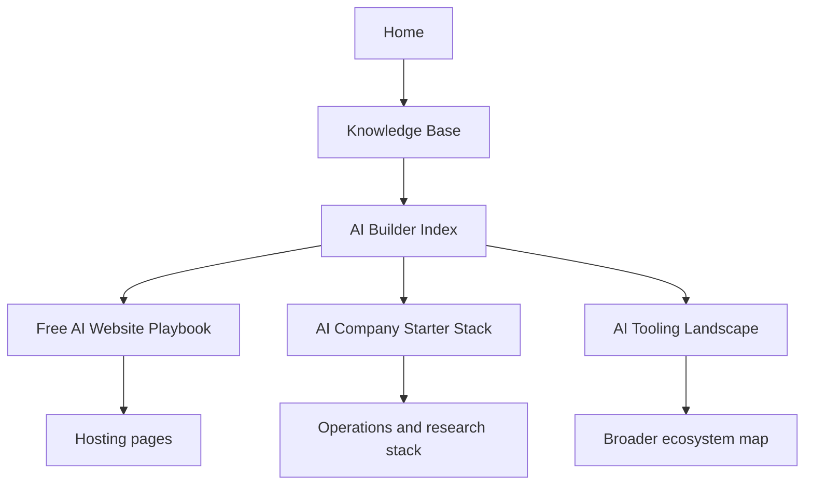

# AI Builder Index

## What it is

The AI Builder Index is the primary discovery portal for the homelab automation and AI engineering stack documented in this repository. It serves as a high-signal directory that routes users to the appropriate playbooks, tools, and architectural patterns based on their desired outcomes, whether they are building public websites, internal company operations, or specialized research agents.

## What problem it solves

The repository contains a vast array of tools and patterns, which can be overwhelming for new users. The AI Builder Index solves this "discovery friction" by organizing the content into logical "outcome buckets." Instead of browsing a flat file list, builders can start with a goal (e.g., "Build a website for free") and immediately find the curated set of tools and instructions needed to achieve it.

## Where it fits in the stack

**Category**: Knowledge Base / Entry Point. It is the **navigational layer** of the KnowledgeOps system, sitting between the [Home Index](../index.md) and the detailed technical documentation for individual services and tools.

## Typical use cases

- **New User Onboarding**: Quickly finding the "Starter Stack" to begin automating a home or small business.
- **Project Selection**: Deciding between a local-first approach (Ollama/LocalAI) or a hosted approach (OpenRouter/Vercel) for a new AI application.
- **Research Workflow Design**: Identifying the right combination of browsing (Browser Use) and memory (mem0) tools for market intelligence.
- **Rapid Prototyping**: Using the [Free AI Website Playbook](free_ai_website_playbook.md) to launch an MVP in a single weekend.

## Strengths

- **Signal-to-Noise**: Filters the entire repository into the most impactful tools and paths.
- **Outcome-Driven**: Focuses on "Jobs to be Done" rather than tool features.
- **Highly Visual**: Uses Mermaid diagrams and grid cards for rapid mental mapping.
- **Opinionated Defaults**: Provides clear "Practical Defaults" to reduce decision fatigue.

## Limitations

- **Index Lag**: Requires manual updates when new high-impact tools are added to the repository.
- **Abstraction Layer**: Points to documentation but does not contain the deep technical implementation details itself.
- **Path Dependency**: Assumes users are following the repository's core philosophy of AI-assisted development and automation.

## When to use it

- When you are new to the repository and don't know where to start.
- When you have a specific goal (e.g., "Set up an internal knowledge base") and need a curated stack.
- When you need a high-level overview of how the various architectural pieces (Agents, Infrastructure, Flows) fit together.

## When not to use it

- If you already know exactly which tool you need (use the global search or specific category indices).
- If you are looking for low-level API references or installation logs (go to the specific tool page).

## Getting started

To get the most out of the AI Builder Index:

1. **Identify your Goal**: Scan the "Start by outcome" table below.
2. **Follow the Path**: Click the link in the "Start here" column for your chosen goal.
3. **Adopt Defaults**: If you are unsure, look at the "My practical defaults" section to see the recommended baseline stack.
4. **Explore the Map**: Use the "Navigation map" at the bottom of the page to understand the structural hierarchy of the documentation.

## Start by outcome

| Goal | Start here | Then go to | Best for |
| :--- | :--- | :--- | :--- |
| Build a website or app for free | [Free AI Website Playbook](free_ai_website_playbook.md) | [Vercel](../tools/development_ops/vercel.md), [Cloudflare Pages](../tools/development_ops/cloudflare-pages.md), [GitHub Pages](../tools/development_ops/github-pages.md), [Supabase](../tools/infrastructure/supabase.md) | Founders, consultants, internal builders |
| Set up an AI-driven company stack | [AI Company Starter Stack](ai_company_starter_stack.md) | [n8n](../services/n8n.md), [Google Workspace CLI](../tools/automation_orchestration/google-workspace-cli.md), [mem0](../tools/agents/mem0.md) | Teams building operating leverage |
| Build AI products | [AI Tooling Landscape](ai_tooling_landscape.md) | [Context7](../tools/development_ops/context7.md), [Claude Cookbooks](../tools/development_ops/claude-cookbooks.md), [OpenRouter](../tools/ai_knowledge/openrouter.md) | Product builders and engineers |
| Choose an agent framework or agent stack | [Agent Framework Learning Map](agent_framework_learning_map.md) | [LangGraph](../tools/frameworks/langgraph.md), [OpenAI Agents SDK](../tools/frameworks/openai-agents-sdk.md), [OpenClaw](../tools/development_ops/openclaw.md) | Builders deciding what to study vs what to use |
| Research markets, leads, or targets | [AI Company Starter Stack](ai_company_starter_stack.md) | [DeerFlow](../tools/agents/deerflow.md), [Tavily](../tools/providers/tavily.md), [Browser Use](../tools/automation_orchestration/browser-use.md) | Agencies, sales, strategy work |
| Build internal knowledge assistants | [AI Company Starter Stack](ai_company_starter_stack.md) | [AnythingLLM](../tools/ai_knowledge/anythingllm.md), [LocalAI](../tools/infrastructure/localai.md), [Ollama](../services/ollama.md) | Internal enablement and knowledge access |
| Run local or private AI | [AI Company Starter Stack](ai_company_starter_stack.md) | [LocalAI](../tools/infrastructure/localai.md), [llmfit](../tools/development_ops/llmfit.md), [Ollama](../services/ollama.md) | Privacy-sensitive or cost-conscious teams |

## Recommended entry paths

-   **Build Websites**

    ---

    Start with the [Free AI Website Playbook](free_ai_website_playbook.md).

    Use this when you need to decide:
    - what site to build,
    - what free host fits it,
    - and how to prompt the LLM correctly.

-   **Ship AI Products**

    ---

    Start with the [AI Tooling Landscape](ai_tooling_landscape.md).

    Use this when you need the broader map of providers, agents, frameworks, and serving layers before choosing implementation tools.

-   **Run Operations**

    ---

    Start with the [AI Company Starter Stack](ai_company_starter_stack.md).

    Use this when the real goal is not the app itself but the company operating system behind it.

-   **Research And Leads**

    ---

    Start with the [Research and lead-intel pack](ai_company_starter_stack.md#expansion-packs).

    Use this when you need repeatable account research, market synthesis, or lead-generation workflows.

-   **Internal Knowledge**

    ---

    Start with [AnythingLLM](../tools/ai_knowledge/anythingllm.md) and the [Knowledge workspace pack](ai_company_starter_stack.md#expansion-packs).

    Use this when the company needs a usable internal assistant before it needs a custom AI product.

-   **Private / Local AI**

    ---

    Start with [LocalAI](../tools/infrastructure/localai.md) and [llmfit](../tools/development_ops/llmfit.md).

    Use this when control, privacy, or cost discipline matters more than convenience.

## Curated buckets

### Website builders and launch stack

Use this bucket when the main question is, "What can I launch this week without paying for infrastructure yet?"

- [Free AI Website Playbook](free_ai_website_playbook.md)
- [Vercel](../tools/development_ops/vercel.md)
- [Cloudflare Pages](../tools/development_ops/cloudflare-pages.md)
- [Netlify](../tools/development_ops/netlify.md)
- [GitHub Pages](../tools/development_ops/github-pages.md)
- [Supabase](../tools/infrastructure/supabase.md)

### Product implementation stack

Use this bucket when the main question is, "How do I build the AI product itself without making architecture mistakes?"

- [AI Tooling Landscape](ai_tooling_landscape.md)
- [Agent Framework Learning Map](agent_framework_learning_map.md)
- [Context7](../tools/development_ops/context7.md)
- [Claude Cookbooks](../tools/development_ops/claude-cookbooks.md)
- [OpenRouter](../tools/ai_knowledge/openrouter.md)
- [Playwright](../tools/development_ops/playwright.md)

### Company operations stack

Use this bucket when the main question is, "How do I make the company itself run better with AI?"

- [AI Company Starter Stack](ai_company_starter_stack.md)
- [n8n](../services/n8n.md)
- [Google Workspace CLI](../tools/automation_orchestration/google-workspace-cli.md)
- [Claude Skills Ecosystem](../tools/agents/claude-skills-ecosystem.md)
- [Superpowers](../tools/agents/superpowers.md)

### Research and intelligence stack

Use this bucket when the main question is, "How do I create a machine for lead research, market synthesis, or target-account intelligence?"

- [DeerFlow](../tools/agents/deerflow.md)
- [Tavily](../tools/providers/tavily.md)
- [Browser Use](../tools/automation_orchestration/browser-use.md)
- [mem0](../tools/agents/mem0.md)
- [OpenBB](../tools/ai_knowledge/openbb.md)

### Internal knowledge and workspace stack

Use this bucket when the main question is, "How do I give the team an internal assistant they will actually use?"

- [AnythingLLM](../tools/ai_knowledge/anythingllm.md)
- [Ollama](../services/ollama.md)
- [LocalAI](../tools/infrastructure/localai.md)
- [Supabase](../tools/infrastructure/supabase.md)

## My practical defaults

If I had to route most people quickly:

1. Public product or marketing site: [Free AI Website Playbook](free_ai_website_playbook.md) -> [Vercel](../tools/development_ops/vercel.md) -> [Supabase](../tools/infrastructure/supabase.md) if needed.
2. Docs-heavy site or repo project: [Free AI Website Playbook](free_ai_website_playbook.md) -> [GitHub Pages](../tools/development_ops/github-pages.md).
3. AI-driven company ops: [AI Company Starter Stack](ai_company_starter_stack.md).
4. Product implementation questions: [AI Tooling Landscape](ai_tooling_landscape.md).

## Navigation map

```mermaid
flowchart TD
    A["Home"] --> B["Knowledge Base"]
    B --> C["AI Builder Index"]
    C --> D["Free AI Website Playbook"]
    C --> E["AI Company Starter Stack"]
    C --> F["AI Tooling Landscape"]
    D --> G["Hosting pages"]
    E --> H["Operations and research stack"]
    F --> I["Broader ecosystem map"]
```

## Related tools / concepts

- [Knowledge Base Overview](README.md)
- [Free AI Website Playbook](free_ai_website_playbook.md)
- [AI Company Starter Stack](ai_company_starter_stack.md)
- [AI Tooling Landscape](ai_tooling_landscape.md)
- [Agent Framework Learning Map](agent_framework_learning_map.md)
- [Agent Protocols](agent_protocols.md)
- [Agentic Workflows](patterns/agentic-workflows.md)
- [Home](../index.md)
- [Infrastructure](../architecture/infrastructure.md)
- [System Prompts](system_prompts.md)

## Sources / References
- [awesomeclaude.ai](https://awesomeclaude.ai/)
- [Free AI Website Playbook sources](free_ai_website_playbook.md#sources--references)

## Contribution Metadata
- Last reviewed: 2026-05-10
- Confidence: high
