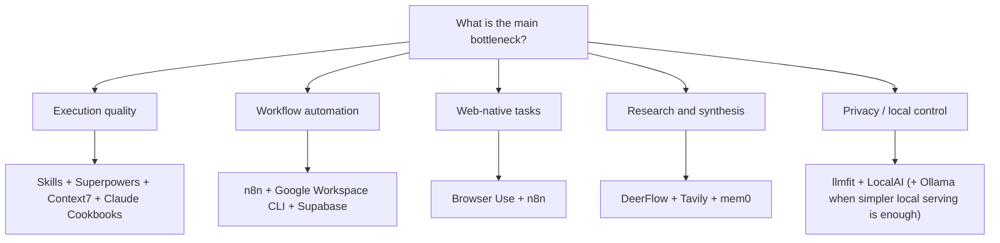
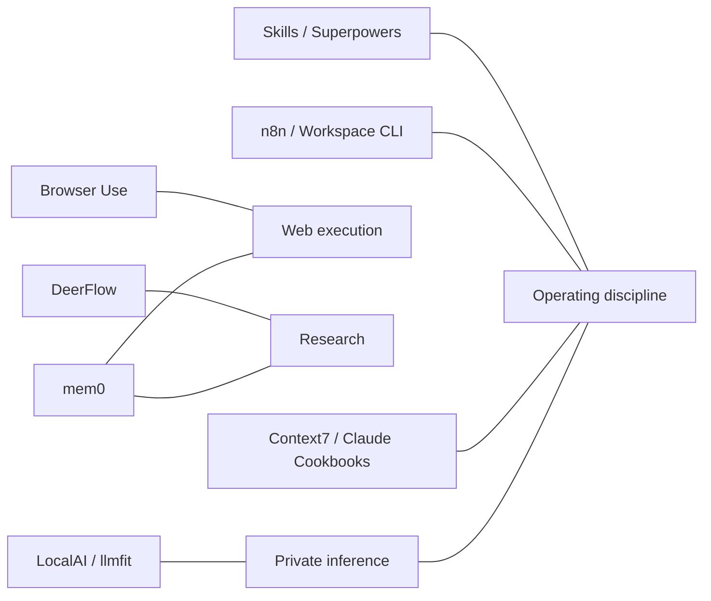

# AI Company Starter Stack

This page turns the catalogue into an opinionated starter stack for building a company where AI is part of daily operations, not just a side experiment.

The goal is not to list every good tool. The goal is to help you choose the smallest stack that gives you leverage across product, operations, research, content, and internal execution.

## The default stack

| Layer | Default choice | Why it belongs in the starter stack | Replace when |
| :--- | :--- | :--- | :--- |
| Agent operating model | [Claude Skills Ecosystem](../tools/agents/claude-skills-ecosystem.md) + [Superpowers](../tools/agents/superpowers.md) | Reusable workflows plus execution discipline | You are not using coding agents seriously yet |
| Current technical context | [Context7](../tools/development_ops/context7.md) | Keeps coding agents grounded in current docs | Your work is mostly non-technical or repo-local |
| Workflow control plane | [n8n](../services/n8n.md) | Scheduling, retries, approvals, and cross-system automation | Your company is still too small for durable workflows |
| Web interaction | [Browser Use](../tools/automation_orchestration/browser-use.md) | Covers UI-only systems and interactive web tasks | Stable APIs exist for the same work |
| Company operating surface | [Google Workspace CLI](../tools/automation_orchestration/google-workspace-cli.md) | Documents, calendars, files, and admin actions become automatable | You do not run the company on Google Workspace |
| Memory | [mem0](../tools/agents/mem0.md) | Preserves account, process, and user context across sessions | Tasks are stateless and one-off |
| Research harness | [DeerFlow](../tools/agents/deerflow.md) | Strong fit for strategy, research, and evidence synthesis | Your work is mostly transactional automation |
| Claude implementation examples | [Claude Cookbooks](../tools/development_ops/claude-cookbooks.md) | First-party examples reduce integration guesswork | You already have strong internal patterns |
| Local/private inference option | [LocalAI](../tools/infrastructure/localai.md) + [llmfit](../tools/development_ops/llmfit.md) | Gives you a path to self-hosting without blind hardware bets | Frontier cloud models are more important than control |

## What each part is for

### 1. Skills + Superpowers
Use this pair when you want agents to behave like trained operators instead of smart autocomplete.

- **Skills** package repeatable company procedures.
- **Superpowers** enforces a better process for execution.
- Together, they make AI usable by teams, not only by one power user.

### 2. n8n + Workspace CLI
Use this pair when the company needs actual operating workflows.

- **n8n** coordinates timing, branching, retries, approvals, and logs.
- **Google Workspace CLI** executes useful work in Docs, Sheets, Drive, Calendar, and Chat.
- Together, they turn office operations into an automatable system.

### 3. Context7 + Claude Cookbooks
Use this pair when the team is building AI products or internal tools.

- **Context7** provides current third-party docs.
- **Claude Cookbooks** provides first-party Claude implementation patterns.
- Together, they reduce bad assumptions during build work.

### 4. Browser Use + mem0 + DeerFlow
Use this trio for research, lead generation, and web-native execution.

- **Browser Use** interacts with websites.
- **mem0** remembers what happened and what matters.
- **DeerFlow** structures longer research/execution tasks.

### 5. LocalAI + llmfit
Use this pair when privacy, local control, or cost discipline matters.

- **llmfit** decides what can run on your hardware.
- **LocalAI** gives you a reusable local API once you know the hardware plan is viable.

## Comparison table

| Need | Best default | Use instead when | Comment |
| :--- | :--- | :--- | :--- |
| Reusable company procedures | [Claude Skills Ecosystem](../tools/agents/claude-skills-ecosystem.md) | You only need one-off prompts | Skills matter once the process repeats |
| Reliable coding-agent execution | [Superpowers](../tools/agents/superpowers.md) | Speed matters more than rigor | Best for important engineering work |
| Workflow orchestration | [n8n](../services/n8n.md) | One small script is enough | n8n is the operating system, not just a node editor |
| Browser-only workflows | [Browser Use](../tools/automation_orchestration/browser-use.md) | API exists | APIs beat browsers when available |
| Workspace automation | [Google Workspace CLI](../tools/automation_orchestration/google-workspace-cli.md) | Your company runs elsewhere | Great when Docs/Sheets/Drive are core |
| Long-lived memory | [mem0](../tools/agents/mem0.md) | Stateless execution is enough | Do not add memory unless it pays for itself |
| Deep research | [DeerFlow](../tools/agents/deerflow.md) | Search + one summary call is enough | Best for evidence-heavy work |
| Current docs for agents | [Context7](../tools/development_ops/context7.md) | No external docs required | Very high leverage for coding teams |
| First-party Claude patterns | [Claude Cookbooks](../tools/development_ops/claude-cookbooks.md) | You need broader ecosystem docs | Strong complement to Context7 |
| Local inference | [LocalAI](../tools/infrastructure/localai.md) | You need frontier quality and speed first | Pair with llmfit before buying hardware |

## Selection map

## Overlap map

## Example starter stacks

### Lean AI-native services company
- [Claude Skills Ecosystem](../tools/agents/claude-skills-ecosystem.md)
- [Superpowers](../tools/agents/superpowers.md)
- [Context7](../tools/development_ops/context7.md)
- [n8n](../services/n8n.md)
- [Google Workspace CLI](../tools/automation_orchestration/google-workspace-cli.md)

Use this when you want the smallest serious stack for delivery, documentation, and operations.

### Research-heavy AI consultancy
- [DeerFlow](../tools/agents/deerflow.md)
- [Browser Use](../tools/automation_orchestration/browser-use.md)
- [Tavily](../tools/providers/tavily.md)
- [mem0](../tools/agents/mem0.md)
- [n8n](../services/n8n.md)

Use this when account research, competitor analysis, and evidence gathering are core to the business.

### Privacy-first internal automation stack
- [LocalAI](../tools/infrastructure/localai.md)
- [llmfit](../tools/development_ops/llmfit.md)
- [Ollama](../services/ollama.md)
- [n8n](../services/n8n.md)
- [Supabase](../tools/infrastructure/supabase.md)

Use this when local control and internal data handling matter more than frontier-model convenience.

## What I would use first
If I were setting up an AI-driven company from scratch, I would start with:

1. [Claude Skills Ecosystem](../tools/agents/claude-skills-ecosystem.md)
2. [Superpowers](../tools/agents/superpowers.md)
3. [Context7](../tools/development_ops/context7.md)
4. [n8n](../services/n8n.md)
5. [Google Workspace CLI](../tools/automation_orchestration/google-workspace-cli.md)

Then I would add:

- [Browser Use](../tools/automation_orchestration/browser-use.md) when APIs are missing
- [mem0](../tools/agents/mem0.md) when continuity actually matters
- [DeerFlow](../tools/agents/deerflow.md) when research becomes a core workflow
- [LocalAI](../tools/infrastructure/localai.md) and [llmfit](../tools/development_ops/llmfit.md) when local/private inference is justified

## Sources / References
- [Starred AI / Agent Repositories Over 10K Stars](starred_ai_agent_repos.md)
- [Anthropic Skills Repository](https://github.com/anthropics/skills)
- [Superpowers](https://github.com/obra/superpowers)
- [Context7](https://github.com/upstash/context7)
- [Browser Use](https://github.com/browser-use/browser-use)
- [Google Workspace CLI](https://github.com/googleworkspace/cli)
- [mem0](https://github.com/mem0ai/mem0)
- [DeerFlow](https://github.com/bytedance/deer-flow)
- [Claude Cookbooks](https://github.com/anthropics/claude-cookbooks)
- [LocalAI](https://github.com/mudler/LocalAI)
- [llmfit](https://github.com/AlexsJones/llmfit)

## Contribution Metadata
- Last reviewed: 2026-03-14
- Confidence: medium
