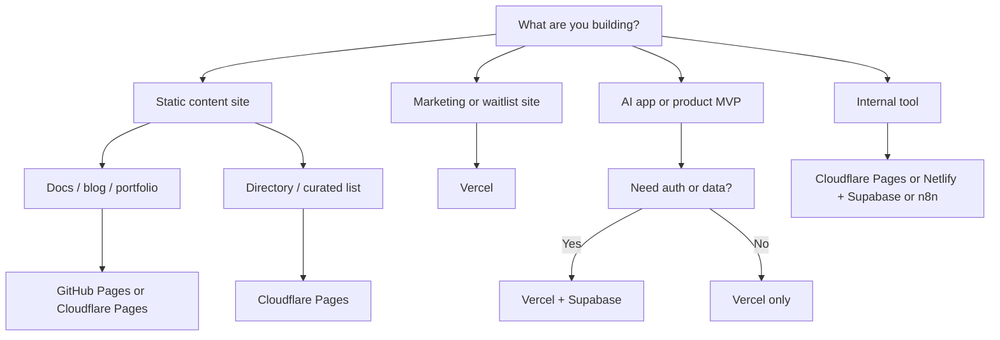
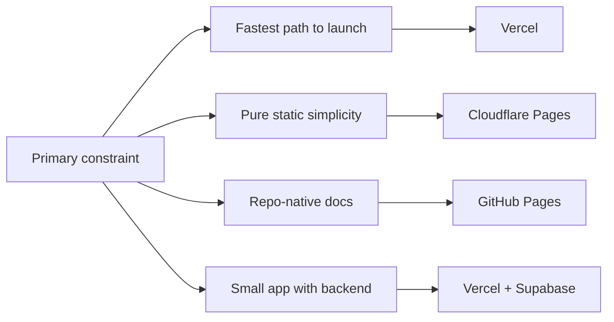

# Free AI Website Playbook

This guide helps you decide what kind of website you can build on free tiers, which host fits best, and how to instruct an LLM to generate the right kind of site.

Use this page when the question is not only "how do I code a site?" but "what should I build, where should it live, and what should I ask the model to produce?"

## Start here

| If you want to build... | Start with | Best default free host | Pair with |
| :--- | :--- | :--- | :--- |
| A simple landing page | [Vercel](../tools/development_ops/vercel.md) or [Cloudflare Pages](../tools/development_ops/cloudflare-pages.md) | Vercel | [Supabase](../tools/infrastructure/supabase.md) only if you need forms or auth |
| A waitlist / lead-gen microsite | [Vercel](../tools/development_ops/vercel.md) | Vercel | [Supabase](../tools/infrastructure/supabase.md) for signup capture |
| A blog or docs site | [GitHub Pages](../tools/development_ops/github-pages.md) or [Cloudflare Pages](../tools/development_ops/cloudflare-pages.md) | GitHub Pages | Static-site generator plus Git repo |
| An AI demo or chat front-end | [Vercel](../tools/development_ops/vercel.md) | Vercel | [Supabase](../tools/infrastructure/supabase.md), model API, optional [OpenRouter](../tools/ai_knowledge/openrouter.md) |
| An internal tool or dashboard | [Cloudflare Pages](../tools/development_ops/cloudflare-pages.md) or [Netlify](../tools/development_ops/netlify.md) | Cloudflare Pages | [Supabase](../tools/infrastructure/supabase.md), [n8n](../services/n8n.md) |
| A static directory site | [Cloudflare Pages](../tools/development_ops/cloudflare-pages.md) | Cloudflare Pages | Search/index data source, optional [Tavily](../tools/providers/tavily.md) for enrichment |
| A product MVP with auth and data | [Vercel](../tools/development_ops/vercel.md) | Vercel | [Supabase](../tools/infrastructure/supabase.md) |

## What you can realistically build for free

Free tiers are best for distribution, validation, and early workflow testing. They are usually enough for:

- Marketing and landing pages
- Waitlist and lead-capture pages
- Documentation and blog sites
- Lightweight directories
- Public demos of AI products
- Internal dashboards for small teams
- Small authenticated apps with modest traffic

Free tiers are usually a bad long-term fit for:

- High-volume production SaaS with heavy background processing
- Media-heavy consumer apps
- Large-scale collaborative apps
- Anything where downtime, cold starts, or usage caps directly hurt revenue

## Website archetypes

### 1. Landing page
Use this when you need one clear conversion goal: book a call, join a waitlist, or try a product.

- Best fit: [Vercel](../tools/development_ops/vercel.md)
- Why: fast deploys, strong frontend defaults, good fit for modern React/Next.js marketing sites
- Common stack: static site + form + simple analytics

### 2. Waitlist or lead-gen microsite
Use this when the site exists to validate demand before you build the product.

- Best fit: [Vercel](../tools/development_ops/vercel.md) + [Supabase](../tools/infrastructure/supabase.md)
- Why: Vercel handles the frontend cleanly; Supabase gives you a practical free backend for signups
- Common stack: landing page, email capture form, admin sheet/export

### 3. Documentation or blog
Use this when discoverability and clear reading experience matter more than interactivity.

- Best fit: [GitHub Pages](../tools/development_ops/github-pages.md) or [Cloudflare Pages](../tools/development_ops/cloudflare-pages.md)
- Why: low-complexity static hosting works well; GitHub Pages is especially good for docs tied to a repo
- Common stack: static-site generator + Markdown content + search

### 4. Directory or curated list
Use this when you need searchable collections such as tools, agencies, prompts, or resources.

- Best fit: [Cloudflare Pages](../tools/development_ops/cloudflare-pages.md)
- Why: static-first deployment works well, and Cloudflare is good when global delivery matters
- Common stack: static site + structured JSON/Markdown data + filters

### 5. AI demo or chat front-end
Use this when you want to show a narrow AI capability without building the whole company backend.

- Best fit: [Vercel](../tools/development_ops/vercel.md)
- Why: frontend-heavy AI demos fit well with Vercel's deployment model
- Common stack: frontend + API route/proxy + model provider + optional persistence

### 6. Internal dashboard or ops tool
Use this when a small team needs a usable interface for workflows, reporting, or approvals.

- Best fit: [Cloudflare Pages](../tools/development_ops/cloudflare-pages.md) or [Netlify](../tools/development_ops/netlify.md)
- Why: both work well for frontend-first tools; pair with [Supabase](../tools/infrastructure/supabase.md) or [n8n](../services/n8n.md)
- Common stack: frontend + auth + database + workflow hooks

### 7. Small SaaS MVP
Use this when you need enough product surface to sell or test usage, but not yet full production-grade scale.

- Best fit: [Vercel](../tools/development_ops/vercel.md) + [Supabase](../tools/infrastructure/supabase.md)
- Why: this is the most common free-tier path for modern AI-native web apps
- Common stack: app shell, auth, database, file storage, model API integration

## Free host matrix

| Host | Best for | Free-tier fit | Backend story | Upgrade trigger | Comments |
| :--- | :--- | :--- | :--- | :--- | :--- |
| [Vercel](../tools/development_ops/vercel.md) | Product sites, app shells, AI demos, waitlists | Excellent for early launch | Works well with [Supabase](../tools/infrastructure/supabase.md), hosted APIs, and lightweight serverless patterns | Traffic, execution, or team needs outgrow the hobby tier | Best default when speed of shipping matters more than deep infra control |
| [Cloudflare Pages](../tools/development_ops/cloudflare-pages.md) | Static sites, directories, docs, lightweight apps | Excellent for static and edge-oriented delivery | Good with external APIs, KV/D1/Workers if you move deeper into Cloudflare | You need more backend complexity or Cloudflare-specific architecture | Strong choice for globally fast static delivery |
| [Netlify](../tools/development_ops/netlify.md) | Marketing sites, JAMstack sites, forms-driven pages | Good for small sites and prototypes | Good for frontend-first apps; backend usually paired externally | Build, bandwidth, or function needs become operational limits | Practical for teams that like Netlify's DX and deploy previews |
| [GitHub Pages](../tools/development_ops/github-pages.md) | Docs, blogs, project sites, simple portfolios | Very good for purely static sites | Minimal backend story; pair with third-party services if needed | You need dynamic features, auth, or serious app behavior | The cleanest free path for docs tied to a repo |
| [Supabase](../tools/infrastructure/supabase.md) | Backend for small apps and internal tools | Good as the backend half of a free stack | Database, auth, storage, edge functions | Data, auth, or operational requirements outgrow the free plan | Not a static host replacement; use it as the app backend |
| Firebase Hosting | Static/SPA hosting with Firebase-centric stacks | Good if you are already in the Firebase ecosystem | Works well with Firebase Auth, Firestore, and Functions | You need more control, portability, or better fit with other stacks | Best when Firebase is already the chosen backend |
| Render | Simpler full-stack web apps and small services | Useful for prototypes, but less ideal as the default free website layer | Can host app and backend together | Sleep limits, instance needs, or cost sensitivity increase | Better for "one service app" prototypes than polished marketing sites |
| Railway | Small deployable apps with backend needs | Useful for experiments, not my default free frontend choice | Strong for quick app deployment, databases, and services | Usage or predictability matters more than convenience | Better for app prototypes than content-heavy websites |

## Selection map



## Host selection by constraint



## Free starter packs

### 1. Fast launch pack
- [Vercel](../tools/development_ops/vercel.md)
- [Supabase](../tools/infrastructure/supabase.md)
- One modern frontend stack

Use this when you want the highest-probability path from idea to working product page or MVP.

### 2. Docs and authority pack
- [GitHub Pages](../tools/development_ops/github-pages.md)
- Markdown docs or static-site generator

Use this when your website is mainly content, documentation, or thought leadership.

### 3. Directory pack
- [Cloudflare Pages](../tools/development_ops/cloudflare-pages.md)
- Static data files
- Optional [Tavily](../tools/providers/tavily.md) or scraping pipeline

Use this when the site is a searchable resource collection rather than an application.

### 4. Internal ops pack
- [Cloudflare Pages](../tools/development_ops/cloudflare-pages.md) or [Netlify](../tools/development_ops/netlify.md)
- [Supabase](../tools/infrastructure/supabase.md)
- [n8n](../services/n8n.md)

Use this when the website is a team operating surface, not a public marketing property.

## What to use by default vs in combination

| Tool | Use by itself? | Use in combination? | Comment |
| :--- | :--- | :--- | :--- |
| [Vercel](../tools/development_ops/vercel.md) | Yes, for static and simple frontend launches | Yes, add [Supabase](../tools/infrastructure/supabase.md) when the site has state | Best default solo host for product and marketing launches |
| [Cloudflare Pages](../tools/development_ops/cloudflare-pages.md) | Yes, for static public sites | Yes, pair with backend/data tools for apps | Strong default for directories and static-first public sites |
| [GitHub Pages](../tools/development_ops/github-pages.md) | Yes | Rarely | Best when the site should remain mostly static and repo-native |
| [Netlify](../tools/development_ops/netlify.md) | Yes, for small frontend launches | Yes, with [Supabase](../tools/infrastructure/supabase.md) for app behavior | Good alternative when the workflow fits Netlify's model |
| [Supabase](../tools/infrastructure/supabase.md) | No | Yes, almost always | Treat it as the backend half of the stack, not the website host |

## How to instruct the LLM

The quality of the generated website depends heavily on whether you specify the website type, business goal, audience, stack, and deployment target.

### Reusable prompt skeleton

```text
Build a [website type] for [audience] whose main goal is [conversion or user job].

Use [stack/framework] and optimize for [speed / SEO / conversions / clarity / admin usability].

Deployment target: [Vercel / Cloudflare Pages / GitHub Pages / Netlify].
Backend: [none / Supabase / external API / mock data].

Required pages:
- ...

Required sections/components:
- ...

Design direction:
- visual style
- tone
- examples to emulate
- what to avoid

Functional requirements:
- forms, auth, search, filters, CMS, blog, chat, analytics, etc.

Technical constraints:
- static-first or dynamic
- mobile-first
- accessibility
- no paid dependencies
- environment variables isolated

Output:
- project structure
- implementation files
- deployment notes
- sample content
```

### What to specify before asking for code

- Site type: landing page, docs site, MVP shell, internal dashboard, directory
- Main conversion: signup, call booking, purchase, trial, content reading
- Target host: this changes the right architectural choices
- Content source: hardcoded, Markdown, CMS, database, API
- Backend need: none, form capture only, auth, full app state
- Preferred stack: plain HTML, Astro, Next.js, React, static site generator
- Constraints: free tier, no paid APIs, mobile-first, fast first load

### Prompt recipes by site type

#### Landing page

```text
Build a modern landing page for an AI operations consultancy aimed at founders and small teams.

Main goal: book a discovery call.
Deployment target: Vercel.
Backend: none, except a contact form that can post to Supabase later.

Create:
- homepage only
- hero, proof, services, process, FAQ, CTA footer

Constraints:
- fast loading
- strong mobile layout
- easy to swap copy later
- no unnecessary animation

Output the site as a production-ready project with clean sections and deployment notes for Vercel.
```

#### Waitlist page

```text
Build a waitlist site for an AI research assistant product for sales teams.

Main goal: capture email + company name + team size.
Deployment target: Vercel.
Backend: Supabase for storing signups.

Create:
- homepage
- success state after form submit
- simple admin-facing schema notes

Optimize for:
- clarity
- trust
- conversion
- simple setup on the free tiers of Vercel and Supabase
```

#### Documentation site

```text
Build a documentation website for an AI tooling knowledge base.

Deployment target: GitHub Pages.
Content source: Markdown files in the repository.

Create:
- homepage
- docs layout
- left navigation
- search placeholder
- content page template

Optimize for:
- readability
- static hosting
- clean information hierarchy
- easy Git-based maintenance
```

#### AI chat demo

```text
Build a lightweight AI chat demo website for a niche legal research assistant.

Deployment target: Vercel.
Backend: API route that can call an external model provider.

Create:
- marketing homepage
- chat demo page
- usage limitations notice
- simple settings/config area

Constraints:
- free-tier friendly
- clear separation between frontend and model call layer
- easy replacement of provider later
```

#### Internal ops dashboard

```text
Build an internal operations dashboard for a small AI agency.

Users: founder and operators.
Main jobs: view leads, track research status, review automation runs.
Deployment target: Cloudflare Pages.
Backend: Supabase.

Create:
- dashboard home
- leads table
- research queue
- workflow status panel

Optimize for:
- clear information density
- low maintenance
- mobile usable but desktop first
```

### Comparison prompts

Use prompts like this when you want the model to help choose before building:

```text
Compare the best free-tier deployment options for a [site type].
My constraints are [constraints].
Recommend the best default and one fallback.
Explain what changes in the architecture if I choose Vercel vs Cloudflare Pages vs GitHub Pages.
```

### Anti-pattern prompts

Avoid prompts like:

- "Build me a website for my business."
- "Make it look amazing."
- "Use the best stack."
- "Create a SaaS product."

These are too vague. They force the model to invent goals, architecture, and constraints you should have decided.

## My defaults

If you do not have a strong reason otherwise:

1. Use [Vercel](../tools/development_ops/vercel.md) for public product, marketing, and AI demo sites.
2. Use [GitHub Pages](../tools/development_ops/github-pages.md) for docs-heavy and repo-native sites.
3. Use [Cloudflare Pages](../tools/development_ops/cloudflare-pages.md) for directories and static-first public sites.
4. Add [Supabase](../tools/infrastructure/supabase.md) when you need auth, persistence, or file storage.

## Related guides

- [AI Builder Index](ai_builder_index.md)
- [AI Company Starter Stack](ai_company_starter_stack.md)
- [AI Tooling Landscape](ai_tooling_landscape.md)
- [Home](../index.md)

## Sources / References
- [Vercel Pricing](https://vercel.com/pricing)
- [Cloudflare Pages Pricing](https://developers.cloudflare.com/pages/platform/pricing/)
- [Netlify Pricing](https://www.netlify.com/pricing/)
- [GitHub Pages Overview](https://docs.github.com/en/pages/getting-started-with-github-pages/what-is-github-pages)
- [Firebase Pricing](https://firebase.google.com/pricing)
- [Render Pricing](https://render.com/pricing)
- [Railway Pricing](https://railway.com/pricing)
- [Supabase Pricing](https://supabase.com/pricing)

## Contribution Metadata
- Last reviewed: 2026-03-15
- Confidence: medium
