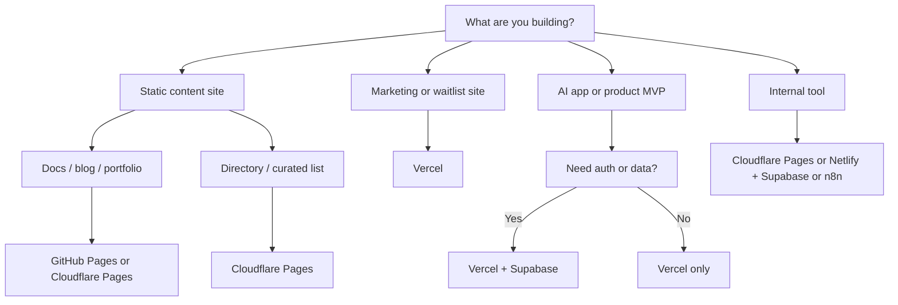

# Free AI Website Playbook

## What it is
The Free AI Website Playbook is a comprehensive guide for builders, founders, and hobbyists looking to launch web properties using zero-cost infrastructure. It covers hosting selection, stack architecture, and prompt engineering strategies to maximize the value of "free tier" services from providers like Vercel, Cloudflare, and GitHub.

## What problem it solves
It eliminates the "choice paralysis" and technical hurdles of starting a new project on a budget. By mapping specific website archetypes (landing pages, blogs, AI demos) to the best free-tier providers, it helps users avoid costly mistakes, performance bottlenecks, and the limitations of mismatched technology.

## Where it fits in the stack
**Category**: Knowledge Base / Playbook

This playbook sits alongside the [AI Builder Index](ai_builder_index.md) and [AI Company Starter Stack](ai_company_starter_stack.md), providing the implementation strategy for projects described in the [Landscape Overview](landscape-overview.md).

## Typical use cases
- **Rapid Prototyping**: Launching a functional MVP in hours without entering credit card details.
- **Validation**: Setting up a waitlist or landing page to test market demand for a new AI product.
- **Documentation**: Hosting project docs or a personal knowledge base on a reliable, free platform.
- **AI Demos**: Creating a public-facing interface for an LLM-powered tool or research project.

## Start here

| If you want to build... | Start with | Best default free host | Pair with |
| :--- | :--- | :--- | :--- |
| A simple landing page | [Vercel](../tools/development_ops/vercel.md) | Vercel | [Supabase](../tools/infrastructure/supabase.md) only if you need forms or auth |
| A waitlist / lead-gen microsite | [Vercel](../tools/development_ops/vercel.md) | Vercel | [Supabase](../tools/infrastructure/supabase.md) for signup capture |
| A blog or docs site | [GitHub Pages](../tools/development_ops/github-pages.md) | GitHub Pages | Static-site generator plus Git repo |
| An AI demo or chat front-end | [Vercel](../tools/development_ops/vercel.md) | Vercel | [Supabase](../tools/infrastructure/supabase.md), model API |
| An internal tool or dashboard | [Cloudflare Pages](../tools/development_ops/cloudflare-pages.md) | Cloudflare Pages | [Supabase](../tools/infrastructure/supabase.md), [n8n](../services/n8n.md) |

## What you can realistically build for free

Free tiers are best for distribution, validation, and early workflow testing. They are usually enough for:

- Marketing and landing pages
- Waitlist and lead-capture pages
- Documentation and blog sites
- Lightweight directories
- Public demos of AI products
- Internal dashboards for small teams
- Small authenticated apps with modest traffic

## Strengths
- **Zero Financial Risk**: Allows for experimentation without upfront costs.
- **Scalability**: Recommended providers have clear upgrade paths if a project grows.
- **High Performance**: Free tiers often include global CDN delivery and modern CI/CD workflows.
- **Security**: Providers handle SSL and basic DDoS protection by default.

## Limitations
- **Usage Caps**: Free tiers have limits on bandwidth, build minutes, or database records.
- **Cold Starts**: Some services may "sleep" after inactivity, leading to initial load delays.
- **Branding**: Some providers may require attribution or restrict custom domains.

## When to use it
- When launching a side project, hobby site, or early-stage startup MVP.
- For internal tools that only a few people will use.
- When you want to leverage modern developer experience (DX) without upfront costs.

## When not to use it
- For high-traffic production applications requiring 99.99% uptime guarantees.
- If your application requires heavy background processing exceeding serverless limits.
- When handling highly sensitive or regulated data requiring private infrastructure.

## Getting started
1. **Choose your Archetype**: Determine if you are building a landing page, a doc site, or a full app MVP.
2. **Select your Host**: Use the Selection Matrix above to pick the best provider.
3. **Draft your Prompt**: Use the [How to instruct the LLM](#how-to-instruct-the-llm) section to generate your code.
4. **Deploy**: Push your code to GitHub and connect it to your chosen host.

## Website archetypes

### 1. Landing page
Use this when you need one clear conversion goal: book a call, join a waitlist, or try a product.
- Best fit: [Vercel](../tools/development_ops/vercel.md)
- Common stack: static site + form + simple analytics

### 2. Waitlist or lead-gen microsite
Use this when the site exists to validate demand before you build the product.
- Best fit: [Vercel](../tools/development_ops/vercel.md) + [Supabase](../tools/infrastructure/supabase.md)
- Common stack: landing page, email capture form, admin sheet/export

### 3. Documentation or blog
Use this when discoverability and clear reading experience matter more than interactivity.
- Best fit: [GitHub Pages](../tools/development_ops/github-pages.md)
- Common stack: static-site generator + Markdown content + search

## Free host matrix

| Host | Best for | Free-tier fit | Backend story | Upgrade trigger |
| :--- | :--- | :--- | :--- | :--- |
| [Vercel](../tools/development_ops/vercel.md) | Product sites, AI demos | Excellent for early launch | Pair with [Supabase](../tools/infrastructure/supabase.md) | Traffic or team needs |
| [Cloudflare Pages](../tools/development_ops/cloudflare-pages.md) | Static sites, directories | Excellent for global speed | Edge-oriented with KV/D1 | Backend complexity |
| [GitHub Pages](../tools/development_ops/github-pages.md) | Docs, blogs | Best for repo-native docs | Minimal backend | Dynamic features/auth |

## Selection map


```mermaid
flowchart TD
    A["What are you building?"] --> B["Static content site"]
    A --> C["Marketing or waitlist site"]
    A --> D["AI app or product MVP"]
    A --> E["Internal tool"]

    B --> B1["Docs / blog / portfolio"]
    B --> B2["Directory / curated list"]
    B1 --> B3["GitHub Pages or Cloudflare Pages"]
    B2 --> B4["Cloudflare Pages"]

    C --> C1["Vercel"]
    D --> D1["Need auth or data?"]
    D1 -->|Yes| D2["Vercel + Supabase"]
    D1 -->|No| D3["Vercel only"]
    E --> E1["Cloudflare Pages or Netlify + Supabase or n8n"]
```

## How to instruct the LLM

### Reusable prompt skeleton

```text
Build a [website type] for [audience] whose main goal is [conversion or user job].
Use [stack/framework] and optimize for [speed / SEO / clarity].
Deployment target: [Vercel / Cloudflare Pages / GitHub Pages].
Backend: [none / Supabase / external API].
```

## Related tools / concepts
- [Vercel](../tools/development_ops/vercel.md)
- [Cloudflare Pages](../tools/development_ops/cloudflare-pages.md)
- [GitHub Pages](../tools/development_ops/github-pages.md)
- [Supabase](../tools/infrastructure/supabase.md)
- [n8n](../services/n8n.md)
- [AI Builder Index](ai_builder_index.md)
- [AI Company Starter Stack](ai_company_starter_stack.md)
- [AI Tooling Landscape](ai_tooling_landscape.md)

## Sources / References
- [Vercel Pricing](https://vercel.com/pricing)
- [Cloudflare Pages Pricing](https://www.cloudflare.com/plans/developer-platform/)
- [Netlify Pricing](https://www.netlify.com/pricing/)
- [GitHub Pages Overview](https://docs.github.com/en/pages/getting-started-with-github-pages/what-is-github-pages)

## Contribution Metadata
- Last reviewed: 2026-05-11
- Confidence: high
