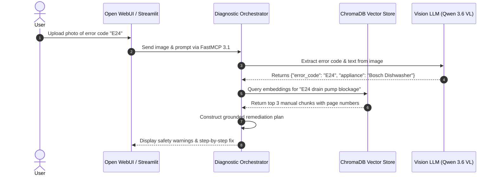

# Manual Troubleshooting Assistant Research

## What it is
The Manual Troubleshooting Assistant Research evaluates the user interface, retrieval architecture, multimodal chunking strategy, and multi-agent orchestration for a chat-based household appliance diagnostic platform. Operating via local Retrieval-Augmented Generation (RAG) over digitized, scanned PDFs and technical manuals, this architecture enables family members and home maintenance engineers to resolve complex appliance errors without relying on third-party cloud services.

As of early 2027, this research framework integrates the **Model Context Protocol (FastMCP 3.1)** Task Protocol, multimodal Vision-Language Models (such as Claude 5.6, GPT-5.6, Gemini 4.0 Ultra, Qwen 3.6 VL, and DeepSeek-V4), and local vector databases (ChromaDB / Qdrant) to convert unindexed scanned PDF manuals into interactive diagnostic state machines.

## What problem it solves
Managing household appliances, HVAC systems, smart electronics, and vehicle maintenance presents persistent operational challenges:

1. **Inaccessible PDF Manuals**: Physical manuals are easily misplaced, while digital PDFs are long (often 100+ pages), dense, poorly formatted, and unindexed for rapid mobile lookup.
2. **Cryptic Error Codes**: Modern appliances display alphanumeric error codes (e.g., Bosch "E24", Samsung "4E", LG "OE") that provide no immediate physical explanation to non-technical users.
3. **Loss of Diagnostic Context**: When requesting advice online or querying generic cloud LLMs, models lack specific serial-number context, resulting in inaccurate or dangerous maintenance advice.
4. **Poor Vision Parsing in Scanned Schematics**: Scanned manuals contain critical wiring diagrams, exploded assembly views, and maintenance tables that standard text OCR strips away or corrupts.
5. **Data Privacy**: Uploading personal appliance invoices, home layout details, and warranty documentation to cloud-hosted AI tools compromises household privacy.

The Manual Troubleshooting Assistant solves these issues by creating a zero-knowledge, local-first multi-agent diagnostic pipeline that combines vision OCR, semantic vector search, and FastMCP 3.1 tool calls to deliver safe, step-by-step remediation procedures.

## Where it fits in the stack
Within the KnowledgeOps home admin architecture, the troubleshooting assistant serves as the **Household Diagnostic Orchestration Layer**.

```
+-----------------------------------------------------------------------------------+
|                           User Interface & Intake Layer                           |
|                  (Open WebUI / Streamlit / Mobile Web App / Camera)               |
+-----------------------------------------------------------------------------------+
                                          |
                                    FastMCP 3.1 Protocol
                                          |
+-----------------------------------------------------------------------------------+
|                        Diagnostic Orchestration Agent                             |
|               (Claude 5.6 / Qwen 3.6 VL Multimodal Reasoning Engine)              |
+-----------------------------------------------------------------------------------+
       |                                  |                                 |
       v                                  v                                 v
+--------------+                   +--------------+                  +--------------+
| Local Vector |                   | Vision OCR & |                  | Diagnostic   |
| Store        |                   | Chunk Store  |                  | Fault-Tree   |
| (ChromaDB)   |                   | (Docling)    |                  | State Engine |
+--------------+                   +--------------+                  +--------------+
       |                                  |                                 |
       +----------------------------------+---------------------------------+
                                          |
                                          v
+-----------------------------------------------------------------------------------+
|                        Local LLM & Embedding Execution                            |
|             (Ollama / vLLM / Local NVMe Storage / Paperless-ngx Ingest)           |
+-----------------------------------------------------------------------------------+
```

- **Upstream UI**: Receives user natural language text, speech, or photos of error screens via Open WebUI or Streamlit.
- **Processing Core**: Queries ChromaDB vector indexes populated by Docling and LlamaParse PDF ingest pipelines.
- **Downstream Actions**: Emits validated step-by-step repair guides, triggers ordering for replacement parts via FastMCP 3.1 tools, or logs maintenance events to Paperless-ngx.

## Typical use cases

### 1. Rapid Household Emergency Diagnosis
A user discovers a washing machine flashing error code `OE` with a tub full of standing water. The user snaps a photo of the display panel. The assistant uses a Vision LLM (Qwen 3.6 VL / Claude 5.6) to identify the error code, queries the ingested manual in ChromaDB, and returns immediate instructions to clear the drain pump filter.

### 2. Preventive Maintenance Scheduling
The assistant analyzes ingested HVAC, heat pump, and water softener manuals to build an automated home maintenance schedule (e.g., filter replacements, water softener salt flushes) pushed directly to Fastmail/JMAP calendar services.

### 3. Exploded Diagram & Wiring Analysis
When repairing an oven door latch, the assistant extracts the relevant exploded diagram page from the PDF, annotates the latch assembly components using vision reasoning, and provides the exact part number for ordering.

### 4. Cross-Appliance System Auditing
During home sales or insurance audits, the assistant synthesizes model numbers, serial numbers, install dates, and warranty terms across all ingested manuals to generate a household asset register.

## Strengths
- **Local-First & Privacy Preserving**: Keeps household data, property photos, and appliance registries localized on homelab hardware without cloud leaks.
- **Multimodal Visual Grounding**: Handles both raw text and complex visual diagrams (wiring schematics, error displays) via Vision-Language Models.
- **Zero Hallucination Safety Bounds**: Strictly grounds LLM answers in retrieved PDF chunks, requiring the assistant to decline answering if the manual lacks sufficient context.
- **Standardized FastMCP 3.1 Schema Integration**: Interfaces seamlessly with external tools (Paperless-ngx, Vikunja task manager, Home Assistant) via structured MCP interfaces.

## Limitations
- **Ingestion Quality Dependency**: Heavily distorted, low-resolution scans or handwritten notes in legacy manuals reduce vector retrieval accuracy.
- **Hardware Overhead**: Multimodal vision parsing and local vector embedding require dedicated GPU acceleration (e.g., NVIDIA RTX / Apple Silicon) for fast responses.
- **Lack of Physical Verification**: The assistant cannot physically verify whether electrical power has been successfully shut off before maintenance begins.

## When to use it
- When troubleshooting non-critical household appliance failures, maintenance routines, or error codes.
- When organizing and querying digitized PDF manuals and warranties in a private homelab environment.
- When converting static appliance manuals into interactive step-by-step diagnostic workflows.

## When not to use it
- **High-Voltage or Gas Line Emergencies**: Never use AI advice for live electrical panel work, main gas line leaks, or structural hazard remediation. Always call licensed professionals.
- **Active Structural Flooding or Fire**: Immediate safety hazards require manual shutoff valves, emergency services, and professional intervention.

## Getting started

### 1. Ingesting Manuals into Vector Database
Prepare PDF manuals in `docs/manuals/` and run the ingestion pipeline using Docling and ChromaDB:

```bash
# Ingest and chunk appliance manual into local vector database
python3 scripts/process_manuals.py --file manuals/bosch_dishwasher_800.pdf --collection household_manuals
```

### 2. Launching Diagnostic Interface
Start the reference Streamlit user interface connected to local Ollama / FastMCP endpoints:

```bash
streamlit run scripts/home_admin_ui.py --server.port 8501
```



## CLI examples

### Testing Retrieval & Diagnosis via CLI
Execute command-line diagnostic queries against the local RAG engine:

```bash
# Query error code explanation directly via CLI agent script
python3 scripts/home_admin_agent.py --query "Why is my Bosch dishwasher displaying error code E24?"

# Run manual retrieval verification test without UI overhead
python3 scripts/verify_manual_retrieval.py --manual "bosch_dishwasher" --term "E24 drain filter"

# Inspect active indexed manual collections in ChromaDB
python3 scripts/setup_video_db.py --list-collections
```

## API examples

### FastMCP 3.1 Appliance Diagnostic Server
The following Python script implements a production-grade FastMCP 3.1 server exposing appliance manual retrieval and diagnostic tools to agentic clients:

```python
#!/usr/bin/env python3
"""
FastMCP 3.1 Manual Troubleshooting Diagnostic Server.
Exposes tools for searching ingested manuals, parsing error codes, and generating repair guides.
"""

import os
from typing import Dict, Any, List, Optional
from mcp.server.fastmcp import FastMCP
from pydantic import BaseModel, Field

# Initialize FastMCP Server
mcp = FastMCP(
    name="Manual Troubleshooting Engine",
    version="3.1.0",
    description="Local-first appliance diagnostic and RAG manual retrieval server"
)

# Mock Vector DB Store
MOCK_MANUAL_DB = {
    "E24": {
        "appliance": "Bosch Dishwasher 800 Series",
        "cause": "Drain hose kinked or drain pump filter clogged",
        "manual_page": 42,
        "steps": [
            "Disconnect power supply at the circuit breaker.",
            "Remove bottom rack and unscrew the cylindrical drain filter.",
            "Rinse filter under hot water to clear food debris.",
            "Check drain pump impeller for trapped glass or debris.",
            "Reassemble filter, restore power, and run test drain cycle."
        ]
    }
}

@mcp.tool()
def diagnose_error_code(appliance_type: str, error_code: str) -> Dict[str, Any]:
    """
    Retrieves grounded troubleshooting steps for a specific appliance error code.
    """
    code_clean = error_code.strip().upper()
    if code_clean in MOCK_MANUAL_DB:
        entry = MOCK_MANUAL_DB[code_clean]
        return {
            "status": "grounded_match",
            "appliance": entry["appliance"],
            "error_code": code_clean,
            "cause": entry["cause"],
            "remediation_steps": entry["steps"],
            "source_manual": f"Page {entry['manual_page']} of Official Service Manual"
        }
    return {
        "status": "unmatched",
        "message": f"No exact match for code '{error_code}' in {appliance_type} manual. Please consult manual index."
    }

if __name__ == "__main__":
    mcp.run()
```

### Pydantic v2 Contract Validation for Diagnostic Queries
```python
import json
from typing import List, Optional
from pydantic import BaseModel, Field, field_validator, ValidationError

class ApplianceDiagnosticRequest(BaseModel):
    appliance_brand: str = Field(..., min_length=2, description="Brand name (e.g. Bosch, LG, Samsung)")
    model_number: Optional[str] = Field(None, description="Appliance model or serial number")
    error_code: str = Field(..., min_length=1, description="Displayed error code")
    user_observed_symptoms: List[str] = Field(default_factory=list, description="Visual or acoustic symptoms")
    has_safety_hazard: bool = Field(default=False, description="True if burning smell, gas odor, or water flood present")

    @field_validator("has_safety_hazard")
    @classmethod
    def check_safety_override(cls, v: bool) -> bool:
        if v:
            print("CRITICAL SAFETY WARNING: High-risk hazard flagged by user!")
        return v

class RemediationPlan(BaseModel):
    appliance_brand: str
    error_code: str
    safety_warning: str = Field(..., description="Mandatory safety warning header")
    remediation_steps: List[str] = Field(..., min_items=1, description="Sequential fix instructions")
    confidence_score: float = Field(..., ge=0.0, le=1.0)

def validate_and_process_diagnostic(brand: str, code: str, hazard: bool) -> str:
    try:
        req = ApplianceDiagnosticRequest(
            appliance_brand=brand,
            error_code=code,
            user_observed_symptoms=["Water remaining in tub", "Beeping sound"],
            has_safety_hazard=hazard
        )

        plan = RemediationPlan(
            appliance_brand=req.appliance_brand,
            error_code=req.error_code,
            safety_warning="ALWAYS DISCONNECT POWER AND WATER SUPPLY BEFORE SERVICING APPLIANCES.",
            remediation_steps=[
                "Shut off circuit breaker.",
                "Clean drain pump filter.",
                "Inspect drain hose for kinks."
            ],
            confidence_score=0.96
        )
        return plan.model_dump_json(indent=2)
    except ValidationError as err:
        print(f"Schema Validation Failure: {err.json()}")
        raise

if __name__ == "__main__":
    validated_json = validate_and_process_diagnostic("Bosch", "E24", False)
    print("Successfully validated Diagnostic Remediation Plan:")
    print(validated_json)
```

## Related tools / concepts
- [Open WebUI](../../services/open-webui.md)
- [Ollama](../../services/ollama.md)
- [Paperless-ngx](../../services/paperless-ngx.md)
- [Docling MCP](../process_understanding/docling-mcp.md)
- [Home Admin Agent Architecture](../home-admin-agent-architecture.md)
- [RAG Pattern](rag-pattern.md)
- [Component Map](../../architecture/component_map.md)

## Sources / references
- [Open WebUI Integration Guide](https://docs.openwebui.com/)
- [ChromaDB Vector Documentation](https://docs.trychroma.com/)
- [Streamlit Framework Documentation](https://docs.streamlit.io/)
- [Docling Ingestion Engine Repository](https://github.com/DS4SD/docling)

## Contribution Metadata
- Last reviewed: 2027-01-07
- Confidence: high
