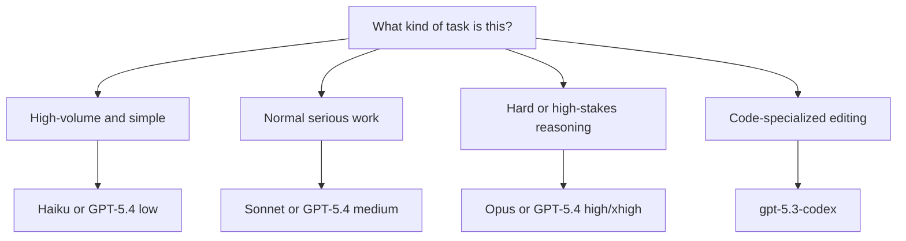

# Model Routing Guide

This guide defines when to use Anthropic's Haiku, Sonnet, and Opus tiers, when to use OpenAI GPT-5.4 at different reasoning levels, and when to use GPT-5.3 Codex.

The goal is not benchmark trivia. The goal is routing: pick the cheapest model that is still reliable for the task, and only escalate when the failure mode justifies it.

## Short version

| Need | Best default | Escalate when | Avoid when |
| :--- | :--- | :--- | :--- |
| Fast, cheap classification or drafting | Anthropic Haiku | Quality or reasoning failures appear | Long-horizon coding or deep research |
| Most coding, writing, planning, and agent work | Anthropic Sonnet | The task is unusually strategic, ambiguous, or high-stakes | Latency and cost must be minimal |
| Rare, premium deep-thinking pass | Anthropic Opus | You need the strongest Claude-tier synthesis or judgment | The task is routine, repetitive, or time-sensitive |
| General OpenAI reasoning with cost control | GPT-5.4 `low` | Multi-step reasoning starts to break | The task is shallow enough for a cheaper fast model elsewhere |
| Balanced OpenAI reasoning | GPT-5.4 `medium` | Failures suggest the task needs heavier deliberate reasoning | The task is simple extraction or routing |
| Hard OpenAI reasoning | GPT-5.4 `high` | Important planning, debugging, or analysis still fails at `medium` | You need fast high-volume responses |
| Maximum OpenAI deliberate reasoning | GPT-5.4 `xhigh` | Only for the last escalation step on very hard or very important tasks | Default usage, background jobs, or broad automation |
| OpenAI coding-specialized lane | GPT-5.3 Codex | You want code-editing bias over general chat behavior | Non-coding tasks, broad research, or cross-domain synthesis |

## The routing principle

Use the smallest model or effort level that reliably succeeds.

Escalation order for most teams:

1. Haiku or GPT-5.4 `low` for easy or high-volume work
2. Sonnet or GPT-5.4 `medium` for the default serious lane
3. Opus or GPT-5.4 `high` for hard tasks
4. GPT-5.4 `xhigh` only when the cost and latency are justified

For code-first tasks, `gpt-5.3-codex` is a specialized lane, not a universal default.

## Anthropic routing

### Haiku

Use Haiku when speed and price matter more than deep reasoning.

Best for:
- classification
- extraction
- rewriting
- summarization
- simple support responses
- first-pass triage

Use it when:
- the instructions are clear
- the answer space is narrow
- you will validate or post-process the output
- the main constraint is throughput or cost

Do not use it as the default for:
- large repo edits
- multi-step debugging
- hard prompt-sensitive workflows
- strategic research synthesis

### Sonnet

Use Sonnet as the default Claude lane for serious work.

Best for:
- coding agents
- repo-aware implementation work
- document analysis
- planning
- structured writing
- mixed reasoning plus execution tasks

Use it when:
- the task matters but is still part of normal daily work
- you need strong instruction-following
- the task mixes judgment, structure, and tool use
- you want the best capability/cost balance

This should usually be the default Claude model for:
- coding
- ops workflows
- knowledge work
- important content generation

### Opus

Use Opus as a premium escalation lane, not the default.

Best for:
- difficult synthesis
- high-ambiguity reasoning
- executive-quality drafts
- complex tradeoff analysis
- final-pass judgment on expensive or high-stakes work

Use it when:
- Sonnet fails repeatedly on the same hard task
- the cost of a wrong answer is materially higher than the model premium
- you want a deeper second opinion before making a decision

Do not use it for:
- bulk automation
- background summarization
- routine coding
- standard content workflows

## OpenAI routing

### GPT-5.4 `low`

Use `low` when you want the GPT-5.4 family but do not want to pay the full reasoning tax.

Best for:
- concise drafting
- straightforward coding tasks
- normal analysis with clear context
- tasks where latency matters

Use it when:
- the task is real work, but not especially hard
- you want a quick first pass before escalating
- you need more discipline than a lightweight fast model, but not heavy deliberate reasoning

### GPT-5.4 `medium`

Use `medium` as the default GPT-5.4 lane.

Best for:
- serious implementation planning
- debugging
- agent task decomposition
- document reasoning
- most non-trivial coding support

Use it when:
- the task needs real reasoning, not just fluent generation
- you would otherwise be tempted to overuse `high`
- you need a strong general OpenAI default

### GPT-5.4 `high`

Use `high` when the task is difficult enough that the extra reasoning budget is justified.

Best for:
- knotty debugging
- multi-step architecture tradeoffs
- careful policy or system analysis
- research-heavy planning

Use it when:
- `medium` gives shallow or brittle answers
- the task is hard enough to benefit from more deliberate internal reasoning
- a retry costs less than a human cleanup pass

### GPT-5.4 `xhigh`

Use `xhigh` rarely and intentionally.

Best for:
- last-resort hard reasoning
- important one-off decisions
- deep investigation where time is less important than answer quality

Use it when:
- lower effort levels already failed
- you are doing expensive analysis once, not at scale
- the task is materially important enough to pay both latency and cost

Do not use it as a background default. That creates hidden cost and slower systems without proportionate gain.

## When to use `gpt-5.3-codex`

Use `gpt-5.3-codex` when the work is clearly code-centric and you want a coding-specialized model rather than a general reasoning model.

Best for:
- code generation
- edits inside an existing codebase
- refactors
- test writing
- CLI or IDE code assistance

Use it when:
- the task is mostly source code, not broad analysis
- you want code bias and editing behavior over broader conversational reasoning
- you are comparing a specialized coding lane against Sonnet or GPT-5.4 general reasoning

Do not use it as the default for:
- research
- long-form synthesis
- general business planning
- complex multi-domain decisions that happen to include some code

## Practical defaults

### If you only want one Anthropic default
Use Sonnet.

### If you only want one OpenAI default
Use GPT-5.4 `medium`.

### If you want one cheap lane, one default lane, and one escalation lane

| Provider | Cheap lane | Default lane | Escalation lane |
| :--- | :--- | :--- | :--- |
| Anthropic | Haiku | Sonnet | Opus |
| OpenAI | GPT-5.4 `low` | GPT-5.4 `medium` | GPT-5.4 `high` or `xhigh` |

### If you run a coding-heavy stack

Use:
- Sonnet for default coding-agent work
- `gpt-5.3-codex` for specialized code generation and edit loops
- GPT-5.4 `high` only when the task is more about hard reasoning than code-local editing

## Example routing policies

### Coding team

| Task | Recommended model |
| :--- | :--- |
| Bulk lint-fix suggestions | Haiku |
| Normal implementation task | Sonnet |
| Hard debugging or architecture review | GPT-5.4 `high` or Opus |
| Code-editing specialist lane | `gpt-5.3-codex` |

### Operations and automations

| Task | Recommended model |
| :--- | :--- |
| Tagging, extraction, triage | Haiku |
| Workflow design and important docs | Sonnet |
| High-risk incident reasoning | GPT-5.4 `high` |

### Research and strategy

| Task | Recommended model |
| :--- | :--- |
| First-pass summaries | Haiku |
| Normal synthesis and memos | Sonnet or GPT-5.4 `medium` |
| Executive or difficult final pass | Opus or GPT-5.4 `xhigh` |

## Selection map

## My defaults

If I were setting up a practical mixed stack:

1. Anthropic Sonnet as the default daily workhorse
2. Anthropic Haiku for cheap background and triage work
3. GPT-5.4 `medium` as the default OpenAI general-reasoning lane
4. GPT-5.4 `high` as the escalation lane
5. `gpt-5.3-codex` as the coding-specialized alternative
6. Opus and GPT-5.4 `xhigh` only for explicit escalation

## Related

- [OpenAI](../tools/ai_knowledge/openai.md)
- [Anthropic](../tools/providers/anthropic.md)
- [OpenAI Codex](../tools/development_ops/codex.md)
- [Model Comparison and Evaluation](model_comparison_and_evaluation.md)
- [AI Company Starter Stack](ai_company_starter_stack.md)

## Sources / References
- [Anthropic Models Overview](https://docs.anthropic.com/en/docs/about-claude/models/overview)
- [OpenAI Models Overview](https://platform.openai.com/docs/models)
- [OpenAI Reasoning Guide](https://platform.openai.com/docs/guides/reasoning)
- [OpenAI Codex](https://openai.com/codex/)

## Contribution Metadata
- Last reviewed: 2026-03-15
- Confidence: medium
