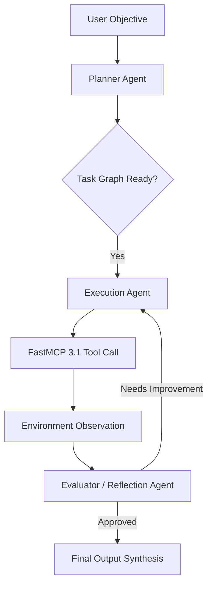

# Agentic Workflows

## What it is
Agentic workflows represent a paradigm shift in artificial intelligence engineering where Large Language Models (LLMs) and Multimodal Reasoning Models transition from single-turn request-response interfaces to autonomous, multi-turn, goal-driven systems. In an agentic workflow, an AI model acts as a reasoning engine within a closed-loop control system. It evaluates goals, decomposes complex tasks into execution plans, selects and executes external tools, observes environment state changes, reflects on intermediate outcomes, and iteratively self-corrects until the objective is achieved or explicitly halted.

As of early 2027, agentic workflows natively incorporate the **Model Context Protocol (FastMCP 3.1)** and **FastMCP Task Protocol** primitives. Modern agentic platforms leverage frontier reasoning engines—such as Claude 5.6, GPT-5.6, Gemini 4.0 Ultra, DeepSeek-V4, Qwen 3.6 VL, and Llama 4—to power multi-agent coordination, structured tool calling, dynamic memory retrieval, and human-in-the-loop (HITL) approval gates.

## What problem it solves
Traditional prompt engineering and single-shot LLM queries suffer from inherent structural limitations:

1. **Inability to Solve Complex Multi-Step Tasks**: Single prompts cannot execute complex software refactoring, deep market research, or multi-system infrastructure deployments that require tens or hundreds of discrete API calls and conditional branching.
2. **Lack of Self-Correction & Reliability**: In a single prompt, any error, hallucination, or API failure immediately fails the entire query. Agentic workflows introduce reflection, unit testing, and dynamic fallback routing to recover from errors mid-execution.
3. **Static Knowledge Limits**: Single-turn models rely solely on pre-training weights. Agentic workflows enable dynamic retrieval-augmented generation (RAG), real-time web search, and database access via FastMCP 3.1 tool interfaces.
4. **Context Window Exhaustion**: Long-running multi-turn chats often pollute model context windows. Agentic patterns utilize state machine memory, sub-agent task delegation, and context summaries to keep prompt payloads lean and high-precision.

## Where it fits in the stack
Within the KnowledgeOps and modern enterprise AI architecture, agentic workflows occupy the **Orchestration, Reasoning & Control Layer**.

```
+-----------------------------------------------------------------------------------+
|                            User Goal / Intent Input                               |
|                  ("Deploy production cluster & document API")                    |
+-----------------------------------------------------------------------------------+
                                          |
                                          v
+-----------------------------------------------------------------------------------+
|                           Agentic Orchestration Layer                             |
|          (Planner / Memory State Machine / Reflection & Evaluation Loops)          |
+-----------------------------------------------------------------------------------+
       |                                  |                                 |
       v                                  v                                 v
+--------------+                   +--------------+                  +--------------+
| Reasoning    |                   | FastMCP 3.1  |                  | Context &    |
| Engine       |                   | Tool Gate    |                  | Memory Store |
| (Claude 5.6) |                   | (Execution)  |                  | (Vector/Graph|
+--------------+                   +--------------+                  +--------------+
       |                                  |                                 |
       +----------------------------------+---------------------------------+
                                          |
                                          v
+-----------------------------------------------------------------------------------+
|                        Environment / External Systems                             |
|      (GitHub API / Kubernetes / AnyType / Fastmail JMAP / Databases)              |
+-----------------------------------------------------------------------------------+
```

- **Intelligence Layer**: Receives tokens and generates structured tool calls using frontier models (Claude 5.6, GPT-5.6, Gemini 4.0, DeepSeek-V4).
- **Execution Layer**: Executes API calls, shell scripts, and database queries through FastMCP 3.1 endpoints.
- **Memory & State Layer**: Stores task progress, observation logs, and intermediate artifacts in local vector databases, graph memory, or Redis state stores.

## Typical use cases

### 1. Autonomous Software Engineering & Refactoring
Agents like Claude Code or Aider analyze codebases, run test suites, locate bug roots, generate code fixes, re-run test suites, and create pull requests completely autonomously, looping until all assertions pass.

### 2. Multi-Source Intelligence Synthesis
Research agents break a broad subject (e.g., "Analyze Q1 2027 semiconductor supply chain vulnerabilities") into query sub-tasks, execute web searches via Exa/Tavily, query internal document stores via AnyType/Docling, cross-verify conflicting facts, and generate a validated executive report.

### 3. Self-Healing DevOps & Infrastructure Remediation
Monitoring agents detect Prometheus alerts, query system logs via Loki, identify failing pods, execute diagnostic commands via SSH or Kubernetes APIs, apply configuration patches, and notify on-call engineers.

### 4. Enterprise Process Automation
Finance and operations agents ingest unstructured invoices via OCR/LlamaParse, validate tax fields against ERP databases, request HITL manager approval via Slack/Email for transactions over thresholds, and submit entries.

## Strengths
- **Goal-Oriented Autonomy**: Transforms high-level goals into executable actions without requiring precise step-by-step human prompts.
- **Robustness through Reflection**: Evaluates intermediate outputs (e.g., compiler errors or API validation failures) and self-corrects in real-time.
- **Scalable Specialization**: Multi-agent architectures delegate specialized roles (e.g., Architect, Coder, Reviewer, Tester) to achieve superior output quality.
- **Standardized FastMCP 3.1 Tooling**: Decouples model logic from system tools, allowing seamless swapping of underlying LLM providers without rewriting integrations.

## Limitations
- **Token Consumption & Latency**: Multi-turn loops and reflection cycles consume up to 10x–50x more tokens and require longer completion times than single prompts.
- **Infinite Loop Risk**: Improperly configured reflection loops or ambiguous stopping criteria can trap agents in costly non-terminating cycles.
- **Cascading Hallucinations**: Intermediate errors, if unvetted by verification tools, can compound across execution turns and degrade final outputs.
- **Security & Authorization Boundaries**: Autonomous tool execution requires strict sandbox isolate environments and permission gating to prevent unintended actions (e.g., accidental database deletions).

## When to use it
- When tasks require non-linear decision making, multi-step tool execution, or dynamic research.
- When output quality can be automatically verified using deterministic tests (e.g., unit tests, linters, JSON schemas, SQL execution checks).
- When automating complex end-to-end workflows that previously required significant manual supervision.

## When not to use it
- For simple static transformations, language translation, or direct Q&A where a single LLM call is fast, cheap, and reliable.
- When ultra-low latency (<200ms) user responses are mandatory (e.g., real-time autocomplete).
- When tasks cannot afford non-deterministic tool calls and require rigid procedural code.

## Getting started

### Core Agentic Design Patterns

1. **Reflection & Self-Correction**: The agent generates an initial draft, calls an evaluator prompt or deterministic validator, and refines the draft based on explicit feedback.
2. **Tool Use & MCP**: The agent formulates structured JSON payloads to invoke external functions, receives observation output, and updates its reasoning state.
3. **Planning & Decomposition**: The agent decomposes a goal into a graph of sub-tasks (e.g., DAG) and executes them sequentially or in parallel.
4. **Multi-Agent Collaboration**: Specialized agents communicate via message passing or shared memory state machines.



## CLI examples

### Running Multi-Agent Workflows via CLI
Using standard agent frameworks (Aider, CrewAI, AutoGen) to execute agentic tasks:

```bash
# Executing Aider autonomous refactoring session with test-driven feedback
aider --model claude-5-6-sonnet \
      --auto-test "pytest tests/" \
      --message "Migrate authentication module from Flask-Login to FastMCP OAuth2 standard"

# Triggering CrewAI multi-agent research pipeline from command line
crewai run --inputs '{"topic": "Next-Gen Local Vectors in 2027", "depth": "detailed"}'

# Triggering LangGraph CLI agentic task runner with state tracking
langgraph run --config ./agent_graph.json --input "Audit AWS security group rules"
```

## API examples

### Multi-Agent State Machine & Reflection Loop with FastMCP 3.1
The following Python implementation demonstrates a production-grade multi-agent reflection and execution loop using FastMCP 3.1 and Pydantic v2 schemas:

```python
#!/usr/bin/env python3
"""
Agentic Workflow Orchestrator featuring FastMCP 3.1 Tool Integration,
State Machine Reflection, and Pydantic v2 Validation Contracts.
"""

import os
import json
from typing import List, Dict, Any, Optional
from pydantic import BaseModel, Field, field_validator, ValidationError
from mcp.server.fastmcp import FastMCP

# Initialize FastMCP Server for Agentic Tools
mcp = FastMCP(
    name="Agentic Workflow Orchestrator",
    version="3.1.0",
    description="Multi-agent state control, evaluation, and tool bridge"
)

# ---------------------------------------------------------------------------
# Pydantic v2 Contract Schemas
# ---------------------------------------------------------------------------

class AgentTaskState(BaseModel):
    task_id: str = Field(..., description="Unique task identifier")
    objective: str = Field(..., min_length=5, description="High-level goal statement")
    current_step: int = Field(default=1, ge=1, le=10, description="Execution step index")
    draft_output: Optional[str] = Field(default=None, description="Intermediate generated artifact")
    reflection_critique: Optional[str] = Field(default=None, description="Evaluator critique")
    is_completed: bool = Field(default=False)
    tool_calls_made: List[str] = Field(default_factory=list)

    @field_validator("current_step")
    @classmethod
    def check_step_limit(cls, v: int) -> int:
        if v > 8:
            raise ValueError("Exceeded maximum step budget (8 turns). Halting to prevent reasoning loop.")
        return v

class ToolExecutionResult(BaseModel):
    tool_name: str
    status: str = Field(..., pattern="^(success|error|fallback)$")
    output_data: Dict[str, Any]
    execution_time_ms: float

# ---------------------------------------------------------------------------
# Mock Multi-Agent Reasoning & Tool Functions
# ---------------------------------------------------------------------------

@mcp.tool()
def execute_system_audit(target_component: str) -> Dict[str, Any]:
    """Simulates a system audit tool invoked by an agent via FastMCP 3.1."""
    return {
        "status": "success",
        "component": target_component,
        "vulnerabilities_found": 0,
        "compliance_score": 98.5
    }

def generator_agent(state: AgentTaskState) -> AgentTaskState:
    """Simulates Generator Agent synthesizing solution draft."""
    print(f"[Generator] Executing Step {state.current_step} for objective: '{state.objective}'")
    state.draft_output = (
        f"Generated architecture proposal for {state.objective}. "
        f"Includes FastMCP 3.1 endpoints and Pydantic v2 contracts."
    )
    state.tool_calls_made.append("generate_architecture")
    return state

def evaluator_agent(state: AgentTaskState) -> AgentTaskState:
    """Simulates Evaluator Agent critiquing Generator draft."""
    print(f"[Evaluator] Reviewing draft output for task {state.task_id}...")
    if "Pydantic v2" in (state.draft_output or "") and state.current_step >= 2:
        state.is_completed = True
        state.reflection_critique = "Draft meets all architectural standards and safety bounds."
        print("[Evaluator] Quality check PASSED.")
    else:
        state.reflection_critique = "Missing explicit edge case handling for FastMCP token expiration."
        state.current_step += 1
        print(f"[Evaluator] Quality check REJECTED. Critique: {state.reflection_critique}")
    return state

# ---------------------------------------------------------------------------
# Execution Orchestrator
# ---------------------------------------------------------------------------

def run_agentic_loop(task_id: str, objective: str) -> AgentTaskState:
    """Main Orchestrator loop enforcing reflection iterations and state validation."""
    raw_state = {
        "task_id": task_id,
        "objective": objective,
        "current_step": 1,
        "is_completed": False
    }

    state = AgentTaskState.model_validate(raw_state)

    while not state.is_completed:
        # Step 1: Generator Agent
        state = generator_agent(state)

        # Step 2: Evaluator Agent (Reflection Loop)
        state = evaluator_agent(state)

        # Step 3: State Re-validation
        state = AgentTaskState.model_validate(state.model_dump())

    return state

if __name__ == "__main__":
    print("=== Starting FastMCP 3.1 Agentic Orchestration Loop ===")
    try:
        final_state = run_agentic_loop(
            task_id="task_2027_001",
            objective="Deploy Local Vector Indexing Agent"
        )
        print("\n=== Agentic Task Execution Summary ===")
        print(json.dumps(final_state.model_dump(), indent=2))
    except ValidationError as err:
        print(f"Orchestration Safety Gate Tripped: {err}")
```

## Related tools / concepts
- [Multi-Agent KnowledgeOps](../../architecture/multi_agent_knowledgeops.md)
- [Tool Calling & MCP](tool-calling-and-mcp.md)
- [CrewAI](../../tools/frameworks/crewai.md)
- [LangGraph](../../tools/frameworks/langgraph.md)
- [Aider](../../tools/development_ops/aider.md)
- [Claude Code](../../tools/development_ops/claude-code.md)
- [Component Map](../../architecture/component_map.md)
- [Model Routing Guide](../model_routing_guide.md)

## Sources / references
- [Anthropic: Building Effective AI Agents](https://www.anthropic.com/research/building-effective-agents)
- [Andrew Ng: Agentic AI Design Patterns](https://www.deeplearning.ai/the-batch/how-agents-can-improve-llm-performance/)
- [LangGraph Documentation](https://langchain-ai.github.io/langgraph/)
- [Model Context Protocol Specification](https://modelcontextprotocol.io/)

## Contribution Metadata
- Last reviewed: 2027-01-07
- Confidence: high
