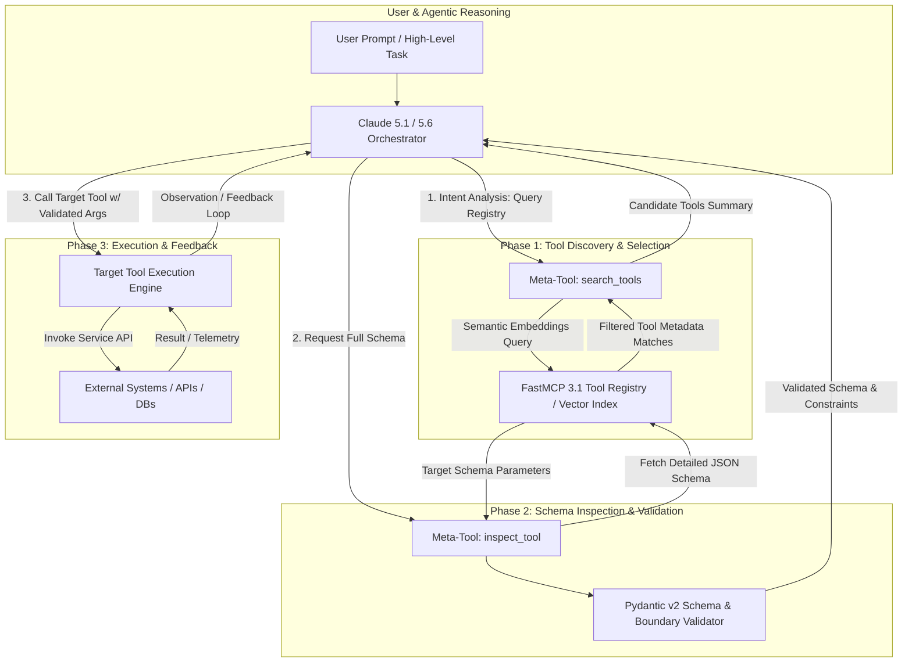
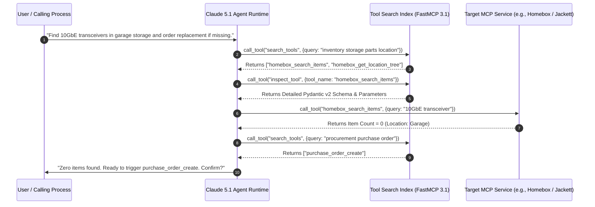

# Claude Tool Search Pattern

## What it is
The **Claude Tool Search Pattern** is an agentic architectural pattern designed for dynamic tool discovery, selection, schema retrieval, and execution within frontier Large Language Model reasoning loops. Rather than hardcoding hundreds of JSON Tool Schemas directly into every prompt's initial context window, the agent operates in a multi-stage discovery loop: it evaluates task intent, queries a semantic tool registry (or vector index), inspects targeted schema parameters, verifies trust boundaries, and executes tool invocations iteratively based on runtime feedback.

Popularized alongside Anthropic's **Claude 5.1** and **Claude 5.6** models, and widely adopted across **GPT-5.5/5.6**, **Gemini 4.0 Ultra**, **DeepSeek-V4**, and **Llama 4 Maverick**, this pattern has become the standard mechanism for managing massive, heterogeneous, multi-server tool ecosystems running on the **Model Context Protocol (FastMCP 3.1)**.

## What problem it solves
As agentic applications scale from simple single-purpose assistants to autonomous enterprise orchestrators, naive tool-calling architectures encounter severe scaling bottlenecks:

1. **Context Window Saturation & Token Blowout**: Injecting 50+ detailed tool schemas (containing nested parameters, descriptions, and enum constraints) into every system prompt consumes tens of thousands of tokens per turn, inflating latency and API costs exponentially.
2. **"Wrong Tool" Hallucinations & Distraction**: Language models presented with broad, overlapping, or dense tool lists suffer degraded tool selection accuracy, frequently invoking incorrect or hallucinated tool names.
3. **Dynamic Ecosystem Fluctuation**: In enterprise environments where FastMCP 3.1 tool servers join or leave the network dynamically, hardcoded system prompts fail to reflect real-time tool availability.
4. **Security & Permission Boundary Leaks**: Indiscriminately exposing administrative or sensitive tool schemas to low-privilege agent loops increases prompt injection vulnerabilities and risks unauthorized function execution.

The Claude Tool Search Pattern solves these problems by decoupling *tool awareness* from *tool schema loading*. The agent receives a lightweight meta-tool (`search_tools` or `inspect_tool`) that allows it to query an index, retrieve only the minimal relevant schemas required for the current subtask, execute them safely within validated trust boundaries, and unload them when complete.



## Where it fits in the stack
**Category**: Orchestration Pattern / Agentic Tool Routing.

The Claude Tool Search Pattern operates at the core of the **Agentic Execution Loop**, specifically bridging user planning and dynamic tool invocation:

- **Orchestration Layer**: Sits within agent frameworks such as [FastMCP 3.1](../../tools/automation_orchestration/mcp.md), [LangChain](../../tools/ai_knowledge/langchain.md), [AG2](../../tools/frameworks/ag2.md), or [PydanticAI](../../tools/frameworks/pydantic.md).
- **Security Layer**: Integrates directly with [LLM Trust Boundaries](llm-trust-boundaries.md) to enforce role-based access control (RBAC) and schema validation prior to execution.
- **Index Layer**: Consumes embeddings or full-text indices hosted on vector databases (ChromaDB, Qdrant, PGvector) or local fast search engines (SQLite FTS5, Meilisearch).



## Typical use cases

1. **Enterprise MCP Gateways with 100+ Tools**:
   Managing enterprise developer platforms where agents have potential access to hundreds of internal microservice endpoints without overloading context windows.

2. **Heterogeneous Multi-Server FastMCP 3.1 Architecture**:
   Connecting an agent to dozens of distributed FastMCP 3.1 servers (e.g., Jackett, Homebox, Habitica, Paperless-ngx, GitHub, Jira) where tools are dynamically discovered based on incoming request topics.

3. **Multi-Tenant Role-Filtered Tool Access**:
   Restricting tool discovery based on user authorization levels: low-privilege users only receive read-only search results, while administrators see system modification tools.

4. **Self-Healing & Exploration Loops**:
   Allowing agents to query search indices when an initial tool invocation returns an unexpected error or missing parameters, enabling automatic fallback tool selection.

5. **Token-Constrained Edge Model Orchestration**:
   Enabling smaller, highly efficient edge models (Llama 4, Gemma 3) to execute complex multi-step workflows by serving them tiny, on-demand tool schema payloads.

## Strengths

- **Enormous Token Savings**: Reduces system prompt overhead by 80–95%, keeping base token usage minimal regardless of total available tool count.
- **Dramatically Higher Tool Precision**: Eliminates tool confusion and parameter mix-ups by narrowing the model's focus to 2–3 relevant candidate tools.
- **Dynamic Adaptability**: New FastMCP servers or tools registered in the catalog become instantly discoverable without modifying or redeploying agent system prompts.
- **Auditable Intent & Decision Logging**: The explicit `search_tools` step provides transparent audit logs explaining why an agent selected specific tools.
- **Cross-Model Compatibility**: Standardized pattern supported natively by Claude 5.1/5.6, GPT-5.5/5.6, Gemini 4.0 Ultra, DeepSeek-V4, and Qwen 3.6.

## Limitations

- **Added Round-Trip Latency**: Introducing discovery and inspection turns adds 1–2 additional model generation cycles prior to final tool execution.
- **Dependency on High-Quality Metadata**: Search performance relies heavily on precise, unambiguous tool titles, descriptions, and semantic tags in the tool catalog.
- **Search Index Maintenance Overhead**: Requires hosting and maintaining a fast semantic or hybrid vector index over registered tool schemas.

## When to use it

- When total available tools exceed 10–15 unique schemas.
- In multi-server FastMCP 3.1 networks where tools are loaded dynamically.
- When token cost and context window optimization are critical performance metrics.
- In enterprise applications requiring strict tool access authorization and audit trails.

## When not to use it

- In simple agents with fewer than 5 static, well-defined tools.
- When absolute minimum single-turn latency is mandatory.
- In static pipelines where tool call sequences are fixed and pre-determined.

## Getting started

To implement the Claude Tool Search Pattern, establish a tool registry with high-quality descriptions, index them into a searchable database, and equip your agent with `search_tools` and `inspect_tool` meta-tools.

```bash
# Example testing FastMCP 3.1 tool search index via CLI
mcp-cli search "inventory query tools"

# Inspect schema parameters for discovered tool
mcp-cli inspect "homebox_search_items"
```

## CLI examples

```bash
# Query a local FastMCP tool search index for media tools
python3 -m mcp_tool_search.cli query "torrent release search"

# Validate Pydantic v2 schema generated from tool search result
python3 -m mcp_tool_search.cli validate --tool "jackett_search_releases"

# Benchmark tool search vector retrieval latency
python3 -m mcp_tool_search.cli benchmark --query "hardware inventory" --top-k 3
```

## API examples

### FastMCP 3.1 Tool Search Server & Pydantic v2 Implementation

The following complete Python application implements a **FastMCP 3.1** Tool Search server. It manages a dynamic tool registry, performs semantic search over tool metadata, exposes schema inspection, and validates payloads using **Pydantic v2**.

```python
import os
import json
from typing import List, Dict, Any, Optional
from pydantic import BaseModel, Field, ConfigDict
from mcp.server.fastmcp import FastMCP

# Initialize FastMCP 3.1 Server for Tool Search Gateway
mcp = FastMCP("Claude-Tool-Search-Gateway", version="3.1.0")

# --- Pydantic v2 Models for Tool Registry ---

class ToolParameterSchema(BaseModel):
    type: str
    description: str
    required: bool = True

class ToolDefinition(BaseModel):
    model_config = ConfigDict(extra="ignore")

    id: str = Field(..., description="Unique tool identifier slug")
    name: str = Field(..., description="Executable tool function name")
    server_name: str = Field(..., description="Source MCP server name")
    description: str = Field(..., description="Detailed semantic description of what the tool does")
    categories: List[str] = Field(default_factory=list, description="Categorization tags")
    parameters_json_schema: Dict[str, Any] = Field(..., description="Full JSON schema of parameters")

class ToolSearchQuery(BaseModel):
    query: str = Field(..., min_length=2, description="Semantic user intent query (e.g. 'search torrent releases')")
    category_filter: Optional[str] = Field(None, description="Optional category tag filter")
    max_results: int = Field(default=3, ge=1, le=10, description="Maximum candidate tools to return")

class ToolSearchMatch(BaseModel):
    id: str
    name: str
    server_name: str
    description: str
    relevance_score: float

class ToolSearchResponse(BaseModel):
    query: str
    total_matches: int
    matches: List[ToolSearchMatch]


# --- In-Memory Tool Catalog (In Production: ChromaDB / PGvector / SQLite FTS5) ---

MOCK_TOOL_REGISTRY: List[ToolDefinition] = [
    ToolDefinition(
        id="jackett_search_releases",
        name="jackett_search_releases",
        server_name="Jackett-Server",
        description="Search Torznab indexers for media, Linux ISOs, and torrent releases with seeder filtering.",
        categories=["media", "download", "indexing"],
        parameters_json_schema={
            "type": "object",
            "properties": {
                "query": {"type": "string", "description": "Search term"},
                "min_seeders": {"type": "integer", "default": 1}
            },
            "required": ["query"]
        }
    ),
    ToolDefinition(
        id="homebox_search_items",
        name="homebox_search_items",
        server_name="Homebox-Server",
        description="Search physical asset inventory, hardware parts, tools, and storage locations.",
        categories=["inventory", "hardware", "storage"],
        parameters_json_schema={
            "type": "object",
            "properties": {
                "query": {"type": "string", "description": "Item or serial query"},
                "min_quantity": {"type": "integer", "default": 0}
            },
            "required": ["query"]
        }
    ),
    ToolDefinition(
        id="habitica_score_task",
        name="habitica_score_task",
        server_name="Habitica-Server",
        description="Score gamified daily habits or to-do items up/down to earn XP and Gold.",
        categories=["productivity", "habits", "gamification"],
        parameters_json_schema={
            "type": "object",
            "properties": {
                "task_id": {"type": "string", "description": "Habitica Task GUID"},
                "direction": {"type": "string", "enum": ["up", "down"], "default": "up"}
            },
            "required": ["task_id"]
        }
    )
]


# --- FastMCP 3.1 Meta-Tools ---

@mcp.tool(
    name="search_tools",
    description="Discover relevant tools matching task intent. Returns lightweight tool candidate metadata without full parameters."
)
def search_tools(query: str, category_filter: Optional[str] = None, max_results: int = 3) -> str:
    """Perform keyword/semantic matching against tool catalog."""
    query_terms = set(query.lower().split())
    matches: List[ToolSearchMatch] = []

    for tool in MOCK_TOOL_REGISTRY:
        if category_filter and category_filter.lower() not in [c.lower() for c in tool.categories]:
            continue

        # Simple term overlap scoring (In Production: Vector Cosine Similarity)
        tool_text = f"{tool.name} {tool.description} {' '.join(tool.categories)}".lower()
        score = sum(2.0 if term in tool.name.lower() else 1.0 for term in query_terms if term in tool_text)

        if score > 0:
            matches.append(
                ToolSearchMatch(
                    id=tool.id,
                    name=tool.name,
                    server_name=tool.server_name,
                    description=tool.description,
                    relevance_score=round(score, 2)
                )
            )

    matches.sort(key=lambda x: x.relevance_score, reverse=True)
    top_matches = matches[:max_results]

    response = ToolSearchResponse(
        query=query,
        total_matches=len(matches),
        matches=top_matches
    )
    return response.model_dump_json(indent=2)


@mcp.tool(
    name="inspect_tool_schema",
    description="Retrieve full JSON parameter schema and constraints for a specific tool name discovered during search."
)
def inspect_tool_schema(tool_name: str) -> str:
    """Fetch exact parameter definitions for a selected tool."""
    for tool in MOCK_TOOL_REGISTRY:
        if tool.name.lower() == tool_name.lower() or tool.id.lower() == tool_name.lower():
            return json.dumps({
                "tool_name": tool.name,
                "server_name": tool.server_name,
                "description": tool.description,
                "parameters_schema": tool.parameters_json_schema
            }, indent=2)

    return f"Error: Tool '{tool_name}' not found in registry."


if __name__ == "__main__":
    mcp.run()
```

## Related tools / concepts

- [Anthropic Claude](../../tools/providers/anthropic.md) — Pioneer LLM family optimized for dynamic tool calling.
- [Agentic Workflows](agentic-workflows.md) — Patterns for structuring multi-step agent execution pipelines.
- [Model Context Protocol (FastMCP 3.1)](tool-calling-and-mcp.md) — Standardized protocol for tool and context interchange.
- [MCP Registry](../../tools/automation_orchestration/mcp-registry.md) — Central catalog index for discovering public and enterprise FastMCP servers.
- [LLM Trust Boundaries](llm-trust-boundaries.md) — Architecture for isolating prompt contexts and verifying permissions.
- [Skills Best Practices](skills-best-practices.md) — Designing modular, high-precision agent capabilities.

## Sources / references

- [Anthropic Engineering: Advanced Tool Use Patterns](https://www.anthropic.com/engineering/advanced-tool-use)
- [Anthropic Claude Tool Use Documentation](https://docs.anthropic.com/en/docs/build-with-claude/tool-use)
- [Model Context Protocol (MCP) Foundation Specification v3.1](https://modelcontextprotocol.io/protocol/tasks)
- [Pydantic v2 Documentation & Schema Generation](https://docs.pydantic.dev/latest/)

## Contribution Metadata
- Last reviewed: 2027-01-07
- Confidence: high
