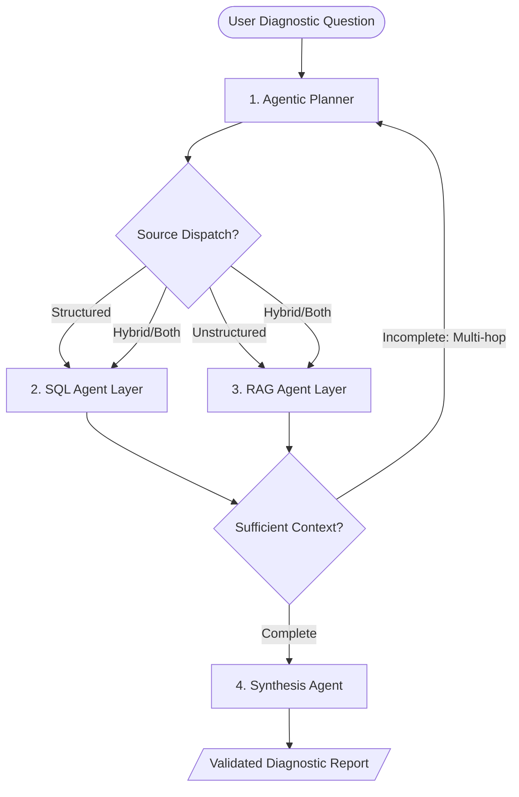

# Data Copilot: Agentic RAG & Hybrid Retrieval

Diagnostic analytics requires more than just SQL database queries. Answering complex operational questions like "Why did quarterly margins contract?" requires correlating quantitative metrics (SQL databases) with unstructured policies, meeting logs, and technical incident reports (RAG context). This pattern defines an agentic retrieval architecture that dynamically routes and synthesizes across structured and unstructured data silos.

## What it is
The Agentic RAG (Retrieval-Augmented Generation) and Hybrid Retrieval pattern is a data access architecture where an AI agent acts as a dynamic planner and multi-step investigator. In early 2027, this pattern leverages FastMCP 3.1 for high-throughput tool discovery and execution, incorporating frontier reasoning models (Claude 5.1/5.6, GPT-5.5/5.6, Gemini 4.0 Pro/Ultra) alongside local edge planners (Llama 4-70B, Gemma 3-27B, Qwen 3.8-32B). It determines optimal retrieval paths across SQL databases, vector document stores, and live web endpoints.

### Hybrid Retrieval Workflow (2027)



## What problem it solves
Traditional RAG setups fail on diagnostic multi-silo queries because evidence is partitioned across systems. Structured databases contain the "what" (metric numbers, time-series shifts), while unstructured documentation holds the "why" (code changes, policy updates, incident summaries). Agentic RAG bridges this gap by coordinating multi-hop investigation across disparate repositories to generate causal explanations.

## Where it fits in the stack
This pattern operates at the **Reasoning, Query Planning & Synthesis Layer** of the [Data Copilot Architecture](../../architecture/data-copilot-text-to-sql.md). It orchestrates underlying [Data Copilot MCP Tooling](data-copilot-mcp-tooling.md) and database connectors, leveraging **FastMCP 3.1** and Pydantic v2 schemas for low-latency tool discovery and verified response payloads.

## Typical use cases
- **Root Cause Financial Analysis**: Explaining metric drops by linking transaction database deltas with executive meeting notes.
- **Enterprise Policy & Transaction Audit**: Verifying whether SQL expense records comply with corporate policy PDFs via RAG.
- **Technical Incident Troubleshooting**: Correlating system logs (SQL/ClickHouse) with post-mortem documentation (Markdown/PDFs).
- **Supply Chain Diagnostics**: Explaining inventory shortages by linking warehouse database rows with supplier notice emails.

## Strengths
- **Comprehensive Causal Context**: Unifies quantitative proof with qualitative domain insights.
- **Autonomous Multi-Hop Investigation**: Performs recursive queries to resolve missing variables without manual intervention.
- **ColBERT & Dense/Sparse Hybrid Search**: Incorporates late-interaction retrieval models for elevated precision in dense research documents.
- **Auditable Provenance**: Generates clear citation chains linking conclusions back to database rows and document chunks.

## Limitations
- **Coordination Latency**: Multi-turn planning and multi-hop execution introduce latency compared to single-pass RAG.
- **Token Spend**: Recursive investigation paths consume higher token budgets across reasoning loops.
- **Planner Complexity**: Requires robust prompt structures and schema constraints to prevent invalid query routing.

## When to use it
- When answering complex diagnostic "Why" or "How" questions across mixed data silos.
- When auditability and verifiable citation links are mandatory for decision support.
- When integrating structured SQL and unstructured vector stores under a unified FastMCP 3.1 interface.

## When not to use it
- For basic aggregation queries (e.g., "Total sales for Q4") where Text-to-SQL alone is sufficient.
- For simple factual lookup tasks where standard single-pass RAG achieves full recall.
- When ultra-low latency response (<200ms) is strictly required.

## Getting started

### Architectural Components

#### 1. Agentic Planner
- Analyzes user intent and context window requirements to select retrieval targets (SQL, RAG, or Hybrid).
- Routing Logic:
  - Quantitative metrics, aggregates, filtering -> **SQL Agent**.
  - Policies, documentation, unstructured text -> **RAG Agent**.
  - Causal diagnostics, root-cause investigation -> **Hybrid Agentic RAG**.

#### 2. SQL Agent Layer
- Follows the [Layered Text-to-SQL Architecture](../../architecture/data-copilot-text-to-sql.md) using FastMCP 3.1 connectors.

#### 3. RAG Agent Layer
- Performs dense/sparse hybrid search across Markdown, PDF, and HTML vector indexes.

#### 4. Synthesis Agent
- Merges quantitative SQL outputs with unstructured document excerpts into a unified response with confidence scores.

### Multi-Hop Diagnostic Pipeline
1. **Baseline Quantitative Delta (SQL)**: Calculate exact numerical variance.
2. **Event & Change Correlation (RAG)**: Query document indices for matching timestamps and change events.
3. **Hypothesis Formulation**: Formulate causal links between quantitative data and event logs.
4. **Targeted Verification Query**: Run follow-up SQL/RAG queries to confirm or refute the hypothesis.
5. **Causal Synthesis Report**: Output final report with validated citations and confidence metrics.

## CLI examples

### CLI Verification of FastMCP Retrieval Tools
```bash
# Query SQL database via FastMCP 3.1 CLI
fastmcp call sqlite_server query --data '{"sql": "SELECT SUM(amount) FROM transactions WHERE date >= \"2027-01-01\""}'

# Query vector document store via FastMCP 3.1 CLI
fastmcp call vector_server search --data '{"query": "revenue policy change 2027", "top_k": 3}'
```

## API examples

### Python Agentic Planner Router (FastMCP 3.1 & Pydantic v2)
The following Python implementation defines an agentic routing model with heuristic fallbacks and Pydantic v2 validation:

```python
from enum import Enum
from typing import List, Optional
from pydantic import BaseModel, Field, field_validator, ValidationError

class RouteDestination(str, Enum):
    """Target retrieval system for incoming query."""
    SQL = "sql"
    RAG = "rag"
    HYBRID = "hybrid"

class QueryAnalysis(BaseModel):
    """Pydantic v2 schema for analyzing and validating query routing parameters."""
    original_query: str = Field(..., description="Unmodified input query string.")
    route: RouteDestination = Field(..., description="Determined routing destination.")
    confidence_score: float = Field(..., ge=0.0, le=1.0, description="Routing confidence score.")
    extracted_keywords: List[str] = Field(default_factory=list, description="Extracted key terms and entities.")

    @field_validator("route", mode="before")
    @classmethod
    def apply_keyword_heuristics(cls, v: str, info) -> str:
        """Apply keyword heuristics to enforce hybrid routing for diagnostic queries."""
        query = info.data.get("original_query", "").lower()
        structured_keywords = ["total", "count", "average", "highest", "revenue", "sum"]
        unstructured_keywords = ["why", "policy", "process", "reason", "explain", "cause"]

        has_struct = any(k in query for k in structured_keywords)
        has_unstruct = any(k in query for k in unstructured_keywords)

        if has_struct and has_unstruct:
            return RouteDestination.HYBRID
        elif has_unstruct:
            return RouteDestination.RAG
        elif has_struct:
            return RouteDestination.SQL
        return v

# Example Verification Usage
if __name__ == "__main__":
    payload = {
        "original_query": "Why did SaaS subscription revenue decline in Q4?",
        "route": "sql",  # Heuristically overridden to hybrid
        "confidence_score": 0.96,
        "extracted_keywords": ["revenue", "decline", "saas", "q4"]
    }

    try:
        validated_analysis = QueryAnalysis.model_validate(payload)
        print(f"Validated Route Destination: {validated_analysis.route.value}")
        print(f"Confidence Score: {validated_analysis.confidence_score:.2f}")
    except ValidationError as err:
        print(f"Validation error: {err.json(indent=2)}")
```

## Related tools / concepts
- [Data Copilot Architecture](../../architecture/data-copilot-text-to-sql.md) — Text-to-SQL architecture.
- [Data Copilot MCP Tooling](data-copilot-mcp-tooling.md) — Tool integration layer.
- [Answer Synthesis Schema](../../reference-implementations/data-copilot/answer-synthesis-schema.md) — Standard output payload schema.
- [FastMCP 3.1 Specification](tool-calling-and-mcp.md) — Tool protocol standard.
- [Model Routing Guide](../model_routing_guide.md) — Provider model selection framework.

## Sources / References
- [LangChain Agentic RAG Architecture](https://python.langchain.com/docs/tutorials/rag/#agentic-rag)
- [FastMCP 3.1 Protocol Documentation](https://modelcontextprotocol.io/spec)
- [ColBERTv2 Late-Interaction Retrieval Architecture](https://arxiv.org/abs/2112.01488)

## Contribution Metadata
- Last reviewed: 2027-01-07
- Confidence: high
