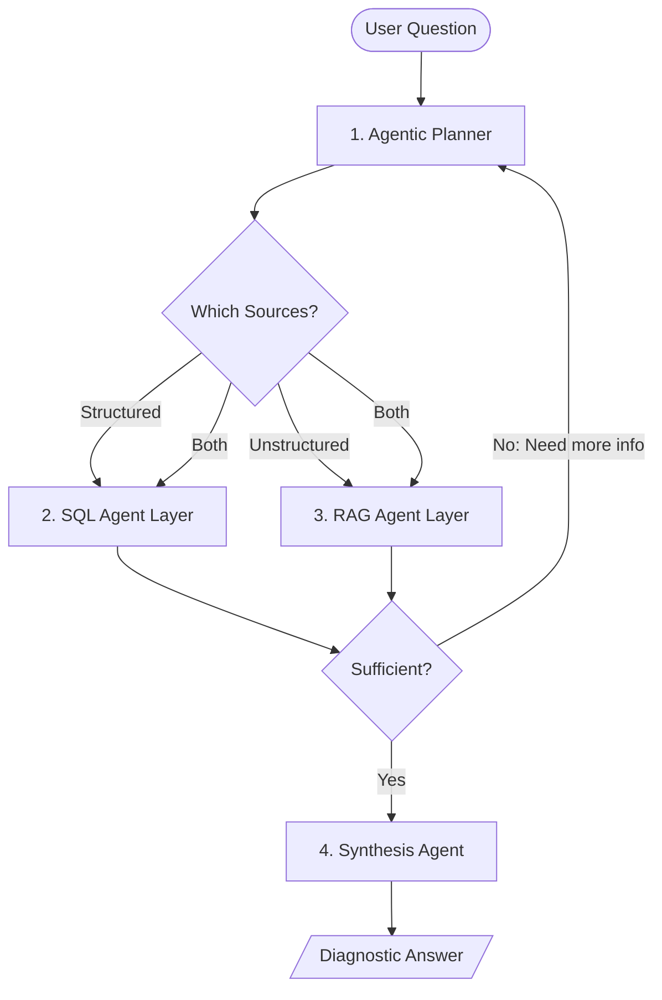

# Data Copilot: Agentic RAG & Hybrid Retrieval

Diagnostic analytics often requires more than just a SQL query. Answering "Why did revenue drop?" requires looking at data (SQL), standard operating procedures (SOPs), policy changes (Meeting Notes), and external factors. This pattern defines an agentic retrieval system that decides between structured (SQL) and unstructured (Docs) sources.

## Goal
Enable the Data Copilot to answer complex diagnostic questions by deciding when to query SQL, documents, or both, and synthesizing the results with confidence scoring.

## Hybrid Retrieval Workflow

## Layers

### 1. Agentic Planner
- **Role**: Analyzes the refined intent to determine if the answer lies in the database, the knowledge base, or a combination.
- **Decision Logic**:
  - If the question involves "How many", "Total", "Top X" -> **SQL**.
  - If the question involves "Why", "Policy", "Process", "Who is responsible" -> **RAG**.
  - If the question is a root-cause diagnosis (e.g., "Why did metric X change?") -> **Hybrid**.

### 2. SQL Agent Layer
- Follows the [Layered Text-to-SQL Architecture](../../architecture/data-copilot-text-to-sql.md).

### 3. RAG Agent Layer
- Uses semantic search over unstructured documents (SOPs, meeting notes, project logs).
- **Tool**: MCP server exposing local Markdown files.

### 4. Synthesis Agent
- Combines the structured data points from SQL with the qualitative context from RAG.
- **Output Requirements**: Must state assumptions and provide a confidence score.

## Multi-hop Investigation Flow
For complex root-cause "Why" questions, the agent often needs multiple steps of iterative retrieval:

1.  **Step 1: Identify Variance (Structured)**: Query SQL to identify exactly *what* changed, by *how much*, and *when*.
    - *Example*: "Conversion rate dropped by 5% in the 'Home Office' category between May 1st and May 7th."
2.  **Step 2: Contextual Lookup (Unstructured)**: Query RAG (Meeting Notes, Project Logs) using the specifics from Step 1.
    - *Search Query*: "Home Office conversion rate drop May 2026" or "Home Office category updates".
3.  **Step 3: Hypothesize & Validate**: If Step 2 finds a potential cause (e.g., "We updated the pricing algorithm"), the agent may perform a second SQL query to validate the hypothesis.
    - *Validation Query*: "Compare average price in Home Office before and after May 1st."
4.  **Step 4: Refined Retrieval (Optional)**: If Step 2 is insufficient, check alternative sources like Calendar events (e.g., "Was there a site-wide outage?") or Email summaries (e.g., "Customer support reported a bug in the Home Office checkout flow").
5.  **Step 5: Final Synthesis**: Combine quantitative proof with qualitative reasoning.

## Retrieval Sufficiency & Confidence Scoring

### Sufficiency Check
Before synthesis, the planner must ask: "Do I have enough information to answer the user's specific diagnostic question without guessing?"

**Criteria for Sufficiency**:
- **Source grounding**: Every claim in the synthesis must be traceable to a specific SQL row or document snippet.
- **Dimensional alignment**: If the SQL identifies a drop in a specific category (e.g., "Kitchen"), the RAG retrieval must have explicitly searched for that category.
- **Temporal alignment**: The quantitative change and the qualitative event must occur within a logical timeframe (e.g., event precedes or coincides with the change).

- **Low Sufficiency**: "I found the metric drop, but no corresponding notes in the logs."
- **Action**: Report findings but state the missing link.

### Confidence Scoring
- **High (0.8 - 1.0)**: Direct match in SQL + explicit reason found in RAG.
- **Medium (0.5 - 0.7)**: Metric drop found, but reason is inferred from general policy.
- **Low (0.0 - 0.4)**: Correlating data found but no causal links.

## Example Q&A: Diagnostic

### Example 1: Home Finance
**Question**: "Why did my grocery spending spike last week?"

**Agent Logic**:
1.  **SQL Query**: Finds top categories for last week. (Result: 'Dining Out' is 3x higher than average).
2.  **RAG Query**: Search for "Dining", "Restaurants", or "Guests" in family logs/calendar. (Result: Found "Anniversary Dinner" on April 20).
3.  **Synthesis**: "Your spending spiked by £150 last week primarily due to 'Dining Out'. This is explained by the 'Anniversary Dinner' event found in your calendar for April 20."
4.  **Confidence**: 0.95 (Direct causal link found).

### Example 2: Business Metric
**Question**: "Why did conversion rate (Metric X) drop for the 'Outdoor' category?"

**Agent Logic**:
1.  **Step 1 (SQL)**: Compares conversion rate per category. (Result: 'Outdoor' category conversion fell from 3.2% to 1.8% starting Tuesday).
2.  **Step 2 (RAG)**: Searches project logs for "Outdoor category". (Result: Found entry in `dev_log.md`: "Deployed new image gallery component for Outdoor category on Tuesday morning").
3.  **Step 3 (Refined SQL)**: Queries for error rates in the Outdoor category. (Result: 404 errors on image assets spiked on Tuesday).
4.  **Synthesis**: "Conversion rate (Metric X) for the 'Outdoor' category dropped from 3.2% to 1.8% due to a buggy deployment of the new image gallery component on Tuesday, which caused image asset failures."
5.  **Confidence**: 0.90 (Strong correlation between deployment event and error spike).

## Sources / References
- [LangChain: Agentic RAG](https://python.langchain.com/docs/tutorials/rag/#agentic-rag)
- [Multi-hop RAG Strategies](https://github.com/langchain-ai/rag-from-scratch)

## Related tools / concepts
- [Data Copilot Architecture](../../architecture/data-copilot-text-to-sql.md)
- [Data Copilot MCP Tooling](data-copilot-mcp-tooling.md)
- [Data Copilot SQL Validation](../../playbooks/data-copilot-sql-validation.md)
- [Answer Synthesis Schema](../../reference-implementations/data-copilot/answer-synthesis-schema.md)

## Contribution Metadata
- Last reviewed: 2026-04-30
- Confidence: high
- Related Issues: #188
