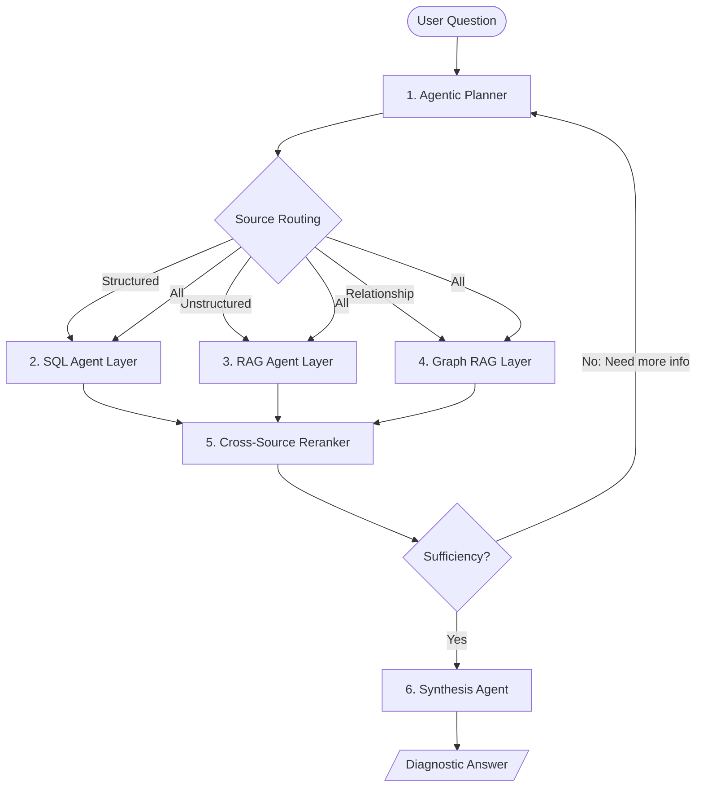

# Data Copilot: Agentic RAG & Hybrid Retrieval

Diagnostic analytics often requires more than just a SQL query. Answering "Why did revenue drop?" requires looking at data (SQL), standard operating procedures (SOPs), policy changes (Meeting Notes), and external factors. This pattern defines an agentic retrieval system that decides between structured (SQL), unstructured (Docs), and graph-based (Knowledge Graph) sources.

## What it is
The Agentic RAG (Retrieval-Augmented Generation) and Hybrid Retrieval pattern is a sophisticated data access strategy where an AI agent acts as a dynamic planner. It determines the most effective way to answer a complex query by coordinating between structured data sources (like SQL databases), unstructured data sources (like Markdown documentation or PDFs), and increasingly, **Graph-based** sources for relational reasoning.

## What problem it solves
Traditional RAG often fails at complex diagnostic questions (e.g., "Why did revenue drop?") because the answer is split across multiple systems. Structured data provides the "what" (the numbers), while unstructured documents provide the "why" (policy changes, meeting notes, project logs). This pattern bridges that gap, providing a unified, causal explanation through multi-hop reasoning.

## Where it fits in the stack
This pattern resides at the **Reasoning & Orchestration Layer** of the [Data Copilot Architecture](../../architecture/data-copilot-text-to-sql.md). It serves as the intelligence layer above the raw [MCP Tooling](data-copilot-mcp-tooling.md) and database connectors.

## Typical use cases
- **Root Cause Analysis**: Diagnosing business metric fluctuations by correlating data spikes with project logs.
- **Compliance Auditing**: Checking if financial transactions (SQL) adhere to corporate travel policies (RAG).
- **Customer Support**: Troubleshooting technical issues by matching user account history (SQL) with technical manuals (RAG).
- **Personal Finance**: Explaining spending anomalies by linking bank statements to calendar events and receipts.

## Strengths
- **Comprehensive Context**: Combines quantitative proof with qualitative reasoning.
- **Autonomous Investigation**: Can perform "multi-hop" queries to track down missing information without human intervention.
- **Traceability**: Provides a clear audit trail (Iteration Trace) from the final answer back to both database rows and document snippets.
- **Grounding**: Significantly higher accuracy for complex queries compared to single-shot retrieval.

## Limitations
- **Latency**: Coordination between multiple retrieval steps and synthesis can be slower than simple RAG (often > 5 seconds).
- **Complexity**: Requires sophisticated prompt engineering for the "Planner" agent to make correct routing decisions.
- **Compute Cost**: Multi-step reasoning chains consume significantly more tokens (3x - 10x) than single-shot retrieval.

## Hybrid Retrieval Workflow (2026 Refined)

## Layers

### 1. Agentic Planner (Mindscape-Aware)
- **Role**: Analyzes the query to build a "global view" of the required information.
- **Decision Logic**:
  - If the question involves "How many", "Total", "Top X" -> **SQL**.
  - If the question involves "Why", "Policy", "Process" -> **Vector RAG**.
  - If the question involves "How is X related to Y", "Impact of change Z" -> **Graph RAG**.
  - If the question is diagnostic -> **Hybrid Routing**.

### 2. SQL Agent Layer
- Follows the [Layered Text-to-SQL Architecture](../../architecture/data-copilot-text-to-sql.md).

### 3. RAG Agent Layer (Vector)
- Uses semantic search over unstructured documents (SOPs, meeting notes, project logs).
- **2026 Pattern**: Implements **Adaptive Retrieval**—only retrieving when the planner identifies a specific knowledge gap.

### 4. Graph RAG Layer (Relational)
- Maps entities (people, projects, assets) and their relationships to resolve complex dependencies that vector search misses.

### 5. Cross-Source Reranker
- Normalizes and ranks results from SQL, Vector, and Graph sources to ensure the most relevant context is sent to the synthesis agent.

### 6. Synthesis Agent
- Combines the structured data points from SQL with the qualitative context from RAG.
- **Output Requirements**: Must provide an **Iteration Trace** and a confidence score.

## Multi-hop Investigation Flow
For complex root-cause "Why" questions, the agent performs a recursive 5-step investigation:

1.  **Step 1: Quantitative Baseline (Structured)**: Establish the exact delta via SQL.
2.  **Step 2: Event Correlation (Unstructured/Graph)**: Search for events or relationship changes matching the timestamp.
3.  **Step 3: Hypothesis Generation (Reasoning)**: Use an LLM to link the data change to the retrieved event.
4.  **Step 4: Targeted Validation (Structured/Hybrid)**: Perform a specific query to test the hypothesis (e.g., "Check error rates for the specific user group affected").
5.  **Step 5: Root Cause Synthesis**: Combine proof and context into a final grounded report.

## Retrieval Sufficiency & Confidence Scoring (2026 Standards)

### Sufficiency Check
Before synthesis, the planner must evaluate the retrieved data against three criteria:
- **Source Grounding**: Are all claims traceable to a specific source ID?
- **Dimensional Alignment**: Did the search cover the specific categories identified in the data?
- **Temporal Alignment**: Do the events and data changes align on the timeline?

### Confidence Scoring
- **High (0.8 - 1.0)**: Direct match in SQL + explicit reason found in RAG/Graph.
- **Medium (0.5 - 0.7)**: Metric drop found; reason is inferred from general policy or related events.
- **Low (0.0 - 0.4)**: Correlating data found but no explicit causal links; requires "Knowledge Gap" alert.

## Example Q&A: Diagnostic
**Question**: "Why did my grocery spending spike last week?"
1.  **SQL**: Finds 'Dining Out' is 3x higher than average (£150 spike).
2.  **Graph/RAG**: Found "Anniversary Dinner" on April 20 in Calendar.
3.  **Synthesis**: "Spending spiked by £150 primarily due to 'Dining Out', specifically the 'Anniversary Dinner' on April 20."
4.  **Confidence**: 0.95.

## When to use it
- High-value research, analysis, or audit workloads.
- When contradictory sources are likely and require resolution.
- For "Multi-hop" synthesis that vector RAG alone cannot handle.

## When not to use it
- Latency-critical applications (< 3 seconds).
- Simple factual lookups or pure data aggregations.
- High query volume with low margins (cost-prohibitive).

## Related tools / concepts
- [Data Copilot Architecture](../../architecture/data-copilot-text-to-sql.md)
- [Data Copilot SQL Validation](../../playbooks/data-copilot-sql-validation.md)
- [Answer Synthesis Schema](../../reference-implementations/data-copilot/answer-synthesis-schema.md)
- [RAG Pattern](rag-pattern.md)
- [Agentic Workflows](agentic-workflows.md)
- [Graph-O1 &HGMem](https://www.turingpost.com/p/ragtypes) (Advanced RAG 2026)

## Sources / References
- [20 Advanced RAG Types in 2026 (Turing Post)](https://www.turingpost.com/p/ragtypes)
- [Agentic RAG Patterns: Multi-Step Reasoning Guide (Digital Applied)](https://www.digitalapplied.com/blog/agentic-rag-patterns-multi-step-reasoning-guide)
- [RAG Architecture 2026 Patterns (Future AGI)](https://futureagi.com/blog/rag-architecture-llm-2025/)

## Contribution Metadata
- Last reviewed: 2026-05-31
- Confidence: high
- Related Issues: #188
