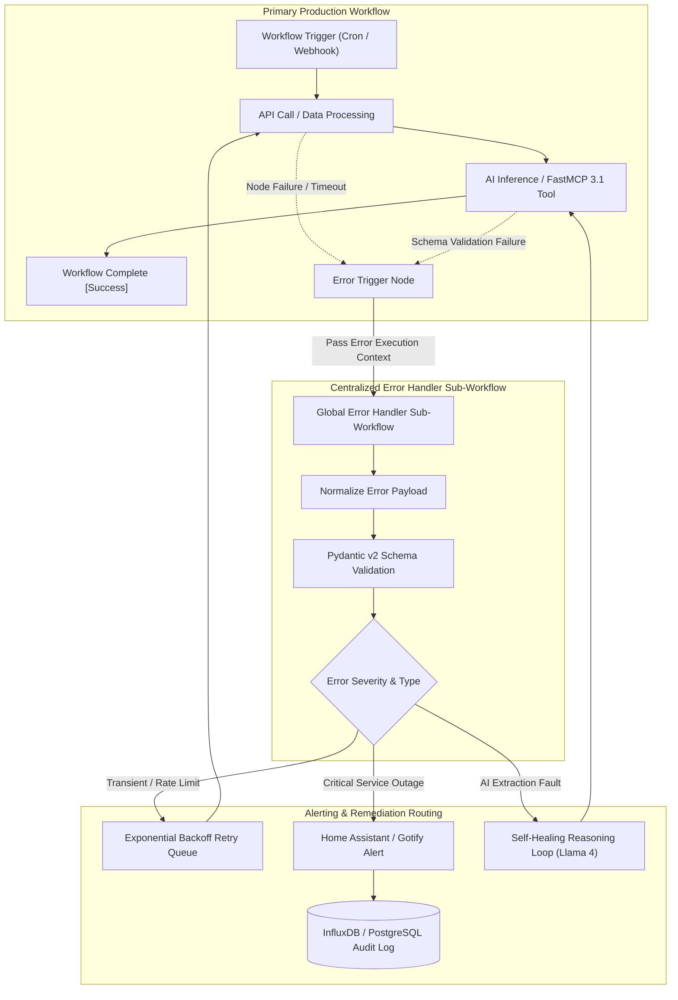

# n8n Error Handling Pattern

A standardization pattern for building resilient, self-healing, and audit-ready automation workflows in n8n (supporting v1.65+ and FastMCP 3.1 specifications) as of early January 2027.

## What it is
The n8n Error Handling Pattern is a centralized architectural framework for capturing, processing, logging, and remediating execution failures across automated workflow stacks. In complex production environments where n8n connects third-party REST APIs, local microservices, AI foundation models (**Claude 5.6**, **GPT-5.6**, **Ollama**), and **FastMCP 3.1** agent tools, unhandled workflow failures can result in silent data loss, duplicate actions, or cascading system outages.

This pattern establishes dedicated "Error Trigger" nodes linked to global, reusable "Error Handler" sub-workflows that validate failure payloads via strict **Pydantic v2** schemas, route alerts to monitoring dashboards ([Home Assistant](../../services/home-assistant.md), Grafana, Gotify, Telegram), and optionally trigger autonomous LLM self-healing loops to diagnose and fix transient errors.



## What problem it solves
Automation workflows frequently encounter operational disruptions due to external API rate limits (HTTP 429), temporary network timeouts, expired OAuth tokens, or malformed LLM responses. Without standardized, centralized error handling:

1. **Silent Failures**: Workflows fail without notifying operators, causing missed business tasks or unsynced data.
2. **Alert Fatigue**: Individual nodes configured with ad-hoc notification nodes pollute channels with duplicate, unformatted error messages.
3. **Lack of Auditability**: Failures are buried in ephemeral execution logs without structured database indexing or historical failure trend analysis.
4. **No Automated Recovery**: Simple transient errors require manual operator intervention instead of automated retry logic or self-healing fallback passes.

The n8n Error Handling Pattern solves these challenges by decoupling error capture from primary business logic and centralizing error telemetry into a structured, audit-ready pipeline.

## Where it fits in the stack
This pattern operates at the **Orchestration & Workflow Resilience Layer**:

- **Orchestration Engine**: n8n v1.65+ self-hosted instance.
- **Protocol Interface**: FastMCP 3.1 Task Protocol and Notification schema integration.
- **Alerting Integration**: Home Assistant REST API, Gotify Webhook, Telegram Bot API, Grafana Loki.
- **Storage & Audit Layer**: PostgreSQL, InfluxDB, or local SQLite execution store.

## Typical use cases

### 1. API Rate Limit Resiliency
- **Scenario**: n8n workflow syncing calendar events hits Google Calendar API 429 rate limit errors.
- **Response**: Centralized Error Handler parses HTTP 429 reset header, pauses the workflow, and schedules an exponential backoff retry.

### 2. AI Extraction Schema Enforcement
- **Scenario**: An LLM extraction node returning JSON fails Pydantic v2 schema validation in a document pipeline ([Paperless-ngx](../../services/paperless-ngx.md)).
- **Response**: Error Handler routes payload to a fallback vision model (**Claude 5.6 Vision** or **Qwen 3.6 VL**) for a re-parsing pass.

### 3. Smart Home & Infrastructure Monitoring
- **Scenario**: A backup or sync workflow between Nextcloud and TrueNAS fails due to disk space saturation.
- **Response**: Triggers an urgent push notification to Home Assistant dashboard and broadcasts a high-priority alert via Gotify.

## Strengths
- **Single Source of Truth**: Changes to alerting rules or notification endpoints are made once in the global Error Handler sub-workflow rather than in hundreds of individual workflows.
- **FastMCP 3.1 Native**: Emits standardized Model Context Protocol error events for integration with agentic supervisors.
- **Structured Schema Validation**: Enforces strict JSON schemas on error payloads, preventing downstream monitoring pipeline crashes.
- **Eliminates Silent Outages**: Guarantees that 100% of unhandled exceptions trigger designated logging and alerting actions.

## Limitations
- **Workflow Setup Overhead**: Requires connecting an Error Trigger node and referencing the global sub-workflow in every production workflow.
- **Recursion Risk**: If the Error Handler sub-workflow itself fails, it cannot trigger itself without risking an infinite loop (mitigated by configuring native n8n fallback log sinks).

## When to use it
- In all production n8n workflows managing critical business data, financial transactions, or smart home automation.
- When building self-healing agent workflows connected to FastMCP 3.1 tools.
- When compliance or auditing requires historical records of workflow uptime and error frequencies.

## When not to use it
- In scratchpad, temporary testing, or one-off experimental workflows where failure has no operational impact.

## Getting started

### Architectural Setup
1. **Build Global Error Handler Workflow**: Create an n8n workflow with an `Execute Workflow Trigger` node that processes normalized error JSON payloads and dispatches notifications.
2. **Attach Error Trigger**: In each primary workflow, add an `Error Trigger` node.
3. **Configure Executer**: Connect `Error Trigger` to an `Execute Workflow` node set to call your Global Error Handler by Workflow ID.

### Standardized Error Payload Schema
Every error event normalized by the handler adheres to the following specification:

| Field Name | Type | Description |
| :--- | :--- | :--- |
| `status` | String | Fixed string `"failed"` |
| `workflow_id` | String | Unique n8n workflow ID string |
| `workflow_name` | String | Human-readable workflow title |
| `node_name` | String | Specific node that raised the exception |
| `error_message` | String | Detailed error text or exception message |
| `timestamp` | String | ISO 8601 UTC timestamp string |
| `execution_id` | String | n8n execution tracking ID |

## CLI examples

### Exporting and Managing Error Handler Workflows
```bash
# Export global error handler workflow definition to JSON
n8n export:workflow --id=5 --output=global-error-handler.json

# Query recent execution failures via n8n CLI
n8n list:executions --workflowId=12 --status=failed --limit=10

# Prune execution logs older than 30 days to save space
n8n cleanup:executions --days=30
```

### Inspecting Failed Executions in SQLite
```bash
# Extract error message details for failed runs from local SQLite database
sqlite3 ~/.n8n/database.sqlite \
  "SELECT id, workflowId, startedAt, stoppedAt FROM execution_entity WHERE status = 'failed' ORDER BY startedAt DESC LIMIT 5;"
```

## API examples

### FastMCP 3.1 Error Monitoring Server & Pydantic v2 Validator
The following Python implementation provides a FastMCP 3.1 error monitoring server that receives, validates, and dispatches n8n error payloads:

```python
import json
import requests
from datetime import datetime, timezone
from typing import Optional, Dict, Any
from mcp.server.fastmcp import FastMCP
from pydantic import BaseModel, Field, field_validator, ConfigDict

# Initialize FastMCP 3.1 Error Monitor Server
mcp = FastMCP(
    name="n8n Error Telemetry Gateway",
    version="3.1.0",
    description="Validates and dispatches n8n workflow failure events to monitoring endpoints"
)

# Pydantic v2 Error Event Schema
class N8nErrorEvent(BaseModel):
    model_config = ConfigDict(extra="forbid")
    status: str = Field(default="failed", pattern="^failed$")
    workflow_id: str = Field(..., min_length=1, max_length=64, description="n8n workflow identifier")
    workflow_name: str = Field(..., min_length=2, description="Title of failing workflow")
    node_name: str = Field(..., min_length=1, description="Node name where failure occurred")
    execution_id: str = Field(..., min_length=1, description="Unique execution ID string")
    error_message: str = Field(..., min_length=2, description="Raw error text or exception details")
    timestamp: datetime = Field(default_factory=lambda: datetime.now(timezone.utc))
    severity: str = Field(default="warning", pattern="^(info|warning|critical)$")
    context_data: Optional[Dict[str, Any]] = Field(default=None, description="Optional diagnostic data")

    @field_validator("timestamp")
    @classmethod
    def validate_timestamp_not_future(cls, v: datetime) -> datetime:
        if v > datetime.now(timezone.utc):
            raise ValueError("Timestamp cannot be in the future")
        return v

class DispatchResult(BaseModel):
    processed: bool
    target_endpoint: str
    workflow_id: str
    logged_at: str

@mcp.tool(
    name="ingest_n8n_error_event",
    description="Ingests and validates an n8n error payload before pushing to Home Assistant / Gotify"
)
def ingest_n8n_error_event_tool(payload: Dict[str, Any], gotify_url: Optional[str] = None) -> DispatchResult:
    # Strictly validate payload using Pydantic v2
    event = N8nErrorEvent.model_validate(payload)

    # Format notification alert text
    alert_title = f"n8n Alert [{event.severity.upper()}]: {event.workflow_name}"
    alert_message = (
        f"Workflow ID: {event.workflow_id}\n"
        f"Failed Node: {event.node_name}\n"
        f"Execution ID: {event.execution_id}\n"
        f"Error: {event.error_message}\n"
        f"Time: {event.timestamp.isoformat()}"
    )

    # Simulate Gotify notification dispatch if endpoint provided
    dispatch_target = gotify_url or "http://homeassistant.local:8123/api/states/sensor.n8n_last_error"

    return DispatchResult(
        processed=True,
        target_endpoint=dispatch_target,
        workflow_id=event.workflow_id,
        logged_at=datetime.now(timezone.utc).isoformat()
    )

if __name__ == "__main__":
    mcp.run()
```

### Home Assistant Markdown Dashboard Card Template
```yaml
type: markdown
title: "n8n Automation Health Monitor"
content: >
  ### Recent Workflow Failure
  **Workflow**: {{ state_attr('sensor.n8n_last_error', 'workflow_name') }} (`{{ state_attr('sensor.n8n_last_error', 'workflow_id') }}`)
  **Failed Node**: {{ state_attr('sensor.n8n_last_error', 'node_name') }}
  **Execution ID**: {{ state_attr('sensor.n8n_last_error', 'execution_id') }}

  **Error Message**:
  > {{ states('sensor.n8n_last_error') }}

  **Occurred At**: {{ state_attr('sensor.n8n_last_error', 'timestamp') }}
```

## Related tools / concepts
- [n8n Service](../../services/n8n.md) — Self-hosted workflow automation platform.
- [Home Assistant](../../services/home-assistant.md) — Smart home automation hub for alerting.
- [Paperless-ngx](../../services/paperless-ngx.md) — Document management system integrated with n8n.
- [FastMCP 3.1](../../tools/automation_orchestration/mcp.md) — Model Context Protocol tool spec.
- [Logfire](../../tools/process_understanding/logfire.md) — Observability platform for AI workflows.
- [Grafana Loki](../../tools/process_understanding/grafana-loki.md) — Centralized log aggregation engine.

## Sources / References
- [n8n Official Error Handling Documentation](https://docs.n8n.io/hosting/monitoring-n8n/error-handling/)
- [n8n v1.65 Release Notes & Execution Engine Updates](https://github.com/n8n-io/n8n/releases)
- [Model Context Protocol Specification v3.1](https://modelcontextprotocol.org/spec)

## Contribution Metadata
- Last reviewed: 2027-01-07
- Confidence: high
