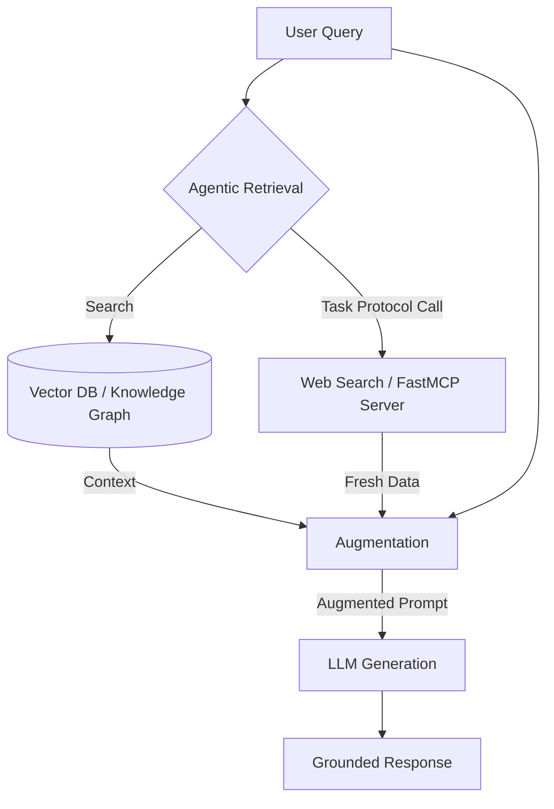

# RAG Pattern (Retrieval-Augmented Generation)

## What it is
Retrieval-Augmented Generation (RAG) is a design pattern that enhances the performance of Large Language Models (LLMs) by providing them with relevant information from external data sources before generating a response. It grounds the model's output in verifiable facts retrieved from a reliable source.

As of early January 2027, the pattern has evolved into **Agentic RAG**, where autonomous agents use tools and [Model Context Protocol (FastMCP 3.1 Task Protocol)](../../tools/automation_orchestration/mcp.md) to dynamically browse, retrieve, and reason over structured, unstructured, or graph-based information.



## What problem it solves
It addresses the core limitations of LLMs, such as hallucinations (generating plausible but incorrect information) and the "knowledge cutoff" (lack of access to up-to-date or private data). It provides a mechanism for **verifiability** and **temporal accuracy**.

## Where it fits in the stack
RAG sits at the **Application & Knowledge Layer**, bridging the gap between raw data storage (Vector Databases, Knowledge Graphs) and the reasoning engine (LLM).

## Typical use cases
- **Enterprise Knowledge Management**: Providing answers based on internal wikis, Slack history, and documentation.
- **Dynamic Fact-Checking**: Verifying real-time news or data against trusted repositories.
- **Personalized Agentic Workflows**: Allowing assistants to retrieve user-specific context (emails, calendar) via [FastMCP 3.1](../../tools/automation_orchestration/mcp.md).
- **Complex Analytical Synthesis**: Reasoning across thousands of documents using tools like [Hebbia](../../tools/enterprise/hebbia.md).

## Strengths
- **Accuracy**: Significantly reduces hallucinations by grounding responses in provided context.
- **Data Freshness**: Allows the LLM to access the latest information without retraining.
- **Security**: Enables granular access control by filtering retrieved data before it reaches the prompt.
- **Explainability**: Enables the system to provide citations and direct links to source material.

## Limitations
- **Retrieval Bottleneck**: The system is only as good as the information it finds; poor retrieval leads to poor answers.
- **Latency**: The extra retrieval step adds overhead to the response time.
- **Context Window Management**: Managing large volumes of retrieved data requires sophisticated ranking and chunking.

## When to use it
- When you need accurate, up-to-date information not present in the LLM's base training.
- When transparency, grounding, and source attribution are critical for user trust.
- When working with private or proprietary data that cannot be sent to public training sets.

## When not to use it
- For tasks where the LLM's internal general knowledge is sufficient and latency is a primary concern.
- If the target data is structured and better suited for direct SQL/API queries without natural language retrieval.

## Getting started
1. **Ingest Data**: Use [Docling](../../tools/process_understanding/docling.md) to parse PDFs and documents into clean Markdown.
2. **Chunk & Embed**: Break text into semantic chunks and convert to vectors using [Llama 4](../../tools/ai_knowledge/llama-4.md) or [Gemma 3](../../tools/ai_knowledge/gemma-3.md) native embeddings.
3. **Store**: Use a vector database like [ChromaDB](../../tools/infrastructure/chroma.md) or [Milvus 3.0](../../tools/infrastructure/milvus.md).
4. **Retrieve & Augment**: Use [FastMCP 3.1 Task Protocol](../../tools/automation_orchestration/mcp.md) to connect your retrieval engine to [Claude 5.6](../../tools/providers/anthropic.md), [GPT-5.6](../../tools/ai_knowledge/openai.md), [Gemini 4.0 Ultra](../../tools/providers/google.md), or [DeepSeek-V4](../../tools/providers/deepseek.md).

## CLI examples

### Using `rag-stack` (Hypothetical CLI)
```bash
# Initialize a RAG index for a directory
rag-stack init ./docs --db milvus

# Query the index from the terminal
rag-stack query "What are the early January 2027 compliance requirements?"
```

## API examples

### Python (Agentic RAG with LlamaIndex & Pydantic v2 validation)
The following example demonstrates how to validate RAG query parameters and retrieve structured query results using strict Pydantic v2 schemas under FastMCP 3.1:

```python
from typing import List, Optional
from pydantic import BaseModel, Field, field_validator
from llama_index.core import VectorStoreIndex, SimpleDirectoryReader
from llama_index.llms.anthropic import Anthropic

# Define validation schemas
class RAGQuery(BaseModel):
    query_text: str = Field(..., min_length=3, description="The semantic search query")
    top_k: int = Field(default=3, ge=1, le=10, description="Number of segments to retrieve")
    similarity_threshold: float = Field(default=0.7, ge=0.0, le=1.0, description="Minimum cosine similarity")

    @field_validator('similarity_threshold')
    @classmethod
    def check_threshold(cls, v: float) -> float:
        if v < 0.5:
            raise ValueError("Similarity threshold must be at least 0.5 for reliable grounding")
        return v

class RetrievedSegment(BaseModel):
    text: str = Field(..., description="The content chunk retrieved")
    source: str = Field(..., description="Source document reference")
    score: float = Field(..., ge=0.0, le=1.0, description="Similarity score")

class RAGResponse(BaseModel):
    query: RAGQuery
    answer: str = Field(..., description="The synthesized answer from the LLM")
    sources: List[RetrievedSegment] = Field(..., description="Verified citation sources")
    confidence: float = Field(..., ge=0.0, le=1.0, description="Confidence score")

# Initialize LLM and RAG under 2027 standards
llm = Anthropic(model="claude-5-6-sonnet-20270105")
documents = SimpleDirectoryReader("./data").load_data()
index = VectorStoreIndex.from_documents(documents)
query_engine = index.as_query_engine(llm=llm)

# Execute and Validate
def run_grounded_rag(request_json: str) -> RAGResponse:
    # 1. Parse and validate incoming query
    query = RAGQuery.model_validate_json(request_json)

    # 2. Execute vector search and generation
    response = query_engine.query(query.query_text)

    # 3. Build a structured verified response
    retrieved_sources = [
        RetrievedSegment(
            text=node.node.get_content(),
            source=node.node.metadata.get("file_name", "unknown"),
            score=node.score or 0.85
        ) for node in response.source_nodes
    ]

    rag_response = RAGResponse(
        query=query,
        answer=response.response,
        sources=retrieved_sources,
        confidence=sum(s.score for s in retrieved_sources) / max(len(retrieved_sources), 1)
    )
    return rag_response
```

## Related tools / concepts
- [Agentic RAG](data-copilot-agentic-rag.md)
- [GraphRAG](../../tools/frameworks/graphrag.md)
- [Docling](../../tools/process_understanding/docling.md)
- [Milvus 3.0](../../tools/infrastructure/milvus.md)
- [ChromaDB](../../tools/infrastructure/chroma.md)
- [LlamaIndex](../../tools/ai_knowledge/llamaindex.md)
- [LangChain](../../tools/ai_knowledge/langchain.md)
- [Model Context Protocol (FastMCP 3.1 Task Protocol)](../../tools/automation_orchestration/mcp.md)
- [Llama 4](../../tools/ai_knowledge/llama-4.md)
- [Claude 5.6](../../tools/providers/anthropic.md)

## Sources / References
- [Retrieval-Augmented Generation for Knowledge-Intensive NLP Tasks](https://arxiv.org/abs/2005.11401)
- [Agentic RAG: The Next Evolution of Knowledge Retrieval and MCP 3.1 Integrations](https://example.com/agentic-rag-2027)
- [LlamaIndex Documentation](https://docs.llamaindex.ai/)

## Contribution Metadata
- Last reviewed: 2027-01-07
- Confidence: high
