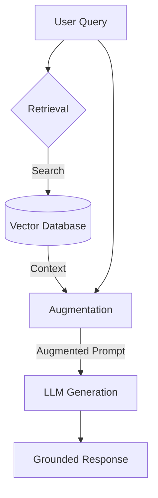

# RAG Pattern (Retrieval-Augmented Generation)

## What it is
Retrieval-Augmented Generation (RAG) is a design pattern that enhances the performance of Large Language Models (LLMs) by providing them with relevant information from external data sources before generating a response.

## What problem it solves
It addresses the limitations of LLMs, such as hallucinations (generating incorrect information) and a lack of access to up-to-date or private data, by grounding the model's output in verifiable facts retrieved from a reliable source.

## Where it fits in the stack
RAG sits at the **Application & Knowledge Layer**, bridging the gap between raw data storage (Vector Databases) and the reasoning engine (LLM).

## How it works
1. **User Query**: The user provides a prompt or question.
2. **Retrieval**: The system searches an external data source (e.g., a vector database) for information relevant to the query.
3. **Augmentation**: The retrieved information is combined with the original user query to create an augmented prompt.
4. **Generation**: The augmented prompt is sent to the LLM, which generates a response based on both its internal knowledge and the provided context.

## Typical use cases
- **Question Answering over Documents**: Providing answers based on a company's internal knowledge base or documentation.
- **Fact-Checking**: Verifying claims against a trusted data source.
- **Personalized Recommendations**: Generating suggestions based on user-specific data retrieved at query time.

## Strengths
- **Reduced Hallucinations**: Grounds the LLM's responses in external, verifiable data.
- **Access to Current Data**: Allows LLMs to use information that was not part of their training set.
- **Transparency**: Enables the system to provide citations or references for its answers.

## Limitations
- **Retrieval Quality**: The system's performance is heavily dependent on the quality and relevance of the retrieved information.
- **Latency**: Adding a retrieval step can increase the time it takes to generate a response.
- **Complexity**: Setting up and maintaining the retrieval infrastructure (e.g., embeddings, vector stores) adds complexity.

## When to use it
- When you need accurate, up-to-date information that is not present in the LLM's training data.
- When transparency and grounding of responses are critical.

## When not to use it
- For tasks where the LLM's internal knowledge is sufficient and no external context is required.
- If the latency introduced by retrieval is unacceptable for the use case.

## Getting started
To implement a basic RAG pipeline:
1.  **Select a Vector DB**: Use [ChromaDB](../../tools/infrastructure/chromadb.md) or [Qdrant](../../tools/infrastructure/qdrant.md).
2.  **Chunk your Data**: Use [Docling](../../tools/process_understanding/docling.md) or LangChain text spliters to break documents into manageable pieces.
3.  **Embed and Store**: Convert chunks into vectors using an embedding model (e.g., OpenAI or HuggingFace) and store them in the DB.
4.  **Query and Generate**: Retrieve relevant chunks based on user query and pass them as context to the LLM.

## Related tools / concepts
- [Vector DB Comparison](../../knowledge_base/vector-db-comparison.md)
- [Agentic RAG](data-copilot-agentic-rag.md)
- [Docling](../../tools/process_understanding/docling.md)
- [LlamaIndex](../../tools/frameworks/llamaindex.md)
- [LangChain](../../tools/ai_knowledge/langchain.md)
- [Embeddings Guide](../model_classes.md#embeddings)
- [Agentic Workflows](agentic-workflows.md)

## Sources / References
- [Wikipedia](https://en.wikipedia.org/wiki/Retrieval-augmented_generation)
- [Prompt Engineering Guide](https://www.promptingguide.ai/techniques/rag)

## Contribution Metadata
- Last reviewed: 2026-05-10
- Confidence: high
