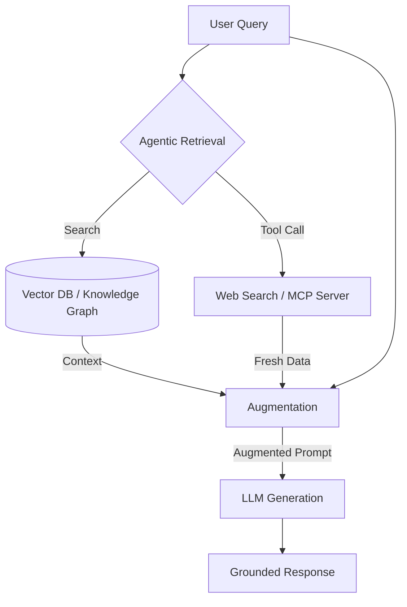

# RAG Pattern (Retrieval-Augmented Generation)

## What it is
Retrieval-Augmented Generation (RAG) is a design pattern that enhances the performance of Large Language Models (LLMs) by providing them with relevant information from external data sources before generating a response. It grounds the model's output in verifiable facts retrieved from a reliable source.

As of late August 2026, the pattern has evolved into **Agentic RAG**, where autonomous agents use tools and [Model Context Protocol (MCP 3.1)](../../tools/automation_orchestration/mcp.md) to dynamically browse, retrieve, and reason over structured, unstructured, or graph-based information.



## What problem it solves
It addresses the core limitations of LLMs, such as hallucinations (generating plausible but incorrect information) and the "knowledge cutoff" (lack of access to up-to-date or private data). It provides a mechanism for **verifiability** and **temporal accuracy**.

## Where it fits in the stack
RAG sits at the **Application & Knowledge Layer**, bridging the gap between raw data storage (Vector Databases, Knowledge Graphs) and the reasoning engine (LLM).

## Typical use cases
- **Enterprise Knowledge Management**: Providing answers based on internal wikis, Slack history, and documentation.
- **Dynamic Fact-Checking**: Verifying real-time news or data against trusted repositories.
- **Personalized Agentic Workflows**: Allowing assistants to retrieve user-specific context (emails, calendar) via [MCP](../../tools/automation_orchestration/mcp.md).
- **Complex Analytical Synthesis**: Reasoning across thousands of documents using tools like [Hebbia](../../tools/enterprise/hebbia.md).

## Strengths
- **Accuracy**: Significantly reduces hallucinations by grounding responses in provided context.
- **Data Freshness**: Allows the LLM to access the latest information without retraining.
- **Security**: Enables granular access control by filtering retrieved data before it reaches the prompt.
- **Explainability**: Enables the system to provide citations and direct links to source material.

## Limitations
- **Retrieval Bottleneck**: The system is only as good as the information it finds; poor retrieval leads to poor answers.
- **Latency**: The extra retrieval step adds overhead to the response time.
- **Context Window Management**: Managing large volumes of retrieved data requires sophisticated ranking and chunking.

## When to use it
- When you need accurate, up-to-date information not present in the LLM's base training.
- When transparency, grounding, and source attribution are critical for user trust.
- When working with private or proprietary data that cannot be sent to public training sets.

## When not to use it
- For tasks where the LLM's internal general knowledge is sufficient and latency is a primary concern.
- If the target data is structured and better suited for direct SQL/API queries without natural language retrieval.

## Getting started
1.  **Ingest Data**: Use [Docling](../../tools/process_understanding/docling.md) to parse PDFs and documents into clean Markdown.
2.  **Chunk & Embed**: Break text into semantic chunks and convert to vectors using [Llama 4](../../tools/ai_knowledge/meta_llama.md) native embeddings.
3.  **Store**: Use a vector database like [ChromaDB](../../tools/infrastructure/chromadb.md) or [Milvus 3.0](../../tools/infrastructure/milvus.md).
4.  **Retrieve & Augment**: Use [MCP 3.1](../../tools/automation_orchestration/mcp.md) to connect your retrieval engine to [Claude 5.1](../../tools/providers/anthropic.md) or [GPT-5.5](../../tools/ai_knowledge/openai.md).

## CLI examples

### Using `rag-stack` (Hypothetical CLI)
```bash
# Initialize a RAG index for a directory
rag-stack init ./docs --db milvus

# Query the index from the terminal
rag-stack query "What are the late August 2026 compliance requirements?"
```

## API examples

### Python (Agentic RAG with LlamaIndex)
```python
from llama_index.core import VectorStoreIndex, SimpleDirectoryReader
from llama_index.llms.anthropic import Anthropic

# Load documents and create index
documents = SimpleDirectoryReader("./data").load_data()
index = VectorStoreIndex.from_documents(documents)

# Initialize Claude 5.1
llm = Anthropic(model="claude-5-1-sonnet-20260828")

# Query with agentic reasoning
query_engine = index.as_query_engine(llm=llm)
response = query_engine.query("Summarize the latest project updates.")
print(response)
```

## Related tools / concepts
- [Agentic RAG](data-copilot-agentic-rag.md)
- [Knowledge Graphs](../patterns/knowledge-graphs.md)
- [Docling](../../tools/process_understanding/docling.md)
- [Milvus 3.0](../../tools/infrastructure/milvus.md)
- [ChromaDB](../../tools/infrastructure/chromadb.md)
- [LlamaIndex](../../tools/ai_knowledge/llamaindex.md)
- [LangChain](../../tools/ai_knowledge/langchain.md)
- [Model Context Protocol (Model Context Protocol 3.1)](../../tools/automation_orchestration/mcp.md)
- [Llama 4](../../tools/ai_knowledge/meta_llama.md)
- [Claude 5.1](../../tools/providers/anthropic.md)

## Sources / References
- [Retrieval-Augmented Generation for Knowledge-Intensive NLP Tasks](https://arxiv.org/abs/2005.11401)
- [Agentic RAG: The Next Evolution of Knowledge Retrieval and MCP 3.1 Integrations](https://example.com/agentic-rag-2026)
- [LlamaIndex Documentation](https://docs.llamaindex.ai/)

## Contribution Metadata
- Last reviewed: 2026-08-31
- Confidence: high
