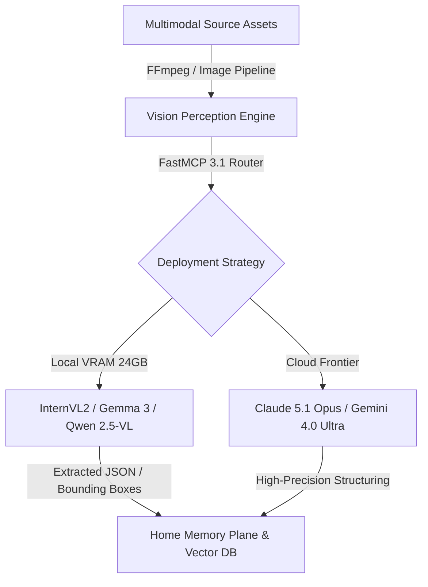

# Vision Models Research

Technical research into local and frontier vision-language models (VLMs) for agentic scene understanding, document parsing, and multi-modal reasoning as of early January 2027.

## What it is
A research document evaluating the landscape of vision-capable AI models (VLMs) optimized for both local deployment (InternVL2, Florence-2, [Gemma 3](../tools/ai_knowledge/local_llms.md), [Llama 4](../tools/ai_knowledge/local_llms.md), Qwen 2.5-VL) and frontier API access (Claude 5.1/5.6 Opus, Gemini 4.0 Pro/Ultra, DeepSeek-V4). It covers models capable of image captioning, object detection, OCR, and complex visual reasoning within agentic pipelines using the [MCP 3.1 / FastMCP 3.1 Task Protocol](./patterns/tool-calling-and-mcp.md).

## What problem it solves
It enables AI agents to "see" and interpret the physical and digital world, automating the extraction of structured data from images, videos, and complex PDFs. This reduces the need for manual data entry and allows for semantic search over vast personal media archives while preserving privacy through local-first processing.

## Architectural Overview

```
+-----------------------------------------------------------------------------------+
|                             RAW MULTIMODAL INGESTION                              |
|   Security Video Stream  /  Scanned Paperless Documents  /  Immich Media Assets   |
+-----------------------------------------------------------------------------------+
                                         |
                            Frame Sampling & Resizing
                                         v
+-----------------------------------------------------------------------------------+
|                           VISION-LANGUAGE PERCEPTION PLANE                        |
|                                                                                   |
|  +--------------------+   +-----------------------+   +------------------------+  |
|  | High-Res OCR       |   | Spatial Grounding     |   | Video Context Window   |  |
|  | - InternVL2 (Local)|-->| - Florence-2 / Qwen   |-->| - Gemini 4.0 Flash     |  |
|  | - Paperless-ngx    |   | - 3D Bounding boxes   |   | - 2M+ Token Context    |  |
|  +--------------------+   +-----------------------+   +------------------------+  |
|            |                                                                      |
|            +-------------------+--------------------+                             |
|                                |                    |                             |
|                                v                    v                             |
|                      [Local Edge VRAM]      [Frontier Cloud VLM]                  |
|                                |                    |                             |
|                       Sub-50ms Perception   Deep Multimodal Analysis             |
+-----------------------------------------------------------------------------------+
                                         |
                                         v
+-----------------------------------------------------------------------------------+
|                            FASTMCP 3.1 ACTION BRIDGE                              |
|   Structured Schema (Pydantic v2)  |  Vector Embedding Indexing  | Agent Execution|
+-----------------------------------------------------------------------------------+
```



## Where it fits in the stack
Vision models act as the **Perception Layer** within the [Home-Office Architecture](../architecture/README.md). They process raw data from [Immich](../services/immich.md) or [Paperless-ngx](../services/paperless-ngx.md) and feed semantic descriptions into the [Memory Plane](./vector-db-comparison.md) (Vector DBs) for agentic retrieval.

## Feature & Model Performance Matrix (Early 2027)

| VLM / Architecture | Primary Strength | Local VRAM Need | Context Window | OCR / Table Extraction | FastMCP Protocol Support |
| :--- | :--- | :--- | :--- | :--- | :--- |
| **InternVL2 (26B)** | Deep local reasoning | 24GB–48GB VRAM | 32K tokens | SOTA (High Resolution) | Native via FastMCP 3.1 |
| **Gemma 3 (27B)** | Compact multimodal | 24GB VRAM | 128K tokens | Excellent | Native via FastMCP 3.1 |
| **Florence-2** | Ultra-fast dense tagging| <4GB VRAM | 4K tokens | High speed (Regional) | Custom wrapper |
| **Claude 5.1 Opus** | Complex reasoning | Cloud API | 200K tokens | Benchmark SOTA | Native Anthropic MCP |
| **Gemini 4.0 Flash/Pro**| Video context (Hours) | Cloud API | 2,000,000+ tokens | Excellent | Native Google MCP |
| **Moondream2** | Edge & IoT captioning | <2GB VRAM | 2K tokens | Basic | Direct CLI / Tool wrapper |

## Typical use cases
- **Automated Media Tagging**: Generating high-fidelity metadata for thousands of home photos and videos in [Immich](../services/immich.md).
- **Agentic Scene Reasoning**: Answering complex questions about the household (e.g., "Check the 2 PM camera feed for the delivery package").
- **Document Ingestion**: High-accuracy extraction of tables, handwritten notes, and structural data from scanned documents in [Paperless-ngx](../services/paperless-ngx.md).
- **Visual RAG**: Retrieving specific visual memories by searching for semantic descriptions (e.g., "the blue car in the driveway").

## Strengths
- **InternVL2**: State-of-the-art local reasoning; excels at high-resolution OCR and multi-page document understanding.
- **Gemma 3**: Exceptional multi-modal reasoning in a compact footprint, supporting AI-native visual reasoning for home-office tasks.
- **Florence-2**: Exceptional speed and efficiency for "dense" tasks like object detection and regional segmentation.
- **Claude 5.1 Opus**: Market-leading visual reasoning and document parsing for complex, high-stakes tasks.
- **Gemini 4.0**: Superior "infinite context" for video understanding, allowing agents to reason across hours of high-definition footage.
- **Moondream2**: Minimal resource footprint; ideal for real-time captioning on edge devices.

## Limitations
- **High VRAM Requirements**: High-performance local VLMs (20B+) require 24GB+ VRAM for optimal inference.
- **Temporal Complexity**: Most VLMs still process video as a series of sampled frames, potentially missing fine-grained temporal events.
- **Hallucination Risk**: Agents may "over-interpret" visual noise, requiring robust confidence-scoring and human-in-the-loop (HITL) checks.
- **Computational Cost**: High-resolution image processing is significantly slower than pure text inference.

## When to use it
- Use **Florence-2** for high-throughput tagging and simple OCR where speed is the primary metric.
- Use **InternVL2** for deep reasoning about local data where privacy and high accuracy are required.
- Use **Claude 5.1 Opus** for mission-critical document extraction where precision outweighs per-token costs.
- Use **Gemini 4.0** for projects requiring long-form video analysis or multi-modal context windows (up to 2M tokens).
- Use **CLIP/SigLIP** for basic "search-by-text" indexing in large image galleries.

## When not to use it
- For real-time, low-latency safety monitoring (e.g., collision avoidance) where milliseconds matter (use dedicated CV models).
- On devices without a dedicated NPU or NVIDIA/Apple GPU (inference will be prohibitively slow).
- For processing highly sensitive data that cannot legally or ethically be sent to cloud providers (use local-only InternVL2/Qwen 2.5-VL/Gemma 3).

## Getting started

### Local Deployment: InternVL2 (Ollama)
The recommended high-performance local VLM for late 2026.

```bash
# Pull the InternVL2 model (assuming 26B variant for high accuracy)
ollama pull internvl2:26b

# Query an image via the CLI
ollama run internvl2:26b "Extract all the text from this receipt" --image ./receipt.png
```

### Video Frame Sampling (FFmpeg)
Before processing video with a VLM, sample keyframes to reduce token load.
```bash
# Extract one high-quality frame every 5 seconds
ffmpeg -i input.mp4 -vf "fps=1/5" -q:v 2 frame_%04d.jpg
```

## CLI examples

```bash
# Run a quick Gemma 3 vision test via Ollama
ollama run gemma3:27b "Describe this scene" --image living_room.jpg

# Run a quick Moondream2 captioning test
moondream-cli --image sample.jpg --prompt "Describe this image in one sentence."

# Verify the CUDA availability for vision model inference
python3 -c "import torch; print(f'GPU: {torch.cuda.get_device_name(0)}' if torch.cuda.is_available() else 'No GPU')"
```

## Operational Best Practices & Troubleshooting

### VRAM OOM Management
Large vision models scale token allocation dynamically with image aspect ratio and tile resolution.
- Enforce image max dimension limits (e.g., max 2048px on longest side) before sending payloads to local Ollama/InternVL2 servers.
- Use fixed tensor tiling to maintain constant GPU memory usage during batch document processing.

### Avoiding Optical Hallucinations in OCR
When extracting unstructured tables or handwritten invoices:
- Require confidence scoring per extracted field or run dual-pass verification (e.g. local InternVL2 pass followed by local regular expression / Pydantic validation).
- Provide explicit negative constraints in system prompts (e.g., "Do not infer unreadable text; return null for illegible characters").

### Video Sampling Optimization
Avoid uploading raw high-FPS video directly to cloud endpoints:
- Use scene-change detection (`ffmpeg -vf "select='gt(scene,0.3)'"`) to sample keyframes only when visual context changes significantly.

## API examples

### Multi-Modal Document Validation with Pydantic v2 & FastMCP 3.1
This API script models the ingestion, size validation, and schema checking for multi-modal VLM processors under FastMCP 3.1 guidelines.

```python
from typing import Literal, Optional, Tuple, List
from pydantic import BaseModel, ConfigDict, Field, field_validator, ValidationError
from mcp.server.fastmcp import FastMCP

mcp = FastMCP("vlm-perception-manager")

class ImageMetadata(BaseModel):
    model_config = ConfigDict(extra="forbid")

    width_pixels: int = Field(..., description="Width of the processed image")
    height_pixels: int = Field(..., description="Height of the processed image")
    format: Literal["PNG", "JPEG", "WEBP"] = Field(..., description="The structural encoding format")

    @field_validator("width_pixels", "height_pixels")
    @classmethod
    def validate_dimensions(cls, val: int) -> int:
        if val <= 0:
            raise ValueError("Dimensions must be positive integers")
        if val > 8192:
            raise ValueError("Dimensions exceed maximum supported VLM scale (8192px)")
        return val

class VisionProcessingJob(BaseModel):
    model_config = ConfigDict(extra="forbid")

    job_id: str = Field(..., description="Unique transaction ID for visual ingestion")
    image_info: ImageMetadata
    prompt: str = Field(..., min_length=5, description="Grounding directive for the VLM")
    preferred_backend: Literal["local_internvl2", "gemini_40_flash", "claude_51_opus"] = Field(
        default="local_internvl2"
    )

class VLMInferenceResponse(BaseModel):
    model_config = ConfigDict(extra="forbid")

    job_id: str
    backend_used: str
    success: bool
    extracted_text: str
    confidence: float = Field(..., ge=0.0, le=1.0)

def execute_vlm_perception(job: VisionProcessingJob) -> Tuple[bool, str]:
    # Ingestion check
    if job.preferred_backend == "local_internvl2" and job.image_info.width_pixels > 4096:
        # Local VLM safety capping to prevent OOM
        return False, "Image resolution too high for local 24GB VRAM. Downsample or route to Gemini 4.0 Pro."
    return True, f"Successfully processed job {job.job_id} on {job.preferred_backend}."

@mcp.tool()
def process_vision_task(job_data: str) -> dict:
    """FastMCP 3.1 tool wrapper for processing vision tasks with validated Pydantic v2 schemas."""
    try:
        job = VisionProcessingJob.model_validate_json(job_data)
        ok, msg = execute_vlm_perception(job)
        return {"status": "success" if ok else "error", "message": msg}
    except ValidationError as e:
        return {"status": "validation_error", "errors": e.errors()}

# Try validating a high resolution image for local processing
if __name__ == "__main__":
    raw_job = {
        "job_id": "vlm_perception_task_773",
        "image_info": {
            "width_pixels": 3840,
            "height_pixels": 2160,
            "format": "JPEG"
        },
        "prompt": "List all physical items and bounding boxes in this office photo.",
        "preferred_backend": "local_internvl2"
    }

    try:
        job = VisionProcessingJob.model_validate(raw_job)
        ok, status = execute_vlm_perception(job)
        print(f"Ingestion result: {ok}. Message: {status}")
    except ValidationError as e:
        print(f"Validation error: {e.json()}")
```

### Gemini 4.0 Video Analysis (Python)
Utilizing Gemini's massive context window for video understanding.

```python
import google.generativeai as genai

video_file = genai.upload_file(path="homelab_tour.mp4")
model = genai.GenerativeModel(model_name="gemini-4.0-flash")

response = model.generate_content([
    video_file,
    "List every piece of networking equipment visible in this video with timestamps."
])
print(response.text)
```

## Related tools / concepts
- [Immich](../services/immich.md) — Media storage and organization.
- [Ollama](../services/ollama.md) — Local model hosting for VLMs.
- [Paperless-ngx](../services/paperless-ngx.md) — Document management and OCR.
- [Vector DB Comparison](./vector-db-comparison.md) — Storing visual embeddings.
- [Home Admin Agent Architecture](./home-admin-agent-architecture.md) — Agentic reasoning.
- [LLM Security and Privacy](./llm_security_privacy.md) — Data sovereignty.
- [Voice-to-Task Research](./voice-to-task-research.md) — Multi-modal synthesis.
- [Tool Calling and MCP](./patterns/tool-calling-and-mcp.md) — Actionable vision.
- [Architecture](../architecture/README.md) — Overall system placement.

## Sources / references
- [InternVL2 Model Card](https://huggingface.co/Open-GVLab/InternVL2-26B)
- [Florence-2: A Unified Vision Foundation Model](https://arxiv.org/abs/2311.06242)
- [Gemini API Documentation](https://ai.google.dev/docs)
- [Anthropic Vision Capabilities](https://docs.anthropic.com/claude/docs/vision)

## Contribution Metadata
- Last reviewed: 2027-01-07
- Confidence: high
