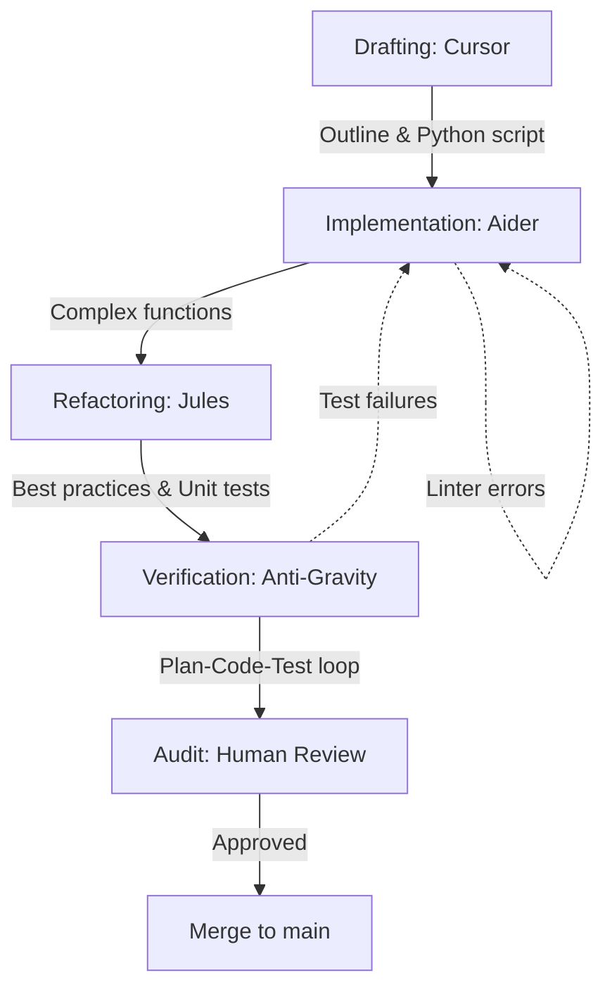

# Playbook: AI-Assisted Dev Workflow

## What it is

The AI-Assisted Dev Workflow is a structured architectural pattern for software development that leverages a hierarchy of AI coding agents. It defines how to move from initial drafting in a specialized IDE like Cursor, through targeted implementation with Aider, to asynchronous refactoring and verification using autonomous agents like Jules and Anti-Gravity.

## What problem it solves

Traditional software development is often slowed by repetitive tasks, context switching, and the overhead of manual unit testing. This playbook solves the "engineering velocity" problem by delegating low-level implementation, best-practice enforcement, and regression testing to specialized AI models. It provides a formal "Plan-Code-Test" loop that ensures high quality while minimizing human intervention.

## Where it fits in the stack

**Category**: Playbook / Development Operations. It acts as the **procedural layer** for the repository, defining how the various development tools documented in `docs/tools/development_ops/` (e.g., VS Code, Aider, Playwright) are orchestrated into a single, high-efficiency workflow.

## Typical use cases

- **Bootstrapping New Scripts**: Rapidly generating Python automation scripts for homelab infrastructure.
- **Legacy Code Refactoring**: Using [Jules](../tools/ai_knowledge/jules.md) to modernize old scripts with current best practices and better test coverage.
- **Large-Scale Maintenance**: Automating documentation audits and repository-wide consistency checks.
- **Continuous Verification**: Running autonomous test loops to ensure infrastructure changes don't break complex Home Assistant or K3s configurations.

## Strengths

- **High Velocity**: Significantly reduces the time from "idea" to "tested code."
- **Layered Defense**: Uses different agents for different tasks (drafting vs. implementation vs. refactoring) to minimize errors.
- **Local-First Ready**: Fully compatible with local models like `Qwen3-Coder` for private, zero-cost development.
- **Reviewable Autonomy**: Includes a "PR-readiness gate" to ensure AI-generated work remains human-understandable.

## Limitations

- **Context Dependency**: Performance is limited by the LLM's context window and the quality of the repository map.
- **Hallucination Risk**: Agents may generate non-existent API calls or invalid logic if not properly grounded in current documentation.
- **Setup Complexity**: Requires initial configuration of multiple tools (Cursor, Aider, Ollama) to work effectively.

## When to use it

- When you are building new features in a complex codebase where manual drafting is slow.
- When you need to increase test coverage across a large set of legacy scripts.
- When you want to leverage local LLMs to avoid token costs for repetitive coding tasks.

## When not to use it

- For trivial "one-liner" changes where the overhead of starting an agent exceeds the manual effort.
- On highly sensitive or proprietary codebases where AI context sharing is strictly prohibited (unless using a fully local setup).

## Getting started

To adopt the AI-Assisted Dev Workflow:

1. **Setup the Environment**: Install [Cursor](../tools/development_ops/cursor.md) and [Aider](../tools/development_ops/aider.md).
2. **Draft the Outline**: Use Cursor to define the high-level architecture and data contracts.
3. **Run the Implementation**: Start an Aider session: `aider --model <your-model> <file-to-edit>`.
4. **Trigger the Audit**: Once the implementation is complete, run the verification scripts listed in the "Verification Checklist" below.
5. **Review the Gate**: Complete the "PR-readiness gate" before merging your changes.

## Objective
Accelerate homelab infrastructure development using a hierarchy of AI coding agents.

## Pre-requisites
- [VS Code](../tools/development_ops/vscode.md) or [Cursor](../tools/development_ops/cursor.md)
- [Aider](../tools/development_ops/aider.md)
- [Ollama](../services/ollama.md)
- [Jules (Google)](../tools/ai_knowledge/jules.md)

## Workflow Architecture



## Step-by-Step Flow
1.  **Drafting**: Use Cursor to outline a new automation script in Python.
2.  **Implementation**: Use Aider to perform targeted code generation for complex functions.
3.  **Refactoring**: Assign [Jules](../tools/ai_knowledge/jules.md) to refactor the repository asynchronously, focusing on best practices and unit test coverage.
4.  **Verification**: [Anti-Gravity](../tools/development_ops/anti_gravity.md) runs a plan-code-test loop to ensure the new script doesn't break existing Home Assistant configurations.
5.  **Audit**: Review AI-generated commits before merging into the `main` branch.

## Data Contract
- **Input**: Natural language prompt + Codebase context.
- **Output**: Git diff + Commit message.

## PR-readiness gate

Before opening a pull request, require the agent or operator to record:

1. **Scope**: the exact issue number, target files, and any files intentionally left unchanged.
2. **Discovery**: the search commands or repository references used to choose the edited files.
3. **Validation**: lint, tests, docs checks, or manual verification that match the files changed.
4. **Risk**: known limitations, missing dependencies, or areas that still need human review.
5. **Rollback path**: the branch name and whether the change is isolated enough to revert cleanly.

This keeps autonomous work reviewable even when the implementation is correct. A passing test suite is not enough if the PR does not explain why those files were touched.

## Failure Modes & Recovery
- **Hallucination**: AI generates non-existent API calls.
    - *Detection*: Linter or compiler errors.
    - *Recovery*: Feed error logs back to Aider for automated fixing.
- **Context Limit**: Large repositories exceed LLM context window.
    - *Recovery*: Use Aider's repository map feature.

## Local-First Setup
A fully local-first development workflow ensures complete privacy and zero per-token costs.

- **Reasoning**: Use `Qwen3-Coder-Next` via [Ollama](../services/ollama.md). This model is highly optimized for coding tasks and can be run on consumer hardware with 16GB+ VRAM.
- **Agent**: [Aider](../tools/development_ops/aider.md) configured to use the local Ollama endpoint.
- **Context Management**: Leverage Aider's **repository map** to provide the LLM with a concise overview of your codebase, ensuring high relevance while staying within local context limits.
- **Verification**: Run local unit tests and linting autonomously after each AI-generated change.

## Token-Efficiency & Value
- **Differential Context**: Only send files that are directly related to the task. Use Aider's `/add` and `/drop` commands to manage context manually if the auto-selection is too broad.
- **Commit Summaries**: Use the LLM to generate concise git commit messages, but review them to ensure they provide technical value without fluff.
- **Local Routing**: Use [LiteLLM](../services/litellm.md) to route simple tasks (like docstring generation) to smaller, faster local models while reserving larger models for complex logic.
- **Search Before Reading**: Use [ripgrep](../tools/development_ops/ripgrep.md) or the repository's code search before asking a model to inspect whole directories.
- **Escalate Late**: Start with local or cheaper models for discovery, summarization, and candidate patch planning. Use stronger hosted models for final design review, complex debugging, or risky cross-module changes.

## Verification Checklist

For this repository, docs-oriented PRs should normally include:

```bash
python3 scripts/check_catalog_consistency.py
python3 scripts/check_docs_contract.py
python3 scripts/validate_new_sources.py
ruby -ryaml -e 'YAML.load_file("mkdocs.yml"); puts "mkdocs.yml OK"'
```

For code-heavy repositories, replace those with the project-native checks, such as unit tests, type checks, and formatters. The important rule is to write down the exact checks in the PR body so future agents can reproduce them.

## Variants
- **Cloud-Based**: Use GPT-4o via [LiteLLM](../services/litellm.md) for better reasoning.
- **Privacy-First**: Use local Llama-3-Coder models in Ollama.

## Related tools / concepts

- [VS Code](../tools/development_ops/vscode.md)
- [Cursor](../tools/development_ops/cursor.md)
- [Aider](../tools/development_ops/aider.md)
- [Jules](../tools/ai_knowledge/jules.md)
- [LiteLLM](../services/litellm.md)
- [Ollama](../services/ollama.md)
- [Model Routing Guide](../knowledge_base/model_routing_guide.md)
- [Agentic Workflows](../knowledge_base/patterns/agentic-workflows.md)
- [Multi-Agent KnowledgeOps](../architecture/multi_agent_knowledgeops.md)
- [Flows](../architecture/flows.md)

## Sources / References
- https://blog.cloudflare.com/vinext
- [Repository standards](../standards.md)
- [Knowledge Base Health Playbook](knowledge-base-health.md)
- [ripgrep](../tools/development_ops/ripgrep.md)

## Contribution Metadata
- Last reviewed: 2026-05-10
- Confidence: high
