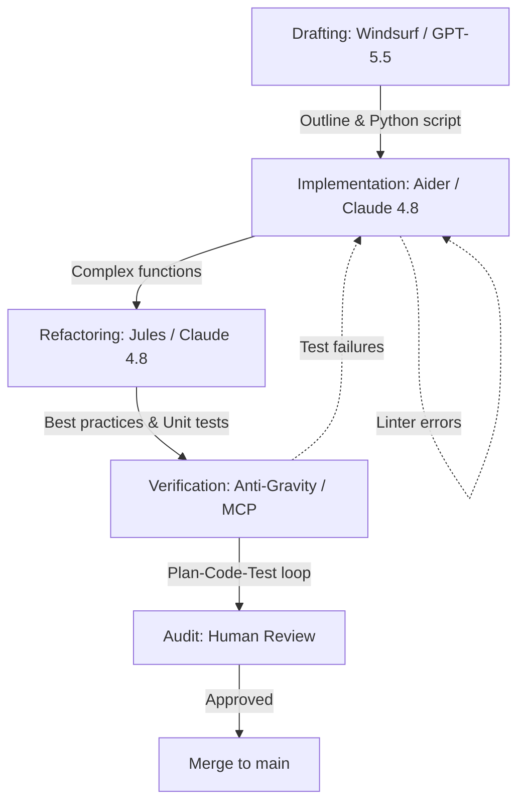

# Playbook: AI-Assisted Dev Workflow

## What it is
The AI-Assisted Dev Workflow is a structured architectural pattern for software development that leverages a hierarchy of AI coding agents. It defines how to move from initial drafting in a specialized IDE like Windsurf or Cursor, through targeted implementation with Aider, to asynchronous refactoring and verification using autonomous agents like Jules and Anti-Gravity.

## What problem it solves
Traditional software development is often slowed by repetitive tasks, context switching, and the overhead of manual unit testing. This playbook solves the "engineering velocity" problem by delegating low-level implementation, best-practice enforcement, and regression testing to specialized AI models. It provides a formal "Plan-Code-Test" loop that ensures high quality while minimizing human intervention.

## Where it fits in the stack
**Category**: Playbook / Development Operations. It acts as the **procedural layer** for the repository, defining how the various development tools documented in `docs/tools/development_ops/` (e.g., Windsurf, Aider, Playwright) are orchestrated into a single, high-efficiency workflow.

## Typical use cases
- **Bootstrapping New Scripts**: Rapidly generating Python automation scripts for homelab infrastructure using GPT-5.5.
- **Legacy Code Refactoring**: Using [Jules](../tools/ai_knowledge/jules.md) (powered by Claude 4.8) to modernize old scripts with current best practices and better test coverage.
- **Large-Scale Maintenance**: Automating documentation audits and repository-wide consistency checks.
- **Continuous Verification**: Running autonomous test loops to ensure infrastructure changes don't break complex Home Assistant or K3s configurations.

## Strengths
- **High Velocity**: Significantly reduces the time from "idea" to "tested code."
- **Layered Defense**: Uses different agents for different tasks (drafting vs. implementation vs. refactoring) to minimize errors.
- **Local-First Ready**: Fully compatible with local models like `Llama 4 Maverick` for private, zero-cost development.
- **Reviewable Autonomy**: Includes a "PR-readiness gate" to ensure AI-generated work remains human-understandable.
- **Protocol Native**: Natively supports the Model Context Protocol (MCP 3.0) for tool discovery and execution.

## Limitations
- **Context Dependency**: Performance is limited by the LLM's context window and the quality of the repository map.
- **Hallucination Risk**: Agents may generate non-existent API calls or invalid logic if not properly grounded in current documentation.
- **Setup Complexity**: Requires initial configuration of multiple tools (Windsurf, Aider, Ollama) to work effectively.

## When to use it
- When you are building new features in a complex codebase where manual drafting is slow.
- When you need to increase test coverage across a large set of legacy scripts.
- When you want to leverage local LLMs to avoid token costs for repetitive coding tasks.

## When not to use it
- For trivial "one-liner" changes where the overhead of starting an agent exceeds the manual effort.
- On highly sensitive or proprietary codebases where AI context sharing is strictly prohibited (unless using a fully local setup).

## Getting started
To adopt the AI-Assisted Dev Workflow:
1. **Setup the Environment**: Install [Windsurf](../tools/development_ops/windsurf.md) (with Cascade) or [Cursor](../tools/development_ops/cursor.md).
2. **Draft the Outline**: Use Cascade to define the high-level architecture and data contracts (GPT-5.5 is excellent for this).
3. **Run the Implementation**: Start an Aider session: `aider --model claude-4.8 <file-to-edit>`.
4. **Trigger the Audit**: Once the implementation is complete, run the verification scripts listed in the [Verification Checklist](#verification-checklist) below.
5. **Review the Gate**: Complete the "PR-readiness gate" before merging your changes.

## CLI examples
Common commands used in the AI-assisted workflow.

```bash
# Start an Aider session for a specific feature
aider --model anthropic/claude-3-5-sonnet-20241022  # Update to 4.8 when available

# Run Jules for an asynchronous refactoring task
python3 scripts/jules_refactor.py --path docs/tools/ --goal "Update to June 2026 standards"

# Verify changes with the repository-native tools
python3 scripts/check_docs_contract.py $(git diff --name-only main)
```

## API examples
Integration patterns for autonomous agents.

```python
# Example of an agent-driven verification loop (Anti-Gravity pattern)
import subprocess

def run_test_loop(file_path):
    # Step 1: Run linter
    lint_res = subprocess.run(["pylint", file_path], capture_output=True)
    if lint_res.returncode != 0:
        return {"status": "fail", "error": lint_res.stdout.decode()}

    # Step 2: Run unit tests
    test_res = subprocess.run(["pytest", "tests/test_logic.py"], capture_output=True)
    return {"status": "pass" if test_res.returncode == 0 else "fail"}

# MCP 3.0 Tool call for repository indexing
async def index_repo(context):
    await context.call_tool("repo_indexer", {"path": "./", "depth": 3})
```

## Related tools / concepts
- [Windsurf](../tools/development_ops/windsurf.md)
- [Cursor](../tools/development_ops/cursor.md)
- [Aider](../tools/development_ops/aider.md)
- [Jules](../tools/ai_knowledge/jules.md)
- [LiteLLM](../services/litellm.md)
- [Ollama](../services/ollama.md)
- [Model Routing Guide](../knowledge_base/model_routing_guide.md)
- [Agentic Workflows](../knowledge_base/patterns/agentic-workflows.md)
- [Multi-Agent KnowledgeOps](../architecture/multi_agent_knowledgeops.md)
- [ripgrep](../tools/development_ops/ripgrep.md)

### Workflow Architecture (June 2026)



### PR-readiness gate

Before opening a pull request, require the agent or operator to record:
1. **Scope**: the exact issue number, target files, and any files intentionally left unchanged.
2. **Discovery**: the search commands or repository references used to choose the edited files.
3. **Validation**: lint, tests, docs checks, or manual verification that match the files changed.
4. **Risk**: known limitations, missing dependencies, or areas that still need human review.
5. **Rollback path**: the branch name and whether the change is isolated enough to revert cleanly.

### Failure Modes & Recovery
- **Hallucination**: AI generates non-existent API calls.
    - *Detection*: Linter or compiler errors.
    - *Recovery*: Feed error logs back to Aider for automated fixing.
- **Context Limit**: Large repositories exceed LLM context window.
    - *Recovery*: Use Aider's repository map feature and Claude 4.8's 500k+ context window where available.

### Local-First Setup
A fully local-first development workflow ensures complete privacy and zero per-token costs.
- **Reasoning**: Use `Llama 4 Maverick` via [Ollama](../services/ollama.md).
- **Agent**: [Aider](../tools/development_ops/aider.md) configured to use the local Ollama endpoint.
- **Context Management**: Leverage Aider's **repository map** for concise overview.

### Token-Efficiency & Value
- **Differential Context**: Only send files directly related to the task.
- **Commit Summaries**: Use the LLM to generate concise git commit messages.
- **Local Routing**: Use [LiteLLM](../services/litellm.md) to route simple tasks to smaller, faster local models.

### Verification Checklist

For this repository, docs-oriented PRs should normally include:

```bash
python3 scripts/check_catalog_consistency.py
python3 scripts/check_docs_contract.py
python3 scripts/validate_new_sources.py
ruby -ryaml -e 'YAML.load_file("mkdocs.yml"); puts "mkdocs.yml OK"'
```

## Sources / References
- [Windsurf: The First Agentic IDE](https://codeium.com/windsurf)
- [Aider: AI pair programming in your terminal](https://aider.chat/)
- [Model Context Protocol Specification](https://modelcontextprotocol.io/)
- [Repository standards](../standards.md)

## Contribution Metadata
- Last reviewed: 2026-06-25
- Confidence: high
