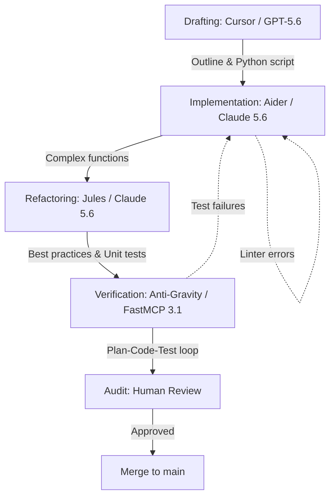

# Playbook: AI-Assisted Dev Workflow

## What it is

The AI-Assisted Dev Workflow is a structured architectural pattern for software development that leverages a hierarchy of AI coding agents. It defines how to move from initial drafting in a specialized IDE like Cursor or Melty, through targeted implementation with Aider, to asynchronous refactoring and verification using autonomous agents like Jules, Anti-Gravity, and FastMCP 3.1 tooling ecosystems in early January 2027 SOTA standards.

## What problem it solves

Traditional software development is often slowed by repetitive tasks, context switching, and the overhead of manual unit testing. This playbook solves the "engineering velocity" problem by delegating low-level implementation, best-practice enforcement, and regression testing to specialized AI models. It provides a formal "Plan-Code-Test" loop that ensures high quality while minimizing human intervention, keeping code robust against breaking API drifts.

## Where it fits in the stack

**Category**: Playbook / Development Operations. It acts as the **procedural layer** for the repository, defining how the various development tools documented in `docs/tools/development_ops/` (e.g., VS Code, Aider, Playwright) are orchestrated into a single, high-efficiency workflow.

## Typical use cases

- **Bootstrapping New Scripts**: Rapidly generating Python automation scripts for homelab infrastructure using GPT-5.6 or Gemini 4.0 Ultra.
- **Legacy Code Refactoring**: Using [Jules](../tools/ai_knowledge/jules.md) (powered by Claude 5.6 or DeepSeek-V4) to modernize old scripts with current best practices and better test coverage.
- **Large-Scale Maintenance**: Automating documentation audits and repository-wide consistency checks.
- **Continuous Verification**: Running autonomous test loops to ensure infrastructure changes don't break complex Home Assistant or K3s configurations.

## Strengths

- **High Velocity**: Significantly reduces the time from "idea" to "tested code."
- **Layered Defense**: Uses different agents for different tasks (drafting vs. implementation vs. refactoring) to minimize errors.
- **Local-First Ready**: Fully compatible with local models like `Llama 4`, `Gemma 4`, or `Qwen 3.6 VL` for private, zero-cost development.
- **Reviewable Autonomy**: Includes a "PR-readiness gate" to ensure AI-generated work remains human-understandable.
- **Protocol Native**: Natively supports the Model Context Protocol (FastMCP 3.1) for tool discovery, context injection, and sandbox execution.

## Limitations

- **Context Dependency**: Performance is limited by the LLM's context window and the quality of the repository map.
- **Hallucination Risk**: Agents may generate non-existent API calls or invalid logic if not properly grounded in current documentation.
- **Setup Complexity**: Requires initial configuration of multiple tools (Cursor, Aider, Ollama) to work effectively.

## When to use it

- When you are building new features in a complex codebase where manual drafting is slow.
- When you need to increase test coverage across a large set of legacy scripts.
- When you want to leverage local LLMs to avoid token costs for repetitive coding tasks.

## When not to use it

- For trivial "one-liner" changes where the overhead of starting an agent exceeds the manual effort.
- On highly sensitive or proprietary codebases where AI context sharing is strictly prohibited (unless using a fully local setup).

## Getting started

To adopt the AI-Assisted Dev Workflow:

1. **Setup the Environment**: Install [Cursor](../tools/development_ops/cursor.md) or [Melty](../tools/development_ops/melty.md) and [Aider](../tools/development_ops/aider.md).
2. **Draft the Outline**: Use Cursor to define the high-level architecture and data contracts (GPT-5.6 or Claude 5.6 are excellent for this).
3. **Run the Implementation**: Start an Aider session: `aider --model claude-5.6 <file-to-edit>`.
4. **Trigger the Audit**: Once the implementation is complete, run the verification scripts listed in the "Verification Checklist" below.
5. **Review the Gate**: Complete the "PR-readiness gate" before merging your changes.

### Workflow Architecture (Late 2026 / Early 2027)



## CLI examples

### Starting an Aider Session
Launching Aider with a specific model and file context.
```bash
# Start Aider with Claude 5.6 Sonnet
aider --model anthropic/claude-5-6-sonnet-20270101 docs/playbooks/dev-workflow-ai-assisted.md
```

### Running Repository Validation
Executing the standard verification suite for this repository.
```bash
# Run consistency and contract checks
python3 scripts/check_catalog_consistency.py
python3 scripts/check_docs_contract.py
```

## API examples

### Triggering an Anti-Gravity Test Loop
Example of an agentic script initiating a verification loop via an API endpoint.
```python
import requests

def trigger_verification_loop(branch_name):
    url = "http://anti-gravity.local/api/v2/verify"
    payload = {
        "branch": branch_name,
        "suites": ["unit", "lint", "docs-contract"],
        "mcp_enabled": True,
        "mcp_version": "3.1"
    }
    response = requests.post(url, json=payload)
    return response.json()

# Result includes real-time logs and pass/fail status
status = trigger_verification_loop("feature/agent-audit")
print(f"Verification status: {status['summary']}")
```

### Automated PR Gate Entry
An agent recording its discovery and validation process.
```python
import json

gate_entry = {
    "scope": "Updated dev-workflow playbook for Early January 2027 SOTA standards.",
    "discovery": "ripgrep search for 'Claude 5.1' to replace with 'Claude 5.6'.",
    "validation": "Passed check_docs_contract.py locally.",
    "risk": "Low. Documentation update only.",
    "rollback_path": "git checkout main"
}

with open("docs/reports/pr-gate-feature-audit.json", "w") as f:
    json.dump(gate_entry, f, indent=2)
```

## Related tools / concepts

- [VS Code](../tools/development_ops/vscode.md)
- [Cursor](../tools/development_ops/cursor.md)
- [Aider](../tools/development_ops/aider.md)
- [Jules](../tools/ai_knowledge/jules.md)
- [LiteLLM](../services/litellm.md)
- [Ollama](../services/ollama.md)
- [Model Routing Guide](../knowledge_base/model_routing_guide.md)
- [Agentic Workflows](../knowledge_base/patterns/agentic-workflows.md)
- [Multi-Agent KnowledgeOps](../architecture/multi_agent_knowledgeops.md)
- [Flows](../architecture/flows.md)
- [Anti-Gravity](../tools/development_ops/anti_gravity.md)

## Sources / References
- [Aider Official Documentation](https://aider.chat/docs/)
- [Model Context Protocol Specification v3.1](https://modelcontextprotocol.org/spec)
- [Repository standards](../standards.md)
- [Knowledge Base Health Playbook](knowledge-base-health.md)
- [ripgrep](../tools/development_ops/ripgrep.md)

## Contribution Metadata
- Last reviewed: 2027-01-07
- Confidence: high
