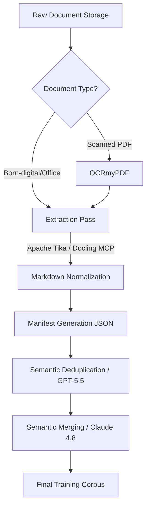

# Playbook: Document Preparation for LLM Training

## What it is
This playbook defines a repeatable architectural process for preparing heterogeneous business documents (`docx`, `pdf`, `pptx`, spreadsheets) for use in LLM fine-tuning or retrieval-augmented generation (RAG) pipelines. It focuses on normalization, metadata preservation, and selective consolidation to create a safe and consistent training corpus.

## What problem it solves
Raw business documents are often fragmented, inconsistent, and unstructured, making them difficult for LLMs to process effectively. This playbook solves the "garbage in, garbage out" problem by providing a systematic workflow for OCR, text extraction, and deduplication. It ensures that document boundaries and provenance are preserved, preventing loss of context during ingestion.

## Where it fits in the stack
**Category**: Playbook / Process. It sits in the **data engineering layer**, acting as the bridge between raw document storage (e.g., [Paperless-ngx](../services/paperless-ngx.md), [Nextcloud](../services/nextcloud.md)) and the vector stores or training harnesses used by AI agents.

## Typical use cases
- **Corpus Construction**: Building a supervised fine-tuning dataset from existing office files.
- **RAG Pre-processing**: Normalizing a fragmented knowledge base into Markdown for high-fidelity retrieval.
- **Data Auditing**: Cleaning and deduplicating an archive of board packs and policy manuals.
- **Synthetic Data Generation**: Using GPT-5.5 to generate high-quality training pairs from normalized document text.
- **High-Fidelity Extraction**: Using Claude 4.8 for section-aware parsing of complex layout PDFs.

## Strengths
- **High Fidelity**: Prioritizes structured extraction (e.g., [Docling](../tools/process_understanding/docling-mcp.md)) over simple copy-pasting.
- **Metadata-Rich**: Includes a mandatory JSON manifest for every document to preserve provenance.
- **Mac-Friendly**: Optimized for local execution using standard macOS and Docker tools.
- **Scalable**: Provides clear rules for when to merge or split documents based on topical coherence.
- **MCP Enabled**: Integrated with Docling MCP 3.0 for seamless tool-based extraction within agentic workflows.

## Limitations
- **OCR Dependency**: Highly dependent on the quality of the OCR engine ([OCRmyPDF](../tools/process_understanding/ocrmypdf.md)) for scanned sources.
- **Manual Spot Checks**: Still requires human review for 5-10% of outputs to ensure extraction quality.
- **Intellectual Property**: Requires rigorous upfront verification of document rights and redaction needs.

## When to use it
- When building a custom knowledge base for an internal AI assistant.
- When preparing a dataset for an LLM evaluation benchmark.
- When migrating document workflows from SaaS to local-first infrastructure.

## When not to use it
- For ad hoc, single-file Q&A (use direct retrieval tools instead).
- If you do not have legal rights to the documents for model training.
- For documents that are purely image-based with no viable OCR path.

## Getting started
To begin document preparation:
1. **Setup Staging**: Create the recommended directory structure (`raw`, `normalized`, `manifests`, `merged`).
2. **Run OCR**: Use [OCRmyPDF](../tools/process_understanding/ocrmypdf.md) on any scanned PDFs.
3. **Extract and Normalize**: Use [Apache Tika](../services/tika.md) or [Docling MCP](../tools/process_understanding/docling-mcp.md) to convert files to Markdown.
4. **Generate Manifests**: Create a JSON sidecar for every file capturing source provenance and checksums.
5. **Deduplicate**: Use GPT-5.5 to identify and remove repeated template noise (headers, footers) before merging related documents.

### Workflow Diagram



### Core Rules
1. Verify rights, retention policy, and redaction requirements before extracting text.
2. Preserve source provenance for every output artifact.
3. Normalize to machine-readable text plus metadata, not to screenshots or page images alone.
4. Merge only semantically related small documents; do not create large mixed-topic bundles.
5. Keep the original files alongside the normalized export so you can reprocess later.

### Recommended Target Structure
```text
dataset/
  raw/
    2026-03-16-board-pack-original.pptx
  normalized/
    2026-03-16-board-pack.md
  manifests/
    2026-03-16-board-pack.json
  merged/
    hr-onboarding-handbook.md
```

### Format-specific Preparation
- **DOCX/Google Docs**: Flatten headers/footers, preserve heading hierarchy.
- **PDF**: Distinguish born-digital from scanned; use structured extraction for tables.
- **PPTX**: Export speaker notes; convert slides to structured text blocks.
- **XLSX**: Treat as structured data; export to CSV with schema notes.

## CLI examples
Common commands for document preparation.

```bash
# OCR a scanned PDF into a searchable PDF
docker run --rm -v "$PWD:/home/docker" jbarlow83/ocrmypdf input.pdf output.pdf

# Extract plain text from a document with Tika Server
curl -T output.pdf http://localhost:9998/tika

# Run Docling extraction via MCP CLI (June 2026)
mcp call docling-server convert_document --params '{"path": "raw/policy.pdf", "format": "markdown"}'
```

## API examples
Metadata manifest structure and ingestion script.

```json
{
  "source_path": "raw/2026-03-16-board-pack.pptx",
  "source_type": "pptx",
  "document_title": "Q1 2026 Strategy Review",
  "authors_or_owner": "Strategy Team",
  "created_at": "2026-03-16T10:00:00Z",
  "exported_at": "2026-06-25T09:00:00Z",
  "language": "en",
  "sensitivity": "confidential",
  "ocr_used": false,
  "checksum": "sha256:e3b0c442..."
}
```

```python
# Python snippet for bulk normalization
import glob
import requests

def normalize_all():
    for doc in glob.glob("raw/*.pdf"):
        with open(doc, 'rb') as f:
            resp = requests.put("http://localhost:9998/tika", data=f)
            with open(f"normalized/{doc.split('/')[-1]}.md", 'w') as out:
                out.write(resp.text)
```

## Related tools / concepts
- [OCRmyPDF](../tools/process_understanding/ocrmypdf.md)
- [Docling MCP](../tools/process_understanding/docling-mcp.md)
- [PageIndex](../tools/process_understanding/pageindex.md)
- [Paperless-ngx](../services/paperless-ngx.md)
- [Apache Tika](../services/tika.md)
- [Google Workspace CLI](../tools/automation_orchestration/google-workspace-cli.md)
- [RAG Pattern](../knowledge_base/patterns/rag.md)
- [Anytype](../tools/intake_storage/anytype.md)
- [Silverbullet](../tools/intake_storage/silverbullet.md)
- [Knowledge Base Health](knowledge-base-health.md)

### Consolidation Strategy
Merge documents when they belong to the same process, policy, customer case, or project. Aim for packets around 1,000 to 5,000 words.

### Quality Checklist
- OCR confidence is acceptable.
- Boilerplate duplication removed.
- Sensitive content redacted.
- Document boundaries recoverable.

## Sources / References
- [OCRmyPDF documentation](https://ocrmypdf.readthedocs.io/)
- [Apache Tika Server](https://cwiki.apache.org/confluence/display/TIKA/TikaServer)
- [Google Drive export MIME types](https://developers.google.com/workspace/drive/api/guides/ref-export-formats)
- [Docling MCP repository](https://github.com/docling-project/docling-mcp)

## Contribution Metadata
- Last reviewed: 2026-06-25
- Confidence: high
