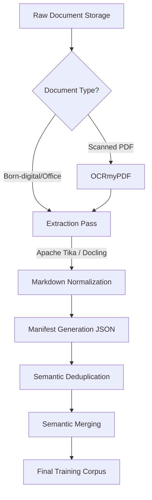

# Playbook: Document Preparation for LLM Training

## What it is

This playbook defines a repeatable architectural process for preparing heterogeneous business documents (`docx`, `pdf`, `pptx`, spreadsheets) for use in LLM fine-tuning or retrieval-augmented generation (RAG) pipelines. It focuses on normalization, metadata preservation, and selective consolidation to create a safe and consistent training corpus.

## What problem it solves

Raw business documents are often fragmented, inconsistent, and unstructured, making them difficult for LLMs to process effectively. This playbook solves the "garbage in, garbage out" problem by providing a systematic workflow for OCR, text extraction, and deduplication. It ensures that document boundaries and provenance are preserved, preventing loss of context during ingestion.

## Where it fits in the stack

**Category**: Playbook / Process. It sits in the **data engineering layer**, acting as the bridge between raw document storage (e.g., [Paperless-ngx](../services/paperless-ngx.md), [Nextcloud](../services/nextcloud.md)) and the vector stores or training harnesses used by AI agents.

## Typical use cases

- **Corpus Construction**: Building a supervised fine-tuning dataset from existing office files.
- **RAG Pre-processing**: Normalizing a fragmented knowledge base into Markdown for high-fidelity retrieval.
- **Data Auditing**: Cleaning and deduplicating an archive of board packs and policy manuals.
- **Migration**: Exporting legacy Google Drive content into machine-readable formats for local AI use.

## Strengths

- **High Fidelity**: Prioritizes structured extraction (e.g., [Docling](../tools/process_understanding/docling-mcp.md)) over simple copy-pasting.
- **Metadata-Rich**: Includes a mandatory JSON manifest for every document to preserve provenance.
- **Mac-Friendly**: Optimized for local execution using standard macOS and Docker tools.
- **Scalable**: Provides clear rules for when to merge or split documents based on topical coherence.

## Limitations

- **OCR Dependency**: Highly dependent on the quality of the OCR engine ([OCRmyPDF](../tools/process_understanding/ocrmypdf.md)) for scanned sources.
- **Manual Spot Checks**: Still requires human review for 5-10% of outputs to ensure extraction quality.
- **Intellectual Property**: Requires rigorous upfront verification of document rights and redaction needs.

## When to use it

- When building a custom knowledge base for an internal AI assistant.
- When preparing a dataset for an LLM evaluation benchmark.
- When migrating document workflows from SaaS to local-first infrastructure.

## When not to use it

- For ad hoc, single-file Q&A (use direct retrieval tools instead).
- If you do not have legal rights to the documents for model training.
- For documents that are purely image-based with no viable OCR path.

## Getting started

To begin document preparation:



1. **Setup Staging**: Create the recommended directory structure (`raw`, `normalized`, `manifests`, `merged`).
2. **Run OCR**: Use [OCRmyPDF](../tools/process_understanding/ocrmypdf.md) on any scanned PDFs.
3. **Extract and Normalize**: Use [Apache Tika](../services/tika.md) or [Docling](../tools/process_understanding/docling-mcp.md) to convert files to Markdown.
4. **Generate Manifests**: Create a JSON sidecar for every file capturing source provenance and checksums.
5. **Deduplicate**: Remove repeated template noise (headers, footers) before merging related documents.

## Objective
Prepare heterogeneous business documents so they are safe, consistent, and useful for LLM training or downstream retrieval workflows. This playbook covers `docx`, `pdf`, `pptx`, spreadsheets, and Google Workspace equivalents, with a focus on normalization, metadata preservation, and selective document consolidation.

## Core rules
1. Verify rights, retention policy, and redaction requirements before extracting text.
2. Preserve source provenance for every output artifact.
3. Normalize to machine-readable text plus metadata, not to screenshots or page images alone.
4. Merge only semantically related small documents; do not create large mixed-topic bundles.
5. Keep the original files alongside the normalized export so you can reprocess later.

## Recommended target structure

```text
dataset/
  raw/
    2026-03-16-board-pack-original.pptx
    2026-03-16-policy-manual-original.docx
  normalized/
    2026-03-16-board-pack.md
    2026-03-16-policy-manual.md
  manifests/
    2026-03-16-board-pack.json
    2026-03-16-policy-manual.json
  merged/
    hr-onboarding-handbook.md
    hr-onboarding-handbook.json
```

Each manifest should capture:

- `source_path`
- `source_type`
- `document_title`
- `authors_or_owner`
- `created_at`
- `exported_at`
- `language`
- `sensitivity`
- `ocr_used`
- `merge_group`
- `checksum`

## Format-specific preparation

### DOCX and Google Docs
- Export Google Docs to `docx` or Markdown-compatible text before ingestion.
- Accept tracked changes and resolve comments before export, unless edit history is itself part of the dataset.
- Flatten headers, footers, repeated boilerplate, and embedded navigation that would otherwise duplicate on every page.
- Preserve heading hierarchy because it is useful for chunking and section-aware prompts.

### PDF
- Distinguish born-digital PDFs from scanned PDFs first.
- Run OCR on scanned or image-heavy PDFs so the resulting file has a searchable text layer.
- If the PDF contains tables or forms, use a structured extraction pass rather than plain copy-paste.
- Retain page numbers in metadata even if you remove them from the training text.

### PPTX and Google Slides
- Export speaker notes as part of the corpus when they carry the actual narrative.
- Convert each slide into a structured text block with:
  - slide title
  - visible bullet text
  - chart/table summary
  - speaker notes
- Remove duplicated legal footers, company taglines, and template artifacts repeated on every slide.
- Keep slide order stable; slide sequencing often carries the meaning.

### XLSX and Google Sheets
- Treat spreadsheets as structured data, not as free-form prose.
- Export each relevant sheet/tab separately to `csv` or `xlsx` plus a schema note describing column meaning.
- Exclude formula noise when the computed values are what matter.
- If a sheet is mostly operational metrics, consider keeping it for evals or retrieval rather than fine-tuning.

## macOS-friendly workflow
1. Create a staging directory with `raw`, `normalized`, `manifests`, and `merged`.
2. Export Google Docs, Sheets, and Slides into Office-compatible formats from Drive first.
3. Run OCR on scanned PDFs with [OCRmyPDF](../tools/process_understanding/ocrmypdf.md).
4. Extract text and metadata with [Apache Tika](../services/tika.md) for broad format coverage.
5. For layout-sensitive PDFs, use a higher-fidelity parser such as [Docling MCP](../tools/process_understanding/docling-mcp.md) or [PageIndex](../tools/process_understanding/pageindex.md).
6. Normalize every document into Markdown or plain text with a sidecar JSON manifest.
7. Deduplicate repeated templates, signatures, disclaimers, and navigation chrome.
8. Merge only related short documents into coherent packets.
9. Run a manual spot check on at least 5 to 10 percent of outputs before bulk ingestion.

## Consolidation strategy for many small documents
Merging can help when the source corpus is fragmented into tiny files that individually carry too little context. It only helps if the merged unit stays topically coherent.

Merge documents when:
- They belong to the same process, policy, customer case, or project.
- Each file is too short to stand on its own.
- Cross-document references are frequent and meaningful.

Do not merge documents when:
- They come from different domains or confidentiality classes.
- They represent separate labels or outcomes in a supervised dataset.
- The merge would create long, noisy files dominated by repeated boilerplate.

Practical merge rules:
- Group by topic, owner, and time window.
- Aim for merged packets around 1,000 to 5,000 words or a small related set of slides/pages.
- Insert explicit separators such as `# Document 3: Vendor Security Addendum`.
- Keep source-level metadata for each embedded document inside the merged manifest.

## Quality checklist before ingestion
- Text is machine-readable and not dependent on screenshots.
- OCR confidence is acceptable for scanned sources.
- Boilerplate duplication has been removed or minimized.
- Sensitive content has been redacted or excluded.
- Document boundaries and provenance are still recoverable after merging.
- Tables, slide notes, and appendices are either preserved or intentionally excluded.
- Random samples have been reviewed by a human.

## Suggested command examples

```bash
# OCR a scanned PDF into a searchable PDF
docker run --rm -v "$PWD:/home/docker" jbarlow83/ocrmypdf input.pdf output.pdf

# Extract plain text from a document with Tika
curl -T output.pdf http://localhost:9998/tika

# Extract metadata from a DOCX with Tika
curl -H "Accept: application/json" -T handbook.docx http://localhost:9998/meta
```

## Related tools / concepts

- [OCRmyPDF](../tools/process_understanding/ocrmypdf.md)
- [Docling MCP](../tools/process_understanding/docling-mcp.md)
- [PageIndex](../tools/process_understanding/pageindex.md)
- [Paperless-ngx](../services/paperless-ngx.md)
- [Apache Tika](../services/tika.md)
- [Google Workspace CLI](../tools/automation_orchestration/google-workspace-cli.md)
- [RAG Pattern](../knowledge_base/patterns/rag.md)
- [Anytype](../tools/intake_storage/anytype.md)
- [Silverbullet](../tools/intake_storage/silverbullet.md)
- [Knowledge Base Health](knowledge-base-health.md)

## Sources / References
- [OCRmyPDF documentation](https://ocrmypdf.readthedocs.io/)
- [Apache Tika Server](https://cwiki.apache.org/confluence/display/TIKA/TikaServer)
- [Google Drive export MIME types](https://developers.google.com/workspace/drive/api/guides/ref-export-formats)
- [Docling MCP repository](https://github.com/docling-project/docling-mcp)

## Contribution Metadata
- Last reviewed: 2026-05-10
- Confidence: high
