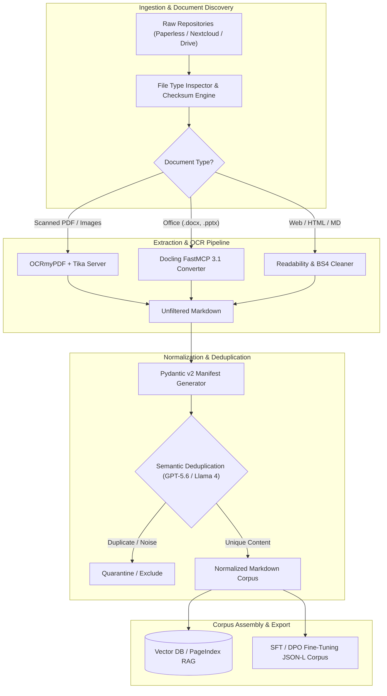

# Playbook: Document Preparation for LLM Training

A comprehensive data engineering playbook for ingesting, OCR-ing, normalizing, deduplicating, and formatting heterogeneous corporate documents (`pdf`, `docx`, `pptx`, `xlsx`, `html`) into high-quality training and RAG datasets under early January 2027 standards.

## What it is
The Document Preparation for LLM Training Playbook establishes an end-to-end data pipeline architecture for converting raw, unstructured, or multi-format enterprise document repositories into clean, standardized Markdown and JSON-L corpora. As of **early January 2027**, this playbook is tailored for preparing fine-tuning datasets, synthetic evaluation sets, and Retrieval-Augmented Generation (RAG) knowledge stores for frontier models (**Claude 5.6**, **GPT-5.6**, **Gemini 4.0 Ultra**, **Llama 4**, **DeepSeek-V4**) using **FastMCP 3.1** tooling standards.


```mermaid
flowchart TD
    subgraph RawIngestion["Ingestion & Document Discovery"]
        Storage["Raw Repositories (Paperless / Nextcloud / Drive)"] --> Scanner[File Type Inspector & Checksum Engine]
        Scanner --> Classify{"Document Type?"}
    end

    subgraph ExtractionPipeline["Extraction & OCR Pipeline"]
        Classify -- Scanned PDF / Images --> OCRPass["OCRmyPDF + Tika Server"]
        Classify -- Office (.docx, .pptx) --> DoclingPass["Docling FastMCP 3.1 Converter"]
        Classify -- Web / HTML / MD --> HTMLParser["Readability & BS4 Cleaner"]

        OCRPass --> RawMD[Unfiltered Markdown]
        DoclingPass --> RawMD
        HTMLParser --> RawMD
    end

    subgraph Normalization_Deduplication["Normalization & Deduplication"]
        RawMD --> MetadataGen["Pydantic v2 Manifest Generator"]
        MetadataGen --> DedupEngine{"Semantic Deduplication (GPT-5.6 / Llama 4)"}
        DedupEngine -- Duplicate / Noise --> Quarantine[Quarantine / Exclude]
        DedupEngine -- Unique Content --> StructuredMD[Normalized Markdown Corpus]
    end

    subgraph DatasetFormatting["Corpus Assembly & Export"]
        StructuredMD --> RAGStore[(Vector DB / PageIndex RAG)]
        StructuredMD --> JSONL[SFT / DPO Fine-Tuning JSON-L Corpus]
    end
```

## What problem it solves
Raw business document archives suffer from severe noise, inconsistent formatting, header/footer repetition, scanned OCR defects, and missing provenance metadata. Attempting to fine-tune an LLM or populate a RAG vector database directly with raw document extractions results in the "garbage in, garbage out" failure mode:

1. **Hallucination and Loss of Context**: Irrelevant headers, repeating page numbers, and broken table structures confuse attention mechanisms during fine-tuning.
2. **Duplication Pollution**: Multiple revisions of identical contracts or policy documents pollute vector embeddings and skew model probability weights.
3. **Missing Metadata Provenance**: Unstructured text blocks lacking sidecar manifests prevent fine-grained retrieval filtering by access permission, date, or author.

This playbook solves these problems by providing a standardized multi-stage pipeline that cleans, normalizes, deduplicates, and annotates document corpora before model ingestion.

## Where it fits in the stack
This playbook operates in the **Data Engineering & AI Preparation Layer**:

- **Raw Ingestion Source**: [Paperless-ngx](../services/paperless-ngx.md), [Nextcloud](../services/nextcloud.md), Apache Tika Server.
- **Conversion & OCR Core**: [Docling MCP](../tools/process_understanding/docling-mcp.md), [OCRmyPDF](../tools/process_understanding/ocrmypdf.md).
- **Reasoning Engine**: Ollama (Llama 4 / Gemma 4) or API Providers (Claude 5.6, GPT-5.6).
- **Output Targets**: Vector Stores (LanceDB, Qdrant, Chroma), Fine-Tuning JSON-L, [PageIndex](../tools/process_understanding/pageindex.md).

## Typical use cases

### 1. Fine-Tuning Corpus Construction
- **Scenario**: Fine-tuning an open-weights model (**Llama 4 70B** or **DeepSeek-V4**) on internal engineering specifications and policy manuals.
- **Pipeline Action**: Extracts structured text, strips boilerplate headers, and generates instruction-response training pairs in JSON-L format.

### 2. High-Fidelity RAG Knowledge Base Assembly
- **Scenario**: Converting thousands of legal contracts and financial reports into a RAG vector database.
- **Pipeline Action**: Parses tables into GitHub Flavored Markdown (GFM) using Docling MCP, attaches Pydantic v2 metadata sidecars, and computes semantic embeddings.

### 3. Archive Deduplication and Auditing
- **Scenario**: Auditing decades of corporate meeting minutes and board packs.
- **Pipeline Action**: Generates SHA-256 checksum manifests and runs semantic similarity clustering to remove redundant drafts.

## Strengths
- **Table Structure Preservation**: Preserves complex multi-column tables as structured GFM tables rather than losing formatting.
- **FastMCP 3.1 Integration**: Connects cleanly into agentic workflows via standardized FastMCP tools.
- **Complete Provenance Tracking**: Guarantees that every chunk in the final training dataset links back to its original source document path, hash, and author.
- **Mac / Linux / Docker Native**: Runs efficiently on Apple Silicon (M2/M3/M4 Max) workstations or Dockerized homelab clusters.

## Limitations
- **OCR Quality Dependency**: Low-resolution scans (<200 DPI) or degraded physical documents require manual visual inspection.
- **Compute Intensity**: Performing semantic deduplication across hundreds of thousands of document pages requires significant local GPU or API token budgets.

## When to use it
- When building a enterprise-grade RAG knowledge base or preparing a custom fine-tuning dataset.
- When migrating document archives from legacy file servers to local AI knowledge engines.
- When creating benchmark evaluation sets for testing internal LLM accuracy.

## When not to use it
- For single ad-hoc file queries where immediate direct retrieval is sufficient.
- For files lacking legal copyright or authorization for machine learning processing.

## Getting started

### Recommended Directory Structure
Set up a clean workspace hierarchy on host storage:

```text
doc-prep-workspace/
├── 01_raw/             # Original docx, pdf, pptx files
├── 02_ocr/             # OCRmyPDF processed output
├── 03_normalized/      # Markdown extractions
├── 04_manifests/       # Pydantic v2 JSON sidecar manifests
└── 05_final_corpus/    # Deduplicated, verified JSON-L / RAG export
```

### Execution Steps
1. **Inbound Ingestion**: Copy raw documents into `01_raw/`.
2. **OCR Pass**: Execute `ocrmypdf` on any non-searchable PDF files.
3. **Structured Conversion**: Run Docling MCP or Apache Tika to output clean Markdown into `03_normalized/`.
4. **Manifest Creation**: Run the Python manifest tool to generate sidecar metadata files in `04_manifests/`.
5. **Deduplication Pass**: Execute semantic deduplication scripts before copying verified records to `05_final_corpus/`.

## CLI examples

### Batch OCR Processing with OCRmyPDF
```bash
# Process all raw PDFs in directory with deskew and OCR
for pdf_file in 01_raw/*.pdf; do
  output_file="02_ocr/$(basename "${pdf_file%.pdf}")_ocr.pdf"
  docker run --rm -v "$PWD:/home/docker" jbarlow83/ocrmypdf \
    --deskew \
    --clean \
    --skip-text \
    "$pdf_file" "$output_file"
done
```

### Extraction via Apache Tika Server
```bash
# Convert Word (.docx) document to plain text via Tika REST API
curl -T 01_raw/policy_manual.docx http://localhost:9998/tika > 03_normalized/policy_manual.txt

# Inspect extracted text header
head -n 20 03_normalized/policy_manual.txt
```

## API examples

### FastMCP 3.1 Ingestion & Manifest Generation Server
The following Python FastMCP 3.1 implementation parses document paths, calculates cryptographic hashes, and generates structured metadata sidecars using **Pydantic v2**:

```python
import os
import hashlib
from datetime import datetime, timezone
from typing import Optional, List
from mcp.server.fastmcp import FastMCP
from pydantic import BaseModel, Field, ConfigDict, field_validator

# Initialize FastMCP 3.1 Document Ingestion Server
mcp = FastMCP(
    name="DocPrep FastMCP 3.1 Gateway",
    version="3.1.0",
    description="Processes document ingestion, calculates SHA-256 hashes, and outputs structured manifests"
)

# Pydantic v2 Document Manifest Schema
class DocumentManifest(BaseModel):
    model_config = ConfigDict(extra="forbid")
    source_path: str = Field(..., description="Relative file path of original raw document")
    file_type: str = Field(..., pattern="^(pdf|docx|pptx|xlsx|html|txt)$", description="Document file extension")
    document_title: str = Field(..., min_length=2, description="Extracted human-readable document title")
    author_or_department: Optional[str] = Field(default="Unknown", description="Document author or department")
    checksum_sha256: str = Field(..., length=64, description="SHA-256 hash of original file")
    file_size_bytes: int = Field(..., ge=1, description="File size in bytes")
    created_at: datetime = Field(default_factory=lambda: datetime.now(timezone.utc))
    ocr_applied: bool = Field(default=False, description="Whether OCRmyPDF was executed")
    merge_group: Optional[str] = Field(default=None, description="Group tag for multi-part documents")
    mcp_protocol_version: str = Field(default="3.1")

    @field_validator("checksum_sha256")
    @classmethod
    def validate_hex_hash(cls, v: str) -> str:
        if not all(c in "0123456789abcdefABCDEF" for c in v):
            raise ValueError("Checksum must be a valid hex string")
        return v.lower()

class DocumentProcessRequest(BaseModel):
    file_path: str
    doc_title: str
    author: Optional[str] = None
    was_ocred: bool = False

@mcp.tool(
    name="generate_document_manifest",
    description="Calculates file SHA-256 checksum and generates a Pydantic v2 manifest"
)
def generate_document_manifest_tool(request: DocumentProcessRequest) -> DocumentManifest:
    if not os.path.exists(request.file_path):
        raise FileNotFoundError(f"Source file not found at: {request.file_path}")

    # Compute SHA-256 hash
    sha256_hash = hashlib.sha256()
    file_size = os.path.getsize(request.file_path)

    with open(request.file_path, "rb") as f:
        for byte_block in iter(lambda: f.read(65536), b""):
            sha256_hash.update(byte_block)

    checksum = sha256_hash.hexdigest()
    file_ext = request.file_path.split(".")[-1].lower()

    return DocumentManifest(
        source_path=request.file_path,
        file_type=file_ext if file_ext in ["pdf", "docx", "pptx", "xlsx", "html", "txt"] else "txt",
        document_title=request.doc_title,
        author_or_department=request.author or "Unspecified",
        checksum_sha256=checksum,
        file_size_bytes=file_size,
        ocr_applied=request.was_ocred
    )

if __name__ == "__main__":
    mcp.run()
```

### JSON-L Supervised Fine-Tuning Export Formatter
```python
import json

def format_doc_for_sft(title: str, text_content: str, manifest: dict) -> str:
    """Formats normalized document text into an OpenAI / Llama 4 JSON-L instruction item."""
    record = {
        "messages": [
            {
                "role": "system",
                "content": f"You are an expert internal knowledge assistant. Answer accurately based on document '{title}'."
            },
            {
                "role": "user",
                "content": f"Summarize the core policies in {title}."
            },
            {
                "role": "assistant",
                "content": text_content[:2000] # Truncated sample summary
            }
        ],
        "metadata": manifest
    }
    return json.dumps(record, ensure_ascii=False)

# Example Usage
sample_manifest = {"checksum": "e3b0c44298fc1c149afbf4c8996fb92427ae41e4649b934ca495991b7852b855", "type": "docx"}
jsonl_row = format_doc_for_sft("2027 Travel Policy", "All corporate travel requires advance manager sign-off...", sample_manifest)
print("Generated JSON-L Row:", jsonl_row[:120], "...")
```

## Related tools / concepts
- [Docling MCP](../tools/process_understanding/docling-mcp.md) — Document parsing service for Markdown extraction.
- [OCRmyPDF](../tools/process_understanding/ocrmypdf.md) — PDF OCR conversion engine.
- [PageIndex](../tools/process_understanding/pageindex.md) — Structured reasoning index for RAG.
- [Paperless-ngx](../services/paperless-ngx.md) — Self-hosted document storage system.
- [Apache Tika](../services/tika.md) — Content detection and extraction framework.
- [FastMCP 3.1](../tools/automation_orchestration/mcp.md) — Model Context Protocol specification.
- [RAG Pattern](rag-pattern.md) — Retrieval-Augmented Generation architectural patterns.

## Sources / References
- [Docling Project Repository](https://github.com/docling-project/docling)
- [OCRmyPDF Official Documentation](https://ocrmypdf.readthedocs.io/)
- [Apache Tika Documentation](https://tika.apache.org/)
- [Model Context Protocol Specification v3.1](https://modelcontextprotocol.org/spec)

## Contribution Metadata
- Last reviewed: 2027-01-07
- Confidence: high
