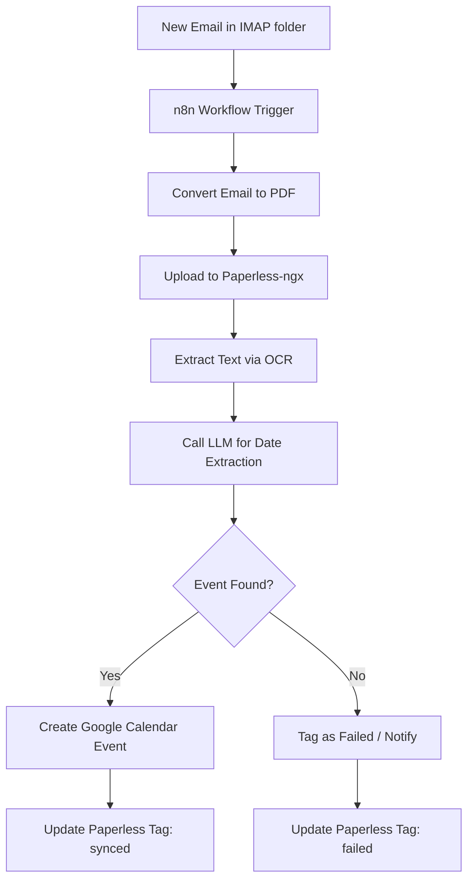

# Playbook: Email to Calendar

## What it is

The Email to Calendar playbook is a specialized automation pattern that uses an LLM-powered agent to monitor an IMAP folder, extract event details (name, date, time, location) from incoming emails, and automatically create corresponding events in a primary family calendar (Google or Proton).

## What problem it solves

Coordinating family schedules often involves manually transferring data from school newsletters, medical appointments, and event invitations received via email. This playbook solves the "scheduling friction" by automating the extraction and entry process. It eliminates human error in date entry and ensures the calendar stays updated without manual effort.

## Where it fits in the stack

**Category**: Playbook / Calendar & Tasks. It sits in the **actionable intelligence layer**, acting as a bridge between the **information intake point** (IMAP/Email) and the **scheduling surface** (Google Calendar/Proton Calendar). It uses [n8n](../services/n8n.md) as the orchestrator and [Paperless-ngx](../services/paperless-ngx.md) for OCR and archival.

## Typical use cases

- **School Event Ingestion**: Automatically adding school holidays, field trips, and parent-teacher conferences to the shared calendar.
- **Medical Appointment Sync**: Extracting doctor's appointments from confirmation emails.
- **Travel Itinerary Management**: Syncing flight, hotel, and rental car dates from confirmation receipts.
- **Utility Bill Scheduling**: Creating calendar reminders for upcoming bill due dates extracted from electronic invoices.

## Strengths

- **High Precision**: Uses specialized LLM prompts for reliable date and time extraction.
- **End-to-End Automation**: Moves from raw email to calendar event with zero manual data entry.
- **Audit Trail**: Keeps a permanent copy of the source email in [Paperless-ngx](../services/paperless-ngx.md) for verification.
- **Human-in-the-Loop Ready**: Can be configured with a "HITL" stage for approving events before they hit the calendar.

## Limitations

- **Email Complexity**: Highly complex or non-standard email layouts (e.g., image-only invitations) may require [OCRmyPDF](../tools/process_understanding/ocrmypdf.md) before processing.
- **IMAP Latency**: Dependent on the polling frequency of the [n8n](../services/n8n.md) workflow.
- **Conflicting Events**: Currently requires manual resolution if two events overlap.

## When to use it

- When you receive a high volume of scheduling information via email.
- When you want to ensure a single source of truth for family events.
- When you are already using [n8n](../services/n8n.md) and [Paperless-ngx](../services/paperless-ngx.md) in your homelab.

## When not to use it

- For highly sensitive appointments that should not be processed by an LLM (unless using a fully local LLM setup).
- If your calendar provider does not have a stable API or [Model Context Protocol](../knowledge_base/agent_protocols.md) connector.

## Getting started

To implement the Email to Calendar workflow:

1. **Prepare IMAP**: Create a dedicated `Automate/Intake` folder in your email account.
2. **Setup n8n**: Deploy the [Email to Calendar Workflow](../reference-implementations/n8n/email-to-calendar.json).
3. **Configure LLM**: Set up an [Ollama](../services/ollama.md) node or OpenAI credential in n8n.
4. **Link Calendar**: Authenticate your [Google Calendar](../tools/calendar_tasks/google_calendar.md) in n8n.
5. **Test the Flow**: Move a sample appointment email into the `Automate/Intake` folder and monitor the n8n execution log.

## Objective
Automatically extract dates and events from incoming emails and sync them to the primary family calendar.

## Pre-requisites
- [n8n](../services/n8n.md)
- [Paperless-ngx](../services/paperless-ngx.md)
- [LLM (Ollama or OpenAI)](../services/ollama.md)
- [Google Calendar](../tools/calendar_tasks/google_calendar.md)

## Workflow Architecture

## Model Selection for Extraction
For high-precision date extraction, the following June 2026-standard models are recommended:
- **GPT-5.5 (Omni)**: Best for complex, multi-event newsletters where intent recognition is critical.
- **Claude 4.7 (Sonnet)**: Excellent for structured data extraction and following strict JSON schemas.
- **Llama 4 Maverick (70B)**: The preferred local-first option for privacy-sensitive calendar data, offering performance parity with proprietary models for this specific task.

## Step-by-Step Flow
1.  **Ingestion**: n8n workflow triggers via IMAP on a new email in the `Automate/Intake` folder.
2.  **Storage**: n8n uploads the email body (as PDF) or any existing PDF attachments to Paperless-ngx with the tag `needs-processing`.
3.  **Extraction**: n8n calls the LLM (GPT-5.5 or Claude 4.7) with the [Date Extraction Prompt](../reference-implementations/llm-prompts/date-extraction.md), passing the OCR text from Paperless.
4.  **Verification**: LLM returns a structured JSON object containing `event_name`, `start_date`, `end_date`, and `location`.
5.  **Action**: n8n creates an event in Google Calendar using the data returned by the LLM.
6.  **Cleanup**: n8n updates the Paperless document tag from `needs-processing` to `synced-to-calendar`.

## Data Contract
| Field | Type | Format | Source |
| :--- | :--- | :--- | :--- |
| `event_name` | String | Plain Text | Email Subject/Body |
| `start_date` | DateTime | ISO8601 | Email Body |
| `end_date` | DateTime | ISO8601 | Email Body |
| `location` | String | Plain Text | Email Body |

## Failure Modes & Recovery
- **Extraction Failed**: LLM returns "No event found".
    - *Detection*: n8n check for null fields.
    - *Recovery*: Tag document in Paperless as `automation-failed` and send a notification to Matrix.
- **IMAP Timeout**:
    - *Detection*: n8n workflow execution error.
    - *Recovery*: Retry policy in n8n (3 retries).

## Variants
- **SaaS Only**: Replace n8n/Ollama with Zapier and ChatGPT.
- **Local Only**: Replace Google Calendar with [Radicale](../services/radicale.md) via CalDAV.

## Related tools / concepts

- [n8n](../services/n8n.md)
- [Paperless-ngx](../services/paperless-ngx.md)
- [Google Calendar](../tools/calendar_tasks/google_calendar.md)
- [Ollama](../services/ollama.md)
- [Date Extraction Prompt](../reference-implementations/llm-prompts/date-extraction.md)
- [Multi-Calendar Conflict Research](../knowledge_base/multi-calendar-conflict-research.md)
- [Model Context Protocol](../knowledge_base/agent_protocols.md)
- [Chronos MCP](../tools/automation_orchestration/chronos-mcp.md)
- [Scan to Task](scan-to-task.md)
- [Family Admin Automation](family-admin-automation.md)

## Advanced Configuration: HITL
To prevent "calendar spam," implement a **Human-in-the-loop (HITL)** stage:
1. n8n sends a message to a Matrix/Signal room with the extracted event details.
2. The message includes "Approve" and "Reject" buttons (using n8n wait nodes or webhook triggers).
3. The event is only created in Google Calendar after a family member clicks "Approve."

## Sources / References
- https://github.com/joanmarcriera/Home-office-automations

## Contribution Metadata
- Last reviewed: 2026-06-07
- Confidence: high
