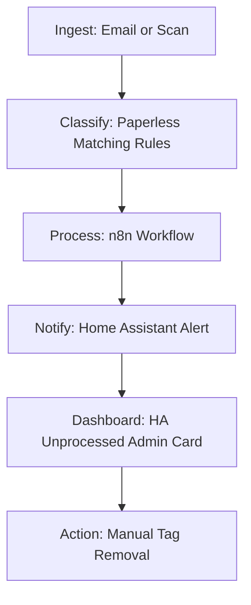

# Playbook: Family Admin Automation

## What it is

Family Admin Automation is an architectural pattern for managing and routing household administrative tasks (bills, insurance, medical documents). It leverages [Paperless-ngx](../services/paperless-ngx.md) for classification, [n8n](../services/n8n.md) for workflow orchestration, and [Home Assistant](../services/home-assistant.md) for family-wide notifications and dashboarding.

## What problem it solves

Household administration is often fragmented across multiple family members, leading to missed due dates, lost paperwork, and redundant communication. This playbook solves the "coordination gap" by centralizing all documents in a searchable archive and automating the notification process. It ensures that everyone is aware of pending tasks without constant manual status updates.

## Where it fits in the stack

**Category**: Playbook / Home Operations. It sits in the **actionable notification layer**, connecting the **document management system** (Paperless-ngx) to the **household control plane** (Home Assistant) and **communication channels** (Matrix/Signal).

## Typical use cases

- **Bill Payment Alerts**: Automatically notifying the family chat when a new utility bill is scanned and due.
- **Insurance Document Archival**: Tagging and filing insurance policies and medical records for easy retrieval during emergencies.
- **School Form Routing**: Pushing new school forms to a shared "Action Required" dashboard in Home Assistant.
- **Home Maintenance Tracking**: Automating reminders for recurring maintenance tasks based on scanned service records.

## Strengths

- **High Visibility**: Centralizes task status on a shared dashboard that all family members can see.
- **Automatic Classification**: Uses Paperless-ngx matching rules to route documents with zero manual intervention.
- **Multi-Channel**: Supports notifications via Matrix, Signal, or Home Assistant mobile alerts.
- **Archival Integrity**: Ensures every task is backed by a permanent, OCR'd digital record.

## Limitations

- **Entry Point Dependency**: Requires all documents (physical or digital) to be scanned or forwarded to the ingestion point.
- **Matching Rule Precision**: Complex or ambiguous documents may require initial manual tagging until matching rules are refined.
- **Home Assistant Configuration**: Requires some familiarity with Home Assistant YAML or UI-based dashboard creation.

## When to use it

- When you have multiple family members sharing administrative responsibilities.
- When you want to eliminate the "Where is that bill?" conversation.
- When you are already using [Home Assistant](../services/home-assistant.md) for other household tasks.

## When not to use it

- For single-person households where a simple task manager or calendar is sufficient.
- If you do not have a reliable way to digitize physical mail (consider the [Scan to Task](scan-to-task.md) playbook first).

## Getting started

To implement Family Admin Automation:

1. **Configure Paperless**: Set up matching rules in [Paperless-ngx](../services/paperless-ngx.md) for tags like `Utility`, `Medical`, and `Insurance`.
2. **Setup the Trigger**: Create an n8n workflow that triggers when the `needs-action` tag is applied in Paperless.
3. **Link Home Assistant**: Configure the [Home Assistant](../services/home-assistant.md) integration in n8n.
4. **Build the Dashboard**: Create an "Admin" card in the Home Assistant Lovelace UI to display unprocessed documents.
5. **Test the Flow**: Scan a test document and verify the notification appears in your family chat.

## Objective
Automate the routing and notification of family-wide administrative tasks (bills, insurance, medical).

## Pre-requisites
- [Paperless-ngx](../services/paperless-ngx.md)
- [Home Assistant](../services/home-assistant.md)
- [Matrix/Signal](../architecture/component_map.md)

## Step-by-Step Flow

1.  **Ingest**: Document arrives via Email or Scan.
2.  **Classify**: Paperless matching rules categorize as `Insurance` or `Utility`.
3.  **Process**: n8n workflow triggers on tag application.
4.  **Notify**: Home Assistant sends a notification to the shared family chat: "New Insurance document received. Due: [Date]".
5.  **Dashboard**: The document appears in the "Unprocessed Admin" card on the Home Assistant dashboard.
6.  **Action**: Once a family member pays or acknowledges, they manually remove the `needs-action` tag in Paperless.

## Data Contract
JSON payload to Home Assistant:
- `doc_id`
- `category`
- `due_date`
- `summary`

## Failure Modes & Recovery
- **Missing Due Date**:
    - *Detection*: LLM returns null for `due_date`.
    - *Recovery*: Default to "ASAP" or 7 days from today.

## Variants
- **SMS Notifications**: Using [Signal-cli](../architecture/component_map.md) for urgent alerts.

## Related tools / concepts

- [Paperless-ngx](../services/paperless-ngx.md)
- [Home Assistant](../services/home-assistant.md)
- [n8n](../services/n8n.md)
- [Matrix](../services/element.md)
- [Signal-cli](../architecture/component_map.md)
- [Scan to Task](scan-to-task.md)
- [Email to Calendar](email-to-calendar.md)
- [Vikunja](../services/vikunja.md)
- [Component Map](../architecture/component_map.md)
- [Family Context Prompt](../reference-implementations/llm-prompts/family-context.md)

## Sources / References
- https://github.com/joanmarcriera/Home-office-automations

## Contribution Metadata
- Last reviewed: 2026-05-10
- Confidence: high
