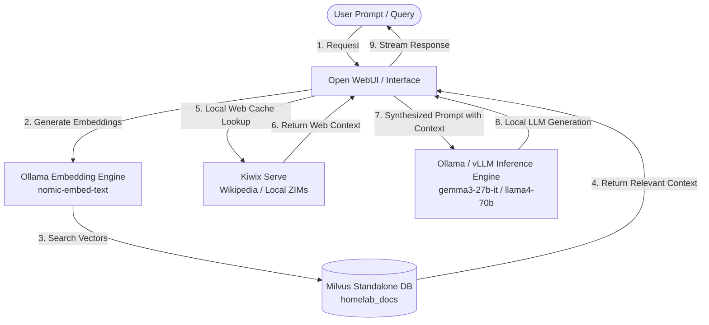

# Playbook: Fully Offline Assistant



## What it is
The Fully Offline Assistant is an end-to-end architecture for deploying a private, air-gapped AI stack on local hardware. It integrates [Ollama](../services/ollama.md) for LLM inference, [Open WebUI](../services/open-webui.md) for the interface, local embeddings for RAG, a local vector database ([Milvus](../tools/infrastructure/milvus.md) or Chroma), and [Kiwix](../services/kiwix.md) for offline web knowledge. It integrates local tools and context-routing using the [Model Context Protocol (MCP 3.1)](../tools/automation_orchestration/mcp.md) and **FastMCP 3.1** standards.

## What problem it solves
It eliminates reliance on cloud-based AI providers (such as Anthropic Claude 5.1/5.6, OpenAI GPT-5.5/5.6, or Google Gemini 4.0 Pro/Ultra), solving for:
- **Data Privacy**: Sensitive personal and diagnostic data never leaves the local network.
- **Internet Independence**: The system remains functional during ISP outages or in remote/air-gapped environments.
- **Cost Predictability**: Eliminates monthly subscription fees and token-based cloud pricing.
- **Data Sovereignty**: Complete control over which local models (such as LLaMA 4, Gemma 3, DeepSeek-V4, and Qwen 3.8) and knowledge bases are used.

## Where it fits in the stack
**Category**: Playbook / Infrastructure. It serves as the **operational blueprint** for the Privacy-First AI layer, orchestrating multiple services from the `docs/services/` and `docs/tools/` directories into a unified, functional assistant.

## Typical use cases
- **Confidential Document Analysis**: Chatting with private financial, medical, or legal documents without cloud exposure.
- **Remote Research**: Accessing a vast library of knowledge (Wikipedia, StackExchange) via Kiwix in areas without internet.
- **Secure Code Assistance**: Using local models to help with proprietary software development.
- **Disaster Recovery Knowledge**: Maintaining access to technical manuals and survival guides during extended outages.

## Strengths
- **Zero Latency (Network)**: No network round-trips to external cloud servers.
- **Uncensored Reasoning**: Ability to use models without restrictive cloud-based filters.
- **Infinite Context**: Leverage local RAG to "talk" to terabytes of local data.
- **Customizable**: Swap models, embedding engines, or vector DBs based on hardware capabilities.

## Limitations
- **Hardware Dependent**: Performance is strictly limited by local CPU/GPU/VRAM resources.
- **Maintenance Overhead**: Requires manual updates for models and knowledge ZIM files.
- **Energy Consumption**: High-performance inference can be power-intensive.
- **Initial Setup**: More complex to configure than a simple cloud API.

## When to use it
- When working with highly sensitive or regulated data.
- In environments with restricted or no internet access.
- When you have dedicated hardware (e.g., Mac Studio, high-VRAM PC) sitting idle.

## When not to use it
- For quick, low-stakes questions where a mobile-ready cloud app is more convenient.
- If you lack the hardware capable of running models at acceptable speeds (e.g., < 5 tokens/sec).
- When you require the absolute latest frontier capabilities (e.g., GPT-5.5) which aren't yet available for local deployment.

## Getting started

### 1. Core Inference Setup
Install [Ollama](../services/ollama.md) and pull your preferred model:
```bash
ollama run gemma3-27b-it
```

### 2. Knowledge Retrieval (Kiwix)
Download Kiwix ZIM files (e.g., Wikipedia) and serve them via [Kiwix](../services/kiwix.md) Docker:
```bash
docker run -d -p 8080:80 -v /path/to/zims:/data kiwix/kiwix-serve
```

### 3. Vector Database
Deploy [Milvus](../tools/infrastructure/milvus.md) via Docker for storing embeddings:
```bash
# Example standalone Milvus deployment
docker run -d --name milvus_standalone -p 19530:19530 -p 9091:9091 milvusdb/milvus:v2.4.0
```

### 4. Orchestration (Open WebUI)
Deploy [Open WebUI](../services/open-webui.md) and connect it to Ollama and Milvus:
```bash
docker run -d -p 3000:8080 --add-host=host.docker.internal:host-gateway -v open-webui:/app/data --name open-webui ghcr.io/open-webui/open-webui:main
```

## CLI examples

### 1. Verifying Local Model Availability
```bash
ollama list
```

### 2. Testing Kiwix API Access
```bash
curl http://localhost:8080/wikipedia_en_all_maxi_2026-07/search?q=FastMCP
```

### 3. Checking Milvus Health
```bash
curl http://localhost:9091/healthz
```

## API examples

### Python: End-to-End RAG Query (Local with Pydantic v2 & FastMCP 3.1 validation)
The following script utilizes **Pydantic v2** validation to process local query intents, interface with local embedding engines, and construct safe, structured prompts for local LLMs running on Ollama.

```python
import ollama
from typing import List, Optional
from pydantic import BaseModel, Field, HttpUrl
from pymilvus import Collection, connections

# Define Pydantic v2 Schemas for Query Inputs and Tool Schemas
class OfflineQueryRequest(BaseModel):
    query: str = Field(..., min_length=3, description="The offline user query.")
    limit: int = Field(default=3, ge=1, le=10, description="Number of context segments to retrieve.")
    embedding_model: str = Field(default="nomic-embed-text", description="Name of the local embedding model.")
    inference_model: str = Field(default="gemma3-27b-it", description="Name of the local LLM model.")

class ContextSegment(BaseModel):
    id: int
    text: str = Field(..., description="The context raw text.")
    distance: float = Field(..., description="The vector distance metrics.")

class AssistantResponse(BaseModel):
    query: str
    context_used: List[ContextSegment]
    generated_answer: str

def execute_local_rag(request_payload: dict) -> dict:
    # Validate input payload using Pydantic v2
    req = OfflineQueryRequest.model_validate(request_payload)

    # 1. Generate local embedding using Ollama
    embed = ollama.embeddings(model=req.embedding_model, prompt=req.query)
    vector = embed["embedding"]

    # 2. Query local Vector DB (Milvus)
    connections.connect("default", host="localhost", port="19530")
    collection = Collection("homelab_docs")
    results = collection.search(
        data=[vector],
        anns_field="vector",
        param={"metric_type": "L2", "params": {"nprobe": 10}},
        limit=req.limit,
        output_fields=["text"]
    )

    # 3. Construct and validate retrieved contexts
    context_segments = []
    text_contexts = []
    for i, res in enumerate(results[0]):
        text = res.entity.get("text")
        segment = ContextSegment(id=i, text=text, distance=res.distance)
        context_segments.append(segment)
        text_contexts.append(text)

    # 4. Synthesize answer with context using local LLM
    context_str = "\n---\n".join(text_contexts)
    prompt = f"Context:\n{context_str}\n\nQuestion: {req.query}"

    response = ollama.generate(
        model=req.inference_model,
        prompt=prompt
    )

    # 5. Formulate structured response and validate using Pydantic v2
    outcome = AssistantResponse(
        query=req.query,
        context_used=context_segments,
        generated_answer=response['response']
    )

    return outcome.model_dump()

# Execution Example
if __name__ == "__main__":
    test_input = {
        "query": "How do I setup Kiwix offline server?",
        "limit": 2,
        "embedding_model": "nomic-embed-text",
        "inference_model": "gemma3-27b-it"
    }
    try:
        result = execute_local_rag(test_input)
        print("Validated Response:", result)
    except Exception as e:
        print("Validation or Runtime Error:", e)
```

## Related tools / concepts
- [Ollama](../services/ollama.md) — Local LLM engine.
- [Open WebUI](../services/open-webui.md) — The interface for local AI.
- [Kiwix](../services/kiwix.md) — Offline knowledge libraries.
- [Local LLMs](../tools/ai_knowledge/local_llms.md) — Guide to models.
- [Vector DB Comparison](../knowledge_base/vector-db-comparison.md) — Choosing the right storage.
- [RAG Pattern](../knowledge_base/patterns/rag-pattern.md) — Theoretical background.
- [Model Context Protocol (MCP)](../tools/automation_orchestration/mcp.md) — Connecting local tools.

## Sources / References
- [Ollama Official Documentation](https://ollama.com/library)
- [Open WebUI RAG Guide](https://docs.openwebui.com/tutorial/rag/)
- [Kiwix Library](https://library.kiwix.org/)
- [Milvus Documentation](https://milvus.io/docs)

## Contribution Metadata
- Last reviewed: 2027-01-07
- Confidence: high
