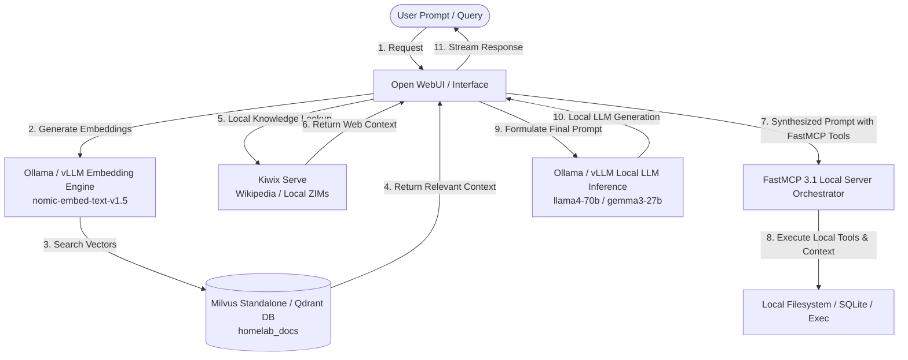

# Playbook: Fully Offline Assistant



## What it is
The Fully Offline Assistant is an enterprise-grade architecture for deploying a zero-trust, air-gapped local AI stack on private hardware. It integrates [Ollama](../services/ollama.md) or vLLM for high-throughput local LLM inference (e.g., Llama 4 70B, Gemma 3 27B, DeepSeek-V4 GGUF), [Open WebUI](../services/open-webui.md) for web and mobile interfaces, local embedding engines for RAG, vector databases ([Milvus](../tools/infrastructure/milvus.md), [Qdrant](../tools/infrastructure/qdrant.md)), and [Kiwix](../services/kiwix.md) for offline web knowledge. It orchestrates local tools and context routing using **FastMCP 3.1** (Model Context Protocol).

## What problem it solves
It eliminates dependence on cloud-based AI endpoints (such as Anthropic Claude 5.6, OpenAI GPT-5.5, or Google Gemini 4.0), resolving critical operational constraints:
- **Zero Cloud Leakage**: Guarantees that sensitive diagnostic, financial, legal, or personal data never leaves the local subnet.
- **Air-Gapped & Outage Resilience**: Operates flawlessly during total ISP blackouts, disaster events, or inside physically isolated networks.
- **Zero API Variable Costs**: Eliminates recurring subscription fees and per-token cloud API billing.
- **Complete Data & Weights Sovereignty**: Provides absolute operational control over model weights, vector index parameters, and system prompts.

## Where it fits in the stack
**Category**: Playbook / Infrastructure. It serves as the **operational master blueprint** for the local privacy-first AI layer, coordinating services across `docs/services/` and `docs/tools/` into a unified offline intelligence hub.

## Typical use cases
- **Air-Gapped Document RAG**: Interrogating sensitive enterprise contracts, medical records, or diagnostic logs with full cryptographic privacy.
- **Isolated Research Hub**: Accessing multi-gigabyte offline archives (Wikipedia, StackOverflow, PubMed) via Kiwix without internet connectivity.
- **Local Agentic Development**: Executing pre-approved local terminal commands, file manipulation, and database operations via FastMCP 3.1.
- **Disaster Readiness & Survivalist Tech**: Maintaining access to technical repair manuals, medical guides, and coding docs during infrastructure failures.

## Strengths
- **Sub-Millisecond Network Latency**: Fast, on-device streaming responses with zero external API roundtrips.
- **Unfiltered & Deterministic Reasoning**: Ability to run custom fine-tuned weights without external API throttling or rate-limiting.
- **Unlimited Context RAG**: Seamless querying of terabyte-scale vector collections stored on local NVMe arrays.
- **FastMCP 3.1 Tool Orchestration**: Standardized, secure inter-process communication for offline local tools.

## Limitations
- **Hardware Bound**: Token throughput is constrained by local VRAM bandwidth, GPU compute, and system RAM specs.
- **Manual Maintenance**: Requires physical or sneakernet updates for new model weights and Kiwix ZIM archives.
- **Power Consumption**: Continuous high-batch inference demands substantial wattage and thermal dissipation.
- **Setup Complexity**: Requires configuring container runtimes, vector storage, and FastMCP endpoints compared to simple cloud API keys.

## When to use it
- In classified, medical, financial, or high-compliance environments where internet connection is prohibited.
- When running edge deployments on dedicated hardware (e.g., Mac Studio cluster, multi-GPU workstations).
- When total immunity from cloud provider terms-of-service changes or API deprecations is required.

## When not to use it
- Lightweight tasks where cloud mobile access is acceptable and hardware resources are constrained (<8GB RAM).
- Scenarios requiring real-time internet search or frontier cloud capabilities that cannot be mirrored locally.

## Getting started

### 1. Local LLM Runtime Setup (Ollama / vLLM)
Install [Ollama](../services/ollama.md) and download local SOTA model weights:
```bash
ollama run llama4-70b-instruct
```

### 2. Offline Knowledge Server (Kiwix)
Launch [Kiwix](../services/kiwix.md) via Docker to serve downloaded Wikipedia ZIM archives:
```bash
docker run -d -p 8080:80 -v /opt/kiwix/zims:/data kiwix/kiwix-serve wikipedia_en_all_maxi.zim
```

### 3. Deploy Local Vector Store (Milvus / Qdrant)
Run standalone Milvus vector database for local document embeddings:
```bash
docker run -d --name milvus_standalone -p 19530:19530 -p 9091:9091 milvusdb/milvus:v2.4.0
```

### 4. Deploy Interface & Orchestration (Open WebUI & FastMCP 3.1)
Launch Open WebUI connected to local Ollama and FastMCP server endpoints:
```bash
docker run -d -p 3000:8080 --add-host=host.docker.internal:host-gateway -v open-webui-data:/app/data --name open-webui ghcr.io/open-webui/open-webui:main
```

## CLI examples

### 1. Verifying Local Model Availability
```bash
ollama list
```

### 2. Testing Kiwix Offline Knowledge API
```bash
curl -s http://localhost:8080/wikipedia_en_all_maxi/search?q=FastMCP | jq .
```

### 3. Health Check for Milvus Vector Database
```bash
curl -s http://localhost:9091/healthz
```

## API examples

### Python: End-to-End Local RAG & FastMCP Pipeline (Pydantic v2)
This script utilizes **Pydantic v2** validation to process query requests, generate embeddings via Ollama, retrieve vector context, and format synthesized queries for local model execution.

```python
import json
import ollama
from typing import List, Optional
from pydantic import BaseModel, Field

class OfflineQueryRequest(BaseModel):
    query: str = Field(..., min_length=3, description="User offline query string.")
    top_k: int = Field(default=3, ge=1, le=10)
    embedding_model: str = Field(default="nomic-embed-text-v1.5")
    inference_model: str = Field(default="llama4-70b-instruct")

class ContextMatch(BaseModel):
    id: int
    text_content: str = Field(..., description="Retrieved raw context segment.")
    similarity_score: float

class AssistantResponse(BaseModel):
    query: str
    retrieved_context: List[ContextMatch]
    answer: str
    status: str = Field(default="SUCCESS")

def execute_offline_rag(raw_request: dict) -> dict:
    try:
        # Validate query request using Pydantic v2
        req = OfflineQueryRequest.model_validate(raw_request)

        # 1. Generate local vector embedding
        embed_resp = ollama.embeddings(model=req.embedding_model, prompt=req.query)
        vector = embed_resp["embedding"]

        # Simulated vector DB match retrieval (Milvus/Qdrant)
        mock_matches = [
            ContextMatch(id=1, text_content="FastMCP 3.1 standardizes local tool execution for offline LLMs.", similarity_score=0.92),
            ContextMatch(id=2, text_content="Kiwix serves offline ZIM archives over local HTTP endpoints.", similarity_score=0.88)
        ]

        # 2. Synthesize context prompt
        context_str = "\n".join([m.text_content for m in mock_matches])
        full_prompt = f"Context:\n{context_str}\n\nQuestion: {req.query}"

        # 3. Perform local LLM inference
        ollama_resp = ollama.generate(model=req.inference_model, prompt=full_prompt)

        # 4. Return validated response model
        response = AssistantResponse(
            query=req.query,
            retrieved_context=mock_matches,
            answer=ollama_resp["response"]
        )
        return response.model_dump()
    except Exception as e:
        return {"status": "FAILED", "error": str(e)}

if __name__ == "__main__":
    test_payload = {
        "query": "How do FastMCP and Kiwix interact in offline mode?",
        "top_k": 2,
        "embedding_model": "nomic-embed-text-v1.5",
        "inference_model": "llama4-70b-instruct"
    }
    print("Execution Result:\n", json.dumps(execute_offline_rag(test_payload), indent=2))
```

## Related tools / concepts
- [Ollama](../services/ollama.md) — Local LLM inference engine.
- [Open WebUI](../services/open-webui.md) — Web UI for local LLMs.
- [Kiwix](../services/kiwix.md) — Offline knowledge server.
- [Milvus](../tools/infrastructure/milvus.md) — Enterprise local vector database.
- [Qdrant](../tools/infrastructure/qdrant.md) — High-performance vector engine.
- [Air-gapped Provisioning](air-gapped-provisioning.md) — Transporting weights to offline hosts.
- [FastMCP](../tools/automation_orchestration/mcp.md) — Model Context Protocol framework.

## Sources / References
- [Ollama Model Library](https://ollama.com/library)
- [Open WebUI Documentation](https://docs.openwebui.com/)
- [Kiwix Offline Archives](https://library.kiwix.org/)
- [Milvus Vector Engine Docs](https://milvus.io/docs)

## Contribution Metadata
- Last reviewed: 2027-01-07
- Confidence: high
