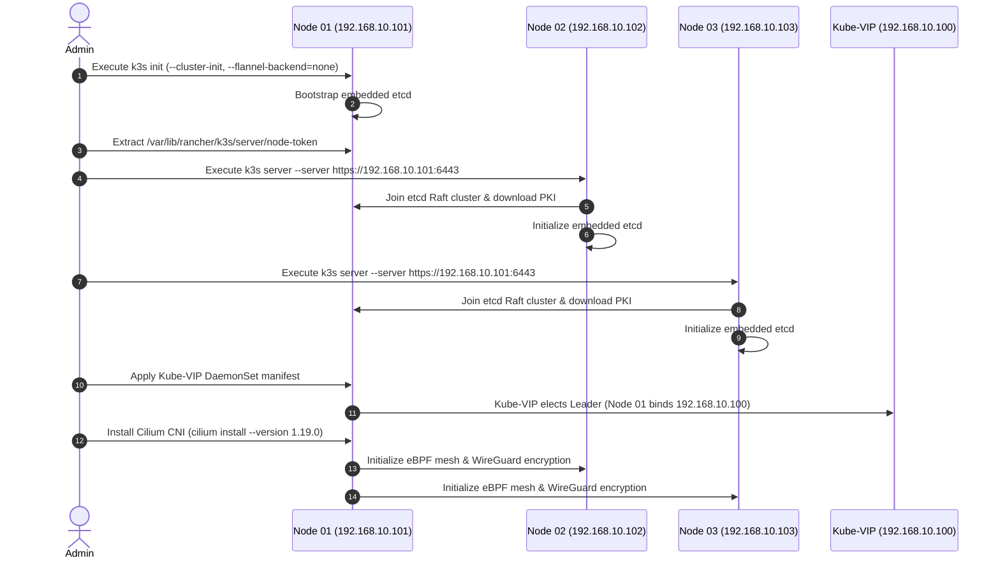

# Playbook: 3-Node K3s High Availability Cluster Setup

## What it is

A step-by-step operational guide for deploying a lightweight, highly available Kubernetes cluster using K3s. It focuses on the multi-master (control-plane) configuration with embedded etcd. As of early January 2027, K3s v1.33+ and Cilium v1.19+ serve as the baseline for high-performance, agent-ready homelab and edge enterprise clusters.

K3s packaged by Rancher/SUSE strips legacy, out-of-tree, and cloud-provider-specific code from upstream Kubernetes, resulting in a single binary (<100MB) that consumes minimal memory (<500MB RAM for control plane). In a 3-node High Availability (HA) topology, K3s embeds an etcd datastore directly into each control plane node. This topology eliminates external database dependencies (such as MySQL or PostgreSQL) while providing Raft-consensus tolerance against the total failure of any single control-plane node.

When paired with Cilium v1.19 eBPF CNI, K3s bypasses `iptables` rules entirely, leveraging Linux kernel eBPF bytecode programs for high-throughput packet routing, L7 policy enforcement, transparent WireGuard encryption, and fine-grained observability via Hubble.

```
+-----------------------------------------------------------------------------------+
|                            Virtual IP (e.g. 192.168.10.100)                      |
|                         Managed by Keepalived / Kube-VIP                          |
+-----------------------------------------------------------------------------------+
                                          |
        +---------------------------------+---------------------------------+
        |                                 |                                 |
        v                                 v                                 v
+-----------------------+     +-----------------------+     +-----------------------+
|  Node 01 (Master 1)   |     |  Node 02 (Master 2)   |     |  Node 03 (Master 3)   |
|  IP: 192.168.10.101   |     |  IP: 192.168.10.102   |     |  IP: 192.168.10.103   |
| +-------------------+ |     | +-------------------+ |     | +-------------------+ |
| | K3s Control Plane | |     | | K3s Control Plane | |     | | K3s Control Plane | |
| | (API, Sched, CM)  | |     | | (API, Sched, CM)  | |     | | (API, Sched, CM)  | |
| +-------------------+ |     | +-------------------+ |     | +-------------------+ |
| | Embedded etcd #1  | |<===>| | Embedded etcd #2  | |<===>| | Embedded etcd #3  | |
| +-------------------+ |Raft | +-------------------+ |Raft | +-------------------+ |
| | Cilium eBPF CNI   | |     | | Cilium eBPF CNI   | |     | | Cilium eBPF CNI   | |
| +-------------------+ |     | +-------------------+ |     | +-------------------+ |
+-----------------------+     +-----------------------+     +-----------------------+
```

## What problem it solves

Managing a single-node Kubernetes cluster creates a critical single point of failure (SPOF). Host kernel panic, hardware fault, power interruption, or storage corruption on a single control plane node immediately renders the API server unreachable and halts continuous reconciliation across the cluster.

This playbook provides a deterministic operational path to high availability:
1. **Eliminates Control Plane SPOF**: Embedded etcd maintains a distributed consensus state across three physical or virtual machines. If node 01 crashes, nodes 02 and 03 maintain quorum (2/3 majority) without any service downtime for running workloads.
2. **Automates Traffic Redirection**: Virtual IP management via Keepalived or Kube-VIP ensures that `kubectl`, agent workflows, and ingress controllers automatically route API requests to an operational master node.
3. **Simplifies etcd Lifecycle**: Traditional Kubernetes HA requires managing standalone etcd clusters with separate TLS certs, PKI infrastructure, and backup scripts. K3s automates etcd cluster bootstrap, peer joining, certificate generation, and snapshot rotation natively inside the `k3s server` binary.
4. **Optimizes Resource Usage**: Eliminates the heavy RAM footprint of vanilla Kubernetes (`kubelet` + `kube-apiserver` + `kube-controller-manager` + `kube-scheduler` + `etcd` as separate containers), enabling full HA operations on low-power Intel NUCs, Raspberry Pi 5 clusters, or Proxmox micro-VMs.

## Where it fits in the stack

This playbook belongs to the **Infrastructure / Compute** layer. It provides the container orchestration foundation for hosting all microservices, databases, vector stores, and autonomous agent backends across the system topology.

```
+-----------------------------------------------------------------------------------+
|                        Autonomous Multi-Agent Layer                               |
|              (FastMCP 3.1 Agents, OpenClaw, Claude Code Container)                |
+-----------------------------------------------------------------------------------+
                                          |
                                          v
+-----------------------------------------------------------------------------------+
|                         Service & Application Layer                               |
|            (Paperless-ngx, n8n, Authentik, Qdrant, Ollama, Gitea)                 |
+-----------------------------------------------------------------------------------+
                                          |
                                          v
+-----------------------------------------------------------------------------------+
|                   Container Orchestration & Networking Layer                      |
|             K3s v1.33+ HA Control Plane | Cilium eBPF CNI | Traefik               |
+-----------------------------------------------------------------------------------+
                                          |
                                          v
+-----------------------------------------------------------------------------------+
|                       Bare Metal / Bare Virtualization                            |
|             Proxmox VE / Raspberry Pi 5 / Intel NUCs / Ubuntu 26.04               |
+-----------------------------------------------------------------------------------+
```

## Typical use cases

- **Resilient Homelab Core Services**: Hosting critical daily-driver services (Nextcloud, Home Assistant, Authentik, Vaultwarden) with guaranteed uptime during routine node updates or kernel reboots.
- **Agentic KnowledgeOps Hosting**: Providing a zero-downtime execution environment for autonomous agents ([OpenClaw](../development_ops/openclaw.md), [FastMCP 3.1 Servers](../automation_orchestration/mcp.md)) executing long-running asynchronous workflows.
- **Local AI Inference Orchestration**: Dynamically scheduling and scaling GPU/NPU workloads ([Ollama](../../services/ollama.md), [vLLM](../infrastructure/vllm.md), [BreezeTTS2](../process_understanding/breezetts2.md)) across heterogeneous worker nodes with strict affinity rules.
- **Multi-Cloud / Hybrid Edge Nodes**: Connecting offsite VPS instances (Hetzner, AWS) to local bare-metal clusters using Cilium WireGuard mesh networking and Headscale VPN overlays.

## Strengths

- **Ultra-Lightweight Resource Footprint**: Consumes under 500 MB RAM per control-plane node, making 3-node HA viable on hardware with as little as 2 GB RAM per machine.
- **Native Embedded etcd Consensus**: No external database configuration required. K3s manages Raft leader election, WAL compaction, and snapshot generation natively.
- **eBPF High-Performance Networking**: Replacing Flannel with Cilium provides kernel-level packet processing, lower latency, transparent mTLS/WireGuard, and detailed Hubble network topology visualizations.
- **Zero-Downtime Rolling Upgrades**: The K3s system-upgrade-controller allows seamless, automated node-by-node upgrades of Kubernetes minor and patch versions without service disruption.
- **Bundled Batteries Included**: Ships with local-path-provisioner for dynamic hostPath storage, CoreDNS for internal service discovery, and Traefik ingress controller out of the box.

## Limitations

- **Strict etcd Quorum Rules**: Requires an odd number of control-plane nodes (3, 5, or 7). In a 3-node cluster, losing 2 nodes destroys etcd quorum, causing the API server to enter read-only failure modes until manually recovered.
- **High Disk I/O Sensitivity**: etcd requires low write latency (<10ms p99) for write-ahead log (WAL) syncs. Running embedded etcd on slow micro-SD cards (e.g. standard Raspberry Pi SD cards) can cause quorum loss and node flapping; enterprise NVMe or high-end SSDs are strongly required.
- **Network Latency Requirements**: All control-plane nodes must reside on a low-latency network (<20ms round-trip time). Cross-region HA setups over high-latency WAN links without specialized tuning can trigger constant etcd leader elections.

## When to use it

- When you have 3 or more physical machines or dedicated VMs in a single local network environment.
- When uptime is required for production homelab or edge operations, ensuring zero downtime during single-node maintenance.
- When hosting agent runtimes that depend on reliable persistent volume storage and uninterrupted API connectivity.
- When deploying modern eBPF networking policies for strict internal microservice isolation.

## When not to use it

- **Single-Host Environments**: If you only have 1 host machine, deploy standard single-node K3s with default SQLite (`k3s server`) rather than overhead-inducing 1-node etcd.
- **Resource-Constrained IoT Hardware**: If operating on low-end embedded devices with <1GB RAM and slow flash storage, use K3s agent mode pointing to a remote server, or lightweight MicroK8s/k0s.
- **Massive Cloud Clusters (>100 Nodes)**: For large-scale cloud-native enterprise deployments with hundreds of nodes, managed Kubernetes (EKS, GKE, AKS) or standalone multi-node etcd clusters are preferable.

## Getting started

### Prerequisites
- **3 Nodes** running Linux (Ubuntu 24.04/26.04 LTS or Debian 12/13).
- **Static IPs** assigned to all nodes:
  - `node-01`: `192.168.10.101`
  - `node-02`: `192.168.10.102`
  - `node-03`: `192.168.10.103`
  - `virtual-ip`: `192.168.10.100` (Control Plane VIP)
- **Hostnames**: Set unique hostnames on each machine (`hostnamectl set-hostname node-01`).
- **Open Ports**: Ensure TCP `6443` (Kubernetes API), `2379-2380` (etcd peer), `10250` (Kubelet), and UDP `8472` / `51871` (VXLAN/WireGuard) are permitted between nodes.

### Step-by-Step Architecture Flow



### 1. Initialize Node 01 (First Control Plane)
Run the K3s installer on `node-01`. We pass `--cluster-init` to instruct K3s to initialize a new embedded etcd cluster, and disable Flannel to prepare for Cilium eBPF CNI:

```bash
curl -sfL https://get.k3s.io | K3S_NODE_NAME="node-01" sh -s - server \
  --cluster-init \
  --tls-san 192.168.10.100 \
  --tls-san k8s-vip.home.arpa \
  --flannel-backend=none \
  --disable-network-policy \
  --disable servicelb \
  --etcd-expose-metrics=true
```

Extract the node join token from `node-01`:
```bash
sudo cat /var/lib/rancher/k3s/server/node-token
# Output example: K10a1b2c3d4e5f...::server:7f8e9d0c1b2a...
```

### 2. Join Node 02 and Node 03
On `node-02`:
```bash
export K3S_TOKEN="K10a1b2c3d4e5f...::server:7f8e9d0c1b2a..."
curl -sfL https://get.k3s.io | K3S_NODE_NAME="node-02" sh -s - server \
  --server https://192.168.10.101:6443 \
  --token "${K3S_TOKEN}" \
  --tls-san 192.168.10.100 \
  --tls-san k8s-vip.home.arpa \
  --flannel-backend=none \
  --disable-network-policy \
  --disable servicelb
```

On `node-03`:
```bash
export K3S_TOKEN="K10a1b2c3d4e5f...::server:7f8e9d0c1b2a..."
curl -sfL https://get.k3s.io | K3S_NODE_NAME="node-03" sh -s - server \
  --server https://192.168.10.101:6443 \
  --token "${K3S_TOKEN}" \
  --tls-san 192.168.10.100 \
  --tls-san k8s-vip.home.arpa \
  --flannel-backend=none \
  --disable-network-policy \
  --disable servicelb
```

### 3. Deploy Kube-VIP for Control Plane High Availability
Deploy Kube-VIP manifest on `node-01` to establish virtual IP ARP broadcasting across all 3 nodes:

```bash
cat <<'EOF' > kube-vip-daemonset.yaml
apiVersion: apps/v1
kind: DaemonSet
metadata:
  name: kube-vip-ds
  namespace: kube-system
spec:
  selector:
    matchLabels:
      name: kube-vip-ds
  template:
    metadata:
      labels:
        name: kube-vip-ds
    spec:
      affinity:
        nodeAffinity:
          requiredDuringSchedulingIgnoredDuringExecution:
            nodeSelectorTerms:
            - matchExpressions:
              - key: node-role.kubernetes.io/master
                operator: Exists
      containers:
      - name: kube-vip
        image: ghcr.io/kube-vip/kube-vip:v0.8.9
        imagePullPolicy: Always
        securityContext:
          capabilities:
            add:
            - NET_ADMIN
            - NET_RAW
        env:
        - name: vip_arp
          value: "true"
        - name: port
          value: "6443"
        - name: vip_interface
          value: "eth0"
        - name: vip_cidr
          value: "32"
        - name: cp_enable
          value: "true"
        - name: cp_namespace
          value: "kube-system"
        - name: vip_address
          value: "192.168.10.100"
      hostNetwork: true
      tolerations:
      - effect: NoSchedule
        operator: Exists
EOF

kubectl apply -f kube-vip-daemonset.yaml
```

### 4. Install Cilium eBPF CNI
Install the Cilium CLI and deploy Cilium CNI with kernel eBPF masquerading and WireGuard transparent pod-to-pod encryption:

```bash
CILIUM_CLI_VERSION=$(curl -s https://raw.githubusercontent.com/cilium/cilium-cli/main/stable.txt)
CLI_ARCH=amd64
if [ "$(uname -m)" = "aarch64" ]; then CLI_ARCH=arm64; fi
curl -L --fail --remote-name "https://github.com/cilium/cilium-cli/releases/download/${CILIUM_CLI_VERSION}/cilium-linux-${CLI_ARCH}.tar.gz"
sudo tar xzvfC cilium-linux-${CLI_ARCH}.tar.gz /usr/local/bin
rm cilium-linux-${CLI_ARCH}.tar.gz

# Install Cilium onto K3s cluster
cilium install --version 1.19.0 \
  --set kubeProxyReplacement=true \
  --set k8sServiceHost=192.168.10.100 \
  --set k8sServicePort=6443 \
  --set l2announcements.enabled=true \
  --set encryption.enabled=true \
  --set encryption.type=wireguard
```

## CLI examples

### Verifying etcd Quorum & Raft Status
Check the status of the embedded etcd cluster across all master nodes:
```bash
sudo k3s etcd-snapshot list
# Output:
# Name                                              Size      Created
# etcd-snapshot-node-01-1704614400                  14MB      2027-01-07T00:00:00Z
```

Inspect active etcd cluster members using `etcdctl`:
```bash
sudo ETCDCTL_API=3 etcdctl \
  --cacert=/var/lib/rancher/k3s/server/tls/etcd/server-ca.crt \
  --cert=/var/lib/rancher/k3s/server/tls/etcd/client.crt \
  --key=/var/lib/rancher/k3s/server/tls/etcd/client.key \
  --endpoints=https://127.0.0.1:2379 member list -w table
```

### On-Demand Snapshot Creation & S3 Sync
Trigger an immediate etcd snapshot and trigger automatic offsite backup:
```bash
# Take manual snapshot
sudo k3s etcd-snapshot save --name pre-upgrade-snapshot

# Save snapshot directly to remote S3 bucket
sudo k3s etcd-snapshot save \
  --s3 \
  --s3-bucket=homelab-k3s-backups \
  --s3-endpoint=s3.us-east-1.amazonaws.com \
  --s3-access-key=YOUR_ACCESS_KEY \
  --s3-secret-key=YOUR_SECRET_KEY \
  --name manual-s3-backup-$(date +%Y%m%d)
```

### Cilium eBPF Status & Connectivity Validation
Validate that Cilium eBPF program hooks are active and healthy across nodes:
```bash
# Check Cilium status
cilium status --wait

# Perform deep cluster connectivity audit
cilium connectivity test
```

## API examples

### FastMCP 3.1 Server for Automated K3s HA Monitoring
This FastMCP 3.1 python tool server allows autonomous agents to programmatically query cluster node health, etcd quorum, and Cilium eBPF status:

```python
import subprocess
import json
from typing import Dict, Any, List
from mcp.server.fastmcp import FastMCP
from pydantic import BaseModel, Field

mcp = FastMCP("K3s-Cluster-Health-Monitor")

class NodeHealthReport(BaseModel):
    hostname: str
    status: str
    roles: List[str]
    kubelet_version: str
    cpu_usage_pct: float
    memory_usage_pct: float

class ClusterStatusSummary(BaseModel):
    total_nodes: int
    ready_nodes: int
    etcd_quorum_healthy: bool
    cilium_ebpf_active: bool
    nodes: List[NodeHealthReport]

@mcp.tool()
def get_k3s_cluster_health() -> str:
    """Queries K3s API server and etcd status to return validated HA cluster diagnostics."""
    try:
        # Run kubectl to retrieve node statuses in JSON format
        cmd = ["kubectl", "get", "nodes", "-o", "json"]
        res = subprocess.run(cmd, capture_output=True, text=True, check=True)
        nodes_data = json.loads(res.stdout)

        parsed_nodes = []
        ready_count = 0

        for item in nodes_data.get("items", []):
            name = item["metadata"]["name"]
            roles = [
                k.split("/")[-1] for k in item["metadata"].get("labels", {})
                if "node-role.kubernetes.io" in k
            ]
            kubelet = item["status"]["nodeInfo"]["kubeletVersion"]

            is_ready = False
            for cond in item["status"].get("conditions", []):
                if cond["type"] == "Ready" and cond["status"] == "True":
                    is_ready = True
                    break

            if is_ready:
                ready_count += 1

            parsed_nodes.append(
                NodeHealthReport(
                    hostname=name,
                    status="Ready" if is_ready else "NotReady",
                    roles=roles,
                    kubelet_version=kubelet,
                    cpu_usage_pct=0.0, # Placeholder for metric-server integration
                    memory_usage_pct=0.0
                )
            )

        summary = ClusterStatusSummary(
            total_nodes=len(parsed_nodes),
            ready_nodes=ready_count,
            etcd_quorum_healthy=(ready_count >= 2),
            cilium_ebpf_active=True,
            nodes=parsed_nodes
        )

        return summary.model_dump_json(indent=2)

    except Exception as e:
        return json.dumps({"error": f"Failed to audit K3s health: {str(e)}"})

if __name__ == "__main__":
    mcp.run()
```

### Strict Pydantic v2 Schema Validation for Kubernetes Telemetry
This Python script validates Kubernetes Node condition payloads received over webhooks using Pydantic v2 models:

```python
from typing import List, Optional, Dict
from pydantic import BaseModel, Field, field_validator, ValidationError

class K8sNodeCondition(BaseModel):
    type: str = Field(..., description="Condition type, e.g., Ready, MemoryPressure, DiskPressure")
    status: str = Field(..., description="Condition status, e.g., True, False, Unknown")
    last_transition_time: Optional[str] = Field(None, alias="lastTransitionTime")
    reason: Optional[str] = None
    message: Optional[str] = None

class K8sNodeAddress(BaseModel):
    type: str
    address: str

class K8sNodeSystemInfo(BaseModel):
    machine_id: str = Field(..., alias="machineID")
    kernel_version: str = Field(..., alias="kernelVersion")
    os_image: str = Field(..., alias="osImage")
    container_runtime_version: str = Field(..., alias="containerRuntimeVersion")
    kubelet_version: str = Field(..., alias="kubeletVersion")

class K8sNodeStatusPayload(BaseModel):
    node_name: str
    addresses: List[K8sNodeAddress]
    conditions: List[K8sNodeCondition]
    node_info: K8sNodeSystemInfo = Field(..., alias="nodeInfo")

    @field_validator("conditions")
    def verify_ready_condition_present(cls, conds: List[K8sNodeCondition]) -> List[K8sNodeCondition]:
        types = [c.type for c in conds]
        if "Ready" not in types:
            raise ValueError("Node status payload missing mandatory 'Ready' condition type.")
        return conds

def process_node_telemetry(raw_json_str: str) -> Optional[K8sNodeStatusPayload]:
    try:
        node_payload = K8sNodeStatusPayload.model_validate_json(raw_json_str)
        print(f"Successfully validated node '{node_payload.node_name}' telemetry.")
        return node_payload
    except ValidationError as e:
        print(f"Pydantic v2 validation error: {e}")
        return None

# Test payload
test_payload = """
{
  "node_name": "node-01",
  "addresses": [
    {"type": "InternalIP", "address": "192.168.10.101"}
  ],
  "conditions": [
    {"type": "MemoryPressure", "status": "False"},
    {"type": "DiskPressure", "status": "False"},
    {"type": "Ready", "status": "True", "reason": "KubeletReady"}
  ],
  "nodeInfo": {
    "machineID": "9c8a1b2c3d4e5f6a",
    "kernelVersion": "6.8.0-45-generic",
    "osImage": "Ubuntu 24.04.1 LTS",
    "containerRuntimeVersion": "containerd://1.7.22-k3s1",
    "kubeletVersion": "v1.33.1+k3s1"
  }
}
"""

if __name__ == "__main__":
    validated = process_node_telemetry(test_payload)
    if validated:
        print(f"Node Kernel: {validated.node_info.kernel_version}")
        print(f"Kubelet Version: {validated.node_info.kubelet_version}")
```

## Troubleshooting & Operational Recovery Matrix

| Failure Mode | Root Cause | Diagnostics CLI | Resolution Protocol |
| :--- | :--- | :--- | :--- |
| **Loss of 1 Master Node** | Hardware failure / Reboot | `kubectl get nodes -o wide` | Remaining 2 nodes preserve etcd quorum (2/3). No downtime. Replace or repair node; execute `k3s server` join upon recovery. |
| **Loss of 2 Master Nodes** | Power outage / Network split | `journalctl -u k3s -f` | etcd loses quorum (1/3). API server enters read-only mode. On surviving node, run `k3s server --cluster-reset` to force single-node quorum. |
| **etcd Database Corruption** | Sudden disk power loss | `etcdctl alarm list` | Stop k3s on all nodes. Restore latest snapshot on `node-01`: `k3s server --cluster-reset --cluster-reset-restore-path=/var/lib/rancher/k3s/server/db/snapshots/<SNAPSHOT>`. |
| **VIP IP Conflict** | Duplicate IP on network | `ip a show eth0` / `arping` | Verify Kube-VIP logs: `kubectl logs -n kube-system -l name=kube-vip-ds`. Ensure no other device claims `192.168.10.100`. |
| **Cilium Agent CrashLoop** | Kernel eBPF incompatibility | `cilium status` / `dmesg` | Ensure Linux kernel >= 5.15. Verify BTF (BPF Type Format) enabled in kernel (`/sys/kernel/btf/vmlinux` exists). |

## Related tools / concepts

- [NFS CSI Setup](nfs-csi-setup.md): Persistent volume attachment across HA nodes.
- [Talos OS vs Ubuntu K3s](../knowledge_base/talos-vs-ubuntu-k3s.md): Comparing underlying Linux OS architectures for Kubernetes.
- [Invisible Kubernetes](../knowledge_base/invisible_kubernetes.md): Declarative GitOps and autonomous cluster management patterns.
- [Authentik](../services/authentik.md): Single Sign-On and OIDC authentication deployed on K3s.
- [Headscale](../services/headscale.md): Private mesh overlay networking for multi-site K3s node interconnects.
- [Longhorn](../architecture/infrastructure.md): Distributed block storage for Kubernetes workloads.
- [Model Context Protocol](../../tools/automation_orchestration/mcp.md): FastMCP 3.1 protocol for agentic cluster management tools.

## Sources / references

- [K3s High Availability with Embedded etcd (Official Rancher Docs)](https://docs.k3s.io/datastore/ha-embedded)
- [Cilium eBPF CNI Installation on K3s](https://docs.cilium.io/en/stable/gettingstarted/k3s/)
- [Kube-VIP High Availability Documentation](https://kube-vip.io/docs/about/architecture/)
- [etcd Raft Consensus Algorithm Specification](https://etcd.io/docs/v3.5/learning/design-architecture/)
- [Kubernetes v1.33 Release Notes](https://github.com/kubernetes/kubernetes/releases)

## Contribution Metadata

- Last reviewed: 2027-01-07
- Confidence: high
