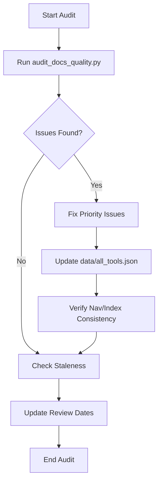

# Playbook: Knowledge Base Health

## What it is
Knowledge Base Health is a set of operational procedures and automated checks designed to ensure the repository remains accurate, up-to-date, and discoverable. It combines periodic manual audits with continuous integration (CI) quality gates. In early January 2027, these gates natively inspect model tags for Claude 5.6, GPT-5.6, Gemini 4.0 Ultra, and other frontier architectures, integrated with the FastMCP 3.1 / Model Context Protocol Task Protocol.

## What problem it solves
In a rapidly evolving technical environment, documentation quickly becomes stale or fragmented. This playbook prevents "documentation rot" by establishing clear ownership, a structured review cadence, and automated enforcement of formatting standards, ensuring users can always trust the information in the repository.

## Where it fits in the stack
This playbook belongs to the **Governance and Maintenance** layer. It provides the "metabolic process" that keeps the [KnowledgeOps](../architecture/multi_agent_knowledgeops.md) system healthy and prevents entropy from degrading the quality of the shared knowledge base.

## Typical use cases
- Performing a weekly quality check to identify non-compliant documents.
- Managing the intake of new tools and patterns from community sources.
- Cleaning up obsolete information and ensuring model names are current.
- Maintaining consistency between the filesystem, the `mkdocs.yml` navigation, and the `data/all_tools.json` catalog.

## Strengths
- **Multi-Layered Enforcement**: Combines automated PR gates with deeper, periodic manual/automated audits.
- **Traceability**: Uses `Last reviewed` and `Confidence` metadata to provide clear signals to users about data reliability.
- **Automated Discovery**: Includes scripts to detect "drift" between user stars/activity and what is actually documented.

## Limitations
- **Maintenance Overhead**: Requires dedicated effort to fix the issues identified by the audit scripts.
- **Script Dependency**: The health of the system relies on the accuracy and maintenance of the underlying Python scripts.

## When to use it
- During every pull request to ensure immediate compliance.
- Once a week to perform a broader scan of the entire repository.
- When onboarding new automated agents to define their quality boundaries.

## When not to use it
- For very small, personal repositories where formal governance processes are overkill.
- For temporary "scratchpad" notes that are not intended to be part of the canonical knowledge base.

## Getting started
The objective of this playbook is to maintain content quality, freshness, and discoverability across the knowledge base through regular audits and automated checks.

### Process Flow


### Pre-requisites
- [Quality audit script](https://github.com/joanmarcriera/Home-office-automations/blob/main/scripts/audit_docs_quality.py) (`scripts/audit_docs_quality.py`)
- [Docs contract checker](https://github.com/joanmarcriera/Home-office-automations/blob/main/scripts/check_docs_contract.py) (`scripts/check_docs_contract.py`)
- [Catalog consistency checker](https://github.com/joanmarcriera/Home-office-automations/blob/main/scripts/check_catalog_consistency.py) (`scripts/check_catalog_consistency.py`)
- [Doc freshness checker](https://github.com/joanmarcriera/Home-office-automations/blob/main/scripts/check_doc_freshness.py) (`scripts/check_doc_freshness.py`)
- [API pricing summary generator](https://github.com/joanmarcriera/Home-office-automations/blob/main/scripts/update_api_pricing_capability_summary.py) (`scripts/update_api_pricing_capability_summary.py`)
- [Model account policy validator](https://github.com/joanmarcriera/Home-office-automations/blob/main/scripts/validate_model_account_pool.py) (`scripts/validate_model_account_pool.py`)
- [Starred repo intake checker](https://github.com/joanmarcriera/Home-office-automations/blob/main/scripts/check_starred_repo_intake.py) (`scripts/check_starred_repo_intake.py`)
- [Standards reference](../standards.md)

### Review cadence

| Check | Frequency | Owner | How |
|:---|:---|:---|:---|
| Intake queue (`new-sources/`) | Daily | Jules (automated) | `daily-jules-maintenance.yml` opens a structured issue |
| Doc contract CI gate | Every PR | CI | `docs-quality-gates.yml` runs `check_docs_contract.py` |
| Catalog consistency CI gate | Every PR | CI | `catalog-quality-gates.yml` runs `check_catalog_consistency.py` |
| Generated pricing summary gate | PRs touching pricing tracker | CI | `generated-content-gates.yml` runs summary sync + freshness checks |
| API pricing maintenance | Weekly | CI | `api-pricing-maintenance.yml` refreshes capacity summaries and flags stale review metadata |
| External link health | Weekly + docs PRs | CI | `docs-link-health.yml` (Lychee) checks markdown links |
| Model-account routing policy gate | PRs touching policy file | CI | `model-account-policy-gates.yml` validates multi-account routing rules |
| Full quality audit | Weekly (manual) | Maintainer | `python3 scripts/audit_docs_quality.py` |
| Starred repo drift check | Weekly (manual/local) | Maintainer | `python3 scripts/check_starred_repo_intake.py --ai-only --min-stars 5000` |
| Staleness review (docs >90 days old) | Monthly | Maintainer | See "Staleness check" below |
| Taxonomy alignment | Quarterly | Maintainer | Verify category dirs match `standards.md` |

### Step-by-step: weekly quality audit

1. **Run the audit script**:
   ```bash
   python3 scripts/audit_docs_quality.py
   ```
2. **Review the output**:
    - **Legacy-format docs**: prioritise upgrading high-traffic pages first.
    - **Missing metadata**: add `Last reviewed` / `Confidence` / `Sources` blocks.
    - **Per-category breakdown**: identify categories with the lowest compliance rate.
3. **Fix the top 5 issues**: focus on the docs that will fail CI the next time they are touched.
4. **Update `data/all_tools.json`**: ensure every page in `mkdocs.yml` nav has a matching entry.
5. **Verify nav ↔ index consistency**: each `index.md` in `docs/tools/*/` should list all sibling tool pages.
6. **Check starred-repo drift**:
   ```bash
   python3 scripts/check_starred_repo_intake.py --ai-only --min-stars 5000
   ```

### Step-by-step: staleness check

1. **Find docs not reviewed in 90+ days**:
   ```bash
   grep -rl "Last reviewed:" docs/ | xargs grep "Last reviewed:" | \
     awk -F': ' '{print $NF, $1}' | sort | head -20
   ```
2. **For each stale doc**, decide:
    - **Still accurate** — update the `Last reviewed` date.
    - **Needs refresh** — update content and bump the date.
    - **Obsolete** — remove from `mkdocs.yml`, `data/all_tools.json`, and the category `index.md`.

### Quality metrics

| Metric | Target | How to measure |
|:---|:---|:---|
| Template compliance rate | >90% | `audit_docs_quality.py` → compliant / total |
| Legacy-format docs remaining | 0 | `audit_docs_quality.py` → legacy count |
| Docs with metadata | 100% | `audit_docs_quality.py` → missing metadata count |
| Average doc age (days since last review) | <60 days | `grep "Last reviewed"` across all docs |
| Catalog consistency (nav ↔ JSON) | 100% | `check_catalog_consistency.py` exit code |
| Intake queue backlog | 0 `new` items | `grep "new" docs/new-sources/*.md` |

### Common failure modes

- **Category index out of sync**: a new tool doc is added to `mkdocs.yml` but not to its `index.md`.
- **Orphaned JSON entries**: a tool page is deleted but its `all_tools.json` entry remains.
- **Duplicate pages**: two pages document the same tool.
- **Stale model references**: docs reference old model names (e.g., "Claude 4.6" instead of "Claude 5.6", "Qwen 3.6" instead of "Qwen 3.8").
- **Starred-repo drift**: you star new GitHub repos but never stage them into `docs/new-sources/`.

## CLI examples
```bash
# Run the full quality audit across the repository
python3 scripts/audit_docs_quality.py

# Verify the KnowledgeOps contract for a specific file
python3 scripts/check_docs_contract.py docs/tools/ai_knowledge/claude.md

# Find documentation pages that are stale or missing metadata
python3 scripts/check_doc_freshness.py
```

## API examples
The health of the knowledge base can be checked programmatically using strict Pydantic v2 schemas to validate compliance in early January 2027:

```python
from datetime import date
from enum import Enum
from typing import List, Optional
from pydantic import BaseModel, Field, field_validator, model_validator

class ConfidenceLevel(str, Enum):
    HIGH = "high"
    MEDIUM = "medium"
    LOW = "low"

class DocMetadata(BaseModel):
    filepath: str = Field(..., description="Relative filesystem path to the markdown document")
    last_reviewed: date = Field(..., description="Date of the last technical freshness audit")
    confidence: ConfidenceLevel = Field(default=ConfidenceLevel.HIGH, description="Confidence in the content accuracy")
    sources: List[str] = Field(..., description="External source/reference URLs validating the content")

    @field_validator("sources")
    @classmethod
    def check_sources_not_empty(cls, value: List[str]) -> List[str]:
        cleaned = [url.strip() for url in value if url.strip().startswith("http")]
        if not cleaned:
            raise ValueError("Metadata must contain at least one valid external source URL starting with 'http'")
        return cleaned

class HealthCheckResult(BaseModel):
    metadata: DocMetadata
    is_compliant: bool = True
    staleness_days: int = Field(default=0, description="Calculated number of days since last review")

    @model_validator(mode="after")
    def calculate_staleness_and_compliance(self) -> "HealthCheckResult":
        today = date.today()
        delta = today - self.metadata.last_reviewed
        self.staleness_days = max(0, delta.days)
        # If the document is older than 90 days, it is no longer strictly compliant and requires a freshness audit
        if self.staleness_days > 90:
            self.is_compliant = False
        return self

# Example audit run:
if __name__ == "__main__":
    try:
        meta = DocMetadata(
            filepath="docs/tools/ai_knowledge/claude.md",
            last_reviewed=date(2027, 1, 7),
            confidence=ConfidenceLevel.HIGH,
            sources=["https://www.anthropic.com/news/claude-5-6"]
        )
        result = HealthCheckResult(metadata=meta)
        print(result.model_dump_json(indent=2))
    except Exception as e:
        print(f"Metadata validation failed: {e}")
```

## Related tools / concepts
- [Standards](../standards.md)
- [Multi-Agent KnowledgeOps](../architecture/multi_agent_knowledgeops.md)
- [Automated Contributions](../architecture/automated_contributions.md)
- [Quality Audit Script](../../scripts/audit_docs_quality.py)
- [Check Docs Contract Script](../../scripts/check_docs_contract.py)
- [Catalog Consistency Script](../../scripts/check_catalog_consistency.py)
- [KnowledgeOps Standards](../standards.md)
- [Jules Agent](../tools/ai_knowledge/jules.md)

## Sources / References
- [Project standards](../standards.md)
- [MkDocs Material docs](https://squidfunk.github.io/mkdocs-material/)
- [GitHub CLI](https://cli.github.com/)

## Contribution Metadata

- Last reviewed: 2027-01-07
- Confidence: high
