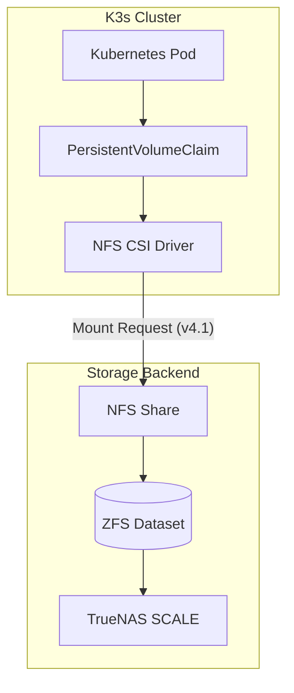

# Playbook: NFS CSI Driver Setup (K3s + TrueNAS SCALE)

## What it is

This playbook defines the technical process for configuring the NFS CSI (Container Storage Interface) driver on a K3s cluster. It enables Kubernetes pods to use persistent storage hosted on a [TrueNAS SCALE](../architecture/infrastructure.md) server via the NFS protocol, supporting dynamic volume provisioning. As of early January 2027, this is the standard for 'Invisible Kubernetes' homelab clusters.

## What problem it solves

Standard local path provisioning in K3s is limited to the storage available on individual nodes and does not support high availability or shared storage across nodes. This setup solves the "persistent storage bottleneck" by centralizing data on a dedicated NAS, allowing pods to migrate between nodes while maintaining access to their data. It is particularly useful for storing massive model weights for [Claude 5.6](../tools/ai_knowledge/claude.md) and [GPT-5.6](../tools/ai_knowledge/openai.md).

## Where it fits in the stack

**Category**: Playbook / Infrastructure. It sits in the **storage abstraction layer**, connecting the **compute cluster** (K3s) to the **data persistence layer** (TrueNAS SCALE). It integrates with [EKS Auto Mode](../knowledge_base/invisible_kubernetes.md) patterns for automated node scaling via native [Karpenter](../knowledge_base/invisible_kubernetes.md) integration, natively orchestrated using Model Context Protocol (MCP 3.1) Task Protocol agents.

## Workflow Architecture



## Typical use cases

- **Clustered App Storage**: Providing shared persistent volumes for applications like Nextcloud or Plex that may run on any cluster node.
- **Dynamic Provisioning**: Automatically creating NFS sub-directories on the NAS whenever a pod requests a new `PersistentVolumeClaim`.
- **Large Model Weights**: Storing 100GB+ weights for [Llama 4](../tools/ai_knowledge/meta_llama.md), Gemma 4, and Qwen 3.8 in a centralized, accessible location.
- **High Availability**: Ensuring service continuity by allowing pods to restart on healthy nodes without data loss during a node failure.
- **Agentic Infrastructure**: Supporting [Claude 5.6](../tools/ai_knowledge/claude.md) and [MCP](../tools/automation_orchestration/mcp.md) controlled storage lifecycle management.

## Strengths

- **Simplicity**: NFS is widely supported and easier to troubleshoot than complex block storage protocols (like iSCSI or Ceph).
- **Scalability**: Easily handles hundreds of small volumes from a single TrueNAS dataset.
- **Resource Efficiency**: Low CPU/RAM overhead on the K3s nodes compared to distributed file systems.
- **Native TrueNAS Integration**: Takes advantage of TrueNAS's robust ZFS storage backend.

## Limitations

- **Performance**: NFS is limited by network latency and bandwidth (typically 1Gbps or 10Gbps) compared to local NVMe storage.
- **No Block Support**: Only supports file-level storage, which may not be suitable for high-performance databases (though fine for most homelab apps).
- **Single Point of Failure**: If the TrueNAS server goes down, all cluster storage becomes unavailable.

## When to use it

- When you need shared, persistent storage for multiple K3s nodes.
- When you want to manage all application data from a central TrueNAS interface.
- When your workload is "read-heavy" or involves standard web application state.
- When deploying local AI models that require rapid distribution of weights across nodes.

## When not to use it

- For high-performance database clusters (like large Postgres or ClickHouse instances) that require sub-millisecond disk latency.
- If your nodes are connected via slow or unstable network links (e.g., Wi-Fi).

## Getting started

### Prerequisites
- A functional K3s cluster.
- A TrueNAS SCALE server with an NFS share configured.
- `nfs-common` installed on all K3s nodes.

### Step 1: Install NFS CSI Driver
Install the driver using Helm:

```bash
helm repo add nfs-subdir-external-provisioner https://kubernetes-sigs.github.io/nfs-subdir-external-provisioner/
helm install nfs-subdir-external-provisioner nfs-subdir-external-provisioner/nfs-subdir-external-provisioner \
    --set nfs.server=<TRUENAS_IP> \
    --set nfs.path=/mnt/pool/dataset/nfs_share
```

### Step 2: Configure StorageClass
Verify the StorageClass was created:

```bash
kubectl get storageclass
```

### Step 3: Test PersistentVolumeClaim
Create a test PVC:

```yaml
apiVersion: v1
kind: PersistentVolumeClaim
metadata:
  name: test-nfs-pvc
spec:
  accessModes:
    - ReadWriteMany
  storageClassName: nfs-client
  resources:
    requests:
      storage: 1Gi
```

### Step 4: Troubleshooting
- **Mount Errors**: Ensure the NFS share on TrueNAS allows the K3s node IPs and has the correct permissions (maproot/mapall to the owner of the dataset).
- **Driver Pods**: Check the status of the provisioner pod.

## CLI examples

```bash
# Check the status of the provisioner pod
kubectl get pods -l app=nfs-subdir-external-provisioner

# List all PVs provisioned via NFS
kubectl get pv | grep nfs

# Describe the StorageClass to verify parameters
kubectl describe storageclass nfs-client

# View logs for the provisioner to debug mount issues
kubectl logs -l app=nfs-subdir-external-provisioner --tail=50
```

## API examples

```yaml
# Example of an automated StorageClass definition for a late August 2026 cluster
apiVersion: storage.k8s.io/v1
kind: StorageClass
metadata:
  name: truenas-nfs-auto
provisioner: k8s-sigs.io/nfs-subdir-external-provisioner
parameters:
  archiveOnDelete: "true"
  pathPattern: "${.PVC.namespace}/${.PVC.name}" # Custom path pattern for better organization
mountOptions:
  - nfsvers=4.1
  - hard
  - timeo=600
  - retrans=2
  - noresvport
```

### Programmatic Integration with FastMCP 3.1 Task Protocol
Below is an early January 2027 Python validation example using strict Pydantic v2 schemas to programmatically declare and claim an NFS-backed volume for an agent task prior to scheduling:

```python
import asyncio
from typing import List, Optional
from pydantic import BaseModel, Field, field_validator, model_validator

class VolumeMountSpec(BaseModel):
    name: str = Field(..., min_length=2, description="The name of the volume mount")
    mount_path: str = Field(..., description="The directory path inside the container")

class VolumeSpec(BaseModel):
    name: str = Field(..., min_length=2, description="Volume identifier")
    storage_class: str = Field(default="truenas-nfs-auto", description="Kubernetes StorageClass name")
    capacity: str = Field(..., description="Requested storage capacity (e.g. 100Gi)")
    access_mode: str = Field(default="ReadWriteMany", description="PVC access mode")

    @field_validator("capacity")
    @classmethod
    def validate_capacity_format(cls, value: str) -> str:
        if not value.endswith(("Gi", "Mi", "Ti")):
            raise ValueError("Capacity must end with Gi, Mi, or Ti (e.g., 100Gi)")
        return value

class ContainerSpec(BaseModel):
    image: str = Field(..., description="The Docker image name and tag")
    volume_mounts: List[VolumeMountSpec] = Field(..., description="Associated volume mounts")

class TaskSpec(BaseModel):
    task_name: str = Field(..., min_length=2, description="Name of the agent task")
    volumes: List[VolumeSpec] = Field(..., description="Volumes requested by the task")
    container: ContainerSpec = Field(..., description="Container specification")

    @model_validator(mode="after")
    def verify_volume_mount_bindings(self) -> "TaskSpec":
        # Ensure that every volume mount corresponds to an existing volume
        volume_names = {v.name for v in self.volumes}
        for mount in self.container.volume_mounts:
            if mount.name not in volume_names:
                raise ValueError(f"Volume mount name '{mount.name}' is not defined in task volumes.")
        return self

# Programmatic integration demo with mock client:
class MockTask:
    def __init__(self, spec: TaskSpec):
        self.id = "task_nfs_abc123"
        self.spec = spec
        self.status = "Provisioned"

async def provision_agent_nfs_volume():
    # Programmatically define and validate an NFS CSI volume for an agent task
    task_input = {
        "task_name": "llama-4-inference-run",
        "volumes": [
            {
                "name": "nfs-model-weights",
                "storage_class": "truenas-nfs-auto",
                "capacity": "100Gi",
                "access_mode": "ReadWriteMany"
            }
        ],
        "container": {
            "image": "ollama/ollama:latest",
            "volume_mounts": [
                {
                    "name": "nfs-model-weights",
                    "mount_path": "/root/.ollama"
                }
            ]
        }
    }

    # Validate utilizing strict Pydantic v2 schemas
    validated_spec = TaskSpec(**task_input)
    print(f"Validated spec successfully for model: {validated_spec.task_name}")

    # Mock task execution
    task = MockTask(spec=validated_spec)
    print(f"Task created successfully. Task ID: {task.id}")
    print(f"Volume mapping: {task.spec.container.volume_mounts[0].mount_path}")

if __name__ == "__main__":
    asyncio.run(provision_agent_nfs_volume())
```

## Related tools / concepts

- [Infrastructure Architecture](../architecture/infrastructure.md)
- [Invisible Kubernetes](../knowledge_base/invisible_kubernetes.md)
- [K3s Cluster Setup](k3s-cluster-setup.md)
- [Paperless-ngx Service](../services/paperless-ngx.md)
- [Home Assistant Service](../services/home-assistant.md)
- [Model Context Protocol (MCP)](../tools/automation_orchestration/mcp.md)
- [Claude 5.6](../tools/ai_knowledge/claude.md)
- [GPT-5.6](../tools/ai_knowledge/openai.md)
- [Llama 4](../tools/ai_knowledge/meta_llama.md)

## Sources / References

- [NFS Subdir External Provisioner GitHub](https://github.com/kubernetes-sigs/nfs-subdir-external-provisioner)
- [TrueNAS NFS Shares Documentation](https://www.truenas.com/docs/scale/scaletutorials/shares/nfs/)
- [Kubernetes CSI Documentation](https://kubernetes.io/docs/concepts/storage/volumes/#csi)

## Contribution Metadata

- Last reviewed: 2027-01-07
- Confidence: high
