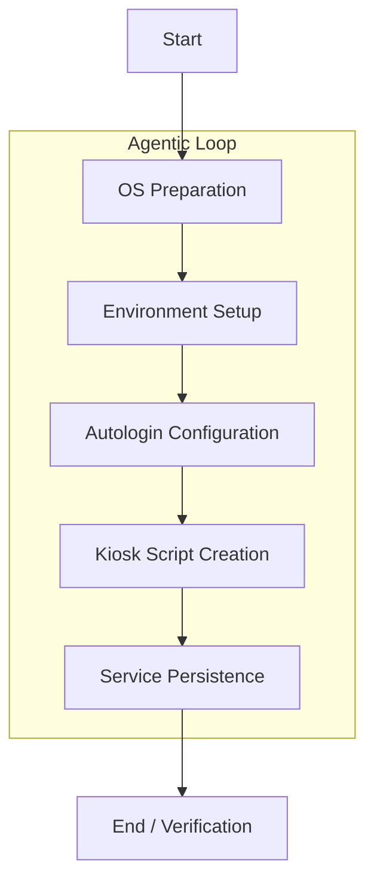

# Raspberry Pi Kiosk Automation

## What it is
Raspberry Pi Kiosk Automation is an agentic pattern for transforming a standard Raspberry Pi into a dedicated, single-purpose display or interactive dashboard. It leverages LLMs and automation agents to handle the often-tedious configuration of X11, browser settings, and persistence layers.

## What problem it solves
Setting up a reliable Raspberry Pi kiosk manually involves multiple steps: configuring autologin, installing window managers, managing display power settings, and ensuring the browser restarts on failure. This playbook automates these steps, reducing human error and ensuring a consistent, reproducible setup across multiple devices.

## Where it fits in the stack
This playbook sits in the **Operations / Playbooks** layer. It coordinates tools from the **Infrastructure** (Raspberry Pi, SSH) and **Development & Ops** (Agents) layers to create a functional hardware endpoint.

## Typical use cases
- **Home Dashboard**: Displaying Home Assistant or Grafana metrics in a kitchen or hallway.
- **Status Display**: Real-time monitoring of CI/CD pipelines or server health in an office.
- **Smart Mirror**: Providing a personalized information overlay behind a two-way mirror.
- **Retail Display**: Running a simple, non-interactive promotional website in a public space.

## Strengths
- **Consistency**: Ensures the same configuration is applied every time, eliminating "it works on my Pi" issues.
- **Resilience**: Configures systemd services to automatically recover from browser crashes or reboots.
- **Agentic Recovery**: LLM-powered agents (Claude 5.1) can detect and fix common installation errors autonomously.
- **Remote-First**: Optimized for headless setup via SSH and Tailscale.

## Limitations
- **Hardware Bound**: Specifically tailored for the Raspberry Pi hardware and Raspberry Pi OS (Debian-based).
- **Network Dependency**: Initial setup requires SSH access, typically over a local network or [Tailscale](../services/tailscale.md).
- **Resource Constraints**: Running a full Chromium browser in kiosk mode can be memory-intensive on older Pi models.

## When to use it
- When you need to deploy one or more dedicated dashboard displays quickly and reliably.
- When you want to ensure your kiosk setup is documented and reproducible via an automated agent.
- When you are using other tools in this stack (like [Tailscale](../services/tailscale.md) or [Home Assistant](../services/home-assistant.md)).

## When not to use it
- For high-security environments where the kiosk must be completely air-gapped.
- If you only need a temporary display that doesn't require persistence or automatic recovery.

## Getting started

### Pre-requisites
- A Raspberry Pi with Raspberry Pi OS installed (Bookworm or newer recommended).
- SSH access enabled via [SSH Execution Patterns](../architecture/ssh_execution_patterns.md).
- An August 2026-class agent like [Claude Code](../tools/development_ops/claude-code.md) (v5.1), [Aider](../tools/development_ops/aider.md), or [Llama 4](../tools/ai_knowledge/llama.md).

### Typical Automation Workflow



## CLI examples

### Installing Kiosk Dependencies
An agent running commands on a remote Pi via SSH.
```bash
# Update and install core kiosk requirements
sudo apt update && sudo apt install -y --no-install-recommends \
    xserver-xorg x11-xserver-utils xinit openbox \
    chromium-browser unclutter
```

### Checking Kiosk Service Logs
Diagnosing startup failures via systemd.
```bash
# View the last 50 lines of the kiosk service log
journalctl -u kiosk.service -n 50 --no-pager
```

## API examples

### Remotely Updating the Kiosk URL
An agent utilizing a management API or SSH to update the target dashboard.
```python
import subprocess

def update_kiosk_url(pi_host, new_url):
    # Remote command to update the kiosk script URL
    remote_cmd = f"sed -i 's|--kiosk .*|--kiosk {new_url}|' /home/pi/kiosk.sh"
    subprocess.run(["ssh", f"pi@{pi_host}", remote_cmd])

    # Restart the service to apply changes
    subprocess.run(["ssh", f"pi@{pi_host}", "sudo systemctl restart kiosk"])

# Update kitchen dashboard to new Home Assistant view
update_kiosk_url("kitchen-pi.local", "http://ha.local:8123/dashboard-kitchen")
```

### Kiosk Startup Script (kiosk.sh)
The core script executed by Xinit to launch the browser.
```bash
#!/bin/bash
xset s noblank
xset s off
xset -dpms
unclutter -idle 0.5 -root &
# Clear crash flags to avoid Chromium "Restore pages" popup
sed -i 's/"exited_cleanly":false/"exited_cleanly":true/' /home/pi/.config/chromium/Default/Preferences
sed -i 's/"exit_type":"Crashed"/"exit_type":"Normal"/' /home/pi/.config/chromium/Default/Preferences
/usr/bin/chromium-browser --noerrdialogs --disable-infobars --kiosk http://your-dashboard-url.local
```

## Related tools / concepts
- [SSH Execution Patterns](../architecture/ssh_execution_patterns.md) — The underlying security and execution model.
- [Tailscale](../services/tailscale.md) — Recommended for secure remote access.
- [Home Assistant](../services/home-assistant.md) — A common dashboard target.
- [Aider](../tools/development_ops/aider.md) — A CLI-based agent for performing this setup.
- [Claude Code](../tools/development_ops/claude-code.md) — Agent for autonomous infrastructure tasks.
- [Paperless-ngx](../services/paperless-ngx.md) — For displaying digitized documents.
- [Grafana](../services/grafana.md) — For high-density monitoring dashboards.

## Sources / References
- [Official Raspberry Pi Documentation](https://www.raspberrypi.com/documentation/)
- [Model Context Protocol Specification v3.1](https://modelcontextprotocol.org/spec)
- https://github.com/joanmarcriera/Home-office-automations
- [Chromium Command Line Switches](https://peter.sh/experiments/chromium-command-line-switches/)

## Contribution Metadata
- Last reviewed: 2026-08-20
- Confidence: high
