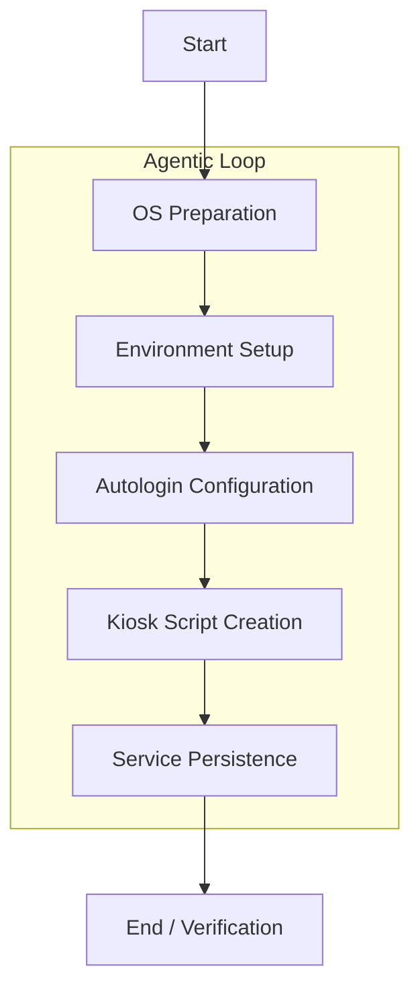

# Raspberry Pi Kiosk Automation

## What it is
Raspberry Pi Kiosk Automation is an agentic pattern for transforming a standard Raspberry Pi into a dedicated, single-purpose display or interactive dashboard. It leverages LLMs and automation agents to handle the often-tedious configuration of X11, browser settings, and persistence layers.

## What problem it solves
Setting up a reliable Raspberry Pi kiosk manually involves multiple steps: configuring autologin, installing window managers, managing display power settings, and ensuring the browser restarts on failure. This playbook automates these steps, reducing human error and ensuring a consistent, reproducible setup across multiple devices.

## Where it fits in the stack
This playbook sits in the **Operations / Playbooks** layer. It coordinates tools from the **Infrastructure** (Raspberry Pi, SSH), **Development & Ops** (Agents), and **Services** (Dashboards) layers to create a functional hardware endpoint.

## Typical use cases
- **Home Dashboard**: Displaying Home Assistant or Grafana metrics in a kitchen or hallway.
- **Status Display**: Real-time monitoring of CI/CD pipelines or server health in an office.
- **Smart Mirror**: Providing a personalized information overlay behind a two-way mirror.
- **Retail Display**: Running a simple, non-interactive promotional website in a public space.

## Strengths
- **Consistency**: Ensures the same configuration is applied every time, eliminating "it works on my Pi" issues.
- **Resilience**: Configures systemd services to automatically recover from browser crashes or reboots.
- **Agentic Recovery**: LLM-powered agents can detect and fix common installation errors (e.g., missing dependencies or network timeouts) autonomously.

## Limitations
- **Hardware Bound**: Specifically tailored for the Raspberry Pi hardware and Raspberry Pi OS (Debian-based).
- **Network Dependency**: Initial setup requires SSH access, typically over a local network or [Tailscale](../services/tailscale.md).
- **Resource Constraints**: Running a full Chromium browser in kiosk mode can be memory-intensive on older Pi models (e.g., Pi 3 or Zero).

## When to use it
- When you need to deploy one or more dedicated dashboard displays quickly and reliably.
- When you want to ensure your kiosk setup is documented and reproducible via an automated agent.
- When you are using other tools in this stack (like [Tailscale](../services/tailscale.md) or [Home Assistant](../services/home-assistant.md)) and want to integrate the display.

## When not to use it
- For high-security environments where the kiosk must be completely air-gapped (initial agent setup requires a connection).
- If you only need a temporary display that doesn't require persistence or automatic recovery.

## Getting started

### Pre-requisites
- A Raspberry Pi with Raspberry Pi OS installed (Bookworm or newer recommended).
- SSH access enabled via [SSH Execution Patterns](../architecture/ssh_execution_patterns.md).
- A June 2026-class agent like [Claude Code](../tools/development_ops/claude-code.md) (v4.7), [Aider](../tools/development_ops/aider.md) (with GPT-5.5), or [Llama 4 Maverick](../tools/ai_knowledge/llama.md) configured for remote execution.

### Typical Automation Workflow



The agent follows an iterative "Propose-Execute-Observe" loop to configure the Pi:

1.  **OS Preparation**: Agent checks the OS version and updates packages.
    - *Command*: `lsb_release -a && sudo apt update && sudo apt upgrade -y`
2.  **Environment Setup**: Agent installs necessary kiosk dependencies (X11, Chromium, Matchbox window manager).
    - *Command*: `sudo apt install --no-install-recommends xserver-xorg x11-xserver-utils xinit openbox chromium-browser unclutter`
3.  **Autologin Configuration**: Agent modifies `/etc/lightdm/lightdm.conf` or uses `raspi-config` non-interactively to ensure the `pi` user logs in automatically to the desktop.
4.  **Kiosk Script Creation**: Agent writes a startup script (`/home/pi/kiosk.sh`):
    ```bash
    #!/bin/bash
    xset s noblank
    xset s off
    xset -dpms
    unclutter -idle 0.5 -root &
    sed -i 's/"exited_cleanly":false/"exited_cleanly":true/' /home/pi/.config/chromium/Default/Preferences
    sed -i 's/"exit_type":"Crashed"/"exit_type":"Normal"/' /home/pi/.config/chromium/Default/Preferences
    /usr/bin/chromium-browser --noerrdialogs --disable-infobars --kiosk http://your-dashboard-url.local
    ```
5.  **Service Persistence**: Agent creates a systemd service (`/etc/systemd/system/kiosk.service`):
    ```ini
    [Unit]
    Description=Raspberry Pi Kiosk
    After=network.target

    [Service]
    ExecStart=/usr/bin/xinit /home/pi/kiosk.sh -- :0
    Restart=always
    User=pi
    Group=pi
    Environment=DISPLAY=:0
    Environment=XAUTHORITY=/home/pi/.Xauthority

    [Install]
    WantedBy=graphical.target
    ```

## Related tools / concepts
- [SSH Execution Patterns](../architecture/ssh_execution_patterns.md) — The underlying security and execution model for this playbook.
- [Tailscale](../services/tailscale.md) — Recommended for secure remote access and management of the kiosk.
- [Home Assistant](../services/home-assistant.md) — A common dashboard target for kiosk displays.
- [Custom Agents](../tools/development_ops/custom_agents.md) — For building specialized agents to manage large kiosk fleets.
- [Aider](../tools/development_ops/aider.md) — A CLI-based agent capable of performing this setup via SSH.
- [Claude Code](../tools/development_ops/claude-code.md) — Another powerful agent for autonomous infrastructure tasks.
- [Paperless-ngx](../services/paperless-ngx.md) — Can be used to store and display digitized documents on the kiosk.
- [Grafana](../services/grafana.md) — For displaying high-density infrastructure monitoring dashboards.

## Security Considerations
- **SSH Key Management**: Ensure the agent uses a dedicated, restricted SSH key for kiosk configuration.
- **Kiosk User Lockdown**: The `pi` user should have restricted permissions, especially if the kiosk is in a public area.
- **Network Isolation**: Place kiosks on a dedicated IoT VLAN where possible, using [Tailscale](../services/tailscale.md) for management.

## Troubleshooting with Agents
If the kiosk fails to start, modern agents like Claude 4.7 can be pointed at the logs to diagnose issues:
- `journalctl -u kiosk.service -n 50`
- `cat /home/pi/.xsession-errors`

## Sources / References
- [Official Raspberry Pi Documentation](https://www.raspberrypi.com/documentation/)
- https://github.com/joanmarcriera/Home-office-automations

## Contribution Metadata
- Last reviewed: 2026-06-07
- Confidence: high
