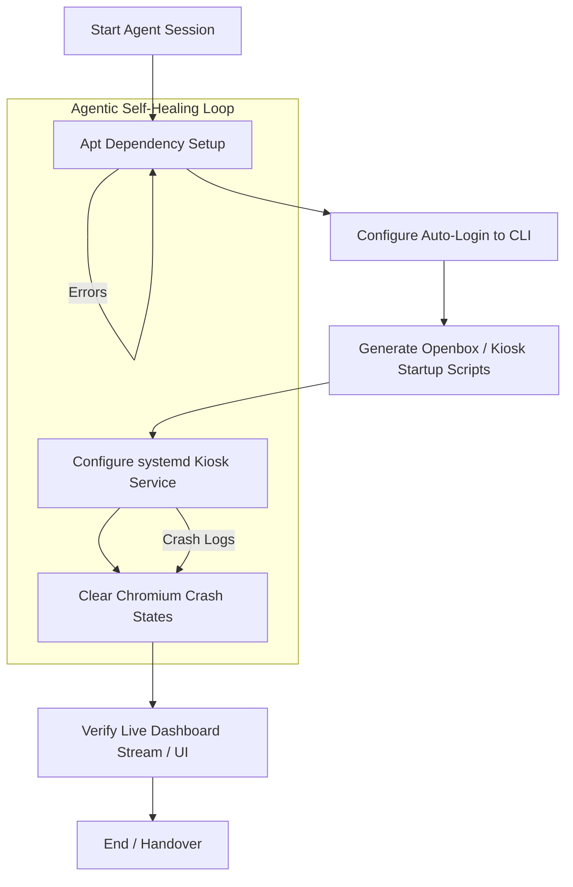

# Raspberry Pi Kiosk Automation

## What it is
Raspberry Pi Kiosk Automation is an agentic operational pattern for transforming standard Raspberry Pi devices into dedicated, single-purpose interactive dashboards, digital signage, or smart mirror endpoints. By leveraging autonomous LLMs (e.g., Claude 5.6 and GPT-5.6) coupled with execution servers adhering to the Model Context Protocol (MCP v3.1 / FastMCP 3.1), this pattern orchestrates headless display configuration, browser optimization, window management, and remote state healing without manual operator intervention.

## What problem it solves
Deploying and maintaining reliable physical displays typically involves a complex series of manual configurations including setting up lightweight window managers, handling auto-login, disabling screen blanking and power management (DPMS), and clearing browser crash flags upon unexpected power cuts. In standard setups, Chromium often displays annoying "Restore pages" popups or resource-exhaustion crashes. This playbook automates these brittle steps via agentic execution loops and provides robust systemd-level resilience, ensuring re-entrant, self-healing, and unattended kiosk behavior.

## Where it fits in the stack
This playbook resides in the **Operations / Playbooks** layer of the homelab automation stack. It links high-level agentic tools from the **Development & Ops** layer (such as [Claude Code](../tools/development_ops/claude-code.md) or [Aider](../tools/development_ops/aider.md)) to bare-metal hardware and operating system parameters in the **Infrastructure** layer, relying on [Tailscale](../services/tailscale.md) for secure, encrypted remote shell access.

## Typical use cases
- **Homelab Command Center**: Launching full-screen [Home Assistant](../services/home-assistant.md) or [Grafana](../tools/process_understanding/grafana-cloud.md) dashboards in kitchens, workshops, or server closets.
- **Continuous Monitoring**: High-density display of real-time CI/CD status, system resources, and network traffic.
- **Smart Mirror Integration**: Low-latency information overlay (weather, transit, calendar events) powered by fully-offline transcription or local model services.
- **Interactive Intake Kiosk**: Providing localized entry portals for household administration or school forms connected to databases.

## Strengths
- **Fully Automated Provisioning**: Replaces hour-long manual configuration checklists with a single execution step orchestrated by an LLM agent.
- **Unattended Recovery**: Leverages lightweight systemd service supervisors to automatically clear Chromium crash files, clear locks, and restart the browser on crash.
- **Low Footprint**: Tailored to run efficiently with lightweight X11 (Openbox/Xinit) without the overhead of heavy desktop environments like GNOME or KDE.
- **Agentic Self-Correction**: Built-in remote diagnostic scripts allow agents like Claude 5.6 to detect missing dependencies or misconfigured environment variables and resolve them autonomously.

## Limitations
- **Debian/Raspberry Pi OS Specific**: Specifically tailored to Debian-based Raspberry Pi OS (Bookworm or newer) running either classic X11 or Wayland (with specific modifications required for Wayfire).
- **Resource Constraints**: Running chromium-browser on older 1GB/2GB RAM Pi models can cause heavy swapping; memory tuning is critical.
- **Network Dependency**: Initial setup relies on secure SSH/Tailscale handshakes. If the interface loses local link, recovery requires physical console access.

## When to use it
- When you are deploying multiple status dashboards or smart mirrors across your home-office or organization.
- When you want to eliminate human error, ensuring absolute reproducibility and configuration-as-code for hardware endpoints.
- When you want your automated agent to have the ability to remotely diagnose, monitor, and configure edge displays using standard protocols.

## When not to use it
- In highly locked-down enterprise networks where remote configuration of edge displays is strictly forbidden.
- For temporary, non-persistent browser displays that do not need to survive power cycles or unexpected system reboots.
- If the hardware platform is running a non-Debian micro-OS (like Alpine Linux or baremetal kiosk firmware) which does not use systemd/apt.

## Getting started

### Pre-requisites
- A Raspberry Pi (Model 3B+, 4, or 5) running Raspberry Pi OS (Bookworm or newer recommended).
- SSH server enabled and Tailscale installed on the Pi for remote access.
- A modern agent framework utilizing Claude 5.6, GPT-5.6, or Gemini 4.0 Ultra connected to a local shell execution MCP server (FastMCP 3.1).

### Typical Automation Workflow



## CLI examples

### Dependency Provisioning via SSH
An LLM agent executing native apt tasks on the target Raspberry Pi over a Tailscale connection:
```bash
# Update repositories and install minimal window managers, Chromium, and tools
sudo apt-get update && sudo apt-get install -y --no-install-recommends \
    xserver-xorg x11-xserver-utils xinit openbox \
    chromium-browser unclutter sed xdotool
```

### Remote Service Diagnostics
An agent auditing the status of the local kiosk browser execution unit:
```bash
# Inspect systemd kiosk unit logs for launch failures or browser crashes
journalctl --unit=kiosk.service --lines=100 --no-pager
```

### Forcing Remote Refresh
Simulating user input to force-refresh chromium on the edge device without rebooting:
```bash
# Send an F5 keyboard stroke to the active chromium window via X11 display channel :0
DISPLAY=:0 xdotool search --onlyvisible --class "chromium" windowactivate key F5
```

## API examples

### Kiosk Configuration Validation (Python & Pydantic v2)
The following Python script illustrates how an agent uses Pydantic v2 to validate the configuration of a kiosk group before applying the settings remotely via an SSH execution backend.

```python
from typing import List, Optional
from pydantic import BaseModel, Field, HttpUrl, ValidationError

class BrowserFlags(BaseModel):
    disable_infobars: bool = Field(default=True, alias="disable-infobars")
    noerrdialogs: bool = Field(default=True, alias="noerrdialogs")
    kiosk_mode: bool = Field(default=True, alias="kiosk")
    incognito: bool = Field(default=False)
    disable_translate: bool = Field(default=True)

class KioskDeviceConfig(BaseModel):
    device_id: str = Field(pattern=r"^[a-zA-Z0-9\-_]+$")
    host_ip: str = Field(description="Tailscale or local IP address of the Pi")
    dashboard_url: HttpUrl = Field(description="Target dashboard HTTP/HTTPS endpoint")
    refresh_interval_seconds: int = Field(default=3600, ge=30)
    flags: BrowserFlags = Field(default_factory=BrowserFlags)
    fallback_urls: List[HttpUrl] = Field(default_factory=list)

def apply_device_config(config_data: dict) -> str:
    try:
        # Strict Pydantic v2 validation
        config = KioskDeviceConfig.model_validate(config_data)

        # Build the command string based on validated properties
        flag_str = ""
        if config.flags.kiosk_mode:
            flag_str += " --kiosk"
        if config.flags.disable_infobars:
            flag_str += " --disable-infobars"
        if config.flags.noerrdialogs:
            flag_str += " --noerrdialogs"
        if config.flags.incognito:
            flag_str += " --incognito"

        cmd = f"chromium-browser{flag_str} {config.dashboard_url}"
        print(f"Validation passed for device: {config.device_id}")
        return f"ssh pi@{config.host_ip} 'echo \"{cmd}\" > /home/pi/kiosk.sh'"
    except ValidationError as e:
        print(f"Configuration validation failed: {e}")
        raise

# Example payload to validate
kiosk_payload = {
    "device_id": "kitchen-pi-01",
    "host_ip": "100.115.22.41",
    "dashboard_url": "http://homeassistant.local:8123/lovelace-kiosk",
    "refresh_interval_seconds": 1800,
    "flags": {
        "kiosk": True,
        "disable-infobars": True,
        "noerrdialogs": True,
        "incognito": True
    }
}

command_to_run = apply_device_config(kiosk_payload)
print(f"Generated Deploy Shell Command:\n{command_to_run}")
```

### Self-Healing Kiosk Shell Script (`/home/pi/kiosk.sh`)
This robust, non-blocking bash script is run by the X display server initialization to handle window hiding, blanking avoidance, and chromium error clearing.
```bash
#!/bin/bash
# Disable screensaver and power management
xset s noblank
xset s off
xset -dpms

# Hide mouse cursor when inactive for 0.5 seconds
unclutter -idle 0.5 -root &

# Clear Chromium crash logs and clean exit flags to prevent restore session popups
CONFIG_FILE="/home/pi/.config/chromium/Default/Preferences"
if [ -f "$CONFIG_FILE" ]; then
    sed -i 's/"exited_cleanly":false/"exited_cleanly":true/g' "$CONFIG_FILE"
    sed -i 's/"exit_type":"Crashed"/"exit_type":"Normal"/g' "$CONFIG_FILE"
fi

# Infinite loop to launch Chromium and respawn immediately on unexpected crash
while true; do
    /usr/bin/chromium-browser \
        --noerrdialogs \
        --disable-infobars \
        --disable-translate \
        --kiosk \
        --no-first-run \
        --fast --fast-start \
        "http://homeassistant.local:8123/lovelace-kiosk"
    sleep 3
done
```

## Related tools / concepts
- [SSH Execution Patterns](../architecture/ssh_execution_patterns.md) — The underlying remote execution and security model.
- [Tailscale](../services/tailscale.md) — Recommended secure Mesh VPN for headless remote administration.
- [Home Assistant](../services/home-assistant.md) — Common visual smart home dashboard target.
- [Aider](../tools/development_ops/aider.md) — CLI-based git-integrated agent useful for deployment configuration.
- [Claude Code](../tools/development_ops/claude-code.md) — SOTA local software agent to automate infrastructure.
- [Paperless-ngx](../services/paperless-ngx.md) — For displaying digitized family/school records.
- [Grafana](../tools/process_understanding/grafana-cloud.md) — High-density monitoring dashboard for visual kiosks.
- [Model Context Protocol (MCP)](../tools/automation_orchestration/mcp.md) — Protocol for remote shell and file tool interactions.

## Sources / References
- [Official Raspberry Pi Documentation](https://www.raspberrypi.com/documentation/)
- [Model Context Protocol Specification v3.1](https://modelcontextprotocol.org/spec)
- [Chromium Command Line Switches](https://peter.sh/experiments/chromium-command-line-switches/)
- [Home Assistant Kiosk Mode](https://github.com/maykar/kiosk-mode)

## Contribution Metadata
- Last reviewed: 2027-01-07
- Confidence: high
