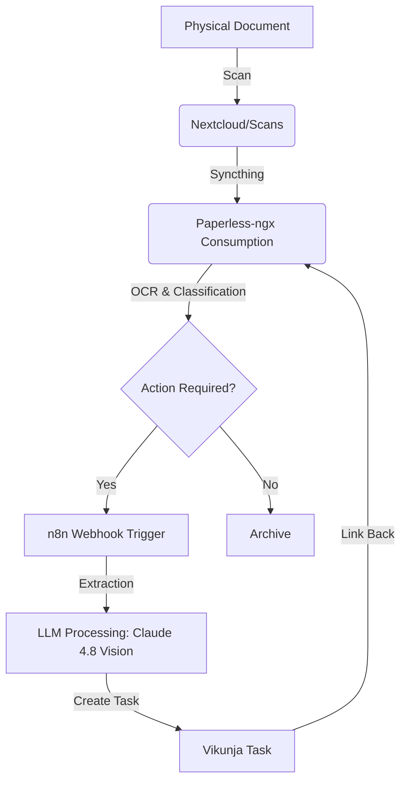

# Playbook: Scan to Task

## What it is
Scan to Task is a paperless automation pattern that transforms physical documents (mail, receipts, invoices) into actionable digital tasks. It uses OCR, LLM-based extraction, and workflow orchestration to eliminate manual data entry.

## What problem it solves
Managing physical paperwork often leads to forgotten deadlines or lost information. Scan to Task digitizes the intake process, automatically identifying due dates, amounts, and required actions from scanned images or PDFs, and injecting them directly into a task management system.

## Where it fits in the stack
This playbook sits in the **Operations / Playbooks** layer. It orchestrates the flow of data between **Services** (Paperless-ngx, Nextcloud, Vikunja) and uses **Automation & Orchestration** (n8n) and **AI Models** (via Ollama or APIs) for reasoning.

## Typical use cases
- **Invoice Management**: Scanning a utility bill and automatically creating a task in Vikunja with the due date and amount.
- **Mail Triage**: Scanning incoming letters and creating tasks for items requiring a response.
- **Receipt Archival**: Scanning receipts for expense tracking, with the LLM (Claude 4.8 Vision) extracting the vendor and total.
- **Warranty Tracking**: Scanning product manuals or receipts to create a reminder for warranty expiration.

## Strengths
- **Automation**: Reduces the friction of moving from physical paper to a digital action list.
- **Searchability**: Documents are indexed and searchable in Paperless-ngx, linked directly from the task.
- **Accuracy**: LLMs can extract structured data from diverse document layouts better than traditional regex-based systems.
- **Vision Mastery**: Claude 4.8's improved vision capabilities allow for high-accuracy extraction from crumpled or low-contrast scans.

## Limitations
- **OCR Quality**: Success depends on the clarity of the original scan; handwritten or low-contrast text may fail (mitigated by using Claude 4.8 Vision).
- **Privacy**: If using cloud-based LLMs, sensitive document text is sent to an external provider (mitigated by using local models).
- **Setup Complexity**: Requires multiple services (Paperless, n8n, Vikunja) to be correctly configured and integrated.

## When to use it
- When you have a significant volume of physical documents that require action.
- When you want to maintain a centralized, searchable archive of all paperwork alongside your task list.
- When you want to leverage AI to automate the "understanding" phase of document management.

## When not to use it
- For very high-security documents that should never be digitized or processed by an LLM.
- If you only have one or two documents a month; manual entry is simpler in that case.

## Getting started
To implement Scan to Task:
1.  **Setup Paperless-ngx**: Configure a consumption directory and ensure OCR is active.
2.  **Configure n8n**: Build a workflow that triggers on "Document Created" or "Tag Added" in Paperless.
3.  **Integrate LLM**: Use a node in n8n to send the document text/image to Claude 4.8 Vision or a local Llama 4 model.
4.  **Connect Task Manager**: Add a Vikunja or Google Tasks node to create the resulting task.

### Workflow Architecture (June 2026 Update)



### Step-by-Step Flow
1.  **Ingestion**: Physical scan via mobile app or scanner reaches the `Nextcloud/Scans` folder.
2.  **Processing**: [Syncthing](../services/syncthing.md) moves the file to the Paperless consumption directory.
3.  **Understanding**: Paperless performs OCR and classifies the document. If it detects a keyword like "Invoice" or "Due", it adds the tag `action-required`.
4.  **Trigger**: n8n monitors Paperless via webhook for the `action-required` tag.
5.  **Reasoning**: n8n sends the OCR text and/or page images to Claude 4.8 Vision using the [Extraction and Classification Prompt](../reference-implementations/llm-prompts/extraction-and-classification.md).
6.  **Action**: n8n creates a task in Vikunja with a title, description, and due date.
7.  **Linking**: The Vikunja task description includes a direct link to the Paperless document.

## CLI examples
Using the Paperless-ngx CLI or API for management.

```bash
# Manually trigger a re-processing of a document for task extraction
docker exec paperless-ngx document_renamer --id 123

# Export documents for backup before processing
python3 manage.py document_exporter /path/to/export

# List documents with the 'action-required' tag via API
curl -H "Authorization: Token <your-token>" \
     "https://paperless.local/api/documents/?tags__name__icontains=action-required"
```

## API examples
Integration between Paperless-ngx, n8n, and Vikunja.

```javascript
// n8n Function node to format the LLM output for Vikunja
const llmResponse = items[0].json.llm_output;
const taskData = {
    title: `Pay: ${llmResponse.vendor} - ${llmResponse.amount}`,
    description: `Extracted from Paperless document: ${items[0].json.paperless_url}\nNotes: ${llmResponse.summary}`,
    due_date: llmResponse.due_date,
    priority: 3
};
return [{ json: taskData }];
```

```python
# Python snippet for local extraction using Ollama
import requests

def extract_task(ocr_text):
    prompt = f"Extract due date and amount from this invoice text: {ocr_text}"
    response = requests.post("http://localhost:11434/api/generate",
                             json={"model": "llama4", "prompt": prompt, "stream": False})
    return response.json()["response"]
```

## Related tools / concepts
- [Paperless-ngx](../services/paperless-ngx.md)
- [Vikunja](../services/vikunja.md)
- [n8n](../services/n8n.md)
- [Ollama](../services/ollama.md)
- [Syncthing](../services/syncthing.md)
- [Nextcloud](../services/nextcloud.md)
- [OCRmyPDF](../tools/process_understanding/ocrmypdf.md)
- [Extraction and Classification Prompt](../reference-implementations/llm-prompts/extraction-and-classification.md)
- [Docling MCP](../tools/process_understanding/docling-mcp.md)
- [Home Admin Agent Architecture](../knowledge_base/home-admin-agent-architecture.md)

## Sources / References
- [Paperless-ngx Documentation](https://docs.paperless-ngx.com/)
- [n8n Library: Paperless to Task](https://n8n.io/workflows/)
- [Vikunja API Documentation](https://vikunja.io/docs/api/)

## Contribution Metadata
- Last reviewed: 2026-06-25
- Confidence: high
