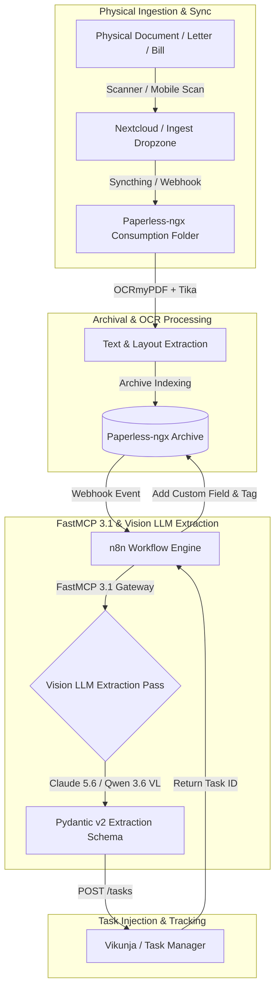

# Playbook: Scan to Task

A paperless automation playbook for transforming physical documents (mail, receipts, invoices, tax forms) into structured, actionable digital tasks linked to searchable archives under early January 2027 standards.

## What it is
Scan to Task is an end-to-end operational automation pattern that bridge physical paper documents and digital task management systems. Utilizing modern Optical Character Recognition (OCR), Vision-Language Models (**Claude 5.6 Vision**, **Qwen 3.6 VL**, **GPT-5.6**), and workflow engines ([n8n](../services/n8n.md)), physical documents placed on a feeder scanner or photographed via mobile app are automatically ingested, parsed for actionable items (due dates, financial amounts, follow-up actions), and injected directly into task platforms ([Vikunja](../services/vikunja.md), Todoist) with deep links back to document storage ([Paperless-ngx](../services/paperless-ngx.md)).


```mermaid
flowchart TD
    subgraph Capture["Physical Ingestion & Sync"]
        Doc[Physical Document / Letter / Bill] -->|Scanner / Mobile Scan| Landing[Nextcloud / Ingest Dropzone]
        Landing -->|Syncthing / Webhook| Consumption[Paperless-ngx Consumption Folder]
    end

    subgraph OCR_Storage["Archival & OCR Processing"]
        Consumption -->|OCRmyPDF + Tika| OCR[Text & Layout Extraction]
        OCR -->|Archive Indexing| DB[(Paperless-ngx Archive)]
    end

    subgraph Agentic_Extraction["FastMCP 3.1 & Vision LLM Extraction"]
        DB -->|Webhook Event| Orchestrator[n8n Workflow Engine]
        Orchestrator -->|FastMCP 3.1 Gateway| VisionLLM{Vision LLM Extraction Pass}
        VisionLLM -->|Claude 5.6 / Qwen 3.6 VL| StructData[Pydantic v2 Extraction Schema]
    end

    subgraph Action_Execution["Task Injection & Tracking"]
        StructData -->|POST /tasks| TaskMgr[Vikunja / Task Manager]
        TaskMgr -->|Return Task ID| Orchestrator
        Orchestrator -->|Add Custom Field & Tag| DB
    end
```

## What problem it solves
Managing physical mail, invoices, receipts, and medical notices presents significant operational challenges in both home and business settings:

1. **Lost Information and Missed Deadlines**: Physical paperwork is easily misplaced, leading to late fees on bills or missed reply deadlines.
2. **Manual Data Entry Friction**: Copying invoice totals, due dates, account numbers, and vendor names into task managers or spreadsheets is tedious and error-prone.
3. **Disconnected Archives**: Even when documents are scanned, the resulting PDF is often disconnected from the corresponding task or calendar event.

Scan to Task eliminates manual data entry by extracting structured metadata via multimodal LLMs, automatically scheduling tasks with correct due dates, and linking the task back to the searchable archival document in Paperless-ngx.

## Where it fits in the stack
Scan to Task sits in the **Operations & Playbooks Layer**, orchestrating interactions across multiple self-hosted services and AI models:

- **Ingestion & Storage Layer**: Paperless-ngx, Nextcloud, Syncthing.
- **OCR Engine**: OCRmyPDF, Tika, Docling MCP.
- **Orchestration Layer**: n8n v1.65+, FastMCP 3.1 Task Protocol adapters.
- **Reasoning Layer**: Ollama (local Llama 4 / Gemma 4 Vision) or Cloud Vision APIs (Claude 5.6 Vision, GPT-5.6).
- **Target Execution System**: Vikunja, Todoist, Google Tasks, Outlook Tasks.

## Typical use cases

### 1. Automated Utility & Supplier Bill Processing
- **Process**: Scanning a utility bill immediately extracts vendor name ("PG&E"), bill total ("$184.20"), due date ("2027-01-28"), and payment link.
- **Result**: Creates a high-priority task in Vikunja under the `Finance` project with a due date reminder 3 days prior.

### 2. Legal & Governmental Mail Triage
- **Process**: Processing official letters (e.g., jury summons, property tax notices) extracts required action items and compliance deadlines.
- **Result**: Schedules mandatory calendar reminders and assigns tasks to household or team members.

### 3. Medical & Insurance Document Management
- **Process**: Ingesting Explanation of Benefits (EOB) statements or medical claims identifies patient copays and pending reimbursement deadlines.
- **Result**: Generates follow-up tracking tasks linked to the specific claim document ID.

### 4. Warranty & Purchase Receipt Tracking
- **Process**: Scanning purchase receipts extracts item description, store location, purchase price, and warranty period.
- **Result**: Files receipt in Paperless-ngx and creates a reminder task 30 days prior to warranty expiration.

## Strengths
- **Zero-Touch Automation**: Dropping paper into a document scanner automatically triggers OCR, AI extraction, and task creation without human intervention.
- **High-Fidelity Extraction**: Modern Vision LLMs (Claude 5.6 Vision, Qwen 3.6 VL) reliably handle handwritten notes, low-contrast thermal receipts, and complex table layouts.
- **Bidirectional Traceability**: The created task contains a direct URL to the Paperless-ngx document, while the Paperless-ngx document is tagged with the task ID.
- **Flexible AI Integration**: Works with both local privacy-preserving LLMs (Ollama) and high-accuracy enterprise APIs.

## Limitations
- **Multi-Service Dependency**: Requires stable connectivity and proper configuration across Paperless-ngx, n8n, and Vikunja.
- **Scan Quality Thresholds**: Extremely damaged, smudged, or torn physical documents may cause OCR/LLM extraction errors, requiring manual review.
- **Token Usage Costs**: Using cloud vision APIs for multi-page document streams can incur API costs (mitigated by local Qwen 3.6 VL or Gemma 4 Vision models).

## When to use it
- When managing high volumes of physical paperwork that require action or tracking.
- When building a local-first, privacy-conscious paperless home or small office environment.
- When seeking to reduce administrative overhead and eliminate missed deadlines.

## When not to use it
- For high-security classified documents that are strictly prohibited from digital storage or OCR processing.
- For extremely low-volume workflows (1-2 documents per month) where manual task creation takes less time than automated pipeline maintenance.

## Getting started

### Prerequisites Setup
1. **Paperless-ngx**: Installed and configured with consumption folder monitoring.
2. **n8n Workflow Engine**: Running n8n v1.65+ with webhook capabilities.
3. **Task Manager**: Vikunja or Todoist instance with API tokens generated.
4. **Vision Model Access**: Local Ollama instance running `qwen2.5-vl` or API keys for Claude 5.6 / GPT-5.6.

### Architecture Step-by-Step

1. **Scan Document**: Scan paper document directly into `Nextcloud/Scans` or local network share.
2. **Paperless Ingestion**: Paperless-ngx picks up the file, runs OCRmyPDF, indexes text, and assigns a document ID (e.g., `DOC-402`).
3. **n8n Webhook Trigger**: Paperless-ngx workflow trigger emits a POST event to n8n containing `document_id`.
4. **Extraction Pass**: n8n invokes FastMCP 3.1 vision extraction tool, passing document image or text content to Vision LLM.
5. **Task Injection**: Validated extraction payload is posted to Vikunja REST API, creating a new task with due date, priority, and link back to `http://paperless.local/documents/402`.

## CLI examples

### Triggering Document Consumption Manually
```bash
# Force Paperless-ngx to scan consumption directory for new files
docker exec -it paperless-app python3 manage.py document_consumer

# Verify consumption queue status
docker exec -it paperless-app python3 manage.py document_importer --status
```

### Inspecting n8n Ingestion Workflows
```bash
# Query active executions in n8n database
docker exec -it n8n-server sqlite3 /files/sqlite.db \
  "SELECT id, workflowId, mode, retryOf, startedAt FROM execution_entity WHERE status = 'running' ORDER BY startedAt DESC LIMIT 5;"
```

## API examples

### FastMCP 3.1 Extraction Gateway Server
The following complete Python FastMCP 3.1 server processes scanned document payloads and generates structured task payloads using **Pydantic v2**:

```python
import os
import json
from datetime import datetime, timezone
from typing import List, Optional
from mcp.server.fastmcp import FastMCP
from pydantic import BaseModel, Field, HttpUrl, ConfigDict

# Initialize FastMCP 3.1 Task Server
mcp = FastMCP(
    name="Scan-to-Task FastMCP 3.1 Gateway",
    version="3.1.0",
    description="Extracts actionable task items from scanned document OCR streams"
)

# Pydantic v2 Models for Task Payload Validation
class ExtractedTaskItem(BaseModel):
    model_config = ConfigDict(extra="forbid")
    title: str = Field(..., min_length=3, description="Concise task title summarizing action required")
    description: str = Field(..., description="Detailed description including extracted document details")
    due_date: Optional[str] = Field(None, description="ISO 8601 formatted due date (YYYY-MM-DD)")
    priority: int = Field(default=2, ge=1, le=5, description="Task priority (1=Lowest, 5=Urgent)")
    category: str = Field(default="Inbox", description="Target project category (Finance, Legal, Health)")
    monetary_amount: Optional[float] = Field(None, description="Extracted dollar value if bill or invoice")
    vendor_or_sender: Optional[str] = Field(None, description="Extracted vendor or sender name")

class ScanToTaskRequest(BaseModel):
    model_config = ConfigDict(extra="forbid")
    document_id: int = Field(..., description="Paperless-ngx document ID")
    paperless_url: HttpUrl = Field(..., description="Base URL of Paperless-ngx instance")
    ocr_content: str = Field(..., min_length=10, description="Full OCR text extracted from document")

class TaskCreationPayload(BaseModel):
    title: str
    description: str
    due_date: Optional[str]
    priority: int
    labels: List[str]
    paperless_doc_url: str
    mcp_protocol_version: str = "3.1"

@mcp.tool(
    name="parse_scan_to_task",
    description="Parses OCR text using LLM extraction and builds structured task payload"
)
def parse_scan_to_task_tool(request: ScanToTaskRequest) -> TaskCreationPayload:
    # Simulated Vision/Text LLM extraction logic (Claude 5.6 / Qwen 3.6 VL)
    ocr_upper = request.ocr_content.upper()

    # Simple deterministic heuristic fallback for illustration
    is_bill = "BILL" in ocr_upper or "INVOICE" in ocr_upper or "AMOUNT DUE" in ocr_upper

    title = f"Action Required: Process Document #{request.document_id}"
    category = "Finance" if is_bill else "General"
    priority = 4 if is_bill else 2

    doc_link = f"{str(request.paperless_url).rstrip('/')}/documents/{request.document_id}"

    description = (
        f"Extracted automatically from Paperless-ngx Document #{request.document_id}.\n\n"
        f"**Original Document**: [View in Paperless-ngx]({doc_link})\n"
        f"**Document Type**: {'Bill/Invoice' if is_bill else 'Standard Mail'}\n"
        f"**Snippet**: {request.ocr_content[:200]}..."
    )

    return TaskCreationPayload(
        title=title,
        description=description,
        due_date=datetime.now(timezone.utc).strftime("%Y-%m-%dT23:59:59Z"),
        priority=priority,
        labels=[category.lower(), "automated-scan", "mcp-v3.1"],
        paperless_doc_url=doc_link
    )

if __name__ == "__main__":
    mcp.run()
```

### Direct Vikunja Task Creation via Python REST API
```python
import requests
from typing import Dict, Any

def create_vikunja_task(
    vikunja_url: str,
    api_token: str,
    project_id: int,
    task_payload: Dict[str, Any]
) -> Dict[str, Any]:
    """Posts a structured task payload to Vikunja REST API."""
    endpoint = f"{vikunja_url.rstrip('/')}/api/v1/projects/{project_id}/tasks"
    headers = {
        "Authorization": f"Bearer {api_token}",
        "Content-Type": "application/json"
    }

    response = requests.put(endpoint, json=task_payload, headers=headers)
    response.raise_for_status()
    return response.json()

# Example Usage
if __name__ == "__main__":
    payload = {
        "title": "Pay Water Bill - $82.40",
        "description": "Extracted from Paperless Doc #402. Due date: 2027-01-28.",
        "due_date": "2027-01-28T23:59:59Z",
        "priority": 4
    }
    # result = create_vikunja_task("http://vikunja.local", "secret_token", 1, payload)
    print("Task payload prepared for Vikunja API submission.")
```

## Related tools / concepts
- [Paperless-ngx](../services/paperless-ngx.md) — Self-hosted document archival system.
- [Vikunja](../services/vikunja.md) — Open-source self-hosted task management platform.
- [n8n](../services/n8n.md) — Workflow automation platform connecting services.
- [Docling MCP](../tools/process_understanding/docling-mcp.md) — Document parsing service.
- [OCRmyPDF](../tools/process_understanding/ocrmypdf.md) — OCR engine for converting images to text PDFs.
- [Syncthing](../services/syncthing.md) — Continuous file synchronization across nodes.
- [Nextcloud](../services/nextcloud.md) — File storage landing zone for mobile scans.
- [FastMCP 3.1](../tools/automation_orchestration/mcp.md) — Model Context Protocol for agent tooling.

## Sources / References
- [Paperless-ngx Official Documentation](https://docs.paperless-ngx.com/)
- [Vikunja API Documentation](https://vikunja.io/docs/api/)
- [n8n Workflow Automation Docs](https://docs.n8n.io/)
- [Model Context Protocol Specification v3.1](https://modelcontextprotocol.org/spec)

## Contribution Metadata
- Last reviewed: 2027-01-07
- Confidence: high
