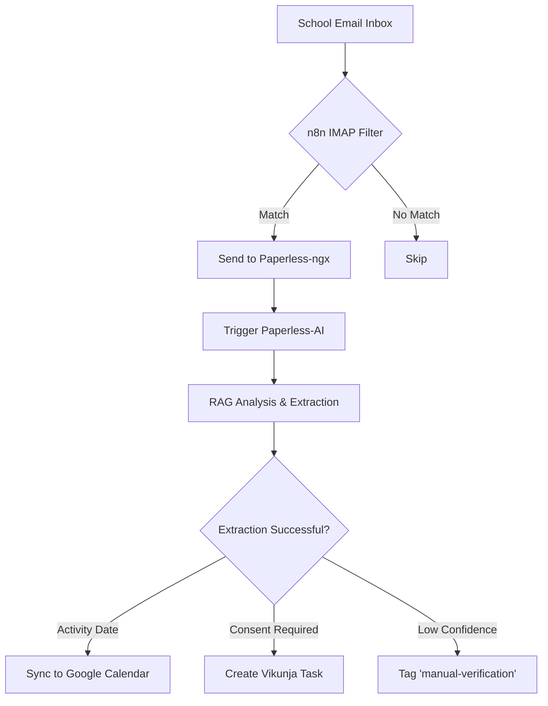

# Playbook: School Admin Intake

## Objective
Streamline the processing of school-related correspondence, extracting dates for school activities and archiving official documents.

## Workflow Architecture

## Pre-requisites
- [Paperless-ngx](../services/paperless-ngx.md)
- [n8n](../services/n8n.md)
- [Google Calendar](../tools/calendar_tasks/google_calendar.md)

## Step-by-Step Flow
1.  **Filter**: n8n monitors the `Inbox` via IMAP for emails from `@school.edu` or containing keywords like "Activity", "Field Trip", "Grade".
2.  **Archive**: The email and any attachments are sent to Paperless-ngx with the document type `SchoolCorrespondence` and the tag `School`.
3.  **Analyze**: [Paperless-AI](../services/paperless-ai.md) triggers on the document creation to perform a RAG-based analysis.
4.  **Extract**: Specifically look for:
    - Activity Date/Time
    - Consent required (Yes/No)
    - Deadline for consent
5.  **Sync**:
    - If an activity date is found, add it to the `School Calendar` in Google Calendar.
    - If consent is required, create a task in [Vikunja](../services/vikunja.md) tagged `Consent`.

## Data Contract
Defined in [Classification Standards](../standards.md).

## Failure Modes & Recovery
- **Ambiguous Dates**: "Next Friday" extraction issues.
    - *Detection*: LLM confidence score < 0.8.
    - *Recovery*: Tag document as `manual-verification`.

## Variants
- **Direct Scan**: Scanning a physical permission slip brought home by the student.

## Contribution Metadata
- Confidence: high
- Last reviewed: 2026-03-01

## Sources / References
- https://github.com/joanmarcriera/Home-office-automations
