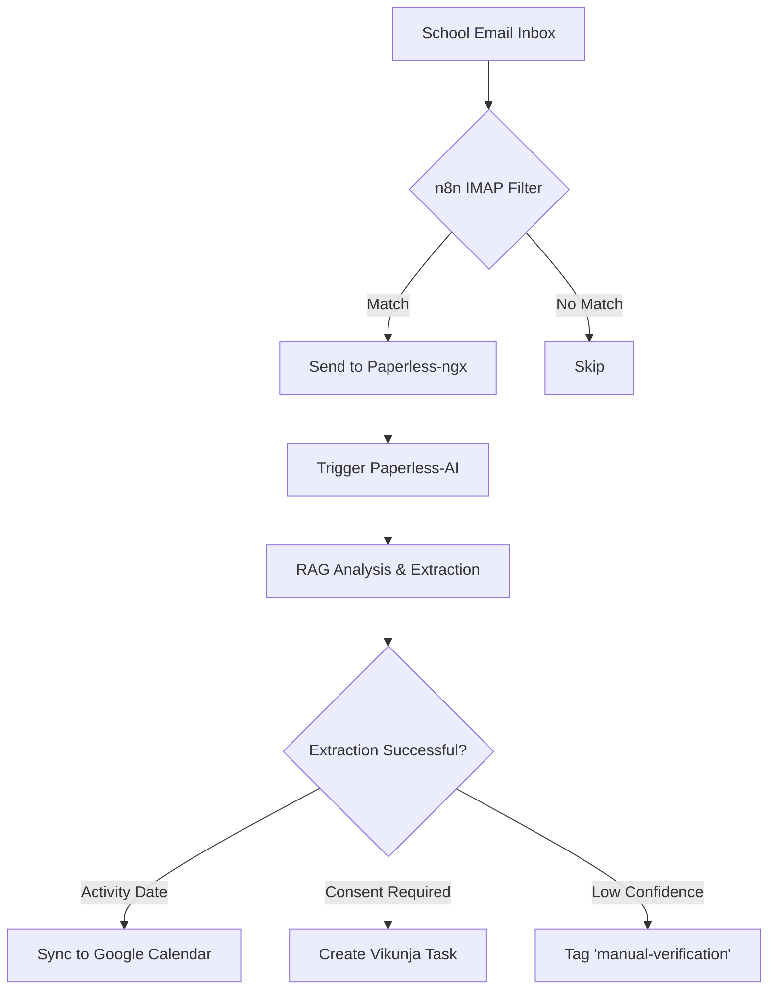

# Playbook: School Admin Intake

## What it is
A specialized administrative automation playbook designed to handle the high volume of correspondence, permission slips, and scheduling requests from educational institutions. It uses OCR, RAG, and automated workflow triggers to ensure no school deadline is missed.

## What problem it solves
It tackles the "backpack black hole" and "email fatigue" faced by parents and guardians. By automating the extraction of dates, consent requirements, and action items from school documents, it reduces manual data entry and prevents scheduling conflicts or missed field trip deadlines.

## Where it fits in the stack
**Category**: Personal Productivity / Family Admin. It integrates [Document Management](../../services/paperless-ngx.md) with [Workflow Automation](../../services/n8n.md) and [Calendar Services](../../tools/calendar_tasks/google_calendar.md).

## Workflow Architecture

```mermaid
flowchart TD
    A[School Email Inbox] --> B{n8n IMAP Filter}
    B -->|Match| C[Send to Paperless-ngx]
    B -->|No Match| Z[Skip]
    C --> D[Trigger Paperless-AI]
    D --> E[RAG Analysis & Extraction]
    E --> F{Extraction Successful?}
    F -->|Activity Date| G[Sync to Google Calendar]
    F -->|Consent Required| H[Create Vikunja Task]
    F -->|Low Confidence| I[Tag 'manual-verification']
```

## Pre-requisites
- [Paperless-ngx](../services/paperless-ngx.md)
- [n8n](../services/n8n.md)
- [Google Calendar](../tools/calendar_tasks/google_calendar.md)

## RAG-Based Extraction Standards
Effective school document processing in June 2026 relies on high-quality RAG (Retrieval-Augmented Generation) patterns. Use models like [Llama 4 Maverick](../tools/ai_knowledge/llama.md) (for local privacy) or [Claude 4.7](../tools/ai_knowledge/claude.md) to:
- **Parse Permission Slips**: Distinguish between "Optional Participation" and "Mandatory Attendance."
- **Handle PII**: Automatically redact or flag student names and IDs if the document is being shared with non-secure agents.
- **Cross-Reference Calendars**: Check the `Family Calendar` for existing conflicts before proposing a new school event.

## Step-by-Step Flow
1.  **Filter**: n8n monitors the `Inbox` via IMAP for emails from `@school.edu` or containing keywords like "Activity", "Field Trip", "Grade".
2.  **Archive**: The email and any attachments are sent to Paperless-ngx with the document type `SchoolCorrespondence` and the tag `School`.
3.  **Analyze**: [Paperless-AI](../services/paperless-ai.md) triggers on the document creation to perform a RAG-based analysis using Claude 4.7 or Llama 4.
4.  **Extract**: Specifically look for:
    - Activity Date/Time
    - Consent required (Yes/No)
    - Deadline for consent
5.  **Sync**:
    - If an activity date is found, add it to the `School Calendar` in Google Calendar.
    - If consent is required, create a task in [Vikunja](../services/vikunja.md) tagged `Consent`.

## Typical use cases
- **Field Trip Permission Slips**: Automatically extracting the date of the trip and creating a task to sign the form.
- **Weekly Newsletters**: Identifying key dates for school holidays or special events.
- **Report Cards**: Archiving official academic records with appropriate metadata for long-term tracking.

## Strengths
- **Error Reduction**: Minimizes human error in transcribing dates or forgetting deadlines.
- **Centralized Archive**: Keeps all school-related documents in a searchable, tagged repository.
- **Proactive Notifications**: Moves information from a passive inbox to an active calendar/task list.

## Limitations
- **Handwriting Recognition**: May struggle with handwritten notes on scanned forms if OCR quality is low.
- **Complex Schedules**: Difficulties parsing multi-day events or complex extracurricular rotations without fine-tuned RAG prompts.
- **Privacy**: Requires careful handling of student PII (Personally Identifiable Information) in cloud-based LLM prompts.

## When to use it
- When you have multiple children in school and are overwhelmed by the volume of digital and physical paperwork.
- When you already use a self-hosted document management system like [Paperless-ngx](../../services/paperless-ngx.md).
- When you need a highly reliable way to ensure consent forms are signed on time.

## When not to use it
- If your school uses a centralized portal (e.g., ParentSquare, Bloomz) that already provides calendar syncing and digital signatures.
- For very low-volume correspondence where manual entry is faster than maintaining an automation stack.
- If you have strict privacy requirements that forbid processing school documents via third-party LLMs.

## Related tools / concepts
- [Paperless-ngx](../../services/paperless-ngx.md) (Document storage)
- [n8n](../../services/n8n.md) (Workflow engine)
- [Vikunja](../../services/vikunja.md) (Task management)
- [Google Calendar](../../tools/calendar_tasks/google_calendar.md) (Scheduling)
- [Paperless-AI](../../services/paperless-ai.md) (RAG for documents)
- [Morgen](../../tools/calendar_tasks/morgen.md) (Unified calendar view)
- [Akiflow](../../tools/calendar_tasks/akiflow.md) (Consolidated task/calendar)

## Data Contract
Defined in [Classification Standards](../standards.md).

## Failure Modes & Recovery
- **Ambiguous Dates**: "Next Friday" extraction issues.
    - *Detection*: LLM confidence score < 0.8.
    - *Recovery*: Tag document as `manual-verification`.

## Variants
- **Direct Scan**: Scanning a physical permission slip brought home by the student.

## Managing High-Volume Seasons
During peak times (e.g., Back-to-School, End-of-Term), the volume of documents can spike.
- **Batch Processing**: Configure n8n to process school documents in batches during off-peak hours to save LLM tokens/compute.
- **Urgency Tagging**: Use the LLM to apply an `URGENT-SCHOOL` tag for any document with a deadline less than 48 hours away.

## Sources / References
- https://github.com/joanmarcriera/Home-office-automations

## Contribution Metadata
- Last reviewed: 2026-06-07
- Confidence: high
