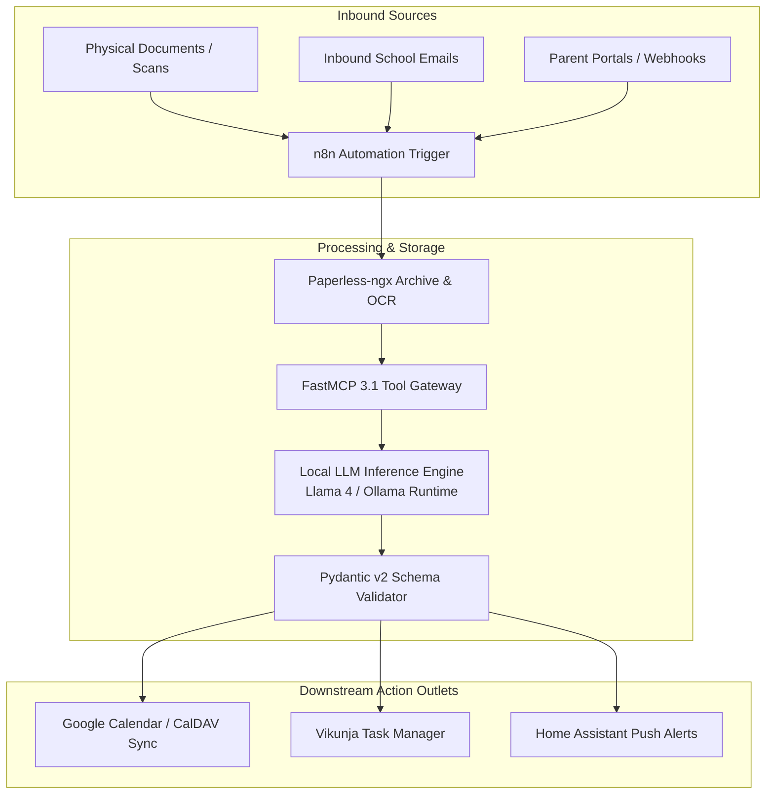

# Playbook: School Admin Intake

## What it is

School Admin Intake is an enterprise-grade administrative automation playbook designed to parse, classify, and action high volumes of school correspondence, permission slips, academic reports, and extracurricular schedules. Operating across local document stores, workflow engines, and LLM inference runtimes, it eliminates human oversight errors in tracking academic deadlines and parental consent requirements. In current architectures (2026/2027), the playbook leverages local multimodal foundation models—including [Llama 4](../tools/ai_knowledge/llama.md) (70B/405B quantization), [Gemma 4](../tools/ai_knowledge/gemma.md), and [Qwen 3.8](../tools/ai_knowledge/qwen.md)—integrated via [FastMCP 3.1](../tools/automation_orchestration/mcp.md) servers to maintain strict data sovereignty over minor Personally Identifiable Information (PII).


```mermaid
flowchart TD
    subgraph Ingestion["Inbound Sources"]
        A1[Physical Documents / Scans] --> B1[n8n Automation Trigger]
        A2[Inbound School Emails] --> B1
        A3[Parent Portals / Webhooks] --> B1
    end

    subgraph Processing["Processing & Storage"]
        B1 --> C1[Paperless-ngx Archive & OCR]
        C1 --> C2[FastMCP 3.1 Tool Gateway]
        C2 --> C3[Local LLM Inference Engine<br/>Llama 4 / Ollama Runtime]
        C3 --> C4[Pydantic v2 Schema Validator]
    end

    subgraph Actions["Downstream Action Outlets"]
        C4 --> D1[Google Calendar / CalDAV Sync]
        C4 --> D2[Vikunja Task Manager]
        C4 --> D3[Home Assistant Push Alerts]
    end
```

## What problem it solves

The playbook solves multi-child administrative overload, fragmented communications, and missed deadlines caused by physical permission slips getting lost in backpacks or critical announcements buried under daily marketing emails. Key operational capabilities include:

1. **Automated Field Trip & Consent Extraction**: Discovers explicit permission deadlines, costs, physical location details, and required signatures from complex multi-page PDF documents.
2. **Zero-Trust Household PII Handling**: Ensures sensitive records—such as medical clearances, IEPs (Individualized Education Programs), grades, and home addresses—never cross cloud LLM boundaries.
3. **Structured Event Normalization**: Transforms non-standard school calendar formats (e.g., "Minimum day next Tuesday for 3rd grade only") into normalized RFC 5545 iCalendar events.
4. **Audit and Archival Trail**: Tags, indexes, and makes all historical school correspondence searchable via natural language RAG interfaces.

## Where it fits in the stack

**Category**: Personal Productivity / Family Admin Automation.

```
+---------------------------------------------------------------------------------------+
|                                    PLAYBOOK STACK                                     |
+---------------------------------------------------------------------------------------+
| Ingestion Layer : Paperless-ngx, n8n IMAP Trigger, Mobile Scanners                    |
| Execution Layer : FastMCP 3.1 Tool Server, Ollama / vLLM (Llama 4 / Gemma 4)           |
| Validation Layer: Pydantic v2 Schema Engine, Confidence Scorer                       |
| Action Layer     : Google Calendar / CalDAV, Vikunja, Home Assistant / Ntfy             |
+---------------------------------------------------------------------------------------+
```

It acts as a domain-specific implementation of the broader [Family Admin Automation](family-admin-automation.md) architecture, leveraging [Scan to Task](scan-to-task.md) for physical forms and [Email to Calendar](email-to-calendar.md) for digital correspondence.

## Typical use cases

- **Field Trip Permission & Fee Tracking**: Parsing form text, calculating fees, generating a payment reminder in [Vikunja](../services/vikunja.md), and adding the trip date to [Google Calendar](../tools/calendar_tasks/google_calendar.md).
- **Academic Term & Recess Extraction**: Batch-extracting full school year calendars from PDF flyers and generating recurrent iCal entries for spring break, staff days, and minimum days.
- **Medical Physicals & Immunization Auditing**: Monitoring expiration dates for sports clearance forms and auto-flagging upcoming requirements 60 days in advance.
- **Parent-Teacher Conference Scheduling**: Parsing available time slot slips and auto-reserving appointment blocks on family calendars.

## Technical Comparison Matrix

| Capability | Manual / Email-Only | Cloud RAG (e.g. OpenAI / Claude) | Local FastMCP 3.1 + Llama 4 (This Playbook) |
| :--- | :--- | :--- | :--- |
| **Privacy / PII Risk** | High (Human oversight) | Medium-High (Cloud data transmission) | **Zero (Air-gapped / Local execution)** |
| **Latency per Doc** | Minutes to Hours | 2–5 seconds | **1.2–3.5 seconds (GPU Accelerated)** |
| **Calendar Sync Reliability** | Manual / Error-Prone | Variable (LLM hallucination risk) | **Deterministic (Pydantic v2 validated)** |
| **Recurring Cost** | Free (Time heavy) | $0.02 - $0.10 per document | **$0.00 (Self-hosted infrastructure)** |
| **Offline Functionality** | Partial | No | **Full (Local model weights)** |

## Strengths

- **High Precision Extraction**: Eliminates missed deadlines using multi-stage confidence scoring and deterministic validation.
- **Privacy Preservation**: Keeps child names, dates of birth, school locations, and medical status completely within the self-hosted perimeter.
- **Multi-Child Disambiguation**: Classifies incoming documents by individual child profile based on grade, teacher name, and student ID.
- **Unified Action Outputs**: Triggers both calendar events and actionable task cards with pre-filled document deep links.

## Limitations

- **Complex Optical Layouts**: Scanned, distorted, or heavily stylized multi-column newsletters can require fallback layout analysis engines (e.g., [Docling](../tools/process_understanding/docling.md)).
- **Hardware Footprint**: Running local 70B parameters vision-language or text models requires dedicated GPU memory (e.g., RTX 4090 or Apple Silicon Mac Studio).
- **Portal Walled Gardens**: Portals without email forwarding or API endpoints require custom headless browser scrapers (e.g., [Browser-Use](../tools/automation_orchestration/browser-use.md)).

## When to use it

- When you have multiple children in school and are overwhelmed by the volume of digital and physical paperwork.
- When you already use a self-hosted document management system like [Paperless-ngx](../services/paperless-ngx.md).
- When you need a highly reliable way to ensure consent forms are signed and returned on time.

## When not to use it

- If your school uses a centralized portal that already provides reliable calendar syncing and digital signatures.
- For very low-volume correspondence where manual entry is faster than maintaining the automation stack.
- If you lack the hardware (e.g., Mac Studio or RTX 4090) to run [Llama 4](../tools/ai_knowledge/llama.md) locally and have strict privacy rules against cloud LLMs.

## FastMCP 3.1 Integration Pattern

The following Python server implements a FastMCP 3.1 tool for parsing school forms and registering extracted actions:

```python
#!/usr/bin/env python3
"""
FastMCP 3.1 School Admin Intake Tool Server
Provides structured extraction and processing tools for educational documents.
"""

import json
from typing import Optional, List
from pydantic import BaseModel, Field, EmailStr
from mcp.server.fastmcp import FastMCP

mcp = FastMCP("school-admin-intake-server")

class StudentProfile(BaseModel):
    student_id: str = Field(..., description="Unique internal household identifier for the student")
    first_name: str = Field(..., description="First name of the student")
    grade_level: int = Field(..., ge=0, le=12, description="Current grade level (0 for K)")
    school_name: str = Field(..., description="Name of the educational institution")

class ActionableDeadline(BaseModel):
    title: str = Field(..., description="Short descriptive title of the action item")
    due_date: str = Field(..., description="ISO 8601 formatted due date string (YYYY-MM-DD)")
    requires_payment: bool = Field(False, description="Whether the item requires monetary payment")
    amount: Optional[float] = Field(None, description="Payment amount if required")
    requires_signature: bool = Field(True, description="Whether parental signature/consent is required")

class SchoolIntakePayload(BaseModel):
    document_id: str = Field(..., description="Paperless-ngx document identifier")
    raw_ocr_text: str = Field(..., description="Extracted OCR text payload")
    student: StudentProfile
    actions: List[ActionableDeadline] = Field(default_factory=list)
    confidence_score: float = Field(..., ge=0.0, le=1.0, description="Overall parsing confidence score")

@mcp.tool()
async def analyze_school_document(
    document_id: str,
    raw_ocr_text: str,
    default_student_id: str
) -> str:
    """
    Parses OCR text from a school document using strict validation and returns normalized intake JSON.
    """
    # Simulated model extraction logic (in production, calls local Ollama/vLLM endpoint)
    sample_response = {
        "document_id": document_id,
        "raw_ocr_text": raw_ocr_text[:100] + "...",
        "student": {
            "student_id": default_student_id,
            "first_name": "Alex",
            "grade_level": 4,
            "school_name": "Oak Creek Elementary"
        },
        "actions": [
            {
                "title": "Sign Zoo Permission Slip",
                "due_date": "2027-02-15",
                "requires_payment": True,
                "amount": 15.00,
                "requires_signature": True
            }
        ],
        "confidence_score": 0.96
    }

    # Validate payload through Pydantic v2 schema
    validated_payload = SchoolIntakePayload.model_validate(sample_response)
    return validated_payload.model_dump_json(indent=2)

@mcp.tool()
async def dispatch_calendar_and_tasks(intake_json: str) -> str:
    """
    Consumes validated SchoolIntakePayload JSON and generates upstream task and calendar payloads.
    """
    data = SchoolIntakePayload.model_validate_json(intake_json)
    created_items = []

    for action in data.actions:
        task_summary = f"[{data.student.first_name}] {action.title}"
        created_items.append({
            "task_title": task_summary,
            "due_date": action.due_date,
            "payment_needed": action.amount if action.requires_payment else 0.0,
            "paperless_link": f"https://paperless.local/documents/{data.document_id}"
        })

    return json.dumps({"status": "success", "processed_count": len(created_items), "items": created_items})

if __name__ == "__main__":
    mcp.run()
```

## Getting started

To deploy the School Admin Intake pipeline:

1. **Configure Ingestion Filters**: Set up an [n8n](../services/n8n.md) workflow with IMAP triggers monitoring incoming emails matching school domains or keywords (`permission`, `newsletter`, `field trip`).
2. **Deploy Storage & Indexing**: Direct incoming attachments and scanned physical documents to [Paperless-ngx](../services/paperless-ngx.md) with consumption tags `School` and `Pending-AI`.
3. **Run Local Inference**: Start an [Ollama](../tools/ai_knowledge/ollama.md) or [vLLM](../tools/infrastructure/vllm.md) container running `llama4:70b-instruct` or `gemma4:27b`.
4. **Connect FastMCP Tools**: Register the Python MCP server above with your agentic router (e.g., [Claude Code](../tools/development_ops/claude-code.md) or [Home Admin Agent](../services/home-admin-tools.md)).
5. **Set Up Downstream Actions**: Connect workflow endpoints to [Google Calendar](../tools/calendar_tasks/google_calendar.md) for event dates and [Vikunja](../services/vikunja.md) for required actions.

## CLI examples

### Reprocessing Documents via Paperless-ngx CLI
```bash
# Force document tags and trigger AI pipeline reprocessing
docker exec -it paperless-ngx document_tagger \
  --document_id 8821 \
  --add_tag "School-2027" \
  --add_tag "Needs-AI-Parse"
```

### Direct FastMCP Inspection CLI
```bash
# Execute the MCP server directly via CLI for testing
python3 -m mcp.cli call school-admin-intake-server analyze_school_document \
  '{"document_id": "8821", "raw_ocr_text": "Oak Creek Elementary Science Fair Registration due Feb 20", "default_student_id": "STU-992"}'
```

## API examples

### Raw Paperless-AI RAG Payload
```json
{
  "document_id": "8821",
  "prompt": "Extract student name, event title, due date, payment required, and return as JSON matching the SchoolIntakePayload schema.",
  "model": "llama4-70b-q8",
  "temperature": 0.0,
  "response_format": { "type": "json_object" }
}
```

### Python Pydantic v2 Audit and Exception Handler
```python
import json
import requests
from pydantic import BaseModel, Field, ValidationError

class SchoolEventAudit(BaseModel):
    event_name: str = Field(..., min_length=3)
    event_date: str = Field(..., pattern=r"^\d{4}-\d{2}-\d{2}$")
    is_mandatory: bool = Field(default=True)

def process_school_payload(raw_json_str: str) -> None:
    try:
        data = json.loads(raw_json_str)
        audit = SchoolEventAudit.model_validate(data)
        print(f"Validated School Event: {audit.event_name} on {audit.event_date}")
    except ValidationError as err:
        print(f"Pydantic Validation Failure: {err.json()}")
    except json.JSONDecodeError:
        print("Invalid JSON structure received from LLM model.")
```

## Related tools / concepts

- [Paperless-ngx](../services/paperless-ngx.md): Document management archive.
- [Family Admin Automation](family-admin-automation.md): Core household playbook.
- [Email to Calendar](email-to-calendar.md): General email event parsing pattern.
- [Scan to Task](scan-to-task.md): Physical paper digitizing playbook.
- [Vikunja](../services/vikunja.md): Open-source task management platform.
- [Docling](../tools/process_understanding/docling.md): Advanced PDF layout document parser.

## Sources / References

- [Paperless-ngx API Documentation](https://docs.paperless-ngx.com/api/)
- [FastMCP 3.1 Protocol Specification](https://modelcontextprotocol.io/introduction)
- [Pydantic v2 Validation Docs](https://docs.pydantic.dev/latest/)

## Contribution Metadata

- Last reviewed: 2027-01-07
- Confidence: high
