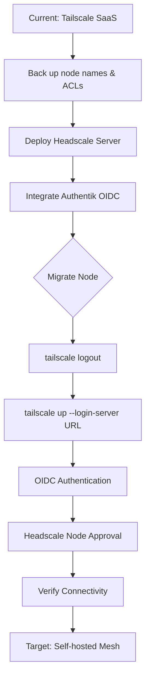

# Playbook: Tailscale to Headscale Migration

## What it is
This playbook is a step-by-step operational guide for migrating a mesh network from the Tailscale SaaS coordination server to [Headscale](../../services/headscale.md), an open-source, self-hosted implementation of the Tailscale control server.

## What problem it solves
It eliminates dependency on Tailscale's proprietary coordination server, providing 100% data sovereignty over your network topology. It solves the "proprietary lock-in" problem for users who require a fully self-hosted, sovereign VPN solution for their homelab.

## Where it fits in the stack
It sits in the **Operational Playbook Layer**, specifically under **Infrastructure Migration**. It guides the transition from a managed service to a self-hosted infrastructure component.

## Typical use cases
- **Homelab Hardening**: Moving your internal network control plane to hardware you own.
- **Privacy Optimization**: Ensuring that no metadata about your node connections ever leaves your infrastructure.
- **Cost Management**: Bypassing device limits on Tailscale's free tier by using your own server.

## Strengths
- **Sovereignty**: Complete control over your coordination server.
- **Cost**: No per-device or per-user fees (limited only by your hardware).
- **Integration**: Seamlessly integrates with [Authentik](../../services/authentik.md) for OIDC-based identity management.

## Limitations
- **Operational Burden**: You are responsible for the availability and security of the Headscale server.
- **Complexity**: Requires managing OIDC, SSL certificates, and server backups.

## When to use it
- When you have a stable, self-hosted identity provider like Authentik.
- When your homelab has grown beyond the scope of Tailscale's free tier or privacy policies.

## When not to use it
- If you require the "it just works" simplicity of the Tailscale SaaS.
- If you don't have the technical expertise to manage a critical piece of networking infrastructure.

## Getting started
To begin the migration:
1.  **Deploy Headscale**: Follow the [Headscale Service](../../services/headscale.md) guide to set up the server.
2.  **Back up Tailscale**: Document your existing node names and ACLs.
3.  **Perform a Pilot**: Migrate a single non-critical node first using the steps in this playbook.

## Migration Workflow



## Migration Steps

### Prerequisites
- A functional [Authentik](../../services/authentik.md) instance for OIDC.
- A public FQDN with valid SSL certificates (e.g., via Let's Encrypt) pointing to your Headscale server.
- Tailscale clients installed on target nodes.

### Step 1: Headscale Deployment
1. Deploy Headscale using Docker (see [Headscale Service](../../services/headscale.md) for compose snippet).
2. Configure `config.yaml` with your `server_url`.
3. Integrate with Authentik for OIDC to allow family members to join easily.

### Step 2: Client Migration (Manual)
On each node currently running Tailscale, perform the following:

#### Linux
You can use the provided migration script:
```bash
./scripts/headscale_migration.sh https://<headscale-fqdn>
```

Or manually:
```bash
# Logout from Tailscale SaaS
tailscale logout

# Login to Headscale
tailscale up --login-server https://<headscale-fqdn>
```

#### MacOS / Windows
1. Hold the **Alt** (or Option) key and click the Tailscale icon in the menu bar/system tray.
2. Select **Change Server...**.
3. Enter your Headscale FQDN: `https://<headscale-fqdn>`.
4. Follow the OIDC login flow.

### Step 3: Headscale Node Approval
If not using OIDC or if a node requires manual registration:
1. Run `tailscale up --login-server https://<headscale-fqdn>` on the client.
2. Copy the provided URL.
3. On the Headscale server:
   ```bash
   headscale nodes register --user <username> --key <node-key>
   ```

### Step 4: Node-Specific Checklists

#### TrueNAS SCALE NAS
- [ ] SSH into TrueNAS.
- [ ] Run `tailscale logout`.
- [ ] Run `tailscale up --login-server https://<headscale-fqdn>`.
- [ ] Verify NAS is reachable via Tailscale IP in Headscale.

#### K3s Compute Node
- [ ] Ensure `tailscale` is running on the host.
- [ ] Run migration script or manual commands.
- [ ] Update any K3s service advertisements if using Tailscale IPs for cluster communication.

#### Home Assistant VM
- [ ] Use the HA Terminal & SSH add-on.
- [ ] Execute `tailscale logout` followed by `tailscale up --login-server ...`.
- [ ] Re-verify HA external access if proxied through Tailscale.

### Step 5: Verification
1. List nodes on Headscale: `headscale nodes list`.
2. Verify connectivity between nodes: `tailscale ping <other-node-ip>`.
3. Ensure ACLs are correctly migrated if using a custom `policy.hujson`.

## Rollback Plan
If migration fails, logout from Headscale and login back to Tailscale:
```bash
tailscale logout
tailscale up
```

## Related tools / concepts
- [Headscale Service](../../services/headscale.md)
- [Authentik Service](../../services/authentik.md)
- [Invisible Kubernetes](../../knowledge_base/invisible_kubernetes.md)
- [K3s Cluster Setup](k3s-cluster-setup.md)
- [Infrastructure Architecture](../../architecture/infrastructure.md)
- [SSO Comparison](../../knowledge_base/sso-comparison.md)
- [Family Admin Automation](family-admin-automation.md)

## Sources / References
- [Headscale Documentation](https://github.com/juanfont/headscale/blob/main/docs/ref/registration.md)
- [Tailscale CLI Reference](https://tailscale.com/kb/1080/cli/)

## Contribution Metadata
- Last reviewed: 2026-05-10
- Confidence: high
