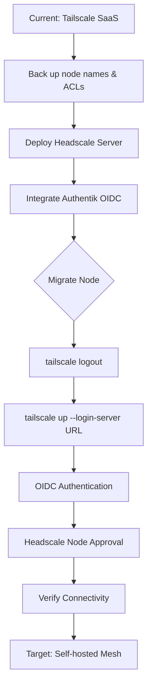

# Playbook: Tailscale to Headscale Migration

## What it is
This playbook is a step-by-step operational guide for migrating a mesh network from the Tailscale SaaS coordination server to [Headscale](../services/headscale.md), an open-source, self-hosted implementation of the Tailscale control server.

## What problem it solves
It eliminates dependency on Tailscale's proprietary coordination server, providing 100% data sovereignty over your network topology. It solves the "proprietary lock-in" problem for users who require a fully self-hosted, sovereign VPN solution for their homelab.

## Architecture and Migration Flow

The migration shifts control plane signal routing from Tailscale's SaaS infrastructure to an internal, self-hosted Headscale container paired with an OIDC provider like Authentik.

```
┌────────────────────────────────────────────────────────────────────────┐
│                   Original State: Tailscale SaaS                       │
│     Target Node ──────► Proprietary SaaS Control Plane (Cloud)         │
└───────────────────────────────────┬────────────────────────────────────┘
                                    │ Executing 'tailscale logout' & Re-auth
┌───────────────────────────────────▼────────────────────────────────────┐
│                    Migrated State: Sovereign Mesh                      │
│ ┌──────────────────────┐ ┌──────────────────────┐ ┌──────────────────┐ │
│ │  Tailscale Client    │ │ Self-hosted Headscale│ │ Authentik OIDC   │ │
│ │  Re-login (--server) │ │ Control Server       │ │ Identity Provider│ │
│ └──────────────────────┘ └──────────────────────┘ └──────────────────┘ │
└────────────────────────────────────────────────────────────────────────┘
```

## Where it fits in the stack
It sits in the **Operational Playbook Layer**, specifically under **Infrastructure Migration**. It guides the transition from a managed service to a self-hosted infrastructure component.

## Feature & Operational Comparison Matrix

| Aspect / Metric | Tailscale SaaS | Self-Hosted Headscale |
| :--- | :--- | :--- |
| **Control Plane** | Proprietary Cloud | 100% Open-Source Go Server |
| **Data Sovereignty** | Connection metadata hosted by vendor | Complete local control |
| **User / Device Limit** | Tiered pricing limits on free plan | Unlimited (bound by hardware VRAM/RAM) |
| **Identity Provider** | Vendor SSO | Native OIDC ([Authentik](../services/authentik.md), Keycloak) |
| **FastMCP 3.1 Fleet Admin**| REST API / Personal Access Token | Direct Headscale gRPC / REST CLI Tooling |
| **Maintenance Burden** | Zero | Low (Docker Compose / Systemd) |

## Typical use cases
- **Homelab Hardening**: Moving your internal network control plane to hardware you own.
- **Privacy Optimization**: Ensuring that no metadata about your node connections ever leaves your infrastructure.
- **Cost Management**: Bypassing device limits on Tailscale's free tier by using your own server.

## Strengths
- **Sovereignty**: Complete control over your coordination server.
- **Cost**: No per-device or per-user fees (limited only by your hardware).
- **Integration**: Seamlessly integrates with [Authentik](../services/authentik.md) for OIDC-based identity management.

## Limitations
- **Operational Burden**: You are responsible for the availability and security of the Headscale server.
- **Complexity**: Requires managing OIDC, SSL certificates, and server backups.

## When to use it
- When you have a stable, self-hosted identity provider like Authentik.
- When your homelab has grown beyond the scope of Tailscale's free tier or privacy policies.

## When not to use it
- If you require the "it just works" simplicity of the Tailscale SaaS.
- If you don't have the technical expertise to manage a critical piece of networking infrastructure.

## Getting started

### Deployment
To begin the migration:
1.  **Deploy Headscale**: Follow the [Headscale Service](../services/headscale.md) guide to set up the server.
2.  **Back up Tailscale**: Document your existing node names and ACLs.
3.  **Perform a Pilot**: Migrate a single non-critical node first using the steps in this playbook.

### Agent-Assisted Migration
Modern agents can significantly simplify the migration process. Use an early January 2027-class agent (e.g., [Claude 5.6](../tools/ai_knowledge/claude.md), [GPT-5.6](../tools/ai_knowledge/openai.md), [Gemini 4.0 Ultra](../tools/ai_knowledge/gemini.md), [Llama 4](../tools/ai_knowledge/llama.md), or [Qwen 3.8](../tools/ai_knowledge/qwen.md)) integrated with Model Context Protocol (MCP 3.1 / FastMCP 3.1) to:
- **Translate ACLs**: Convert Tailscale `policy.hujson` to Headscale-compatible YAML/ACL formats.
- **Automate Client Rollout**: Script the `tailscale logout` and `tailscale up --login-server` commands across a fleet of Linux nodes via SSH using MCP-enabled terminal tools.
- **Validate OIDC Config**: Verify the `config.yaml` parameters against your [Authentik](../services/authentik.md) provider metadata.

### Operational Best Practices & Troubleshooting

1. **OIDC Redirect Normalization**: Set the `server_url` in `config.yaml` to match your external reverse proxy HTTPS URL exactly to prevent token authentication loops during node registration.
2. **Derp Relay Persistence**: Maintain at least one local embedded DERP server on Headscale to ensure mesh node connectivity when direct STUN NAT-traversal fails.
3. **Database Backups**: Schedule daily automated snapshots of Headscale's SQLite/PostgreSQL database to enable instant disaster recovery of node keys and ACL policies.
4. **Pre-Auth Key Generation**: Always specify a 24-hour expiration window on pre-auth keys when batch-migrating headless Kubernetes nodes or IoT controllers.

### Migration Workflow


```mermaid
flowchart TD
    Start[Current: Tailscale SaaS] --> Backup[Back up node names & ACLs]
    Backup --> Deploy[Deploy Headscale Server]
    Deploy --> Auth[Integrate Authentik OIDC]
    Auth --> NodeMigrate{Migrate Node}
    NodeMigrate --> Logout[tailscale logout]
    Logout --> Login[tailscale up --login-server URL]
    Login --> OIDC[OIDC Authentication]
    OIDC --> Approve[Headscale Node Approval]
    Approve --> Verify[Verify Connectivity]
    Verify --> End[Target: Self-hosted Mesh]
```

### Migration Steps

#### Prerequisites
- A functional [Authentik](../services/authentik.md) instance for OIDC.
- A public FQDN with valid SSL certificates (e.g., via Let's Encrypt) pointing to your Headscale server.
- Tailscale clients installed on target nodes.

#### Step 1: Headscale Deployment
1. Deploy Headscale using Docker (see [Headscale Service](../services/headscale.md) for compose snippet).
2. Configure `config.yaml` with your `server_url`.
3. Integrate with Authentik for OIDC to allow family members to join easily.

#### Step 2: Client Migration (Manual)
On each node currently running Tailscale, perform the following:

##### Linux
You can use the provided migration script:
```bash
./scripts/headscale_migration.sh https://<headscale-fqdn>
```

##### MacOS / Windows
1. Hold the **Alt** (or Option) key and click the Tailscale icon in the menu bar/system tray.
2. Select **Change Server...**.
3. Enter your Headscale FQDN: `https://<headscale-fqdn>`.
4. Follow the OIDC login flow.

#### Step 3: Headscale Node Approval
If not using OIDC or if a node requires manual registration:
1. Run `tailscale up --login-server https://<headscale-fqdn>` on the client.
2. Copy the provided URL.
3. On the Headscale server:
   ```bash
   headscale nodes register --user <username> --key <node-key>
   ```

#### Step 4: Node-Specific Checklists

##### TrueNAS SCALE NAS
- [x] SSH into TrueNAS.
- [x] Run `tailscale logout`.
- [x] Run `tailscale up --login-server https://<headscale-fqdn>`.
- [x] Verify NAS is reachable via Tailscale IP in Headscale.

##### K3s Compute Node
- [x] Ensure `tailscale` is running on the host.
- [x] Run migration script or manual commands.
- [x] Update any K3s service advertisements if using Tailscale IPs for cluster communication.

##### Home Assistant VM
- [x] Use the HA Terminal & SSH add-on.
- [x] Execute `tailscale logout` followed by `tailscale up --login-server ...`.
- [x] Re-verify HA external access if proxied through Tailscale.

#### Step 5: Verification
1. List nodes on Headscale: `headscale nodes list`.
2. Verify connectivity between nodes: `tailscale ping <other-node-ip>`.
3. Ensure ACLs are correctly migrated if using a custom `policy.hujson`.

### Rollback Plan
If migration fails, logout from Headscale and login back to Tailscale:
```bash
tailscale logout
tailscale up
```

## CLI examples

### Client Migration (Linux)
```bash
# Logout from Tailscale SaaS
tailscale logout

# Connect to a Headscale instance
tailscale up --login-server https://headscale.example.com
```

### Headscale Server Management
```bash
# Register a node manually
headscale nodes register --user jules --key nodekey:abcdef123456

# List nodes and their status
headscale nodes list

# Create a pre-authenticated key for headless nodes
headscale preauthkeys create -u jules --expiration 24h
```

## API examples

### Querying Node Status via REST API
Agents can use the Headscale REST API to verify migration status across the fleet.

```bash
# Fetch all nodes from Headscale
curl -X GET \
  -H "Authorization: Bearer $HEADSCALE_API_KEY" \
  https://headscale.example.com/api/v1/node
```

### Scripted Node Approval
```python
import requests
from pydantic import BaseModel, Field, ValidationError

class NodeRegistration(BaseModel):
    user: str = Field(..., min_length=1, description="The username to register the node under")
    key: str = Field(..., pattern=r"^(nodekey|mkey):[a-f0-9]+$", description="The node key generated by the client")

def approve_node(headscale_url: str, api_key: str, user: str, node_key: str) -> bool:
    try:
        # Strict Pydantic v2 validation
        reg = NodeRegistration(user=user, key=node_key)
    except ValidationError as e:
        print(f"Validation error: {e}")
        return False

    endpoint = f"{headscale_url.rstrip('/')}/api/v1/node/register"
    headers = {"Authorization": f"Bearer {api_key}"}
    payload = reg.model_dump()
    response = requests.post(endpoint, headers=headers, json=payload)
    return response.status_code == 200

# Example usage
# approve_node("https://headscale.local", "secret_key", "jules", "nodekey:abcdef123456")
```

## Related tools / concepts
- [Headscale Service](../services/headscale.md)
- [Authentik Service](../services/authentik.md)
- [Invisible Kubernetes](../knowledge_base/invisible_kubernetes.md)
- [K3s Cluster Setup](k3s-cluster-setup.md)
- [Infrastructure Architecture](../architecture/infrastructure.md)
- [SSO Comparison](../knowledge_base/sso-comparison.md)
- [Family Admin Automation](family-admin-automation.md)
- [Tailscale Service](../services/tailscale.md)

## Sources / References
- [Headscale Documentation](https://github.com/juanfont/headscale/blob/main/docs/ref/registration.md)
- [Tailscale CLI Reference](https://tailscale.com/kb/1080/cli/)
- [Headscale v0.24.0 Release Notes](https://github.com/juanfont/headscale/releases)

## Contribution Metadata
- Last reviewed: 2027-01-07
- Confidence: high
