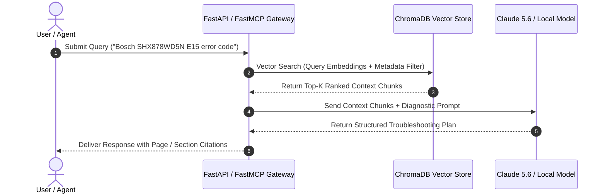

# Manual Assistant Troubleshooting Backend

Reference implementation for a RAG-based backend and agentic tool server to search, extract, and answer complex troubleshooting questions from digitized appliance and equipment manuals.

## What it is

The Manual Assistant Troubleshooting Backend is a production-grade FastAPI service integrated with [ChromaDB v0.6+](../../tools/infrastructure/pinecone.md) and [FastMCP 3.1](../../knowledge_base/patterns/tool-calling-and-mcp.md). It performs hybrid (dense vector embeddings + Sparse/BM25 keyword search + metadata filtered) retrieval across OCR'd equipment manuals.

By early 2027, this backend provides a standardized, real-time context provider and action executor for multi-agent frameworks. It enables agents powered by [Claude 5.6](../../tools/ai_knowledge/claude.md), [GPT-5.6](../../tools/ai_knowledge/openai.md), [Gemini 4.0 Ultra](../../tools/ai_knowledge/gemini.md), [DeepSeek-V4](../../tools/ai_knowledge/claude.md), and local [Qwen 3.6 VL](../../tools/ai_knowledge/qwen.md) to inspect error codes, retrieve wiring diagrams, and walk non-technical users through home repairs step by step.

```
+-------------------------------------------------------------------------------------------------------------------+
|                                 MANUAL ASSISTANT TROUBLESHOOTING ARCHITECTURE                                    |
+-------------------------------------------------------------------------------------------------------------------+
|                                                                                                                   |
|  +---------------------------+     +---------------------------+     +---------------------------+               |
|  | Paperless-ngx PDF Ingest  |     | Direct PDF/OCR Upload     |     | Web Scraped Equipment PDF |               |
|  +-------------+-------------+     +-------------+-------------+     +-------------+-------------+               |
|                |                                 |                                 |                             |
|                +---------------------------------+---------------------------------+                             |
|                                                  |                                                               |
|                                                  v                                                               |
|                                 +---------------------------------+                                              |
|                                 | Chunking & Processing Engine    |                                              |
|                                 | (scripts/process_manuals.py)    |                                              |
|                                 +----------------+----------------+                                              |
|                                                  | Vector Embeddings                                             |
|                                                  v                                                               |
|                                 +---------------------------------+                                              |
|                                 | ChromaDB Vector Store (v0.6+)   |                                              |
|                                 | Metadata: Brand, Model, Section |                                              |
|                                 +----------------+----------------+                                              |
|                                                  | Hybrid Vector Search                                          |
|                                                  v                                                               |
|  +-----------------------------------------------+-----------------------------------------------+               |
|  |                             FastAPI & FastMCP 3.1 Service Gateway                             |               |
|  +-------------------------------+-------------------------------+-------------------------------+               |
|                                  |                               |                                               |
|          +-----------------------+                               +-----------------------+                       |
|          | SSE / Stdio Stream                                                            | REST / JSON           |
|          v                                                                               v                       |
|  +-------------------------------+                                               +-------------------------------+|
|  | MCP Agent Clients             |                                               | Frontend Clients              ||
|  | (Claude 5.6 / GPT-5.6 / Qwen) |                                               | (Open WebUI, Streamlit, HA)   ||
|  +-------------------------------+                                               +-------------------------------+|
|                                                                                                                   |
+-------------------------------------------------------------------------------------------------------------------+
```

## What problem it solves

Household equipment documentation is notoriously fragmented. When a dishwasher exhibits an obscure error code (e.g., "Bosch Error E15") or an HVAC thermostat loses network pairing, physical manuals are rarely accessible.

This reference backend solves the "manual accessibility and context gap" by converting unstructured PDF manuals into structured, queryable knowledge graphs. Rather than forcing users to scroll through 120-page manuals, the backend executes targeted vector search filtered by exact manufacturer and model designations, supplying precise troubleshooting instructions directly to chat, web, or voice interfaces.

## Where it fits in the stack

**Category**: Reference Implementation / Knowledge & Retrieval Operations.

It sits in the **domain retrieval and agent execution layer**:
1. **Upstream Services**: [Paperless-ngx](../../services/paperless-ngx.md) (source archive) and `scripts/process_manuals.py` (chunking & vector embedding pipeline).
2. **Database Layer**: [ChromaDB](../../tools/infrastructure/pinecone.md) (vector store) and local disk or S3 document storage.
3. **Gateway Layer**: FastAPI REST endpoints and FastMCP 3.1 protocol servers.
4. **Downstream Clients**: [Open WebUI](../../services/open-webui.md), [Home Assistant](../../services/home-assistant.md), [n8n](../../services/n8n.md), and autonomous agent clients.

## Typical use cases

- **Appliance Error Diagnostics**: Translating cryptic LED flash codes or digital display errors (e.g., Samsung fridge error code 22E) into actionable repair procedures.
- **Maintenance Schedule Lookup**: Querying exact service interval guidelines (e.g., water filter replacement frequency, lawnmower oil viscosity ratings).
- **Parts & Diagram Retrieval**: Searching manuals for specific part numbers or disassembly order prior to conducting home maintenance.
- **Warranty Expiration Auditing**: Verifying whether specific repair issues are covered under vendor warranty terms based on manual clause extraction.

## Strengths

- **Metadata-Constrained Filtering**: Eliminates cross-model confusion by strictly filtering vector search by manufacturer and model strings.
- **High-Throughput Async Execution**: Built on FastAPI and Python `asyncio` for rapid response times.
- **Dual-Interface Flexibility**: Supports both standard REST OpenAPI endpoints and FastMCP 3.1 tools simultaneously.
- **Local Air-Gapped Operation**: Can operate entirely offline using local ChromaDB and open embedding models (e.g., `bge-m3`, `nomic-embed-text`).

## Limitations

- **OCR Quality Dependency**: Highly dependent on clear PDF OCR parsing; degraded text scans may yield vector retrieval gaps.
- **Pre-Indexing Overhead**: Requires initial processing and embedding generation before a manual becomes searchable.
- **Diagram Interpretation**: Pure text extraction fails on purely visual wiring schematics unless accompanied by multimodal vision models ([Qwen 3.6 VL](../../tools/ai_knowledge/qwen.md)).

## When to use it

- When building homelab or enterprise AI assistants designed to troubleshoot technical hardware.
- When expanding an existing [Paperless-ngx](../../services/paperless-ngx.md) repository into a dynamic RAG knowledge engine.
- When requiring a standardized FastMCP 3.1 manual retrieval tool for autonomous agents.

## When not to use it

- When dealing with small collections (under 5 documents) where simple keyword search in Paperless-ngx is sufficient.
- When requiring real-time web search for non-documented or recall-related hardware issues.

## Getting started

### 1. Ingesting & Indexing Manuals
Ingest PDF documents into ChromaDB using the batch ingestion script:
```bash
# Ingest single PDF manual with metadata
python3 scripts/process_manuals.py --file "/data/manuals/Bosch_SHX878WD5N.pdf" \
                                   --manufacturer "Bosch" \
                                   --model "SHX878WD5N" \
                                   --category "Dishwasher"
```

### 2. Launching the Backend Gateway
Start the FastAPI REST server and FastMCP tool provider:
```bash
# Run FastAPI server on port 8000
uvicorn app.main:app --host 0.0.0.0 --port 8000 --reload
```

### 3. Execution Sequence Diagram



## CLI examples

### 1. Querying REST Endpoint via Curl
```bash
curl -X POST "http://localhost:8000/api/v1/search" \
     -H "Content-Type: application/json" \
     -d '{
       "query": "water leaks under door seal E15",
       "manufacturer": "Bosch",
       "model": "SHX878WD5N",
       "top_k": 2
     }'
```

### 2. Verifying Collection Statistics
```bash
python3 -c "
import chromadb
client = chromadb.PersistentClient(path='./chroma_db')
col = client.get_collection('appliance_manuals')
print(f'Total Indexed Chunks: {col.count()}')
"
```

## API examples

Below is a complete Python FastAPI backend service utilizing ChromaDB v0.6+ and Pydantic v2 schemas:

```python
"""
FastAPI Backend Service: Manual Assistant RAG & Troubleshooting Service
"""

from typing import List, Optional, Dict, Any
from fastapi import FastAPI, HTTPException, Depends, Query
from pydantic import BaseModel, Field, ValidationError
import chromadb
from chromadb.config import Settings

app = FastAPI(
    title="Manual Assistant RAG Service",
    version="3.1.0",
    description="Vector retrieval and RAG gateway for household equipment manuals"
)

# ChromaDB Client Initialization
chroma_client = chromadb.PersistentClient(
    path="./chroma_db",
    settings=Settings(allow_reset=False, anonymized_telemetry=False)
)
manuals_collection = chroma_client.get_or_create_collection(name="appliance_manuals")

# Pydantic v2 Request / Response Schemas
class SearchQueryRequest(BaseModel):
    query: str = Field(..., min_length=2, description="Troubleshooting query or symptom description")
    manufacturer: Optional[str] = Field(None, description="Appliance manufacturer filter (e.g., Bosch)")
    model: Optional[str] = Field(None, description="Model designation filter (e.g., SHX878WD5N)")
    top_k: int = Field(default=3, ge=1, le=10, description="Number of context matches to return")

class ManualSnippet(BaseModel):
    text_content: str = Field(..., description="Extracted paragraph or section text")
    manufacturer: str = Field(..., description="Appliance manufacturer")
    model: str = Field(..., description="Appliance model number")
    page_number: Optional[int] = Field(None, description="Manual page number citation")
    relevance_score: float = Field(..., description="Cosine similarity / vector distance metric")

class SearchResponse(BaseModel):
    success: bool = True
    total_matches: int
    results: List[ManualSnippet] = Field(default_factory=list)

@app.post("/api/v1/search", response_model=SearchResponse)
async def search_manuals(payload: SearchQueryRequest):
    try:
        # Build ChromaDB metadata filter clause
        where_conditions = []
        if payload.manufacturer:
            where_conditions.append({"manufacturer": payload.manufacturer})
        if payload.model:
            where_conditions.append({"model": payload.model})

        where_clause = None
        if len(where_conditions) == 1:
            where_clause = where_conditions[0]
        elif len(where_conditions) > 1:
            where_clause = {"$and": where_conditions}

        # Query Vector DB
        query_results = manuals_collection.query(
            query_texts=[payload.query],
            n_results=payload.top_k,
            where=where_clause
        )

        formatted_snippets: List[ManualSnippet] = []
        if query_results and query_results.get("documents") and query_results["documents"][0]:
            docs = query_results["documents"][0]
            metas = query_results["metadatas"][0] if query_results.get("metadatas") else [{}] * len(docs)
            distances = query_results["distances"][0] if query_results.get("distances") else [0.0] * len(docs)

            for doc, meta, dist in zip(docs, metas, distances):
                formatted_snippets.append(
                    ManualSnippet(
                        text_content=doc,
                        manufacturer=meta.get("manufacturer", "Unknown"),
                        model=meta.get("model", "Unknown"),
                        page_number=meta.get("page_number"),
                        relevance_score=round(float(dist), 4)
                    )
                )

        return SearchResponse(
            success=True,
            total_matches=len(formatted_snippets),
            results=formatted_snippets
        )

    except Exception as err:
        raise HTTPException(status_code=500, detail=f"Search engine execution error: {str(err)}")
```

### FastMCP 3.1 Tool Implementation

Below is a complete FastMCP 3.1 tool server exposing the manual lookup engine to Claude 5.6 and other MCP clients.

```python
"""
FastMCP 3.1 Server: Appliance Manual Lookup Tool
"""

from typing import Dict, Any, Optional
from pydantic import BaseModel, Field
import chromadb
from mcp.server.fastmcp import FastMCP

mcp = FastMCP("ManualAssistantMCP")

class ManualLookupInput(BaseModel):
    query: str = Field(..., description="The error code or troubleshooting symptom to look up.")
    manufacturer: str = Field(..., description="Appliance brand name (e.g. Bosch, LG, Whirlpool).")
    model: str = Field(..., description="Model number (e.g. SHX878WD5N).")

@mcp.tool()
def lookup_appliance_manual(input_data: ManualLookupInput) -> str:
    """
    Retrieves authoritative context snippets from indexed manuals to answer hardware diagnostic queries.
    """
    client = chromadb.PersistentClient(path="./chroma_db")
    try:
        collection = client.get_collection(name="appliance_manuals")
    except Exception:
        return f"Error: Appliance manuals vector collection not found or uninitialized."

    where_filter = {
        "$and": [
            {"manufacturer": input_data.manufacturer},
            {"model": input_data.model}
        ]
    }

    results = collection.query(
        query_texts=[input_data.query],
        n_results=3,
        where=where_filter
    )

    documents = results.get("documents", [[]])[0]
    if not documents:
        return f"No manual documentation found matching {input_data.manufacturer} model {input_data.model} for query '{input_data.query}'."

    retrieved_text = "\n\n---\n\n".join(documents)
    return f"Retrieved Context for {input_data.manufacturer} {input_data.model}:\n\n{retrieved_text}"

if __name__ == "__main__":
    mcp.run()
```

## Related tools / concepts

- [Paperless-ngx](../../services/paperless-ngx.md): Document archive and OCR ingestion source.
- [ChromaDB](../../tools/infrastructure/pinecone.md): High-performance vector database.
- [FastAPI](../../tools/frameworks/fastapi.md): Modern Python Web framework.
- [FastMCP 3.1 Pattern](../../knowledge_base/patterns/tool-calling-and-mcp.md): Protocol for agent tool execution.
- [Claude 5.6](../../tools/ai_knowledge/claude.md): Reasoning model for context-aware diagnostics.
- [Open WebUI](../../services/open-webui.md): Web frontend for local model interaction.

## Sources / references

- [FastAPI Framework Documentation](https://fastapi.tiangolo.com/)
- [ChromaDB Vector Store Documentation](https://docs.trychroma.com/)
- [Model Context Protocol Specification](https://modelcontextprotocol.io)

## Contribution Metadata

- Last reviewed: 2027-01-07
- Confidence: high
