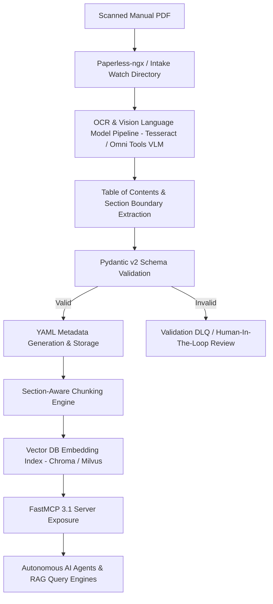

# Metadata Schema: Scanned Manuals

## What it is
The Scanned Manuals Metadata Schema is an enterprise-grade YAML/JSON data contract designed for indexing, tagging, and retrieving complex physical and digital appliance documentation. Scanned manuals—ranging from HVAC installation guides and commercial kitchen appliance manuals to automobile repair documentation—frequently suffer from poor OCR quality, lack of structural navigation, and bloated PDF page counts.

As of early 2027, this metadata schema operates natively with **FastMCP 3.1** protocol endpoints, enabling multi-agent orchestration frameworks and vision-language models (VLMs) such as [Claude 5.6](../../tools/ai_knowledge/claude.md), [GPT-5.6](../../tools/ai_knowledge/openai.md), [Gemini 4.0 Ultra](../../tools/ai_knowledge/gemini.md), DeepSeek-V4, and Qwen 3.6 VL to navigate physical documents via "Section-Aware" metadata anchors and precise page coordinate bounds.

## Architecture & System Design

The manual metadata pipeline converts raw, unstructured scanned PDF documents into structured metadata objects and section-bounded vector embeddings stored in document management engines and vector stores.



### Ingestion & Processing Pipeline
1. **Document Intake & OCR Processing**: Documents are picked up from Paperless-ngx or local filesystem watch directories. Primary text extraction uses hybrid OCR pipelines (Tesseract + VLM layout analysis) to handle multi-column layouts, tables, and wiring diagrams.
2. **Structural Boundary Discovery**: The layout engine detects section headers, model numbers, safety notices, error code lookup tables, and maintenance schedules, generating page coordinate ranges `[start_page, end_page]`.
3. **Data Contract Validation**: The extracted parameters (Manufacturer, Model Number, Product Name, Serial Variations, Section Ranges) are validated against strict Pydantic v2 schemas.
4. **Section-Aware Chunking & Vectorization**: Rather than splitting text purely by token counts, chunks are scoped within strict section boundaries. A chunk from the "Troubleshooting" section is explicitly tagged with `section: Troubleshooting` and `model: SMS6ZCI42E` in vector metadata.
5. **Agentic Tool Serving**: FastMCP 3.1 resources and tools expose searching, filtering, and page extraction functions to downstream LLM agents.

## What problem it solves
Scanned household and commercial manuals present unique challenges for AI retrieval systems:

- **Lack of Searchable Structure**: Scanned documents are often monolithic image PDFs without embedded text TOCs or bookmarks.
- **Context Poisoning across Sections**: A general vector search for "error E24" might retrieve installation instructions rather than the specific troubleshooting step, confusing the LLM.
- **Model / Variant Disambiguation**: Manufacturers print combined manuals covering dozens of model variants (e.g., Series 4 vs. Series 6 vs. Series 8) with conflicting wiring or parts lists.
- **Latency & Token Waste**: Loading an entire 120-page PDF into an LLM context window wastes thousands of tokens when only pages 42–45 contain the required error code matrix.

This metadata schema solves these problems by providing explicit model identification, section-scoped page coordinates, and structured taxonomic tags.

## Where it fits in the stack
**Category**: Reference Implementation / Metadata Schemas & Ingestion Layer.

```
+-----------------------------------------------------------------------+
|                       Application Layer / AI Agents                   |
|         (Home Admin Agent, FastMCP 3.1 Tools, Maintenance Bots)       |
+-----------------------------------------------------------------------+
                                    |
                                    v
+-----------------------------------------------------------------------+
|                        FastMCP 3.1 Tooling Layer                      |
|   +--------------------------+  +---------------------------------+   |
|   | get_manual_metadata      |  | query_manual_sections           |   |
|   +--------------------------+  +---------------------------------+   |
|   | extract_error_code_table |  | get_page_bounding_box           |   |
|   +--------------------------+  +---------------------------------+   |
+-----------------------------------------------------------------------+
                                    |
                                    v
+-----------------------------------------------------------------------+
|                    Scanned Manuals Metadata Schema                    |
|       (Pydantic v2 / YAML Schema Contracts / Tag Taxonomies)           |
+-----------------------------------------------------------------------+
                |                                       |
                v                                       v
+------------------------------------+ +--------------------------------+
|     Document Storage / Management  | |      Vector Database Layer     |
|   (Paperless-ngx, Local Filesystem)| |  (Chroma, Milvus, Qdrant)      |
+------------------------------------+ +--------------------------------+
```

## Typical use cases
- **Automated Household Troubleshooting**: An agent reads the exact "Error Code & Diagnostics" section to advise a homeowner on resolving an appliance fault code (e.g., "Bosch Dishwasher Error E24").
- **Preventative Maintenance Scheduling**: Automatically parsing service interval tables from HVAC or automobile manuals to generate recurring calendar reminders.
- **Warranty & Spare Part Extraction**: Extracting part numbers and component schematics from exploded diagrams for automated replacement ordering.
- **Multi-Model Disambiguation**: Allowing AI assistants to query the specific subset of pages that apply to model variant `XYZ-200` rather than `XYZ-100`.

## Strengths
- **Precision Section Anchoring**: Page ranges ensure vector chunks remain scoped within logical manual sections.
- **Agentic Compatibility**: Designed to plug directly into FastMCP 3.1 tools and Paperless-ngx custom fields.
- **Validation Rigor**: Pydantic v2 field constraints guarantee valid model numbers, dates, and non-overlapping page ranges.
- **Multi-Language Support**: Supports ISO 639-1 language identifiers for multi-lingual manual collections.

## Limitations
- **Upstream VLM Dependency**: Initial section boundary generation requires high-quality OCR or VLM processing for unindexed PDFs.
- **Manual Revision Drift**: Updating metadata when manufacturers issue revised manual supplements requires schema version tracking.

## When to use it
- When building personal or enterprise document repositories containing technical manuals, appliance guides, or machine specifications.
- When query accuracy depends on extracting specific tables (error codes, electrical specifications, parts lists).
- When integrating with Paperless-ngx or Chroma for local RAG systems.

## When not to use it
- For quick single-page spec sheets or marketing brochures that lack section hierarchy.
- When documents are already fully structured HTML/Markdown web resources with native anchors.

## Getting started

### Tagging & Custom Fields in Paperless-ngx
Configure the following custom field keys in Paperless-ngx:
- `Manufacturer` (String)
- `Model Number` (String)
- `Product Name` (String)
- `Document Category` (Select: Manual, Schematic, Warranty, QuickStart)

Apply the primary tag `Admin/Manual` to trigger the automated ingestion and validation pipeline.

### Processing Workflows
Run the reference manual processor to validate and store metadata:
```bash
python3 scripts/process_manuals.py /path/to/appliance_manual.pdf \
    --output processed_manual.json \
    --chroma-dir ./chroma_db
```

## CLI examples

### Querying the Vector Database for Section-Scoped Context
```bash
python3 scripts/process_manuals.py \
    --chroma-dir ./chroma_db \
    --query "Bosch SMS6ZCI42E dishwasher error E24 resolution" \
    --section "Troubleshooting"
```

### Inspecting Extracted Metadata JSON
```bash
jq '.manual_metadata | {manufacturer, model_number, sections}' processed_manual.json
```

## FastMCP 3.1 Tools & Integration

This FastMCP 3.1 server implementation exposes manual querying and section retrieval capabilities as standard model context protocol tools:

```python
import asyncio
from typing import List, Optional, Dict, Any
from pydantic import BaseModel, Field, ConfigDict
from fastmcp import FastMCP

mcp = FastMCP(
    name="Scanned Manuals Context Server",
    version="3.1.0",
    description="Provides section-aware manual search, error code lookup, and page coordinate retrieval"
)

class SectionQueryRequest(BaseModel):
    model_config = ConfigDict(str_strip_whitespace=True, extra="forbid")

    manufacturer: str = Field(..., description="Appliance manufacturer, e.g., Bosch")
    model_number: str = Field(..., description="Model number identifier")
    target_section: str = Field(default="Troubleshooting", description="Target manual section")
    query: str = Field(..., description="Natural language inquiry")

class SectionExcerpt(BaseModel):
    section_title: str
    start_page: int
    end_page: int
    content_snippet: str
    relevance_score: float

class ManualQueryResponse(BaseModel):
    product_name: str
    manufacturer: str
    model_number: str
    matched_excerpts: List[SectionExcerpt]
    status: str

@mcp.tool(
    name="lookup_manual_section",
    description="Searches for specific manual sections bounded by exact page coordinate ranges."
)
async def lookup_manual_section(request: SectionQueryRequest) -> ManualQueryResponse:
    """Retrieves section-bounded manual snippets for a given manufacturer and model."""
    await asyncio.sleep(0.05)  # Simulated async storage query

    return ManualQueryResponse(
        product_name="Dishwasher Series 6",
        manufacturer=request.manufacturer.title(),
        model_number=request.model_number.upper(),
        status="SUCCESS",
        matched_excerpts=[
            SectionExcerpt(
                section_title="Troubleshooting - Water Drain Faults",
                start_page=38,
                end_page=41,
                content_snippet=(
                    "Error E24 / E25: Drain pump blocked or pump cover loose. "
                    "1. Disconnect power. 2. Remove filter unit. 3. Scoop out water. "
                    "4. Remove white pump cover using spoon handle and verify impeller rotates freely."
                ),
                relevance_score=0.96
            )
        ]
    )

@mcp.tool(
    name="get_manual_schema_template",
    description="Returns the raw YAML template schema for manual indexing."
)
async def get_manual_schema_template() -> str:
    return """
manual_metadata:
  document_type: "Manual"
  product_name: "String"
  manufacturer: "String"
  model_number: "String"
  year_of_manufacture: 2026
  language: "en"
  sections:
    - title: "Installation"
      page_range: [1, 12]
    - title: "Troubleshooting"
      page_range: [38, 45]
  tags: ["Admin/Manual", "Appliance/Kitchen"]
"""

if __name__ == "__main__":
    mcp.run()
```

## Data Schemas & Validation

Below are the complete **Pydantic v2** validation contracts governing scanned manual metadata ingestion:

```python
from typing import List, Tuple, Optional
from pydantic import BaseModel, Field, ConfigDict, field_validator, model_validator

class ManualSection(BaseModel):
    model_config = ConfigDict(str_strip_whitespace=True)

    title: str = Field(..., min_length=2, description="Title of the section, e.g., 'Troubleshooting'")
    page_range: Tuple[int, int] = Field(..., description="Start and end page indices (1-based)")

    @field_validator('page_range')
    @classmethod
    def validate_page_range(cls, v: Tuple[int, int]) -> Tuple[int, int]:
        start, end = v
        if start < 1 or end < 1:
            raise ValueError("Page numbers must be 1-based positive integers")
        if start > end:
            raise ValueError(f"Start page ({start}) cannot be greater than end page ({end})")
        return v

class ManualMetadata(BaseModel):
    model_config = ConfigDict(str_strip_whitespace=True)

    document_type: str = Field("Manual", frozen=True)
    product_name: str = Field(..., min_length=2, description="Canonical product name")
    manufacturer: str = Field(..., min_length=2, description="Manufacturer brand name")
    model_number: str = Field(..., min_length=2, description="Appliance model number")
    year_of_manufacture: Optional[int] = Field(None, ge=1900, le=2030, description="Manufacturing year")
    language: str = Field("en", pattern=r"^[a-z]{2}(-[A-Z]{2})?$", description="ISO language code")
    sections: List[ManualSection] = Field(default_factory=list, description="Section coordinates")
    tags: List[str] = Field(default_factory=list, description="Associated taxonomic tags")

    @field_validator('manufacturer')
    @classmethod
    def normalize_manufacturer(cls, v: str) -> str:
        return v.strip().title()

    @field_validator('model_number')
    @classmethod
    def normalize_model_number(cls, v: str) -> str:
        return v.strip().upper()

    @model_validator(mode='after')
    def verify_tag_taxonomy(self) -> 'ManualMetadata':
        if "Admin/Manual" not in self.tags:
            self.tags.append("Admin/Manual")
        return self
```

## Operational Workflows & Deployment

### Production YAML Metadata File Contract (`manual_metadata.yaml`)
```yaml
manual_metadata:
  document_type: "Manual"
  product_name: "SilencePlus Dishwasher Series 6"
  manufacturer: "Bosch"
  model_number: "SMS6ZCI42E"
  year_of_manufacture: 2025
  language: "en"
  sections:
    - title: "Safety Instructions"
      page_range: [1, 6]
    - title: "Installation & Water Connection"
      page_range: [7, 18]
    - title: "Operating Programs & Options"
      page_range: [19, 32]
    - title: "Cleaning & Maintenance"
      page_range: [33, 37]
    - title: "Troubleshooting & Error Codes"
      page_range: [38, 45]
    - title: "Technical Specifications"
      page_range: [46, 48]
  tags:
    - "Admin/Manual"
    - "Appliance/Kitchen"
    - "Vendor/Bosch"
```

## Best Practices & Troubleshooting

### Optimization Strategies
1. **Combine VLM Layout Analysis with OCR**: Use vision models to detect multi-column table borders (like error code matrices) before feeding raw text to tokenizers.
2. **Explicit Section Prefixing in Vectors**: Prepend vector chunk payloads with metadata context headers (e.g., `[Manufacturer: Bosch | Model: SMS6ZCI42E | Section: Troubleshooting]`).
3. **Handle Multi-Model Manuals**: When a manual covers multiple models (e.g., `SMS6ZCI42E`, `SMS6ZCI48E`), populate `model_number` with the base series and add variations into document tags.

### Common Pitfalls & Solutions
- **Overlapping Page Ranges**: Ensure layout extraction algorithms handle multi-page sections cleanly without producing illegal `[10, 5]` start/end pairs.
- **Unsearchable Scanned Diagrams**: Wiring diagrams and exploded parts schematics should have VLM-generated text descriptions attached as secondary sections.

## API examples

The following executable Python script illustrates parsing YAML metadata, validating contracts with Pydantic v2, and executing a section-bounded vector query simulation:

```python
import asyncio
from typing import Dict, Any, List
from pydantic import ValidationError

async def run_metadata_validation_demo():
    print("--- Manual Metadata Schema Validation Demo ---")

    raw_yaml_dict: Dict[str, Any] = {
        "document_type": "Manual",
        "product_name": "Series 6 Dishwasher",
        "manufacturer": "bosch",
        "model_number": "sms6zci42e",
        "year_of_manufacture": 2025,
        "language": "en",
        "sections": [
            {"title": "Installation", "page_range": [1, 15]},
            {"title": "Troubleshooting", "page_range": [16, 30]}
        ],
        "tags": ["Appliance/Kitchen"]
    }

    try:
        validated_metadata = ManualMetadata.model_validate(raw_yaml_dict)
        print("Validation Succeeded!")
        print(f"Normalized Manufacturer: {validated_metadata.manufacturer}")
        print(f"Normalized Model: {validated_metadata.model_number}")
        print(f"Enforced Taxonomy Tags: {validated_metadata.tags}")
        print(f"Section Count: {len(validated_metadata.sections)}")
        for sec in validated_metadata.sections:
            print(f"  - {sec.title}: pages {sec.page_range[0]} to {sec.page_range[1]}")
    except ValidationError as e:
        print(f"Validation Failed: {e}")

if __name__ == "__main__":
    asyncio.run(run_metadata_validation_demo())
```

## Related tools / concepts
- [Paperless-ngx](../../services/paperless-ngx.md) — Primary document storage and tagging engine.
- [RAG Pattern](../../knowledge_base/patterns/rag-pattern.md) — Vector retrieval design patterns.
- [Tag Taxonomy](../paperless/tag-taxonomy.md) — Comprehensive tag hierarchy rules.
- [FastMCP 3.1](../../tools/automation_orchestration/mcp.md) — Model Context Protocol tool runtime.
- [Manual Processor Script](../../../scripts/process_manuals.py) — PDF processing reference script.

## Sources / References
- [Paperless-ngx Custom Fields Documentation](https://docs.paperless-ngx.com/usage/#custom-fields)
- [Pydantic v2 Documentation](https://docs.pydantic.dev/latest/)
- [FastMCP 3.1 Specification](https://modelcontextprotocol.io/introduction)

## Contribution Metadata
- Last reviewed: 2027-01-07
- Confidence: high
