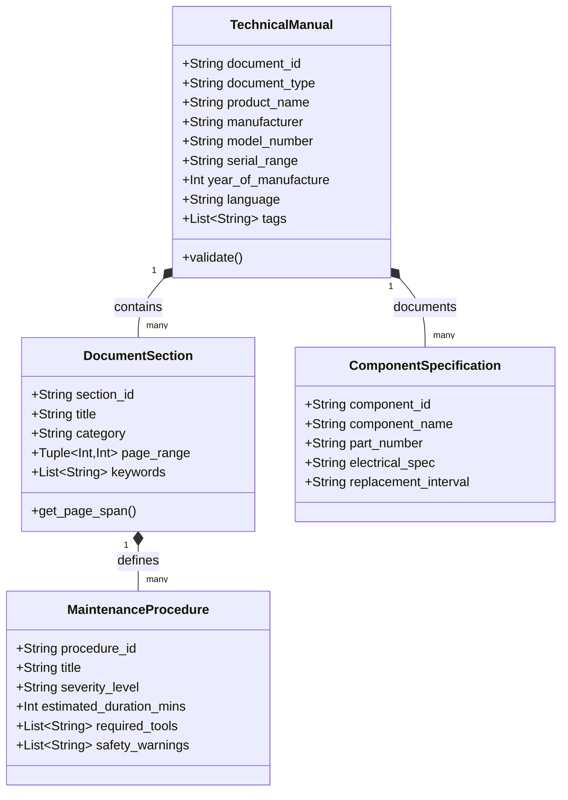

# Metadata Schema: Scanned Manuals

A YAML-based and JSON-schema-validated metadata structure that defines fields for indexing, tagging, section-aware chunking, and semantic retrieval of scanned technical manuals, appliance documentation, and hardware schematics. It ensures technical documentation is stored with structured semantic anchors for both human reference and automated AI agent retrieval.

As of **January 2027**, this schema enables frontier agents like **Claude 5.6**, **GPT-5.6**, **Gemini 4.0 Ultra/Flash**, **DeepSeek-V4**, and **Qwen 3.6 VL** to navigate multi-hundred-page physical manuals via **FastMCP 3.1** protocol bindings, section-coordinate mapping, and Pydantic v2 metadata anchors.



## What it is
The Technical Manual Metadata Schema is a standardized structural contract that governs how scanned physical documentation (PDFs, TIFFs, OCR outputs) is cataloged, vectorized, and made accessible to AI agent runtimes.

Instead of treating a 150-page equipment manual as an undifferentiated stream of text chunks, this schema establishes a multi-tiered hierarchical map:
- **Header Metadata**: Identifies manufacturer, exact model number variations, serial number compatibility bands, and manufacturing year.
- **Section Coordinates**: Maps functional manual sections (e.g., Installation, Electrical Wiring, Error Codes, Spare Parts) to exact zero-indexed page boundaries.
- **Component & Part Registers**: Maps specific part numbers and electrical specifications directly to manual sections.
- **Maintenance & Safety Bounds**: Isolates high-risk procedures and error diagnostic steps with explicit severity ratings and tool prerequisites.

```mermaid
flowchart TD
    A[Scanned Manual PDF / TIFF] --> B[Docling / Tesseract VLM OCR Pipeline]

    B --> C[Structure Analyzer Engine]
    C --> C1[Extract Table of Contents & Headings]
    C --> C2[Identify Component Schematics & Diagrams]
    C --> C3[Detect Maintenance Safety Boxes]

    C1 & C2 & C3 --> D[Section-Aware Metadata Generator]

    D --> E[Validate via Pydantic v2 Manual Schema]

    alt Validation Successful
        E --> F[Inject Metadata into Vector Database]
        F --> F1[ChromaDB / Qdrant Collections]
        F --> F2[Paperless-ngx Custom Fields]
        E --> G[Expose via FastMCP 3.1 Resource Server]
    else Schema Violation
        E --> H[Flag Manual for Human / VLM Re-parsing]
    end
```

## What problem it solves
1. **Unsearchable Scanned PDFs**: Physical equipment manuals digitized via flat OCR lack semantic structure; traditional vector RAG retrieves random 512-token chunks without context regarding section headers or model variations.
2. **LLM Hallucinations in Technical Diagnostics**: When an agent searches for dishwasher "E24 Error Code", naive vector search may return error codes for a different model variant listed on an adjacent page; section-aware metadata bounds retrieval strictly to the applicable model variant.
3. **Loss of Visual & Schematic Context**: Wiring diagrams and exploded parts diagrams are lost in plain-text conversions; this schema maintains explicit bounding boxes and page coordinate metadata for diagram retrieval.
4. **Agentic Tool Isolation**: AI agents require a standardized protocol to query equipment manuals; this schema maps directly to FastMCP 3.1 resource templates and tool parameters.

## Where it fits in the stack
The Technical Manual Metadata Schema resides at the **Data Modeling & Knowledge Ops Layer**, establishing a contract between document ingestion pipelines and agentic retrieval engines:

```
+-----------------------------------------------------------------------+
|                    FastMCP 3.1 Agents / Home Admin AI                 |
+-----------------------------------------------------------------------+
                                   |
                         Model Context Protocol
                                   v
+-----------------------------------------------------------------------+
|                    Manual Metadata Schema Layer                       |
|  - YAML/JSON Schema Contracts         - Pydantic v2 Type Validators   |
|  - Section Coordinates Mapping        - Component & Error Code Index  |
+-----------------------------------------------------------------------+
                                   |
                                   v
+-----------------------------------------------------------------------+
|                   Document Systems & Vector Stores                    |
|  - Paperless-ngx (Custom Fields)      - Vector DB (Qdrant / Chroma)   |
|  - PDF Processing Engine (Docling)    - Local Storage Engine          |
+-----------------------------------------------------------------------+
```

## Typical use cases
- **Automated Equipment Diagnostics**: An AI agent receives an error code (e.g. "Error E-09") from a heat pump display, queries the manual's "Error Diagnostics" section via FastMCP 3.1, and returns exact troubleshooting steps.
- **Home & Industrial Asset Digital Twin**: Building a structured digital twin of all household or facility equipment, mapping each device to its manual, model serial bounds, and part lists.
- **Preventative Maintenance Scheduling**: Automatically parsing service interval tables from vehicle or generator manuals to generate scheduled calendar maintenance reminders.
- **Part Number & Schematic Identification**: Querying exploded views to identify exact OEM replacement part numbers for broken components.

## Strengths
- **Section-Aware Chunking Precision**: Eliminates chunk cross-contamination by enforcing strict page range boundaries during vector embedding generation.
- **FastMCP 3.1 Native Integration**: Exposes equipment manuals as dynamic Model Context Protocol resources (`manuals://{manufacturer}/{model}`).
- **Strict Pydantic v2 Runtime Validation**: Prevents corrupted or incomplete metadata from entering the vector knowledge base.
- **Multi-Model Support**: Standardized YAML/JSON metadata is readable by both lightweight local VLMs and frontier cloud LLMs.

## Limitations
- **Ingestion VLM Dependency**: Initial extraction of section page boundaries requires high-quality OCR/VLM processing (e.g., Docling or Tesseract).
- **Manual Schema Maintenance**: Specialized industrial machinery may require custom fields beyond standard household appliance schemas.

## When to use it
- When building a "Household Manual RAG" or facility maintenance agent system.
- For high-stakes appliances or critical infrastructure (HVAC, solar inverters, backup generators) where rapid troubleshooting is necessary.
- When organizing large paper manual archives in Paperless-ngx or enterprise document management systems.

## When not to use it
- For quick one-page product datasheets or simple quick-start cards lacking multi-section layouts.
- When an equipment manufacturer provides an interactive API or live web search portal for troubleshooting.

## Getting started

### 1. Tagging in Paperless-ngx
Configure Paperless-ngx custom fields and tag taxonomy to align with the schema:
- **Custom Fields**: `Manufacturer`, `Model Number`, `Product Category`, `Serial Range`.
- **Tags**: Apply `Admin/Manual` and `Appliance/HVAC` (or appropriate category tag) to initiate the automated ingestion pipeline.

### 2. Manual Ingestion Pipeline
Execute the section-aware processor script to parse page boundaries and create vector embeddings:

```bash
python3 scripts/process_manuals.py \
  --pdf /path/to/manual.pdf \
  --schema docs/reference-implementations/metadata-schemas/manuals.md \
  --output ./metadata/manual_index.json
```

## CLI examples

### Parsing Manual PDF & Validating Schema
```bash
# Validate manual metadata against Pydantic v2 schema
python3 -c "
import json
from pydantic import BaseModel

with open('./metadata/manual_index.json') as f:
    data = json.load(f)
print(f'Successfully loaded manual metadata for {data.get(\"product_name\")}')
"

# Query section coordinates for Troubleshooting
python3 scripts/process_manuals.py --query "Troubleshooting" --model "SMS6ZCI42E"
```

## API examples

### Manual Metadata FastMCP 3.1 Server Implementation
Below is a complete Python server implementation using **FastMCP 3.1** and **Pydantic v2** to validate technical manual metadata and serve section-aware retrieval resources to AI agents.

```python
"""
FastMCP 3.1 Server for Technical Manual Metadata Management and Section-Aware RAG.
"""

import os
import json
from typing import List, Tuple, Optional, Dict
from pydantic import BaseModel, Field, field_validator, ConfigDict
from fastmcp import FastMCP

# Initialize FastMCP Server
mcp = FastMCP(
    title="Technical Manual Metadata Engine",
    version="3.1.0",
    description="FastMCP server for indexing, validating, and retrieving technical manual metadata and section ranges."
)


# --- Pydantic v2 Validation Schemas ---

class ManualSectionSchema(BaseModel):
    """Pydantic v2 schema for a section within a technical manual."""
    model_config = ConfigDict(extra="forbid")

    title: str = Field(description="Section title, e.g. 'Troubleshooting & Error Codes'")
    category: str = Field(description="Functional category: Installation, Maintenance, Schematics, Troubleshooting")
    page_range: Tuple[int, int] = Field(description="Zero-indexed (start_page, end_page) range")
    keywords: List[str] = Field(default_factory=list, description="Keywords for fast filtering")

    @field_validator("page_range")
    @classmethod
    def validate_page_range(cls, v: Tuple[int, int]) -> Tuple[int, int]:
        if v[0] < 0 or v[1] < 0:
            raise ValueError("Page indices must be non-negative integers")
        if v[0] > v[1]:
            raise ValueError("Start page index cannot exceed end page index")
        return v


class ComponentSpecSchema(BaseModel):
    """Pydantic v2 schema for an OEM component listed in a manual."""
    model_config = ConfigDict(extra="forbid")

    component_name: str = Field(description="Name of component or assembly")
    part_number: str = Field(description="OEM replacement part number")
    specifications: Dict[str, str] = Field(default_factory=dict, description="Key electrical or dimensional specs")


class TechnicalManualMetadata(BaseModel):
    """Pydantic v2 schema for complete technical manual metadata entry."""
    model_config = ConfigDict(extra="forbid")

    document_id: str = Field(description="Unique document identifier, e.g. DOC-BOSCH-SMS6ZCI42E")
    document_type: str = Field(default="TechnicalManual", description="Document type classification")
    product_name: str = Field(description="Full product name")
    manufacturer: str = Field(description="Equipment manufacturer name")
    model_number: str = Field(description="Model number or family series")
    year_of_manufacture: Optional[int] = Field(None, ge=1900, le=2030, description="Manufacturing year")
    language: str = Field(default="en", description="ISO 639-1 language code")
    sections: List[ManualSectionSchema] = Field(min_length=1, description="List of mapped manual sections")
    components: List[ComponentSpecSchema] = Field(default_factory=list, description="Associated OEM parts")
    tags: List[str] = Field(default_factory=list, description="Taxonomic tags, e.g. Admin/Manual")


# --- FastMCP 3.1 Tools & Resources ---

@mcp.tool()
def validate_manual_metadata(raw_yaml_json: str) -> str:
    """
    Validates raw JSON/YAML manual metadata payload against Pydantic v2 TechnicalManualMetadata schema.
    """
    try:
        data = json.loads(raw_yaml_json)
        manual = TechnicalManualMetadata(**data)
        return json.dumps({
            "status": "VALID",
            "document_id": manual.document_id,
            "product": f"{manual.manufacturer} {manual.product_name} ({manual.model_number})",
            "section_count": len(manual.sections),
            "parts_count": len(manual.components)
        }, indent=2)
    except Exception as e:
        return json.dumps({"status": "INVALID", "error": str(e)}, indent=2)


@mcp.tool()
def find_manual_section(manual_metadata_json: str, search_query: str) -> str:
    """
    Finds the exact section and page range for a troubleshooting or operational query within a manual.
    """
    try:
        data = json.loads(manual_metadata_json)
        manual = TechnicalManualMetadata(**data)
    except Exception as e:
        return f"Error: Invalid metadata schema - {str(e)}"

    query_lower = search_query.lower()
    matching_sections = []

    for sec in manual.sections:
        if query_lower in sec.title.lower() or any(query_lower in kw.lower() for kw in sec.keywords):
            matching_sections.append(sec.model_dump())

    return json.dumps({
        "manufacturer": manual.manufacturer,
        "model_number": manual.model_number,
        "query": search_query,
        "matched_sections": matching_sections
    }, indent=2)


if __name__ == "__main__":
    mcp.run()
```

## Related tools / concepts
- [Paperless-ngx](../../services/paperless-ngx.md) — Document management system for manual storage and tagging.
- [RAG Pattern](../../knowledge_base/patterns/rag-pattern.md) — Retrieval augmented generation design patterns.
- [Model Context Protocol](../../tools/automation_orchestration/mcp.md) — Standard for agent tool and resource access.
- [n8n](../../services/n8n.md) — Workflow automation tool for orchestrating manual ingestion.
- [Tag Taxonomy](../../reference-implementations/paperless/tag-taxonomy.md) — Standardized tagging taxonomy including `Admin/Manual`.

## Sources / references
- [Paperless-ngx Custom Fields Documentation](https://docs.paperless-ngx.com/usage/#custom-fields)
- [Pydantic v2 Specification](https://docs.pydantic.dev/latest/)
- [FastMCP 3.1 Protocol Specification](https://modelcontextprotocol.io)

---
## Contribution Metadata
- Last reviewed: 2027-01-07
- Confidence: high
