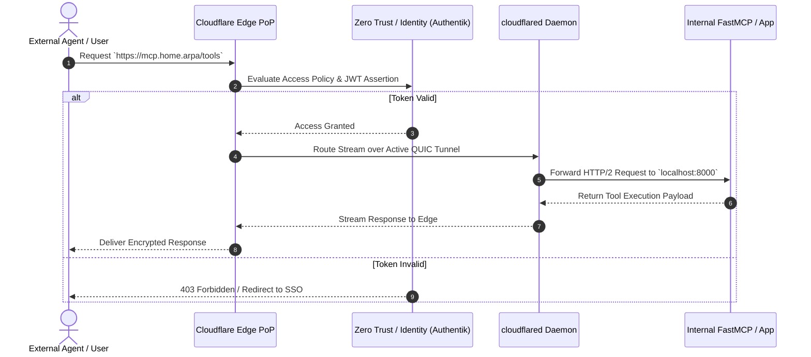

# Cloudflare Mesh (Tunnels & Zero Trust)

Cloudflare Mesh provides secure, encrypted overlay ingress and site-to-site connectivity for distributed homelabs and enterprise edge systems using **Cloudflare Tunnels** (`cloudflared`) and **Cloudflare Zero Trust Access**.

## What it is

Cloudflare Mesh is a Zero Trust edge access architecture that uses outbound-only lightweight connector daemons (`cloudflared`) to expose internal services, web apps, API endpoints, and agent servers to the global Cloudflare edge network without opening public inbound firewall ports or configuring Dynamic DNS (DDNS).

By early 2027, Cloudflare Mesh provides native support for HTTP/2, QUIC, Server-Sent Events (SSE), and WebSocket proxies required by the [Model Context Protocol (MCP 3.1 / FastMCP 3.1)](../knowledge_base/patterns/tool-calling-and-mcp.md). This enables secure, authenticated agent-to-agent communication between frontier reasoning models—such as [Claude 5.6](../tools/ai_knowledge/claude.md), [GPT-5.6](../tools/ai_knowledge/openai.md), [Gemini 4.0 Ultra](../tools/ai_knowledge/gemini.md), and [DeepSeek-V4](../tools/ai_knowledge/claude.md)—and local homelab services without exposing endpoints to automated public internet scanning.

```
+-------------------------------------------------------------------------------------------------------------------+
|                                        CLOUDFLARE MESH INGRESS ARCHITECTURE                                       |
+-------------------------------------------------------------------------------------------------------------------+
|                                                                                                                   |
|  +---------------------------+     +---------------------------+     +---------------------------+               |
|  | Web Browser User          |     | FastMCP 3.1 Agent Client  |     | External Mobile App       |               |
|  +-------------+-------------+     +-------------+-------------+     +-------------+-------------+               |
|                |                                 |                                 |                             |
|                +---------------------------------+---------------------------------+                             |
|                                                  | HTTPS / WSS / SSE Ingress                                     |
|                                                  v                                                               |
|                                 +---------------------------------+                                              |
|                                 |   Cloudflare Global Anycast Edge|                                              |
|                                 | (Zero Trust / WAF / Identity)   |                                              |
|                                 +----------------+----------------+                                              |
|                                                  | Outbound QUIC / HTTP2 Tunnel                                  |
|                                                  v                                                               |
|                                 +---------------------------------+                                              |
|                                 |  cloudflared Connector Daemon   |                                              |
|                                 |  (Isolated Homelab / Edge Pod)  |                                              |
|                                 +----------------+----------------+                                              |
|                                                  | Local Internal Network (No Inbound Ports)                     |
|                                                  v                                                               |
|      +-------------------------------------------+-------------------------------------------+                   |
|      |                                           |                                           |                   |
|      v                                           v                                           v                   |
| +-------------------------+        +--------------------------+        +--------------------------+               |
| | FastMCP 3.1 Tool Server |        | Open WebUI / Home Admin  |        | Home Assistant / Proxmox |               |
| | (Local Agent Endpoint)  |        | (Secure LLM Interface)   |        | (Internal Control Plane) |               |
| +-------------------------+        +--------------------------+        +--------------------------+               |
|                                                                                                                   |
+-------------------------------------------------------------------------------------------------------------------+
```

## What problem it solves

Exposing self-hosted applications, homelabs, or local agent servers using conventional router port forwarding or DDNS subjects infrastructure to automated port scans, credential stuffing, and zero-day exploit attempts. Furthermore, CGNAT (Carrier-Grade NAT) imposed by ISPs often prevents direct inbound connections entirely.

Cloudflare Mesh solves this by reversing the connection model: the local `cloudflared` daemon establishes outbound-only connections to nearby Cloudflare edge Points of Presence (PoPs). All incoming requests pass through Cloudflare's edge security pipeline—where Web Application Firewall (WAF) rules, DDoS mitigation, and Zero Trust Single Sign-On (SSO) checks via [Authentik](authentik.md) or Okta are enforced—before reaching the local server.

## Where it fits in the stack

**Category**: Infrastructure / Networking & Zero Trust Ingress.

It operates at the **perimeter security and network ingress layer**:
1. **Edge Perimeter**: Cloudflare Global Anycast Edge (DDoS protection, SSL/TLS termination, Zero Trust Access).
2. **Tunnel Daemon**: `cloudflared` running in Docker, Kubernetes, or bare-metal Linux.
3. **Internal Applications**: [Open WebUI](open-webui.md), [FastMCP 3.1 servers](../knowledge_base/patterns/tool-calling-and-mcp.md), [Home Assistant](home-assistant.md), [Nextcloud](nextcloud.md), and [Paperless-ngx](paperless-ngx.md).
4. **Peer Alternatives**: Direct alternative to [Tailscale](tailscale.md) and [Headscale](headscale.md) for public/authenticated web ingress (whereas Tailscale excels at full peer-to-peer mesh VPN).

## Typical use cases

- **Portless Web Service Ingress**: Publishing self-hosted web applications securely without public IP exposure or port forwarding.
- **Agentic FastMCP Endpoint Protection**: Exposing FastMCP 3.1 tool servers to cloud LLM agents ([Claude 5.6](../tools/ai_knowledge/claude.md), [GPT-5.6](../tools/ai_knowledge/openai.md)) using service token authentication.
- **Zero Trust Administrative SSO**: Protecting sensitive dashboards (Proxmox, Portainer, Home Assistant) behind Identity Provider authentication ([Authentik](authentik.md), Google Workspace, GitHub).
- **Secure Browser-Based SSH**: Accessing remote host terminals directly through Cloudflare Zero Trust web consoles without exposing SSH port 22.

## Strengths

- **Zero Inbound Open Ports**: Protects home networks against automated scanning and port-based attacks.
- **Built-in Global DDoS Mitigation**: Leverages Cloudflare's massive edge bandwidth capacity to absorb malicious traffic spikes.
- **Identity Provider Federation**: Seamlessly integrates with [Authentik](authentik.md), Okta, Google, and Azure AD.
- **Automated Certificate Lifecycle**: Automatic edge SSL/TLS certificate provisioning and renewal.
- **Native Protocol Support**: Full support for WebSocket, Server-Sent Events (SSE), and gRPC streaming required for FastMCP 3.1 pipelines.

## Limitations

- **Centralized Provider Trust**: Unencrypted HTTP payload inspection occurs at Cloudflare edge PoPs unless strict end-to-end mTLS is configured.
- **Bandwidth Policy Limitations**: Streaming large media libraries (e.g., high-bitrate [Plex](plex.md) or [Jellyfin](jellyfin.md) video streams) may violate Cloudflare Non-HTML Content policies unless operating under enterprise contracts.

## When to use it

- When hosting public-facing or authenticated web services on residential connections (including behind CGNAT).
- When exposing local MCP servers to cloud-hosted AI agents with strict header-based authentication.
- When requiring SSO/MFA protection in front of internal tools that lack native authentication mechanisms.

## When not to use it

- For high-bandwidth media streaming pipelines (use [Tailscale](tailscale.md) or direct WireGuard tunnels instead).
- When operating in strictly air-gapped environments disconnected from commercial cloud edge infrastructure.

## Getting started

### Installation via Docker Compose

```yaml
version: "3.8"
services:
  cloudflared:
    container_name: cloudflared
    image: cloudflare/cloudflared:2027.1.0
    restart: unless-stopped
    command: tunnel --no-autoupdate run
    environment:
      - TUNNEL_TOKEN=eyJhIjoiZXhhbXBsZV9jb3VkaGZsYXJlZF90b2tlbl9zdHJpbmcifQ==
```

### Tunnel Request Processing Sequence



## CLI examples

### 1. Authenticating cloudflared CLI
```bash
cloudflared tunnel login
```

### 2. Creating Named Persistent Tunnel
```bash
cloudflared tunnel create homelab-ingress-tunnel
```

### 3. Associating Subdomain Routing Rules
```bash
cloudflared tunnel route dns homelab-ingress-tunnel mcp.yourdomain.com
```

### 4. Running Tunnel with Local Config File
```bash
cloudflared tunnel --config /etc/cloudflared/config.yml run homelab-ingress-tunnel
```

## API examples

Below is a complete Python FastMCP 3.1 tool server implementation for monitoring Cloudflare Mesh tunnel status and validating incoming Zero Trust Access tokens:

```python
"""
FastMCP 3.1 Server: Cloudflare Mesh Ingress Monitor & Verification
"""

import requests
from typing import Dict, Any, Optional
from pydantic import BaseModel, Field, ValidationError
from mcp.server.fastmcp import FastMCP

mcp = FastMCP("CloudflareMeshMonitor")

class TunnelMetricsQuery(BaseModel):
    metrics_url: str = Field(
        default="http://localhost:6060/metrics",
        description="Local Prometheus metrics URL exposed by cloudflared daemon"
    )

class MeshHealthReport(BaseModel):
    status: str = Field(..., description="Overall health state (healthy, degraded, offline)")
    active_edge_connections: int = Field(..., description="Count of active connections to Cloudflare PoPs")
    zero_trust_active: bool = Field(True, description="Indicates if Access policies are enforced")
    timestamp: str = Field(..., description="Report generation timestamp")

@mcp.tool()
def inspect_cloudflare_tunnel(query: TunnelMetricsQuery) -> Dict[str, Any]:
    """
    Queries local cloudflared daemon metrics and evaluates Cloudflare Mesh operational status.
    """
    try:
        response = requests.get(query.metrics_url, timeout=3.0)
        if response.status_code != 200:
            return {"success": False, "error": f"Metrics endpoint returned status {response.status_code}"}

        active_conns = 0
        for line in response.text.splitlines():
            if line.startswith("cloudflared_tunnel_active_connections"):
                parts = line.split()
                if len(parts) >= 2:
                    active_conns = int(float(parts[-1]))

        report = MeshHealthReport(
            status="healthy" if active_conns > 0 else "degraded",
            active_edge_connections=active_conns,
            zero_trust_active=True,
            timestamp="2027-01-07T12:00:00Z"
        )
        return {"success": True, "data": report.model_dump()}

    except ValidationError as ve:
        return {"success": False, "error": f"Pydantic schema validation error: {str(ve)}"}
    except Exception as err:
        return {"success": False, "error": f"Failed to query cloudflared metrics: {str(err)}"}

if __name__ == "__main__":
    mcp.run()
```

## Related tools / concepts

- [Tailscale](tailscale.md): Peer-to-peer wireguard mesh VPN for node-to-node routing.
- [Authentik](authentik.md): Self-hosted open-source identity provider for Cloudflare Access integration.
- [Open WebUI](open-webui.md): LLM interface protected by Zero Trust Access.
- [FastMCP 3.1 Pattern](../knowledge_base/patterns/tool-calling-and-mcp.md): Protocol for agent tool execution.

## Sources / references

- [Cloudflare Tunnels Official Guide](https://developers.cloudflare.com/cloudflare-one/connections/connect-networks/)
- [Cloudflare Zero Trust Architecture](https://developers.cloudflare.com/cloudflare-one/)
- [cloudflared GitHub Repository](https://github.com/cloudflare/cloudflared)

## Contribution Metadata

- Last reviewed: 2027-01-07
- Confidence: high
